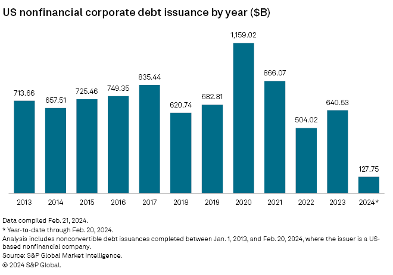

## Table of Contents

## What is a corporate bond?

A corporate bond is a type of loan that a company takes from investors. When a company needs money, it can borrow from people who want to invest their money. In return, the company promises to pay back the money with interest over a certain period of time. These bonds are like IOUs, where the company agrees to pay the investor a fixed amount of interest regularly until the bond matures, at which point the company pays back the original amount.

Investors like corporate bonds because they can provide a steady income through the interest payments. The risk of investing in corporate bonds can vary depending on the financial health of the company. If the company is strong and stable, its bonds are considered safer. However, if the company is struggling, there's a higher chance it might not be able to pay back the bond, making it riskier for the investor.

## How does debt financing work for corporations?

Debt financing is when a company borrows money to help run or grow its business. The company can borrow from a bank or by selling bonds to investors. When a company sells bonds, it's like getting a loan from lots of people at once. The company agrees to pay back the money it borrowed, plus interest, over time. This interest is the cost of borrowing the money, and it's how investors make money from the bond.

The company uses the money it borrows to buy things it needs, like new equipment or to expand its business. It's important for the company to manage its debt well. If it can't pay back the money it owes, it might have big problems. But if it uses the money wisely and makes more money than it has to pay in interest, debt financing can help the company grow and be successful.

## What are the benefits of issuing corporate bonds?

Issuing corporate bonds can help a company get the money it needs without giving up control. When a company sells bonds, it borrows money from investors. Unlike selling shares of the company, which gives investors part ownership, selling bonds means the company only has to pay back the money with interest. This way, the people who run the company still get to make all the decisions.

Another benefit is that the interest payments on bonds can be tax-deductible. This means the company can lower its taxes by the amount of interest it pays on its bonds. This can save the company a lot of money, making it cheaper for them to borrow. It's like getting a discount on the cost of the loan, which makes issuing bonds an attractive way to raise money.

## What are the risks associated with corporate bond issuance?

When a company issues corporate bonds, it takes on the risk of not being able to pay back the money it borrowed. If the company runs into financial trouble, it might not have enough money to make the interest payments or to pay back the bond when it matures. This can lead to a default, which is bad for the company's reputation and can make it hard to borrow money in the future. Investors might also demand higher interest rates from the company because they see it as riskier, which makes borrowing more expensive.

Another risk is that interest rates might go up after the company issues its bonds. If this happens, the company could be stuck paying a higher [interest rate](/wiki/interest-rate-trading-strategies) than what's available in the market. This can make the company's debt more expensive than it planned. Also, if the company's credit rating goes down, the value of its bonds might drop, making it harder and more costly to issue new bonds or refinance existing ones.

## How does the process of issuing a corporate bond work?

When a company wants to issue a corporate bond, it first decides how much money it needs to borrow and for how long. The company works with a bank or a financial firm called an underwriter to help set up the bond. The underwriter helps the company figure out things like the interest rate it will pay and how the bond will be sold to investors. The company then creates a document called a prospectus, which tells investors all about the bond, like how much it costs, when it will be paid back, and the risks involved.

Once everything is ready, the company officially issues the bond. This means it sells the bond to investors, who give the company the money it needs. The company promises to pay back this money, plus interest, over time. The interest payments are usually made every six months until the bond matures, which can be anywhere from a few years to thirty years or more. When the bond matures, the company pays back the original amount of money to the investors. If the company does well and pays back the bond on time, it can borrow money more easily in the future.

## What are the different types of corporate bonds available?

There are several types of corporate bonds that companies can issue, and each type has its own features. One common type is a fixed-rate bond, where the company agrees to pay a set amount of interest to investors until the bond matures. This makes it easier for investors to know how much money they will get back. Another type is a floating-rate bond, where the interest rate can change over time based on market conditions. This can be good for investors if interest rates go up, but it can also be riskier if rates go down.

Another type of bond is a convertible bond, which gives investors the option to turn their bond into shares of the company's stock. This can be a good choice for investors who think the company will do well and want to own part of it. There are also callable bonds, where the company can choose to pay back the bond early if it wants to. This can be good for the company if interest rates go down, but it can be bad for investors because they might not get as much interest as they expected. Each type of bond has its own benefits and risks, so companies and investors need to think carefully about which one is best for them.

## How do interest rates affect corporate bond issuance?

Interest rates play a big role in how companies issue corporate bonds. When interest rates are low, it's cheaper for companies to borrow money. This means they can issue bonds with lower interest rates, which makes the bonds more attractive to investors. More people might want to buy the bonds because they can still get a good return without taking on too much risk. This can help the company raise the money it needs more easily.

On the other hand, when interest rates are high, it's more expensive for companies to borrow. They have to offer higher interest rates on their bonds to make them appealing to investors. This can make it harder for the company to issue bonds because investors might not want to buy them if they can get a better return elsewhere. High interest rates can also make the company's debt more expensive to manage, which can affect its financial health.

## What is the role of credit ratings in corporate bond markets?

Credit ratings are like report cards for companies that want to issue bonds. They tell investors how likely it is that the company will pay back the money it borrows. A credit rating agency looks at the company's financial health, its history of paying back debts, and other factors to give it a grade. A high credit rating means the company is seen as safe and likely to pay back its bonds. A low credit rating means there's more risk that the company might not be able to pay back the money.

These ratings are important because they help investors decide which bonds to buy. If a company has a high credit rating, more people might want to buy its bonds because they feel safer. This can help the company get the money it needs more easily and at a lower interest rate. But if a company has a low credit rating, it might have to offer a higher interest rate to attract investors. This makes borrowing more expensive for the company, which can affect its plans and how much it can grow.

## How do companies decide between issuing bonds and other forms of financing?

When a company needs money, it has to choose between different ways to get it. One way is by issuing bonds, which is like borrowing money from a lot of people at once. Another way is by taking a loan from a bank or by selling shares of the company to investors. Each way has its own pros and cons. Issuing bonds can be good because the company doesn't have to give up any control over its business. It just has to pay back the money with interest. But if the company's credit rating is low, it might have to pay a high interest rate, which can be expensive.

Another thing companies think about is how long they need the money for. Bonds usually have a set time before they need to be paid back, which can be good if the company knows it will have the money to do that. Bank loans might be easier to get quickly, but they can come with strict rules about how the company can use the money. Selling shares means the company gets money without having to pay it back, but it means giving up some control because the new shareholders get a say in how the company is run. Companies look at all these factors to decide which way of getting money is best for them at the time.

## What are the tax implications of corporate bond issuance for both the issuer and the investor?

When a company issues corporate bonds, it can get some tax benefits. The interest the company pays on its bonds is usually tax-deductible. This means the company can lower its taxable income by the amount of interest it pays. This makes borrowing money through bonds cheaper for the company because it reduces the amount of taxes it has to pay. However, the company still has to make sure it can pay back the bond and the interest on time, or it could face financial trouble.

For investors, the tax implications of buying corporate bonds are a bit different. The interest income they get from the bonds is usually taxable. This means they have to pay taxes on the money they earn from the interest payments. The tax rate can depend on where the investor lives and their overall income. Some investors might have to pay a lot in taxes, which can affect how much money they actually make from the bond. It's important for investors to think about these tax implications when deciding if corporate bonds are a good investment for them.

## How do market conditions influence the timing and terms of bond issuance?

Market conditions can have a big impact on when a company decides to issue bonds and what terms it offers. When the economy is doing well and interest rates are low, it's a good time for companies to issue bonds. Low interest rates mean the company can borrow money at a cheaper rate, which makes the bonds more attractive to investors. Also, when the market is stable, investors might feel more confident about buying bonds, so the company can get the money it needs more easily. On the other hand, if the economy is not doing well or interest rates are high, it might be harder for the company to issue bonds. High interest rates mean the company has to offer more money to investors, which can make the bonds more expensive for the company to pay back.

The terms of the bond, like the interest rate and how long it takes to pay back, can also change based on market conditions. If there's a lot of demand for bonds, the company might be able to issue them with lower interest rates because investors are willing to accept less to get a piece of the bond. But if the market is uncertain or investors are worried about the economy, the company might have to offer higher interest rates to attract buyers. The length of the bond can also be affected by market conditions. In a stable market, companies might issue longer-term bonds because investors are more willing to wait for their money back. But in a volatile market, shorter-term bonds might be more popular because investors want to get their money back sooner.

## What advanced strategies can corporations use to optimize their debt financing through bonds?

Companies can use a few smart strategies to make the most out of borrowing money through bonds. One way is to time the market carefully. When interest rates are low, it's a good idea to issue more bonds because the company can borrow money at a cheaper rate. Another strategy is to use different types of bonds, like fixed-rate and floating-rate bonds, to balance out the risks. If the company thinks interest rates might go up, it can issue more floating-rate bonds, which can help if rates do increase. Also, companies can look at their credit ratings and work on improving them. A better credit rating means they can borrow money at lower interest rates, which saves them money in the long run.

Another advanced strategy is to use bond ladders. This means issuing bonds that mature at different times, so the company doesn't have to pay back all its debt at once. This can help manage cash flow better and reduce the risk of not being able to pay back the bonds. Companies can also consider using convertible bonds, which give investors the option to turn their bonds into shares of the company. This can be a good way to attract investors who want the safety of a bond but also the potential to own part of the company if it does well. By mixing these strategies, companies can borrow money more effectively and keep their finances strong.

## References & Further Reading

1. **Fabozzi, F. J. (2000).** *Bond Markets, Analysis, and Strategies*. This book provides an in-depth understanding of the structure and dynamics of bond markets, including corporate bonds and their role in financial strategies.

2. **Mishkin, F. S. (2018).** *The Economics of Money, Banking, and Financial Markets*. This text offers insights into the fundamentals of financial markets, exploring the function and impact of bonds in corporate financing.

3. **Hull, J. C. (2017).** *Options, Futures, and Other Derivatives*. A comprehensive guide to financial derivatives, including discussions on bonds and interest rate derivatives crucial for managing credit risk.

4. **Christensen, P. O., & Feltham, G. A. (2009).** "Equity Valuation and Analysis", Journal of Accounting Research. This paper provides valuable methodologies for assessing the creditworthiness and valuation of various debt securities.

5. **Chlistalla, M., & Henke, C. (2010).** “Algorithmic Trading in Global Financial Markets: How to harness the power of algo trading in the financial market’s largest playing field”, Deutsche Bank Research. This industry report offers an overview of algorithmic trading trends, strategies, and their impact on bond markets.

6. **Narang, R. K. (2013).** *Inside the Black Box: A Simple Guide to Quantitative and High-Frequency Trading*. An accessible introduction to the strategies and technologies used in quantitative trading, with applications in bond market liquidity.

7. **IOSCO (International Organization of Securities Commissions) (2010).** *Regulatory Issues Raised by the Impact of Technological Changes on Market Integrity and Efficiency*. A report on the implications of technological advances in trading, including algorithmic trading.

8. **Brigo, D., & Mercurio, F. (2006).** *Interest Rate Models – Theory and Practice: With Smile, Inflation and Credit*. This book investigates into mathematical models used to price interest rate derivatives and bonds.

9. **Li, B., & Hu, Y. (2017).** “Machine Learning in Bond Trading: A Case Study”, Journal of Financial Markets. A study on how machine learning techniques are being applied to assess bond pricing and enhance trading strategies.

10. **European Commission (2021).** *Blockchain and Digital Identity: An Overview of the European Landscape*. This report examines the role of blockchain technologies in financial markets, assessing implications for future bond trading infrastructures.

11. **CITI GPS (2016).** *Digital Disruption: How FinTech is Forcing Banking to a Tipping Point*. Industry insights on how fintech innovations, including blockchain and AI, are transforming traditional banking and finance practices, pertinent to debt issuance.

12. **Biais, B., Foucault, T., & Moinas, S. (2015).** “Equilibrium High Frequency Trading”, Econometrica. This paper discusses the equilibrium impacts of high-frequency trading on market stability, relevant to bond and equity markets alike.

