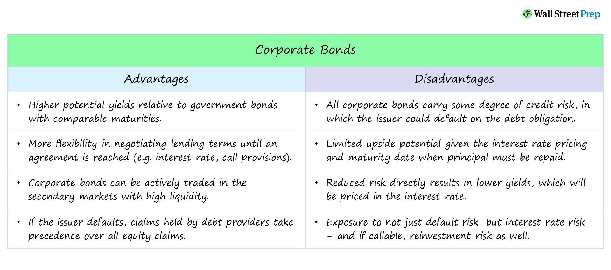

## Table of Contents

## What are corporate bonds?

Corporate bonds are a type of loan that companies take from investors. When a company needs money, it can issue bonds to the public. Investors buy these bonds, essentially lending money to the company. In return, the company promises to pay back the money with interest over a certain period of time. This interest is like a reward for the investors for lending their money.

These bonds are considered safer than stocks because they offer a steady income through interest payments. However, they are riskier than government bonds because companies can go bankrupt. If a company goes bankrupt, bondholders might not get all their money back. That's why it's important for investors to check the credit rating of the company before buying its bonds. A higher credit rating means the company is more likely to pay back the loan.

## How do corporate bonds differ from other types of bonds?

Corporate bonds are different from other types of bonds mainly because they are issued by companies, not by the government or a city. When you buy a corporate bond, you are lending money to a company. The company then pays you back with interest over time. This is different from government bonds, where you lend money to the government, or municipal bonds, where you lend money to a city or local government. Government bonds are usually seen as safer because governments are less likely to go bankrupt than companies.

Another difference is the level of risk and the interest rate. Corporate bonds usually offer higher interest rates than government bonds because they are riskier. If a company goes bankrupt, you might not get all your money back. Government bonds, on the other hand, are backed by the full faith and credit of the government, so they are safer but offer lower interest rates. Municipal bonds can be somewhere in between, depending on the financial health of the city issuing them. So, when choosing between different types of bonds, you need to think about how much risk you are willing to take and how much interest you want to earn.

## What are the main benefits of investing in corporate bonds?

One of the main benefits of investing in corporate bonds is the steady income they provide. When you buy a corporate bond, the company pays you interest regularly, usually every six months. This can be a good way to earn money without taking too much risk. It's like getting paid for lending your money to the company.

Another benefit is that corporate bonds can be less risky than stocks. If a company does well, the value of its stocks can go up a lot, but it can also go down a lot. With bonds, you know how much interest you will get and when you will get your money back, as long as the company doesn't go bankrupt. This makes bonds a safer choice for people who want to protect their money while still earning some interest.

## What are the risks associated with corporate bonds?

One of the main risks with corporate bonds is that the company might go bankrupt. If that happens, you might not get all your money back. When a company goes bankrupt, it has to pay off its debts, and bondholders are usually paid before shareholders. But if there's not enough money to pay everyone, bondholders might only get some of their money back. This is called default risk, and it's higher for corporate bonds than for government bonds because companies are more likely to go bankrupt than governments.

Another risk is interest rate risk. This means that if interest rates go up, the value of your bond might go down. When new bonds are issued with higher interest rates, your old bond with a lower interest rate becomes less attractive to other investors. If you want to sell your bond before it matures, you might have to sell it for less than you paid for it. This can be a problem if you need your money back sooner than expected.

Lastly, there's inflation risk. Inflation means that the value of money goes down over time. If inflation is high, the interest you earn from your bond might not be enough to keep up with the rising prices. This means that even though you're getting paid interest, the real value of your money could be going down. So, it's important to think about inflation when you're deciding whether to invest in corporate bonds.

## How are corporate bonds rated, and what do these ratings mean?

Corporate bonds are rated by special companies called credit rating agencies. These agencies look at how likely a company is to pay back the money it borrows. They give the bonds a grade, kind of like how teachers give grades in school. The grades can be letters like AAA, AA, A, BBB, and so on, all the way down to D. The highest grade, like AAA, means the company is very likely to pay back the money. Lower grades, like BB or below, mean the company is less likely to pay back the money and is riskier.

These ratings help investors decide which bonds to buy. If you want to be safe and don't mind getting less interest, you might choose a bond with a high rating like AAA or AA. These bonds are less risky because the company is more likely to pay back the money. But if you're willing to take more risk for a chance to earn more interest, you might choose a bond with a lower rating like BB or B. These bonds pay more interest because they are riskier, but there's a bigger chance the company might not pay back the money. So, the rating tells you about the balance between risk and reward.

## What is the typical yield of corporate bonds compared to government bonds?

Corporate bonds usually offer higher yields than government bonds. This means you can earn more interest from corporate bonds. The reason for this is that corporate bonds are riskier. Companies can go bankrupt, and if that happens, you might not get all your money back. Because of this higher risk, companies have to offer higher interest rates to attract investors. So, if you want to earn more interest, you might choose a corporate bond, but you also have to be ready for the extra risk.

Government bonds, on the other hand, are seen as safer because governments are less likely to go bankrupt. This means they can offer lower interest rates and still attract investors. For example, U.S. Treasury bonds are backed by the full faith and credit of the U.S. government, which makes them very safe. Because they are safer, the interest rates on government bonds are usually lower than those on corporate bonds. So, if you want to keep your money safe and don't mind earning less interest, you might choose a government bond.

## How can corporate bonds be used in a diversified investment portfolio?

Corporate bonds can be a good part of a diversified investment portfolio because they help spread out the risk. When you invest in different things, like stocks, real estate, and bonds, you're not putting all your eggs in one basket. If one type of investment does badly, the others might do well and balance things out. Corporate bonds can be especially useful because they offer a steady income through interest payments, which can help keep your portfolio stable even when the stock market is going up and down.

Adding corporate bonds to your portfolio can also help you earn more interest than you would with safer investments like government bonds. Because corporate bonds are riskier, they usually pay higher interest rates. This means you can get a better return on your money, but you have to be ready for the chance that the company might not pay back the loan. By mixing corporate bonds with other types of investments, you can find a good balance between earning more interest and keeping your money safe.

## What is the process of issuing corporate bonds?

When a company wants to raise money, it can issue corporate bonds. The first step is for the company to decide how much money it needs and what interest rate it will offer to investors. The company then works with an investment bank to help set up the bond issue. The investment bank helps the company figure out the details, like the bond's maturity date, which is when the company will pay back the money, and the interest rate, which is how much the company will pay investors for lending them money. Once everything is set, the company creates a document called a prospectus. This document tells investors all about the bond, including the risks and the company's financial health.

After the prospectus is ready, the company starts selling the bonds. This can be done in different ways. Sometimes, the company sells the bonds directly to investors. Other times, the investment bank buys the bonds from the company and then sells them to investors. The bonds are usually sold in big groups called tranches. Investors can buy these bonds through their brokers or on bond markets. Once the bonds are sold, the company gets the money it needs and starts paying interest to the investors at regular times, usually every six months. When the bond reaches its maturity date, the company pays back the money it borrowed, and the bond is finished.

## How does the maturity date of a corporate bond affect its risk and return?

The maturity date of a corporate bond is when the company promises to pay back the money it borrowed from investors. If a bond has a longer time until it matures, it's usually riskier. This is because the longer the time, the more things can change. The company might have a hard time paying back the money if it runs into problems, or the economy might change in ways that make it harder for the company to pay. Because of this extra risk, long-term bonds usually offer higher interest rates to attract investors. They want to get paid more for waiting longer and taking more risk.

On the other hand, if a bond has a shorter time until it matures, it's usually safer. The company has less time to run into problems, so it's more likely to pay back the money on time. Because these bonds are less risky, they usually offer lower interest rates. Investors don't need as much reward for lending money for a shorter time. So, when you're thinking about buying a corporate bond, you need to think about how long you're willing to wait and how much risk you're ready to take. The maturity date can help you decide if the bond is a good fit for your investment goals.

## What are callable and puttable features in corporate bonds, and how do they impact investors?

A callable feature in a corporate bond means the company can pay back the money it borrowed before the bond's maturity date. They might do this if interest rates go down and they can borrow money more cheaply somewhere else. For investors, this can be a problem because if the bond is called, they might have to find a new place to invest their money, possibly at a lower interest rate. So, callable bonds usually offer a higher interest rate to make up for this risk. If you're an investor, you need to think about whether you're okay with the chance that your bond might be called early.

A puttable feature in a corporate bond is the opposite. It lets the investor ask for their money back before the bond matures. This can be good for investors because if interest rates go up, they can get their money back and invest it somewhere else at a higher rate. But because this feature is good for investors, puttable bonds usually offer a lower interest rate than regular bonds. So, when you're looking at bonds with puttable features, you need to decide if the chance to get your money back early is worth getting a little less interest.

## How do interest rate changes affect the price and yield of corporate bonds?

When interest rates go up, the price of corporate bonds usually goes down. This happens because new bonds that are issued will have higher interest rates, making the old bonds with lower rates less attractive to investors. If you want to sell your old bond before it matures, you might have to sell it for less money than you paid for it. On the other hand, if interest rates go down, the price of your bond can go up. This is because your bond now has a higher interest rate than new bonds, making it more valuable to other investors.

The yield of a corporate bond, which is like the interest rate you earn on it, also changes with interest rates. When interest rates go up, the yield on new bonds goes up too. But the yield on your existing bond stays the same unless you sell it and buy a new one. So, if you keep your bond, its yield might be lower than the yield on new bonds. But if you sell your bond and buy a new one with a higher yield, you can earn more interest. It's important to think about how interest rates might change when you're deciding whether to buy, sell, or hold onto a corporate bond.

## What advanced strategies can be used to manage a portfolio of corporate bonds effectively?

One advanced strategy for managing a portfolio of corporate bonds is called laddering. This means you buy bonds that mature at different times, like steps on a ladder. Some bonds might mature in one year, others in three years, and others in five years. By doing this, you spread out the risk. If interest rates go up, you can reinvest the money from the bonds that mature soon at the new higher rates. If rates go down, you still have bonds that are paying the old higher rates. This helps you balance the risk and reward and keep a steady income coming in.

Another strategy is to use bond swaps. This means you sell one bond and use the money to buy another one. You might do this if you think the new bond will do better or if you want to change the risk level of your portfolio. For example, if you think interest rates are going to go up, you might swap a long-term bond for a short-term one. This can help you avoid losing money if the price of the long-term bond goes down. By swapping bonds, you can keep your portfolio flexible and ready to take advantage of changes in the market.

A third strategy is to pay attention to credit ratings and diversify across different sectors and companies. You can buy bonds from companies in different industries, like technology, healthcare, and energy. This way, if one industry has problems, your whole portfolio won't be affected. Also, keep an eye on the credit ratings of the bonds you own. If a company's rating goes down, it might be a good idea to sell that bond and buy one with a better rating. By diversifying and watching credit ratings, you can manage the risk in your portfolio and aim for better returns.

## What are the risks associated with corporate bonds?

Corporate bonds, while offering attractive returns, come with a set of inherent risks that investors must carefully consider. One of the primary risks is credit risk, which is the possibility that the bond issuer may default on its payment obligations. This can occur if the issuing company faces financial difficulties, leading to missed interest payments or, in the worst case, a failure to return the principal amount to bondholders. Credit risk is a crucial factor in determining the bond’s [interest rate](/wiki/interest-rate-trading-strategies); higher perceived risk results in higher yields to attract investors.

Closely tied to credit risk is the risk of rating downgrades. Credit rating agencies such as Moody's, Standard & Poor's, and Fitch provide ratings that assess the creditworthiness of bond issuers. A downgrade in a bond's rating often signals an increased risk of default, leading to a decline in the bond's market value. For instance, if a bond is downgraded from 'A' to 'B', its market price may fall as investors demand higher yields for increased risk.

Interest rate risk is another significant factor affecting corporate bonds. Bond prices and interest rates have an inverse relationship; when interest rates rise, existing bond prices typically fall, as new bonds are issued with higher yields. This risk is particularly pronounced for long-term bonds because they lock in a fixed interest rate for an extended period. The price change in a bond due to interest rate fluctuations can be estimated using its duration, which measures the bond's sensitivity to interest rate changes. A bond's price change ($\Delta P$) can be approximated by:

$$
\Delta P \approx -D \times \Delta y \times P_0
$$

where $D$ is the bond’s duration, $\Delta y$ is the change in yield, and $P_0$ is the initial price of the bond.

Event risk involves unpredictable occurrences that can adversely affect a bond issuer's financial condition and, consequently, the value of its bonds. Such events can include mergers and acquisitions, regulatory changes, or natural disasters. These events can lead to sudden changes in a company's credit rating or financial stability, affecting bond values. Investors must be aware of these risks and incorporate strategies to mitigate their impact, such as diversifying their bond portfolios or employing tools like [algorithmic trading](/wiki/algorithmic-trading) to adapt swiftly to market changes.

## References & Further Reading

[1]: ["Advances in Financial Machine Learning"](https://www.amazon.com/Advances-Financial-Machine-Learning-Marcos/dp/1119482089) by Marcos Lopez de Prado

[2]: ["Machine Learning for Algorithmic Trading"](https://github.com/PacktPublishing/Machine-Learning-for-Algorithmic-Trading-Second-Edition) by Stefan Jansen

[3]: ["Quantitative Trading: How to Build Your Own Algorithmic Trading Business"](https://www.amazon.com/Quantitative-Trading-Build-Algorithmic-Business/dp/0470284889) by Ernest P. Chan

[4]: ["Evidence-Based Technical Analysis: Applying the Scientific Method and Statistical Inference to Trading Signals"](https://www.amazon.com/Evidence-Based-Technical-Analysis-Scientific-Statistical/dp/0470008741) by David Aronson

[5]: Bergstra, J., Bardenet, R., Bengio, Y., & Kégl, B. (2011). ["Algorithms for Hyper-Parameter Optimization."](https://dl.acm.org/doi/10.5555/2986459.2986743) Advances in Neural Information Processing Systems 24.