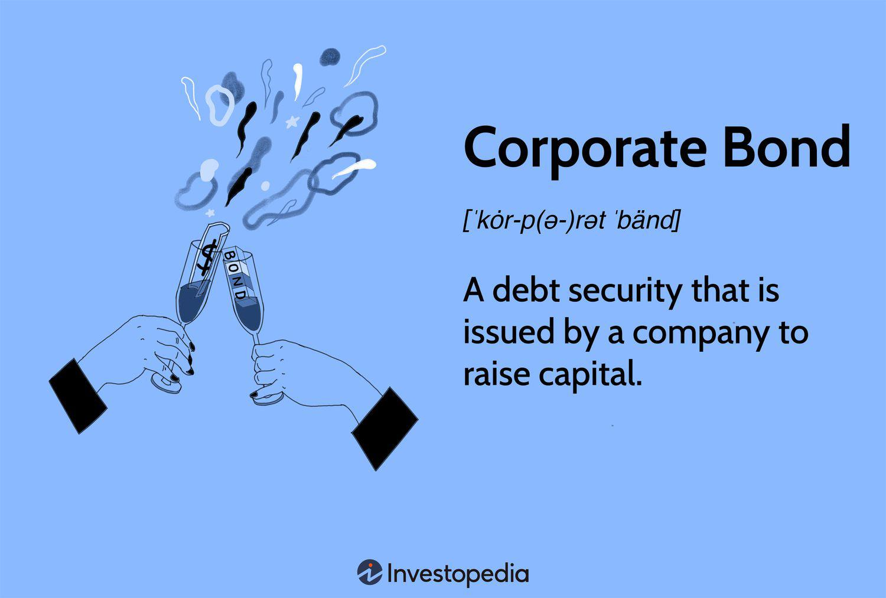

## Table of Contents

## What are corporate bonds?

Corporate bonds are like IOUs that big companies issue to borrow money from investors. When a company needs money for things like expanding their business or paying off debts, they can sell these bonds. Investors buy the bonds and, in return, the company promises to pay back the money they borrowed, plus interest, on specific dates. This interest is usually paid every six months until the bond's maturity date, which is when the company pays back the full amount.

These bonds can be a good way for investors to make money because they usually offer higher interest rates than government bonds. But they also come with more risk. If the company runs into financial trouble, it might not be able to pay back the bondholders. To help investors understand this risk, credit rating agencies give bonds ratings. A high rating means the company is likely to pay back the bond, while a low rating means there's a bigger chance the company might not be able to pay.

## How do corporate bonds differ from other types of bonds?

Corporate bonds are different from other types of bonds mainly because they are issued by companies, not by the government or government-backed agencies. For example, when you buy a corporate bond, you're lending money to a company like Apple or Ford. They use this money for things like building new factories or paying off other debts. In return, they promise to pay you back with interest. This is different from government bonds, which are issued by the government to fund public projects like building roads or schools. Government bonds are generally seen as safer because the government is less likely to go bankrupt than a company.

Another way corporate bonds differ is in their risk and reward. Corporate bonds usually offer higher interest rates than government bonds because they are riskier. If a company goes bankrupt, bondholders might not get their money back. This is different from government bonds, which are considered very safe, especially those issued by stable governments like the U.S. There are also municipal bonds, which are issued by local governments or cities. These bonds often have tax advantages, like being free from federal income tax, which corporate bonds usually don't have. So, when choosing between corporate bonds and other types, investors need to think about the balance between risk, reward, and any special benefits like tax breaks.

## What are the benefits of investing in corporate bonds?

Investing in corporate bonds can give you a steady income. When you buy a corporate bond, the company promises to pay you interest regularly, usually every six months. This can be a good way to earn money without having to do much work. The interest rates on corporate bonds are often higher than what you'd get from saving your money in a bank or investing in government bonds. This means you could earn more money over time.

Another benefit is that corporate bonds can help you spread out your investment risks. Instead of putting all your money into one company's stock, you can buy bonds from different companies. This way, if one company has problems, it won't hurt your whole investment. Also, if you hold onto the bond until it matures, you'll get your original money back, plus all the interest you've earned. This makes corporate bonds a safer choice than stocks, which can go up and down a lot in value.

## What are the risks associated with buying corporate bonds?

One big risk of buying corporate bonds is that the company might not be able to pay you back. If the company goes bankrupt, bondholders might lose their money. This is more likely to happen with companies that are not doing well financially. To help you understand this risk, credit rating agencies give bonds ratings. A high rating means the company is likely to pay back the bond, but a low rating means there's a bigger chance they might not be able to pay. So, it's important to check the rating before you buy a bond.

Another risk is that the value of your bond can go down if interest rates go up. When interest rates rise, new bonds are issued with higher interest rates, making your old bond less attractive to other investors. If you need to sell your bond before it matures, you might have to sell it for less than you paid for it. This is called interest rate risk. It's something to think about if you might need your money back before the bond's maturity date.

## How can someone start buying corporate bonds?

To start buying corporate bonds, you first need to open a brokerage account. This is like a special bank account where you can buy and sell investments, including bonds. You can open a brokerage account online with companies like Fidelity, Charles Schwab, or Vanguard. Once your account is set up, you can start looking for corporate bonds to buy. You can search for bonds by the company's name, the bond's rating, or how long until the bond matures.

After you find a bond you want to buy, you need to decide how much to spend. Corporate bonds are usually sold in big amounts, like $1,000 or more, so you need to make sure you have enough money in your account. Once you've made your decision, you can place an order through your brokerage account. The process is similar to buying stocks. After you buy the bond, you'll start receiving interest payments, usually every six months, until the bond matures. Then, you'll get your original money back.

## What factors should be considered when choosing which corporate bonds to buy?

When choosing which corporate bonds to buy, the first thing to look at is the bond's credit rating. This rating tells you how likely the company is to pay back the money they borrowed. A high rating, like AAA, means the company is very likely to pay you back. A low rating, like BB or below, means there's a bigger chance they might not be able to pay. So, if you want a safer investment, you should choose bonds with higher ratings. But remember, safer bonds usually have lower interest rates.

Another important thing to consider is the bond's interest rate, also called the coupon rate. This is how much money you'll earn from the bond every year. Corporate bonds usually offer higher interest rates than government bonds because they are riskier. You should compare the interest rates of different bonds to see which one gives you the best return for the amount of risk you're willing to take. Also, think about how long you want to keep your money tied up. Bonds have different maturity dates, which is when you get your original money back. If you might need your money back soon, choose a bond with a shorter maturity date.

## What is the process of selling corporate bonds?

Selling corporate bonds is similar to selling stocks. If you have a brokerage account, you can sell your bonds through that account. You just need to go to the part of the account where you can trade bonds, find the bond you want to sell, and place a sell order. You can choose to sell it at the current market price or set a specific price you want to get for it. Once someone buys your bond, the money will go into your brokerage account.

The price you get for your bond can change depending on different things. If interest rates have gone up since you bought the bond, the price might be lower because new bonds are paying more interest. Also, if the company's credit rating has gone down, the bond might be worth less because it's riskier. It's a good idea to check the current market conditions and the company's financial health before you decide to sell.

## How do interest rates affect the value of corporate bonds?

Interest rates have a big impact on the value of corporate bonds. When interest rates go up, new bonds start paying more interest. This makes your old bond, which pays less interest, less attractive to other investors. If you want to sell your bond before it matures, you might have to sell it for less than what you paid for it. This is because other people can buy new bonds that pay more interest.

On the other hand, when interest rates go down, your bond becomes more valuable. This is because your bond is paying more interest than the new bonds being issued. If you decide to sell your bond, you might be able to sell it for more than what you paid for it. So, it's important to keep an eye on interest rates if you might need to sell your bond before it matures.

## What is the role of bond ratings in the corporate bond market?

Bond ratings are important in the corporate bond market because they tell investors how safe a bond is. When a company wants to sell bonds, a special agency looks at the company's finances and gives the bond a rating. A high rating, like AAA, means the company is very likely to pay back the money they borrowed. A low rating, like BB or below, means there's a bigger chance the company might not be able to pay. So, if you're looking for a safe investment, you should choose bonds with higher ratings.

These ratings help investors make better choices. If you're okay with taking more risk, you might choose a bond with a lower rating because it usually pays more interest. But if you want to be safer, you'll go for a bond with a higher rating, even though it might pay less interest. Bond ratings make it easier for everyone to understand the risks and rewards of different bonds, helping them pick the ones that fit their investment goals.

## How can one assess the creditworthiness of a corporate bond issuer?

To assess the creditworthiness of a corporate bond issuer, you can start by looking at the bond's credit rating. Credit rating agencies like Moody's, Standard & Poor's, and Fitch give bonds ratings based on how likely the company is to pay back the money they borrowed. A high rating, like AAA, means the company is very likely to pay back the bond. A low rating, like BB or below, means there's a bigger chance they might not be able to pay. So, checking the rating is a good first step to see if the bond is safe.

Another way to assess a company's creditworthiness is by looking at their financial statements. You can find these statements on the company's website or through financial news websites. Look at things like their revenue, profits, and debt levels. If a company is making a lot of money and doesn't have too much debt, they are more likely to pay back their bonds. You can also read news articles and reports about the company to see if there are any big changes or problems that might affect their ability to pay back the bond.

## What are the tax implications of investing in corporate bonds?

When you invest in corporate bonds, you have to pay taxes on the interest you earn. The interest you get from corporate bonds is usually taxed as regular income. This means it's taxed at the same rate as your salary or wages. So, if you're in a high tax bracket, you might end up paying a lot of taxes on the interest from your bonds. But if you hold the bond until it matures and you get your money back, you don't have to pay taxes on that part.

There are some ways to reduce the taxes you pay on corporate bonds. One way is to buy bonds in a tax-advantaged account, like an IRA or a 401(k). In these accounts, you don't have to pay taxes on the interest until you take the money out, and sometimes you can even avoid paying taxes on it at all. Another thing to think about is buying municipal bonds instead of corporate bonds. Municipal bonds are issued by local governments and are often tax-free at the federal level, and sometimes at the state level too. So, depending on your tax situation, municipal bonds might be a better choice.

## How do advanced trading strategies, like bond swaps, work in the context of corporate bonds?

Bond swaps are a way for investors to trade one bond for another to improve their investment. In the context of corporate bonds, an investor might swap a bond with a low interest rate for one with a higher interest rate. This can happen when interest rates go up, and new bonds are issued with better rates. By swapping, the investor can earn more money from the interest payments. Another reason to swap bonds is to change the risk level of your investment. If you have a bond from a company that's doing badly, you might swap it for a bond from a more stable company to lower your risk.

Another type of bond swap is called a tax swap. This is when an investor swaps a bond that has lost value for a similar bond to get a tax advantage. If the original bond has gone down in price, the investor can sell it and claim a loss on their taxes. Then, they can use the money to buy a new bond with similar features but a different issuer. This way, they keep their investment strategy the same but get a tax break. Bond swaps can be a smart way to manage your investments, but they need careful planning to make sure they fit your overall financial goals.

## References & Further Reading

[1]: Bergstra, J., Bardenet, R., Bengio, Y., & Kégl, B. (2011). ["Algorithms for Hyper-Parameter Optimization."](https://papers.nips.cc/paper/4443-algorithms-for-hyper-parameter-optimization) Advances in Neural Information Processing Systems 24.

[2]: ["Advances in Financial Machine Learning"](https://www.amazon.com/Advances-Financial-Machine-Learning-Marcos/dp/1119482089) by Marcos Lopez de Prado

[3]: Treleaven, P., Galas, M., & Lalchand, V. (2013). ["Algorithmic Trading Review."](https://dl.acm.org/doi/10.1145/2500117) Communications of the ACM, 56(11), 76–85.

[4]: Narang, R. K. (2009). ["Inside the Black Box: The Simple Truth About Quantitative Trading."](https://onlinelibrary.wiley.com/doi/book/10.1002/9781118267738) Wiley.

[5]: O'Hara, M. (2015). ["High-Frequency Market Microstructure."](https://www.sciencedirect.com/science/article/pii/S0304405X15000045) Annual Review of Financial Economics, 7, 133-155.