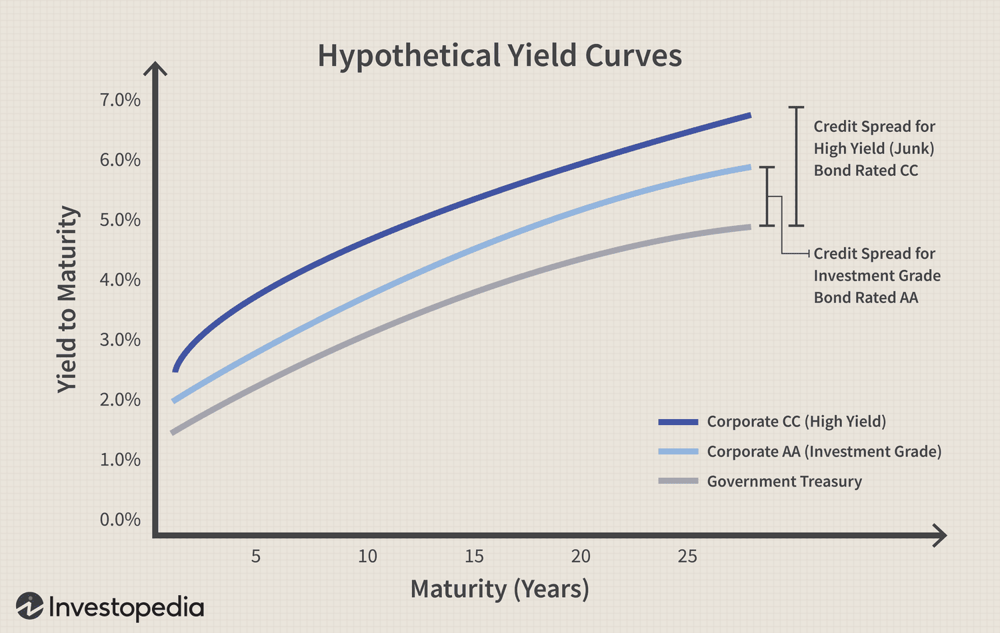

## Table of Contents

## What are corporate bonds?

Corporate bonds are like IOUs that companies issue to borrow money from investors. When you buy a corporate bond, you are lending money to the company, and in return, the company promises to pay you back the amount you lent, plus interest, over a certain period of time. This interest is usually paid to you regularly, like every six months, until the bond reaches its maturity date, which is when the company pays you back the full amount you originally invested.

These bonds are a way for companies to raise money without having to give up ownership, like they would if they issued stocks. Instead, they agree to pay interest to bondholders. Corporate bonds can be safer than stocks because they offer a fixed return, but they still carry some risk. If the company runs into financial trouble, it might not be able to pay back the bondholders. That's why it's important to check the company's credit rating before investing in its bonds. A higher credit rating means the company is more likely to pay you back.

## How do corporate bonds differ from government bonds?

Corporate bonds and government bonds are both ways for organizations to borrow money, but they come from different places. Corporate bonds are issued by companies that want to raise money for things like expanding their business or paying off other debts. On the other hand, government bonds are issued by governments, like the federal government or state governments, to fund public projects, like building roads or schools, or to manage the country's finances.

The main difference between the two is the risk involved. Generally, government bonds are considered safer because governments are less likely to go bankrupt than companies. This means that government bonds usually offer lower interest rates because they are seen as a safer investment. Corporate bonds, on the other hand, can offer higher interest rates because they [carry](/wiki/carry-trading) more risk. If the company does well, you get a good return, but if the company struggles, there's a chance they might not be able to pay you back. So, when choosing between corporate and government bonds, it's important to think about how much risk you're willing to take and what kind of return you're looking for.

## What is credit risk in the context of corporate bonds?

Credit risk in the context of corporate bonds is the chance that the company might not be able to pay back the money they borrowed from you. When you buy a corporate bond, you're lending money to the company, and they promise to pay you back with interest. But if the company runs into financial trouble, they might not have enough money to keep their promise. This is what we mean by credit risk - it's the risk that the company won't be able to pay you back.

To understand how likely this is to happen, people look at the company's credit rating. A credit rating is like a score that tells you how financially healthy a company is. If a company has a high credit rating, it means they're seen as more likely to pay you back, so the credit risk is lower. But if the company has a low credit rating, it means they're seen as more likely to run into trouble, so the credit risk is higher. Investors need to think about this credit risk when they decide whether to buy a corporate bond, because it affects how safe their investment is.

## How is the creditworthiness of a corporate bond issuer assessed?

The creditworthiness of a corporate bond issuer is assessed by looking at their financial health and ability to pay back the money they borrow. Credit rating agencies, like Moody's or Standard & Poor's, do this by studying the company's financial statements, like their income and balance sheets. They look at things like how much debt the company has, how much money they make, and how well they manage their money. They also consider the company's history and the overall health of the industry it's in. All of this information helps them decide if the company is likely to pay back its bonds on time.

Based on this analysis, the credit rating agencies give the company a rating. This rating is a score that tells investors how risky it is to lend money to the company. A high rating, like AAA or AA, means the company is seen as very likely to pay back its bonds, so it's a safer investment. A lower rating, like BB or below, means the company is seen as more likely to have trouble paying back its bonds, so it's a riskier investment. Investors use these ratings to decide if they want to buy the company's bonds and how much interest they should expect in return for taking on the risk.

## What are credit ratings and how do they relate to corporate bonds?

Credit ratings are scores given to companies by special agencies like Moody's or Standard & Poor's. These scores tell investors how likely it is that a company will pay back the money they borrow. A high credit rating, like AAA or AA, means the company is seen as very likely to pay back its debts. A lower rating, like BB or below, means there's more risk that the company might not pay back what it owes.

When it comes to corporate bonds, credit ratings are super important. If a company wants to borrow money by issuing bonds, investors look at the company's credit rating to decide if it's a safe investment. A high credit rating makes the bonds more attractive because they're seen as less risky. But if the rating is low, the company might have to offer higher interest rates to convince people to buy their bonds, because the risk of not getting paid back is higher.

## What factors influence the credit risk of corporate bonds?

The credit risk of corporate bonds depends on a lot of things about the company that issues them. One big thing is how much money the company is making. If they're making a lot of money, they're more likely to be able to pay back their bonds. But if they're not making much money, or if they're losing money, it's harder for them to pay back what they owe. Another thing is how much debt the company already has. If they already owe a lot of money, it might be harder for them to borrow more and pay it all back. The overall health of the industry the company is in also matters. If the industry is doing well, the company is more likely to do well too.

Credit ratings also play a big role in figuring out the credit risk of corporate bonds. Credit rating agencies look at all the things I just mentioned and give the company a score. A high score, like AAA or AA, means the company is seen as likely to pay back its bonds. A low score, like BB or below, means there's more risk that the company might not be able to pay back what it owes. So, when people are thinking about buying corporate bonds, they look at these ratings to help them decide if it's a safe investment. The higher the rating, the less risky the bond is seen to be, and the lower the rating, the riskier it is.

## How can investors mitigate credit risk when investing in corporate bonds?

Investors can lower their credit risk by choosing bonds from companies with high credit ratings. These ratings come from agencies like Moody's or Standard & Poor's, and a high rating means the company is seen as more likely to pay back what they owe. By sticking to bonds with ratings like AAA or AA, investors are [picking](/wiki/asset-class-picking) safer bets. They can also spread out their risk by buying bonds from different companies or industries. This way, if one company runs into trouble, the investor won't lose all their money because they have bonds from other companies that are doing well.

Another way to manage credit risk is to pay attention to the news and keep an eye on the companies they've invested in. If a company starts to struggle, its credit rating might go down, and the investor can decide if they want to sell the bond before it loses more value. Some investors also buy bond insurance, which is like a safety net that promises to pay back the bond if the company can't. This can cost extra, but it adds a layer of protection. By using these strategies, investors can feel more secure about their investments in corporate bonds.

## What are the differences between investment-grade and high-yield corporate bonds?

Investment-grade and high-yield corporate bonds are different mainly because of how risky they are and how much money they can make for investors. Investment-grade bonds come from companies that are seen as pretty safe. They have good credit ratings, like AAA, AA, A, or BBB. Because these companies are less likely to run into trouble and not pay back their bonds, these bonds offer lower interest rates. People who buy investment-grade bonds are looking for a steady, reliable way to earn money without taking too much risk.

On the other hand, high-yield bonds, which are also called junk bonds, come from companies that are seen as riskier. They have lower credit ratings, like BB or below. Because these companies are more likely to have trouble paying back their bonds, they have to offer higher interest rates to get people to buy them. Investors who choose high-yield bonds are willing to take on more risk because they want to earn more money. But if the company does run into trouble, these investors could lose more money than those who stick with investment-grade bonds.

## How do macroeconomic conditions affect the credit risk of corporate bonds?

Macroeconomic conditions, like the overall health of the economy, can really change the credit risk of corporate bonds. When the economy is doing well, companies usually make more money and are better at paying back their bonds. This means the credit risk goes down because it's less likely that the companies will run into financial trouble. But if the economy starts to struggle, like during a recession, companies might not make as much money. This can make it harder for them to pay back their bonds, so the credit risk goes up. Investors need to keep an eye on these big economic changes because they can affect how safe their bond investments are.

Interest rates are another big part of macroeconomic conditions that can affect corporate bonds. When interest rates go up, it can be harder for companies to borrow money because it costs more. This might make it tougher for them to pay back their bonds, increasing the credit risk. On the other hand, when interest rates are low, borrowing is cheaper, and companies might find it easier to pay back what they owe, lowering the credit risk. So, investors need to think about where interest rates are headed when they decide to buy corporate bonds, because it can make a big difference in how risky those bonds are.

## What are the historical default rates for corporate bonds, and how do they vary by rating?

Historical default rates for corporate bonds show how often companies fail to pay back their bonds. Over the years, studies have found that bonds with higher credit ratings have much lower default rates. For example, bonds rated AAA or AA, which are considered very safe, have had default rates that are almost zero. Bonds rated A or BBB, which are still seen as pretty safe, have had default rates of around 0.1% to 0.5% over a 10-year period. This means that out of every 1,000 bonds, only 1 to 5 might not get paid back.

On the other hand, bonds with lower ratings, like those rated BB or below, have much higher default rates. These are called high-yield or junk bonds, and they can have default rates of around 2% to 10% or even higher over a 10-year period. This means that out of every 1,000 of these bonds, 20 to 100 might not get paid back. The difference in default rates shows why investors need to think carefully about the credit rating of a bond before they decide to buy it. A higher rating means a safer investment, but a lower rating means more risk and a chance for higher returns if the company does well.

## How do covenants in bond agreements impact credit risk?

Covenants in bond agreements are like rules that companies have to follow when they borrow money by issuing bonds. These rules are there to help protect the people who buy the bonds by making sure the company doesn't do things that could make it harder to pay back the money they borrowed. For example, a covenant might say the company can't borrow more money or sell important parts of their business without asking bondholders first. By having these rules in place, covenants can lower the credit risk because they keep the company from taking on too much risk that could hurt their ability to pay back the bondholders.

However, if a company breaks a covenant, it can actually increase the credit risk. When a company doesn't follow the rules, it's called a covenant breach, and it can make investors worried that the company is in trouble. This might make the bond's value drop, and it could make it harder for the company to borrow money in the future. So, while covenants are meant to protect investors and lower credit risk, if they're broken, they can end up making the risk higher instead.

## What advanced quantitative models are used to assess and predict credit risk in corporate bonds?

Advanced quantitative models help investors figure out how likely it is that a company won't be able to pay back its corporate bonds. One popular model is the Merton model, which looks at the company's stock price and how much debt it has. It treats the company's equity like an option on its assets, and if the value of the company's assets drops below the value of its debt, the company might not be able to pay back its bonds. Another model is the Altman Z-score, which uses financial ratios like profitability, leverage, and [liquidity](/wiki/liquidity-risk-premium) to predict if a company might go bankrupt. These models use math and data to give investors a better idea of the credit risk they're taking on.

Other models, like logistic regression and [machine learning](/wiki/machine-learning) algorithms, are also used to predict credit risk. Logistic regression looks at a bunch of financial and economic factors to come up with a probability that a company will default on its bonds. Machine learning algorithms can handle even more data and find patterns that might be hard for humans to see. These models can look at things like the company's past financial performance, the overall economy, and even news and social media to predict how likely it is that a company will run into trouble. By using these advanced models, investors can make smarter choices about which corporate bonds to buy and how much risk they're willing to take.

## What is the importance of credit ratings?

Credit ratings are essential tools in the financial market used to gauge the financial health and creditworthiness of bond issuers. Agencies such as Moody's, Standard & Poor's (S&P), and Fitch serve pivotal roles in providing these ratings. They evaluate various aspects such as the issuer's debt levels, revenue generation capacity, economic environment, and management quality to determine how likely the issuer is to meet its financial obligations. Ratings typically range from high grades, such as AAA (indicating the highest creditworthiness), to lower grades, such as C or D (indicating significant risk of default).

These ratings significantly influence the yield spread—the difference in interest rates between corporate and government bonds. When a corporate bond is issued, its [interest rate](/wiki/interest-rate-trading-strategies), or yield, is often compared to that of government bonds, considered risk-free benchmarks (like U.S. Treasury bonds). A higher-rated corporate bond often has a smaller yield spread in comparison to lower-rated ones due to perceived lower risk. Conversely, a corporate bond with a lower credit rating has a larger yield spread to compensate investors for the increased risk of default.

The relationship between credit ratings and yield spreads reflects risk perception in financial markets. Investors use credit spreads as indicators of the risk premium, or the extra return demanded for taking on additional risk beyond a risk-free asset. The formula to calculate the yield spread $(YS)$ can be expressed as:

$$
YS = Y_c - Y_g
$$

Where $Y_c$ is the yield of the corporate bond and $Y_g$ is the yield of the government bond.

Understanding these yield spreads is crucial for investors aiming to balance risk and return in their bond portfolios. A tight yield spread may indicate a stable economic environment or high confidence in the issuer's financial health. In contrast, a widening spread could signal market [volatility](/wiki/volatility-trading-strategies) or concerns about the issuer's ability to meet its obligations.

Moreover, credit ratings not only assist in determining interest yields but they also function as a heuristic for investors, simplifying the complex analysis of financial documents. By comparing credit ratings, investors can quickly assess default risk and adjust their investment strategies accordingly. This ability to interpret and act on credit rating changes is vital as they often precede broader market adjustments, enabling informed and timely investment decisions.

## References & Further Reading

Explore publications such as "Advances in Financial Machine Learning" by Marcos Lopez de Prado to gain insights into the integration of machine learning with financial strategies, including those pertinent to credit risk and bond investments. This book discusses the application of machine learning algorithms in financial markets, which can be particularly useful for developing [algorithmic trading](/wiki/algorithmic-trading) strategies and enhancing data-driven decision-making.

For a comprehensive understanding of fixed income securities, consider the "Fixed Income Analysis" resources. These materials provide in-depth coverage of the fundamental concepts related to bonds and credit risks. They explore a range of topics from basic features of fixed income securities to complex bond investment strategies and risk management techniques.

Both resources are excellent for anyone looking to expand their knowledge in financial mathematics, algorithmic trading, and risk assessment in bond markets. They offer foundational as well as advanced perspectives, catering to beginners and experienced investors aiming to optimize their investment strategies through informed, technology-driven approaches.

