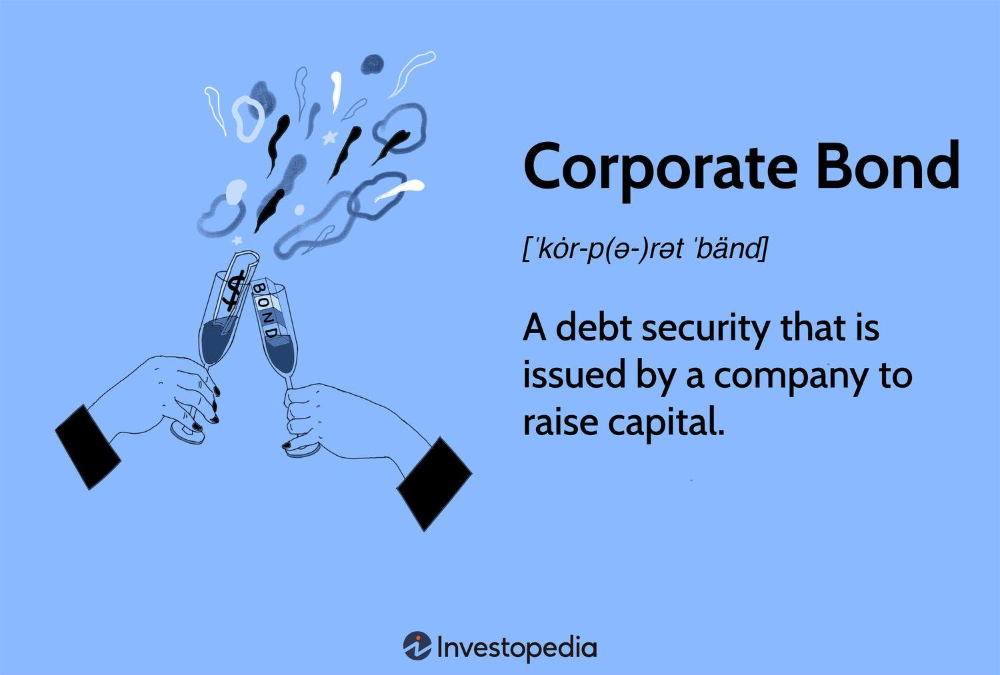

Corporate bonds trading is a pivotal component of financial markets, serving as a mechanism through which corporations can raise essential capital. These debt securities are issued by companies and acquired by investors, thus establishing a financial bridge between corporate entities and capital markets. Investors receive returns through fixed or variable interest payments over a specified period, aligning the interests of both parties involved.

Algorithmic trading, often referred to as algo trading, has introduced a transformative shift in the trading of corporate bonds. By utilizing advanced computer algorithms and mathematical models, algo trading enables the execution of trades at incredible speeds with minimal human intervention. This sophisticated method leverages pre-set rules and complex calculations to identify optimal trade entry and exit points, thereby enhancing the efficiency and effectiveness of bond trading activities. 

The advent of algo trading in corporate bonds trading presents both opportunities and challenges. It offers remarkable improvements in speed and efficiency, allowing for the rapid processing of transactions which can significantly enhance market liquidity. Furthermore, automated trading can lead to reduced trading costs, as it minimizes the reliance on manual processes and human oversight. However, these advancements are accompanied by potential risks, such as technical glitches, market volatility, and a lack of transparency in trading strategies.

This article aims to explore the multifaceted impact of algo trading on corporate bonds trading. It will examine both the benefits, including enhanced speed and efficiency, as well as the challenges and risks associated with this technological advancement. As financial markets continue to evolve with technological innovation, understanding the implications of algo trading will be crucial for market participants navigating the future landscape of bond trading.

## Table of Contents

## Understanding Corporate Bonds Trading

Corporate bonds are debt instruments issued by corporations to obtain necessary capital for various business activities, such as expanding operations, purchasing equipment, or refinancing existing debts. When a company needs to raise funds, it may opt to issue bonds as an alternative to seeking equity investment, which might dilute its shareholders' equity. 

Investors in corporate bonds essentially act as lenders to the issuing company. When investors purchase these bonds, they agree to lend a specified sum of money to the issuer for a predefined duration. In return, they receive periodic interest payments at a fixed or variable rate. The interest rate, often referred to as the coupon rate, is determined by factors such as the issuer's credit rating, prevailing market conditions, and the bond's maturity date. At the bond's maturity, the issuer repays the principal amount to the bondholders.

Corporate bonds are traded in bond markets, primarily through over-the-counter (OTC) transactions, rather than on centralized exchanges. OTC trading allows for greater flexibility, as these trades are negotiated directly between parties, often through brokers or dealers. Consequently, the corporate bond market is considered less transparent compared to equity markets, which can affect [liquidity](/wiki/liquidity-risk-premium) and pricing.

The process of trading corporate bonds involves assessing various factors such as credit risk, [interest rate](/wiki/interest-rate-trading-strategies) risk, and market conditions. Credit risk pertains to the issuer's ability to make timely interest payments and repay the principal amount, which is reflected in the bond's credit rating. Interest rate risk arises from fluctuations in market interest rates, which inversely affect bond prices. When interest rates rise, existing bonds' prices typically fall, and vice versa.

Overall, corporate bonds trading provides opportunities for both issuers and investors. Companies gain access to substantial funding without altering ownership structures, while investors can earn regular income and achieve portfolio diversification. However, the intricate nature of this market necessitates a thorough understanding of the associated risks and dynamics.

 to Algorithmic Trading

Algorithmic trading, often referred to as algo trading, is a sophisticated method of executing trades using computer algorithms. These algorithms are designed to perform trading operations at speeds and frequencies that surpass human capabilities. By employing mathematical models and pre-set rules, algo trading systems make decisions on trade entry and [exit](/wiki/exit-strategy) points, optimizing the order execution process.

At the core of [algorithmic trading](/wiki/algorithmic-trading) is the reliance on computational algorithms that analyze a vast array of market data in real-time. These algorithms can process complex calculations and assess numerous indicators to determine the optimal timing and pricing for trade execution. The primary goal is to capitalize on small price movements with rapid execution, making high-frequency trading possible.

Algorithmic trading has brought about a transformative change in financial markets, having been widely adopted in equities and foreign exchange ([forex](/wiki/forex-system)) trading. Its expansion into corporate bonds is part of this evolving landscape, offering several advantages such as improved liquidity, reduced transaction costs, and enhanced price discovery mechanisms.

Strategies employed in algorithmic trading can vary significantly, ranging from market-making and [arbitrage](/wiki/arbitrage) to [trend following](/wiki/trend-following) and mean reversion. Each strategy is crafted to exploit specific market inefficiencies or to provide liquidity in different scenarios. These strategies are encoded into algorithms capable of adjusting to the fast-paced and dynamic nature of financial markets.

Algorithmic trading’s ability to minimize human intervention reduces the potential for human error and emotional bias in the trading process. Furthermore, with the advent of [machine learning](/wiki/machine-learning) and [artificial intelligence](/wiki/ai-artificial-intelligence), algorithms are increasingly becoming adaptive, capable of learning from historical data and improving their predictive accuracy over time.

The integration of algorithmic trading within corporate bonds markets is a testament to its growing significance across various financial instruments. As the technology continues to advance, its applications are likely to expand, further cementing its role in modern trading practices.

## Benefits of Algo Trading in Corporate Bonds

Algorithmic trading, often referred to as algo trading, offers substantial advantages in the corporate bonds market, primarily through enhanced speed and efficiency, reduced trading costs, and improved price discovery.

Firstly, the speed and efficiency brought by algo trading are transformative. Unlike traditional trading methods, algorithmic systems can process thousands of bond orders in mere seconds. This ability not only accelerates transaction times but also significantly enhances market liquidity. The increased liquidity stems from the system’s capacity to match buy and sell orders more swiftly, resulting in a more dynamic market environment. The ability to execute trades rapidly is vital in markets where prices can fluctuate quickly, allowing investors to capitalize on favorable market conditions without delay.

Secondly, algorithmic trading leads to reduced trading costs. Automation significantly diminishes the necessity for human intervention in the trading process, thereby decreasing operational costs. By relying on pre-defined algorithms to execute trades, firms can reduce the expenses associated with manual trade execution, such as staffing and error correction costs. The efficient processing offered by algorithmic systems eliminates the human errors commonly associated with manual trading, resulting in smoother and more cost-effective operations.

Thirdly, algo trading enhances price discovery in the corporate bonds market. Algorithms can analyze vast amounts of market data and execute trades based on intricate rule sets and mathematical models. This allows for more precise assessments of market conditions and facilitates the identification of pricing anomalies quickly. By incorporating large datasets, algo trading systems provide a clearer and more accurate reflection of market values, aiding traders in making informed decisions about bond pricing. The swift processing of data aids in maintaining market equilibrium by ensuring that bond prices of reflect the latest available information.

In conclusion, the integration of algorithmic trading in the corporate bonds market offers significant benefits by enhancing execution speed, reducing costs, and improving price discovery. These capabilities not only optimize trading efficiency but also contribute to a more robust and transparent market infrastructure.

## Challenges and Risks of Algo Trading

Technical glitches in algorithmic trading can lead to substantial financial losses. These occur when systems experience errors or failures, potentially causing trades to execute incorrectly or not at all. Such glitches may arise from hardware malfunctions, coding errors, or network issues. They underscore the importance of robust system architecture and thorough testing to mitigate risks.

Market [volatility](/wiki/volatility-trading-strategies) is another challenge associated with algorithmic trading, particularly high-frequency trading ([HFT](/wiki/high-frequency-trading-strategies)). The rapid execution of large volumes of trades can amplify price movements, leading to increased volatility. This could potentially unsettle markets, especially during periods of low liquidity or economic uncertainty. Increased volatility poses challenges to traders and investors, who must account for sudden price swings in their strategies.

Lack of transparency is a further concern in algorithmic trading. The complexity and opacity of algorithms can obscure the decision-making process, making it difficult for traders to fully understand and manage their strategies. This opacity can also hinder regulatory oversight, presenting challenges in monitoring and ensuring fair market practices. Traders and firms must prioritize clarity and accountability in algorithm design to address these transparency issues, fostering trust and compliance in the trading environment.

## The Future of Algo Trading in Corporate Bonds

As technology progresses, algorithmic trading is set to play an increasingly pivotal role in the corporate bond markets. Technological enhancements allow algorithms to become more sophisticated, providing increased efficiency in executing trades. The capacity to process immense volumes of data with speed and precision underscores the growing reliance on technology to optimize trading strategies and liquidity in corporate bonds.

Regulatory developments are an integral aspect of the future prospects of algorithmic trading in corporate bonds. As the market dynamics evolve due to the influx of technological solutions, regulatory bodies are actively engaged in updating rules and guidelines to ensure fair practice and stability in financial markets. These regulations are designed to manage risks associated with high-frequency trading, market manipulation, and system stability. As a result, investors and traders are necessitated to stay abreast of these regulatory changes to ensure compliance.

Artificial intelligence (AI) is set to substantially refine algorithmic trading strategies in the future. By leveraging machine learning algorithms and AI models, traders can derive insights from historical data patterns and predict future market movements with greater accuracy. This integration is poised to enhance decision-making processes in trading by providing advanced analytics and data-driven insights. AI's ability to learn and adapt enables continuous improvement of trading algorithms, making them more versatile and robust against market volatility.

The trajectory of algorithmic trading in corporate bonds suggests an expanding role supported by technological advancements, regulatory adaptations, and AI integration. These factors collectively promise to revolutionize how corporate bonds are traded, offering a landscape characterized by improved efficiency, reduced costs, and enhanced risk management capabilities. However, it is crucial for market participants to remain vigilant of the rapid technological changes and align their strategies accordingly to harness the full potential of this trading paradigm.

## Conclusion

Algorithmic trading offers considerable advantages in the realm of corporate bonds, primarily in terms of efficiency and cost reduction. By deploying sophisticated algorithms, traders can execute a high [volume](/wiki/volume-trading-strategy) of transactions with unparalleled speed, fostering enhanced market liquidity. This capability enables market participants to achieve optimal execution strategies while simultaneously lowering operational costs through reduced human intervention. 

However, the implementation of algorithmic trading in the corporate bond market is not without its challenges. Technical glitches, such as system errors or software failures, pose substantial financial risks. The automated nature of algo trading can also contribute to heightened market volatility, particularly during periods of economic uncertainty. Moreover, the intricate design of trading algorithms can lead to a lack of transparency, making it arduous for traders to comprehend and manage their strategies effectively.

As the dynamics of financial markets continue to evolve, it becomes imperative for traders and investors to adapt to technological advancements. Robust risk management measures must be established to mitigate potential pitfalls associated with algorithmic trading. Additionally, regulatory bodies are expected to refine and update market rules to accommodate these technological shifts, ensuring a secure and efficient trading environment.

The integration of artificial intelligence and machine learning technologies is poised to further refine algo trading strategies, making them more responsive to market conditions. As these innovations unfold, market participants who remain receptive and adaptable to new technologies will be better positioned to navigate the future landscape of corporate bond trading. Overall, while algorithmic trading offers promising prospects for the enhancement of trading operations, a balanced approach considering both opportunities and risks is crucial for sustained success.

## References & Further Reading

[1]: Treleaven, P., Galas, M., & Lalchand, V. (2013). ["Algorithmic trading review."](https://dl.acm.org/doi/10.1145/2500117) Communications of the ACM, 56(11), 76-85.

[2]: Harris, L. (2015). ["Trading and Exchanges: Market Microstructure for Practitioners."](https://www.amazon.com/Trading-Exchanges-Market-Microstructure-Practitioners/dp/0195144708) Oxford University Press.

[3]: Aldridge, I. (2013). ["High-Frequency Trading: A Practical Guide to Algorithmic Strategies and Trading Systems."](https://www.ahmetbeyefendi.com/wp-content/uploads/2020/07/High-Frequency-Trading-Irene-Aldridge.pdf) John Wiley & Sons.

[4]: Hendershott, T., Jones, C. M., & Menkveld, A. J. (2011). ["Does algorithmic trading improve liquidity?"](https://onlinelibrary.wiley.com/doi/full/10.1111/j.1540-6261.2010.01624.x) Management Science, 57(1), 1-20.

[5]: Lopez de Prado, M. (2018). ["Advances in Financial Machine Learning."](https://books.google.com/books/about/Advances_in_Financial_Machine_Learning.html?id=oU9KDwAAQBAJ) Wiley.

[6]: Chlistalla, M. (2011). ["High-Frequency Trading."](https://c.mql5.com/forextsd/forum/168/high-frequency_trading_-_better_than_its_reputation.pdf) Deutsche Bank Research.

[7]: Gomber, P., Arndt, B., Lutat, M., & Uhle, T. (2011). ["High-Frequency Trading."](https://papers.ssrn.com/sol3/papers.cfm?abstract_id=1858626) Working Paper, Goethe University.

[8]: Easley, D., López de Prado, M. M., & O'Hara, M. (2012). ["The volume clock: Insights into the high-frequency paradigm."](https://papers.ssrn.com/sol3/papers.cfm?abstract_id=2034858) Operations Research, 60(4), 885-904.