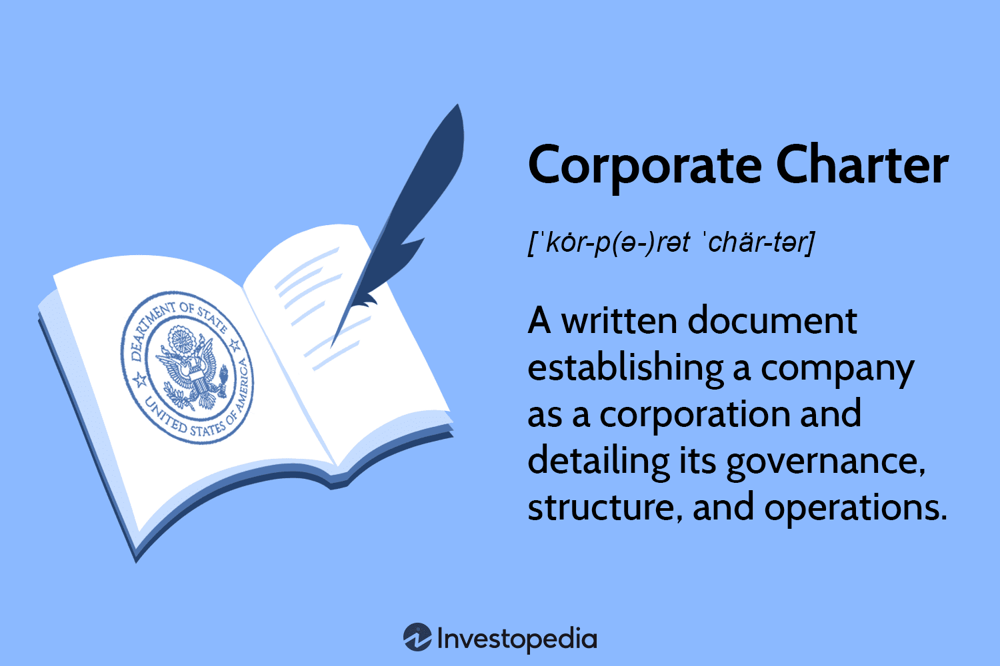

## Table of Contents

## What is a corporate charter?

A corporate charter, also known as a certificate of incorporation or articles of incorporation, is a legal document that officially creates a corporation. It is filed with the state government where the business is located. The charter includes basic information about the company, like its name, address, and the purpose of the business. It also states how many shares of stock the company can issue.

The corporate charter is important because it gives the company the legal right to exist and operate. It sets the rules for how the company will be run, including how decisions are made and how the company can be changed in the future. Without a charter, a business cannot be recognized as a corporation, which means it cannot enjoy the benefits and protections that come with being a corporation, like limited liability for its owners.

## Why is a corporate charter important for a business?

A corporate charter is very important for a business because it is the document that makes the business a legal corporation. When a business becomes a corporation, it is seen as a separate entity from its owners. This means the owners are not personally responsible for the business's debts or legal issues. This protection is called limited liability, and it is one of the main reasons why many businesses choose to become corporations.

The charter also sets out the basic rules for how the business will work. It includes important details like the company's name, where it is located, and what it plans to do. It also says how many shares of stock the company can sell. By having these rules written down, everyone involved with the business knows what to expect and how decisions will be made. This helps keep the business running smoothly and helps it grow in the future.

## What are the basic components of a corporate charter?

A corporate charter has several key parts that help form a business into a legal corporation. The first part is the company's name and address. This tells everyone where the business is located and what it is called. The charter also includes a statement of purpose, which explains what the business plans to do. This can be broad, like "to engage in any lawful business," or specific to the industry the company is in.

Another important part of the corporate charter is the information about the company's stock. This section states how many shares of stock the company can issue. Stocks are like pieces of ownership in the company, and they can be sold to raise money. The charter also lists the names and addresses of the company's initial directors or incorporators. These are the people who start the company and help set it up.

The last part of the charter includes any other rules or details the company wants to include. This can cover things like how the company will be managed, how decisions will be made, and how the company can be changed in the future. All these parts together make the corporate charter a complete document that helps the business become a legal corporation.

## How does one file a corporate charter?

Filing a corporate charter starts with preparing the document. You need to gather all the information needed, like the company's name, address, and what the business will do. You also need to decide how many shares of stock the company will have and who the first directors or incorporators will be. Once you have all this information, you can write the charter. It's a good idea to use a template or get help from a lawyer to make sure everything is right.

After the charter is ready, you need to file it with the state. Each state has its own rules about where and how to file the charter. Usually, you will need to send the charter to the Secretary of State's office or another state agency. You might be able to file online or you might need to mail or deliver the document in person. There is usually a fee to file the charter, and it can take a few weeks for the state to process it and make the company official. Once the state approves the charter, the business becomes a legal corporation.

## What are the legal requirements for a corporate charter in different jurisdictions?

The legal requirements for a corporate charter can be different in each state or country. In the United States, each state has its own rules about what needs to be in a corporate charter. Some states might ask for more details than others. For example, most states will want the company's name, address, and what the business plans to do. They will also want to know how many shares of stock the company can issue and who the first directors or incorporators are. Some states might also ask for other information, like how the company will be managed or how it can be changed in the future.

Outside of the U.S., the requirements can be different in each country. For example, in Canada, you need to file the charter with the federal government or with the government of the province where the business will be located. The information needed is similar to what is required in the U.S., like the company's name, address, and what it will do. In the United Kingdom, the charter is called the "Memorandum of Association," and it needs to include the company's name, where it is located, and what it will do. It also needs to say how the company will be managed and how much money the company will start with.

Overall, no matter where you are filing the corporate charter, it is important to check the specific rules of that place. This helps make sure that the charter has all the right information and that the business can become a legal corporation without any problems.

## Can the terms of a corporate charter be amended, and if so, how?

Yes, the terms of a corporate charter can be changed. This process is called amending the charter. To do this, the company's board of directors usually needs to vote on the changes they want to make. If the board agrees, they will call a meeting of the shareholders. At this meeting, the shareholders will vote on whether to approve the changes. If most of the shareholders agree, the company can then file the changes with the state.

The exact steps for amending a corporate charter can be different depending on where the business is located. Each state or country might have its own rules about how to make changes to the charter. Usually, the company will need to fill out a form and pay a fee to file the changes. It's important to follow these rules carefully so the changes can be made legally. Once the state approves the changes, the new terms of the charter become official and the company can start following them.

## What is the difference between a corporate charter and bylaws?

A corporate charter and bylaws are both important documents for a company, but they do different things. The corporate charter, also called the articles of incorporation, is what makes the company a legal corporation. It's like the company's birth certificate. The charter has the basic information about the company, like its name, where it's located, what it plans to do, and how many shares of stock it can issue. It's filed with the state and gives the company the right to exist and operate as a corporation.

Bylaws, on the other hand, are the rules that the company follows to run its day-to-day business. They are made by the company itself, not the state. Bylaws cover things like how meetings are held, how decisions are made, who can vote, and how officers and directors are chosen. While the corporate charter is more about the company's identity and legal status, the bylaws are about how the company works on the inside. Both are important, but they serve different purposes in helping the company operate smoothly.

## How does a corporate charter affect corporate governance?

A corporate charter is like a rulebook that sets the basic structure for how a company works. It includes important details like the company's name, where it's located, and what it plans to do. This document also says how many shares of stock the company can sell. By setting these rules, the charter helps decide who can make decisions in the company and how those decisions are made. This is a big part of corporate governance, which is all about how a company is run and controlled.

The charter also helps make sure the company follows the law and works in a fair way. For example, it might say how many people need to agree before the company can make a big change. This helps keep the company honest and makes sure everyone's voice is heard. By setting these rules at the start, the charter helps the company run smoothly and helps everyone know what to expect. This is important for good corporate governance because it helps build trust and keeps the company on the right track.

## What are the potential consequences of not complying with the requirements of a corporate charter?

If a company does not follow the rules in its corporate charter, it can get into trouble. The charter is like a rulebook that tells the company how to work and what it can do. If the company does something that goes against these rules, it might not be seen as a legal corporation anymore. This can mean the company loses the special protections that come with being a corporation, like limited liability. This means the owners could be personally responsible for the company's debts or legal problems.

Not following the charter can also lead to legal action from shareholders or the state. Shareholders might sue the company if they think it's not being run the way the charter says it should be. The state might also take action if it finds out the company is not following its own rules. This could lead to fines, penalties, or even the company being shut down. It's important for a company to follow its charter to avoid these problems and keep running smoothly.

## How does the corporate charter relate to shareholders' rights?

The corporate charter is very important for shareholders because it sets the rules about what they can do and what rights they have. The charter says how many shares of stock the company can have. When people buy these shares, they become shareholders and get certain rights, like voting on big decisions and getting a share of the company's profits. The charter also tells shareholders how meetings are run and how they can vote, which helps them have a say in how the company is managed.

If the company does not follow the rules in the charter, it can cause problems for shareholders. They might not be able to vote on important issues or get the profits they are supposed to. Shareholders can even sue the company if it does not follow the charter. This is why the charter is so important. It protects shareholders and makes sure they can use their rights to help run the company the way they think is best.

## What role does the corporate charter play in mergers and acquisitions?

The corporate charter is important when a company wants to merge with another company or get bought by another company. The charter has rules about how the company can change or be sold. It might say how many people need to agree before a merger or acquisition can happen. If the company does not follow these rules, the merger or acquisition might not be legal. This can cause big problems and might stop the deal from happening.

When two companies are thinking about merging or one company wants to buy another, they need to look at the corporate charters of both companies. They need to make sure the charters allow the merger or acquisition to happen. If the charters do not allow it, the companies might need to change their charters first. This can take time and might need a vote from the shareholders. By understanding the rules in the charters, the companies can make sure everything is done the right way and the deal can go through smoothly.

## How have recent legal changes impacted the requirements and purposes of corporate charters?

Recent legal changes have made some small changes to what needs to be in a corporate charter and why they are important. For example, some states now ask for more information about how a company plans to be good for the environment or the community. This is because more people want companies to think about more than just making money. Also, some states have made it easier to file a charter online, which makes it quicker and simpler for new businesses to start up.

These changes show that the rules for corporate charters can change over time. They need to keep up with what people want from businesses and how technology is used. Even though the basic parts of a charter, like the company's name and what it plans to do, stay the same, the new rules help make sure companies are doing what is expected of them in today's world. This helps keep businesses honest and makes sure they are following the law.

## References & Further Reading

[1]: Lo, Andrew W., & MacKinlay, A. Craig. (1999). ["A Non-Random Walk Down Wall Street."](https://www.amazon.com/Non-Random-Walk-Down-Wall-Street/dp/0691092567) Princeton University Press.

[2]: Zohar, A.; Marks, G. (2015). ["Algorithmic Trading: Winning Strategies and Their Rationale."](https://www.wiley.com/en-us/Algorithmic+Trading%3A+Winning+Strategies+and+Their+Rationale-p-9781118746912) Wiley Finance.

[3]: Hendershott, T., Jones, C. M., & Menkveld, A. J. (2011). ["Does Algorithmic Trading Improve Liquidity?"](https://onlinelibrary.wiley.com/doi/full/10.1111/j.1540-6261.2010.01624.x) The Review of Financial Studies, 24(8), 3390-3424.

[4]: U.S. Commodity Futures Trading Commission. ["Regulation Automated Trading (Reg AT)."](https://www.cftc.gov/PressRoom/PressReleases/7283-15) Retrieved from the U.S. CFTC official website.

[5]: Securities and Exchange Commission. ["Market Access Rule (Rule 15c3-5)."](https://www.sec.gov/files/rules/final/2010/34-63241.pdf) Retrieved from the U.S. SEC official website.

[6]: U.S. Department of the Treasury, Office of the Comptroller of the Currency. ["OCC's Model Risk Management Guidance"](https://www.occ.treas.gov/) Retrieved from the OCC official website.

[7]: Kirch, Roland. (2014). ["Financial Market Liquidity: Measurement, Models, and Implications."](https://www.researchgate.net/publication/341164467_Financial_Markets_and_Institutions_A_European_Perspective_Fourth_Edition_Cambridge_University_Press) Wiley Finance.

[8]: Aldridge, Irene. (2009). ["High-Frequency Trading: A Practical Guide to Algorithmic Strategies and Trading Systems."](https://www.amazon.com/High-Frequency-Trading-Practical-Algorithmic-Strategies/dp/1118343506) Wiley.