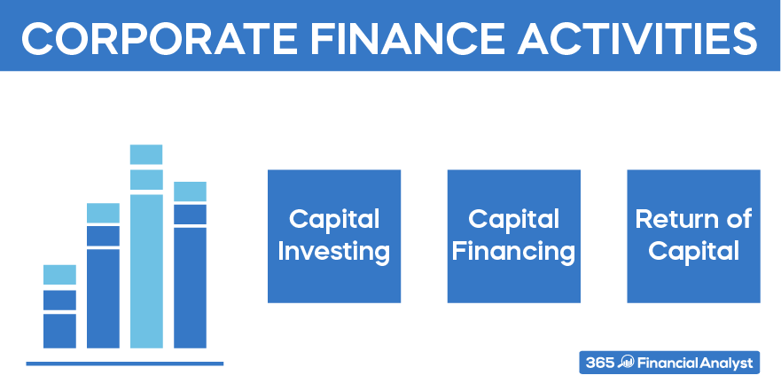

## Table of Contents

## What is corporate finance and why is it important for businesses?

Corporate finance is about how businesses manage their money. It includes things like deciding where to get money from, how to spend it, and how to keep track of it. This can involve borrowing money, selling shares, or using profits to grow the business. It's all about making smart choices to help the company do well and grow over time.

It's really important for businesses because good money management can make the difference between success and failure. If a company uses its money wisely, it can invest in new projects, improve its products, and expand into new markets. This helps the business grow and stay strong, even when times are tough. On the other hand, if a company doesn't manage its money well, it might run into problems like not being able to pay its bills or losing out on good opportunities. So, understanding corporate finance helps businesses make better decisions and stay healthy in the long run.

## What are the primary goals of corporate finance?

The main goal of corporate finance is to increase the value of the company for its shareholders. This means making the business worth more over time. To do this, companies need to find the best ways to use their money. They might invest in new projects, buy other businesses, or improve their products. All these choices should help the company grow and make more profit.

Another big goal is to manage risk. Every business faces risks, like not selling enough products or having to pay back loans. Corporate finance helps companies understand these risks and find ways to reduce them. This might mean having enough cash saved up or buying insurance. By managing risk well, a company can keep running smoothly even when things go wrong.

Lastly, corporate finance aims to make sure the company has enough money to operate and grow. This involves deciding where to get money from, like loans or selling shares, and how to spend it wisely. Good financial planning helps a company pay its bills on time, invest in new opportunities, and avoid running out of money. This keeps the business healthy and able to achieve its long-term goals.

## How does financial planning and analysis contribute to corporate finance?

Financial planning and analysis (FP&A) is a big part of corporate finance because it helps businesses make smart decisions about their money. FP&A involves looking at the company's past financial data, figuring out what it means, and then using that information to plan for the future. This can include making budgets, setting financial goals, and predicting how much money the company will make or spend. By doing this, FP&A helps the company use its money in the best way possible, whether that's investing in new projects, saving for tough times, or paying back loans.

FP&A also helps companies understand and manage risks. By analyzing data, FP&A can spot potential problems before they become big issues. For example, if the analysis shows that the company might not have enough cash to cover its costs in the future, FP&A can suggest ways to fix this, like cutting expenses or finding new sources of money. This kind of planning and analysis is crucial for keeping the business strong and ready for whatever challenges might come up.

## What role does capital budgeting play in corporate finance?

Capital budgeting is a big part of corporate finance because it helps businesses decide where to spend their money on long-term projects. These projects can be things like building a new factory, buying new machines, or starting a new product line. The goal is to choose projects that will make the company more money in the future. To do this, companies look at how much a project will cost and how much money it might make over time. They use tools like net present value (NPV) and internal rate of return (IRR) to see if a project is worth doing.

By using capital budgeting, companies can make smart choices about where to put their money. This helps them grow and stay strong in the long run. If a company picks good projects, it can increase its profits and become more valuable. But if it picks bad projects, it might lose money and struggle to grow. So, capital budgeting is really important for making sure the company uses its money in the best way possible to reach its goals.

## How do companies manage their working capital effectively?

Companies manage their working capital by keeping a close eye on their cash, inventory, and how quickly they get paid by customers. They need to make sure they have enough money to pay their bills on time, like rent and salaries, while also having enough to buy the things they need to keep the business running. This means they need to manage their inventory well, so they don't have too much stuff sitting around that they can't sell. They also need to make sure they are getting paid quickly by their customers, so they don't run out of cash.

Another way companies manage their working capital is by using smart strategies to borrow money if they need it. They might take out short-term loans or use a line of credit to cover any gaps in their cash flow. This helps them keep their business going smoothly without running into money problems. By keeping a balance between having enough cash and not having too much tied up in inventory or unpaid bills, companies can make sure they have the working capital they need to operate and grow.

## What are the different types of financing available to corporations?

Corporations can get money from different places, and each type of financing has its own pros and cons. One common way is through debt financing, which means borrowing money. This can be done by taking out loans from banks or issuing bonds. The good thing about debt financing is that the interest paid on the loan can often be deducted from taxes. However, the company has to pay back the loan with interest, which can be a burden if the business is not doing well. Another type of financing is equity financing, where a company sells shares of its stock to investors. This doesn't have to be paid back, but it means sharing ownership and profits with the shareholders.

Another way to get financing is through retained earnings, which is the money a company makes that it doesn't pay out as dividends. Instead, the company keeps this money to use for growth or other investments. This is a good option because it doesn't involve borrowing or giving away ownership, but it might not be enough if the company needs a lot of money quickly. Lastly, there's alternative financing, like crowdfunding or venture capital. Crowdfunding lets a lot of people give small amounts of money to a project, while venture capital involves getting money from investors who are looking for high-growth opportunities. Each of these methods has its own set of rules and risks, so companies need to pick the one that fits their needs best.

## How do corporations decide on the optimal capital structure?

Corporations decide on the optimal capital structure by figuring out the best mix of debt and equity to use for their financing needs. They want to find a balance that keeps the cost of borrowing low while also not giving away too much ownership of the company. To do this, they look at things like how much interest they have to pay on loans, how much profit they can make, and how risky their business is. If a company has a lot of steady income, it might be able to handle more debt because it can pay back the loans easily. But if the business is risky, it might be better to use more equity to avoid the pressure of having to pay back loans.

Another thing companies think about is the tax benefits of debt. Interest paid on loans can be deducted from taxes, which makes debt a bit cheaper than it seems. But too much debt can be dangerous because it means the company has to make regular payments, no matter how well it's doing. So, companies also look at their growth plans and how much money they need right away. If they need a lot of money quickly, they might use more debt. But if they want to grow slowly and keep control of the company, they might choose to use more equity. Finding the right mix is all about balancing these different factors to make the company as strong and valuable as possible.

## What are the key considerations in managing financial risk in corporate finance?

Managing financial risk in corporate finance is all about understanding and controlling the things that could go wrong with a company's money. One key consideration is [interest rate](/wiki/interest-rate-trading-strategies) risk. This happens when the cost of borrowing money changes, which can make it harder for a company to pay back its loans. Another important [factor](/wiki/factor-investing) is credit risk, which is the chance that someone who owes the company money won't be able to pay it back. Companies also need to think about currency risk if they do business in different countries, because changes in exchange rates can affect how much money they make or spend.

Another big part of managing financial risk is liquidity risk, which is the risk of not having enough cash to pay bills on time. Companies need to keep enough money on hand or be able to get it quickly if they need it. They also need to consider market risk, which is the risk that the value of their investments might go down because of changes in the market. To handle these risks, companies use strategies like diversifying their investments, using financial instruments like derivatives to hedge against risks, and keeping a close eye on their cash flow to make sure they can cover their costs. By thinking about these different kinds of risks and planning ahead, companies can protect themselves and keep their finances stable.

## How do mergers and acquisitions fit into corporate finance strategy?

Mergers and acquisitions (M&A) are big parts of corporate finance strategy because they help companies grow and become stronger. When a company decides to merge with or buy another company, it's usually trying to get bigger, enter new markets, or get new products or technology. This can help the company make more money and be worth more to its shareholders. For example, if a company buys another one that makes a product it doesn't have, it can start selling that product and make more money. Or if two companies merge, they might be able to save money by working together and cutting down on costs.

But M&A also comes with risks and challenges. It can be hard to make sure the two companies fit well together and that their employees and systems can work together smoothly. There's also the risk that the company being bought might not be worth as much as expected, or that the merger might not save as much money as hoped. So, companies need to do a lot of careful planning and analysis before deciding to go through with an M&A. They need to look at the financials of the other company, see how the merger or acquisition will affect their own finances, and make sure it fits with their overall strategy. By doing this, they can make the best decisions and use M&A to help them grow and succeed.

## What advanced techniques are used in corporate valuation?

Corporate valuation involves figuring out how much a company is worth, and there are some advanced techniques that help with this. One popular method is the discounted cash flow (DCF) analysis. This technique looks at all the money a company expects to make in the future and then figures out what that money is worth today. It's like saying, "If I'm going to get $100 in the future, how much is that worth to me right now?" To do this, the company needs to predict its future cash flows and then discount them back to the present using a rate that shows how risky the business is. This gives a good idea of the company's value based on its future [earning](/wiki/earning-announcement) potential.

Another advanced technique is the use of real options valuation. This method treats business decisions like options in the stock market. For example, a company might have the option to expand into a new market or to delay a project until more information is available. By thinking of these choices as options, the company can use financial models to figure out what these options are worth. This can be really helpful for companies that are making big decisions about their future, because it takes into account the flexibility they have to change their plans as things happen. Both DCF and real options valuation help companies get a more accurate picture of their value by looking at more than just their current financial situation.

## How do global economic factors influence corporate finance decisions?

Global economic factors have a big impact on the choices companies make about their money. Things like changes in the world economy, interest rates, and exchange rates can affect how much it costs for a company to borrow money or how much money it makes from selling things in different countries. For example, if interest rates go up in one country, it might be more expensive for a company to take out a loan there. Or if the value of one country's money goes down compared to another country's money, it might make it cheaper for a company to buy things from that country, but it might also mean they make less money when they sell their products there.

Because of these global factors, companies need to be careful and plan ahead. They might decide to borrow money in a country where interest rates are low, or they might change their prices in different countries to make up for changes in exchange rates. They also need to think about how the world economy is doing overall. If the global economy is growing, companies might decide to invest more in new projects or expand into new markets. But if the global economy is slowing down, they might decide to save their money and wait for better times. By paying attention to these global economic factors, companies can make smarter choices about how to use their money and keep their business strong.

## What are the emerging trends and technologies impacting corporate finance?

Emerging trends and technologies are changing how companies handle their money. One big trend is the use of [artificial intelligence](/wiki/ai-artificial-intelligence) (AI) and machine learning. These technologies help companies look at a lot of data quickly and make better guesses about the future. For example, AI can help figure out how much money a company will make or spend, and it can even help find risks that might be hard to see. Another trend is the use of blockchain technology, which is like a digital ledger that keeps track of money and other things in a safe and clear way. This can make it easier for companies to do business with each other and keep their financial records safe.

Another important trend is the growing use of big data and analytics. Companies are using more and more data to make decisions about their money. This can help them see patterns and make better plans for the future. For example, they might use data to figure out which products are selling well and where they should spend their money to grow. Also, there's a move towards more sustainable finance, where companies think about how their money choices affect the environment and society. This means they might choose to invest in projects that are good for the planet, like renewable energy, instead of ones that might harm it. These trends and technologies are helping companies make smarter and more responsible choices with their money.

## What is the role of corporate finance in business?

Corporate finance serves a crucial function in ensuring that companies possess the necessary financial resources to fulfill their objectives. This discipline encompasses a variety of activities, such as budgeting, forecasting, financial analysis, and raising capital through equity or debt financing. Budgeting is the process of creating a plan to spend an organization's financial resources, allowing for effective allocation and priority setting. Forecasting involves predicting future financial conditions and performance based on historical data and market analysis, which aids in strategic planning and decision-making.

In addition to raising capital, corporate finance is concerned with managing short-term financial obligations, ensuring that businesses have adequate liquidity to meet immediate needs and avoid financial distress. This includes maintaining working capital management, which is the monitoring of current assets and liabilities to maintain sufficient operational cash flow.

Corporate finance also focuses on long-term investments, which are crucial for sustainable growth and competitive advantage. Capital investment decisions, or capital budgeting, involve evaluating potential projects or investments and deciding which ones are worth pursuing. Techniques such as Net Present Value (NPV) and Internal Rate of Return (IRR) are commonly used to assess these opportunities. For instance, NPV is calculated as follows:

$$
\text{NPV} = \sum \frac{R_t}{(1+i)^t} - C_0
$$

where $R_t$ is the net cash inflow-outflows during a single period t, $i$ is the discount rate, and $C_0$ is the initial investment cost. Applying such formulas allows companies to assess the profitability of investment opportunities accurately.

Ultimately, the goal of corporate finance is to maximize shareholder value. By efficiently managing financial resources and applying strategic planning, companies seek to grow profits and, consequently, their stock price, which benefits shareholders. This requires careful consideration of both risk management and value creation, ensuring that financial decisions align with the overarching business strategy and corporate governance standards.

## What are the key financial activities in corporate finance?

Corporate finance encompasses various fundamental activities that ensure a company's financial health and capability to achieve its strategic goals. Among these essential activities, capital budgeting, capital financing, and working capital management are pivotal in optimizing business performance through effective resource allocation, funding strategies, and [liquidity](/wiki/liquidity-risk-premium) management.

**Capital Budgeting**

Capital budgeting involves the process of evaluating and selecting long-term investment opportunities that are expected to yield the most beneficial returns. This critical activity stands as a cornerstone of corporate finance. It requires assessing potential projects or investments by analyzing cash flows, project costs, and expected returns. Tools commonly used in capital budgeting include Net Present Value (NPV), Internal Rate of Return (IRR), and payback period calculations. 

For instance, NPV is calculated using the formula:

$$
\text{NPV} = \sum \frac{C_t}{(1 + r)^t} - C_0
$$

where $C_t$ represents the cash inflow during the period t, $r$ is the discount rate, and $C_0$ is the initial investment cost.

By selecting projects with positive NPVs, companies aim to maximize shareholder value, ensuring that their invested capital generates satisfactory returns over time.

**Capital Financing**

Capital financing is integral to securing the necessary funds to support a company's business operations and expansion plans. This activity involves raising capital through equity, debt, or a hybrid of both. Equity financing may include issuing stocks, whereas debt financing can take the form of bonds or loans. The choice between equity and debt financing is influenced by factors such as the cost of capital, dilution of ownership, and the company's balance sheet structure. Strategic financial planning is crucial in determining the optimal capital structure that minimizes the cost of capital while maximizing financial flexibility.

**Working Capital Management**

Working capital management focuses on ensuring that a business can meet its short-term liabilities and operate smoothly without disruptions. It involves managing the difference between a company’s current assets and current liabilities effectively. Key components include managing inventory levels, accounts receivable, and accounts payable. The objective is to maintain a balance that ensures sufficient liquidity to avoid financial strain while minimizing idle resources. The working capital ratio, calculated as current assets divided by current liabilities, provides insights into the company’s liquidity position:

$$
\text{Working Capital Ratio} = \frac{\text{Current Assets}}{\text{Current Liabilities}}
$$

Efficient working capital management contributes to sustaining operational efficiency, reducing borrowing needs, and improving overall profitability.

Each of these financial activities—capital budgeting, capital financing, and working capital management—requires comprehensive financial analysis and strategic decision-making processes. Together, they form the bedrock of sound financial planning and management, enabling businesses to navigate complex financial environments and achieve sustainable growth.

 to Algorithmic Trading

Algorithmic trading automates trading processes by employing sophisticated algorithms and mathematical models. These systems are designed to analyze market data and identify optimal trading opportunities. Unlike traditional trading methods, which rely on human decision-making and actions, [algorithmic trading](/wiki/algorithmic-trading) leverages computational power to execute trades with remarkable speed and precision.

The primary advantage of algorithmic trading lies in its ability to operate at a [high frequency](/wiki/high-frequency-trading), processing vast amounts of market data in milliseconds to detect patterns or anomalies. For example, a typical algorithm might be designed to buy a stock when its 50-day moving average exceeds the 200-day moving average, triggering a trade as soon as this condition is met. The mathematical models underpinning these algorithms can be simple, as in moving averages, or complex, involving [machine learning](/wiki/machine-learning) techniques and statistical [arbitrage](/wiki/arbitrage) strategies. 

One of the key benefits of this approach is cost efficiency. Automated systems can execute trades faster and more accurately than any human, reducing the transaction costs associated with manual trading. This efficiency is crucial in high-frequency trading ([HFT](/wiki/high-frequency-trading-strategies)), where profits are maximized by executing large volumes of transactions at minimal price movements. In addition, algorithms can optimize order execution to minimize market impact and exploit minute price differentials across markets.

Algorithmic trading also enhances liquidity, as it allows for rapid buying and selling, ensuring that there are always counterparties to trade with. This increased liquidity can narrow the bid-ask spread, benefiting all market participants by facilitating smoother and more efficient price discovery.

Moreover, algorithmic trading minimizes the emotional component inherent in human trading decisions. By relying on pre-set strategies and data-driven models, algorithmic systems eliminate the erratic decision-making influenced by fear, greed, or other psychological factors. This objectivity can lead to more consistent trading performance, as decisions are based solely on logic and statistical probabilities.

In summary, algorithmic trading revolutionizes the traditional trading paradigm by utilizing technology to achieve superior speed, precision, and cost efficiency. Its capacity to enhance liquidity and remove emotional biases offers a significant competitive edge, making it a cornerstone of modern financial market operations.

## References & Further Reading

[1]: Bergstra, J., Bardenet, R., Bengio, Y., & Kégl, B. (2011). ["Algorithms for Hyper-Parameter Optimization."](https://papers.nips.cc/paper/4443-algorithms-for-hyper-parameter-optimization) Advances in Neural Information Processing Systems 24.

[2]: ["Advances in Financial Machine Learning"](https://www.amazon.com/Advances-Financial-Machine-Learning-Marcos/dp/1119482089) by Marcos Lopez de Prado

[3]: ["Evidence-Based Technical Analysis: Applying the Scientific Method and Statistical Inference to Trading Signals"](https://www.amazon.com/Evidence-Based-Technical-Analysis-Scientific-Statistical/dp/0470008741) by David Aronson

[4]: ["Machine Learning for Algorithmic Trading"](https://github.com/stefan-jansen/machine-learning-for-trading) by Stefan Jansen

[5]: ["Quantitative Trading: How to Build Your Own Algorithmic Trading Business"](https://www.amazon.com/Quantitative-Trading-Build-Algorithmic-Business/dp/1119800064) by Ernest P. Chan