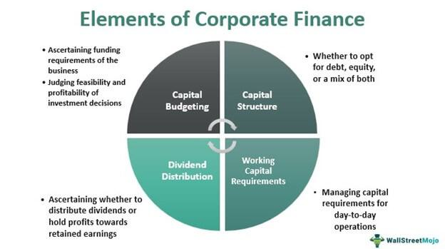

In recent years, financial markets have experienced significant evolution driven by technological innovations. Among these advancements, algorithmic trading has become a pivotal part of corporate finance. Algorithmic trading uses computer algorithms to execute trading activities based on pre-defined parameters, offering advantages like increased speed and efficiency. This method has gained popularity among traders due to its ability to perform complex transactions rapidly, which is critical in fast-moving financial environments.

Algorithmic trading represents a transformative shift in how businesses engage with financial markets. It automates decision-making processes, allowing traders to capitalize on market opportunities that may be too fast for manual intervention. This is particularly beneficial in high-frequency trading scenarios, where trades need to be executed within fractions of a second.



Beyond mere execution speed, algorithmic trading minimizes the emotional component in trading decisions, reducing the risk of human error. By relying on systematic and data-driven approaches, corporations can better manage financial investments, optimize operations, and maximize profits. This effectiveness highlights the intertwined nature of algorithmic trading and corporate finance as businesses seek to leverage technology to enhance financial strategies, manage risks, and improve performance.

Understanding the interaction between corporate finance and algorithmic trading necessitates an exploration of how businesses utilize these digital strategies to gain a competitive edge. The integration of algorithmic trading offers businesses the opportunity to engage more dynamically with the market, optimize financial outcomes, and strategically manage resources, reflecting the increasingly automated nature of modern financial practices.

## Table of Contents

## The Role of Corporate Finance in Business

Corporate finance serves a crucial function in ensuring that companies possess the necessary financial resources to fulfill their objectives. This discipline encompasses a variety of activities, such as budgeting, forecasting, financial analysis, and raising capital through equity or debt financing. Budgeting is the process of creating a plan to spend an organization's financial resources, allowing for effective allocation and priority setting. Forecasting involves predicting future financial conditions and performance based on historical data and market analysis, which aids in strategic planning and decision-making.

In addition to raising capital, corporate finance is concerned with managing short-term financial obligations, ensuring that businesses have adequate liquidity to meet immediate needs and avoid financial distress. This includes maintaining working capital management, which is the monitoring of current assets and liabilities to maintain sufficient operational cash flow.

Corporate finance also focuses on long-term investments, which are crucial for sustainable growth and competitive advantage. Capital investment decisions, or capital budgeting, involve evaluating potential projects or investments and deciding which ones are worth pursuing. Techniques such as Net Present Value (NPV) and Internal Rate of Return (IRR) are commonly used to assess these opportunities. For instance, NPV is calculated as follows:

$$
\text{NPV} = \sum \frac{R_t}{(1+i)^t} - C_0
$$

where $R_t$ is the net cash inflow-outflows during a single period t, $i$ is the discount rate, and $C_0$ is the initial investment cost. Applying such formulas allows companies to assess the profitability of investment opportunities accurately.

Ultimately, the goal of corporate finance is to maximize shareholder value. By efficiently managing financial resources and applying strategic planning, companies seek to grow profits and, consequently, their stock price, which benefits shareholders. This requires careful consideration of both risk management and value creation, ensuring that financial decisions align with the overarching business strategy and corporate governance standards.

## Key Financial Activities in Corporate Finance

Corporate finance encompasses various fundamental activities that ensure a company's financial health and capability to achieve its strategic goals. Among these essential activities, capital budgeting, capital financing, and working capital management are pivotal in optimizing business performance through effective resource allocation, funding strategies, and [liquidity](/wiki/liquidity-risk-premium) management.

**Capital Budgeting**

Capital budgeting involves the process of evaluating and selecting long-term investment opportunities that are expected to yield the most beneficial returns. This critical activity stands as a cornerstone of corporate finance. It requires assessing potential projects or investments by analyzing cash flows, project costs, and expected returns. Tools commonly used in capital budgeting include Net Present Value (NPV), Internal Rate of Return (IRR), and payback period calculations. 

For instance, NPV is calculated using the formula:

$$
\text{NPV} = \sum \frac{C_t}{(1 + r)^t} - C_0
$$

where $C_t$ represents the cash inflow during the period t, $r$ is the discount rate, and $C_0$ is the initial investment cost.

By selecting projects with positive NPVs, companies aim to maximize shareholder value, ensuring that their invested capital generates satisfactory returns over time.

**Capital Financing**

Capital financing is integral to securing the necessary funds to support a company's business operations and expansion plans. This activity involves raising capital through equity, debt, or a hybrid of both. Equity financing may include issuing stocks, whereas debt financing can take the form of bonds or loans. The choice between equity and debt financing is influenced by factors such as the cost of capital, dilution of ownership, and the company's balance sheet structure. Strategic financial planning is crucial in determining the optimal capital structure that minimizes the cost of capital while maximizing financial flexibility.

**Working Capital Management**

Working capital management focuses on ensuring that a business can meet its short-term liabilities and operate smoothly without disruptions. It involves managing the difference between a company’s current assets and current liabilities effectively. Key components include managing inventory levels, accounts receivable, and accounts payable. The objective is to maintain a balance that ensures sufficient liquidity to avoid financial strain while minimizing idle resources. The working capital ratio, calculated as current assets divided by current liabilities, provides insights into the company’s liquidity position:

$$
\text{Working Capital Ratio} = \frac{\text{Current Assets}}{\text{Current Liabilities}}
$$

Efficient working capital management contributes to sustaining operational efficiency, reducing borrowing needs, and improving overall profitability.

Each of these financial activities—capital budgeting, capital financing, and working capital management—requires comprehensive financial analysis and strategic decision-making processes. Together, they form the bedrock of sound financial planning and management, enabling businesses to navigate complex financial environments and achieve sustainable growth.

 to Algorithmic Trading

Algorithmic trading automates trading processes by employing sophisticated algorithms and mathematical models. These systems are designed to analyze market data and identify optimal trading opportunities. Unlike traditional trading methods, which rely on human decision-making and actions, [algorithmic trading](/wiki/algorithmic-trading) leverages computational power to execute trades with remarkable speed and precision.

The primary advantage of algorithmic trading lies in its ability to operate at a [high frequency](/wiki/high-frequency-trading), processing vast amounts of market data in milliseconds to detect patterns or anomalies. For example, a typical algorithm might be designed to buy a stock when its 50-day moving average exceeds the 200-day moving average, triggering a trade as soon as this condition is met. The mathematical models underpinning these algorithms can be simple, as in moving averages, or complex, involving [machine learning](/wiki/machine-learning) techniques and statistical [arbitrage](/wiki/arbitrage) strategies. 

One of the key benefits of this approach is cost efficiency. Automated systems can execute trades faster and more accurately than any human, reducing the transaction costs associated with manual trading. This efficiency is crucial in high-frequency trading ([HFT](/wiki/high-frequency-trading-strategies)), where profits are maximized by executing large volumes of transactions at minimal price movements. In addition, algorithms can optimize order execution to minimize market impact and exploit minute price differentials across markets.

Algorithmic trading also enhances liquidity, as it allows for rapid buying and selling, ensuring that there are always counterparties to trade with. This increased liquidity can narrow the bid-ask spread, benefiting all market participants by facilitating smoother and more efficient price discovery.

Moreover, algorithmic trading minimizes the emotional component inherent in human trading decisions. By relying on pre-set strategies and data-driven models, algorithmic systems eliminate the erratic decision-making influenced by fear, greed, or other psychological factors. This objectivity can lead to more consistent trading performance, as decisions are based solely on logic and statistical probabilities.

In summary, algorithmic trading revolutionizes the traditional trading paradigm by utilizing technology to achieve superior speed, precision, and cost efficiency. Its capacity to enhance liquidity and remove emotional biases offers a significant competitive edge, making it a cornerstone of modern financial market operations.

## How Algorithmic Trading Functions

Algorithmic trading operates through well-defined logical processes that automate the decision-making and execution of trades. These processes are encapsulated in algorithms, which are sets of instructions coded to execute precisely under certain conditions. Algorithms rely on market data and statistical analysis to determine optimal trading opportunities, ensuring trades are executed with precision and efficiency.

At the core of algorithmic trading are strategies that analyze vast streams of real-time data. This data-driven approach enables the algorithms to monitor multiple markets simultaneously, assessing various variables such as price movements, trading [volume](/wiki/volume-trading-strategy), and historical patterns. For example, a trading algorithm may use statistical techniques like regression analysis or moving averages to detect trends or reversals in the market, thus identifying potential entry or [exit](/wiki/exit-strategy) points for trades.

To elucidate how such algorithms function, consider a simple example in Python illustrating a moving average crossover strategy. This strategy involves buying an asset when a short-term moving average crosses above a long-term moving average, and selling when it crosses below.

```python
import numpy as np
import pandas as pd
import matplotlib.pyplot as plt

# Generate sample data
np.random.seed(42)
prices = np.random.normal(loc=100, scale=10, size=100)
dates = pd.date_range(start='2022-01-01', periods=len(prices))
data = pd.DataFrame(data={'Price': prices}, index=dates)

# Calculate moving averages
data['Short_MA'] = data['Price'].rolling(window=5).mean()  # Short-term moving average
data['Long_MA'] = data['Price'].rolling(window=20).mean()  # Long-term moving average

# Generate signals
data['Signal'] = 0
data['Signal'][5:] = np.where(data['Short_MA'][5:] > data['Long_MA'][5:], 1, 0)
data['Position'] = data['Signal'].diff()

# Plotting
plt.figure(figsize=(10, 6))
plt.plot(data['Price'], label='Price', alpha=0.5)
plt.plot(data['Short_MA'], label='Short MA', alpha=0.9)
plt.plot(data['Long_MA'], label='Long MA', alpha=0.9)
plt.title('Moving Average Crossover Example')
plt.xlabel('Date')
plt.ylabel('Price')
plt.legend()
plt.show()
```

Risk management is integral to these algorithms. They incorporate mechanisms to maintain trade execution within certain [volatility](/wiki/volatility-trading-strategies) parameters and price ranges, minimizing exposure to adverse market conditions. This can include setting stop-loss orders or dynamically adjusting positions based on market volatility. Execution strategies, such as slicing large orders into smaller parts to minimize market impact, are also embedded within these algorithms.

The synchronized use of pre-set rules, real-time market analysis, and risk management protocols empowers algorithmic trading systems to operate at speeds and accuracies beyond human capabilities, enabling efficient navigation through complex financial markets.

## Impact of Algorithmic Trading on Corporate Finance

Algorithmic trading, also known as automated trading, has significantly transformed corporate finance by optimizing how corporations manage their financial investments. This innovative approach enhances liquidity and increases trading volumes, facilitating a more dynamic and responsive financial market environment.

The efficiency provided by algorithmic trading systems enables corporations to allocate capital with greater precision. By using complex algorithms and computational models, these systems can identify optimal trading opportunities more effectively than traditional methods. This strategic allocation of resources allows businesses to enhance their financial performance by capitalizing on better investment opportunities and minimizing unnecessary expenditures.

Algorithmic trading also plays a crucial role in reducing trading costs, primarily through lower transaction fees and enhanced execution speeds. These systems can process vast amounts of data at high speed, ensuring that trades are executed at the most favorable prices. This reduction in costs not only improves profitability but also makes capital markets more efficient by facilitating quicker adjustments to market conditions.

Furthermore, the automated nature of algorithmic trading minimizes human errors, which can arise from emotional decision-making or manual processing inaccuracies. Algorithms operate based on predefined rules and statistical models, allowing them to maintain consistent performance without the influence of cognitive biases. This reliability is crucial for maintaining market stability and fostering investor confidence.

In summary, the adoption of algorithmic trading in corporate finance promotes enhanced liquidity, increased trading volumes, and more strategic capital allocation, while simultaneously reducing costs and human errors. These improvements contribute to the overall efficiency of capital markets, offering corporations new opportunities for financial optimization and risk management.

## Challenges and Risks in Algorithmic Trading

Algorithmic trading, while providing significant advantages in terms of speed and efficiency, also introduces several challenges and risks that traders and financial institutions must navigate. One primary concern is market volatility. Algorithmic trading can exacerbate market fluctuations, as high-frequency trading can lead to rapid and large volume transactions, impacting price stability. For instance, the sudden influx or withdrawal of large amounts of trades can cause drastic price movements, sometimes triggering flash crashes, where the market experiences a steep drop in asset prices within a very short period.

Systemic risk is another critical challenge associated with algorithmic trading. Since many traders and institutions rely on similar algorithms and trading strategies, there is a risk that a failure in one segment could propagate quickly across the market, leading to broader financial instability. This interconnectedness can amplify the impact of localized issues, making them systemic.

Algorithmic errors, often stemming from programming mistakes or unforeseen market conditions, pose significant threats. These errors can result in unintended trades, leading to substantial financial losses. For example, incorrect parsing of market data due to software bugs can cause an algorithm to execute a trade that deviates from the intended strategy. Here’s a simple Python snippet illustrating a potential safeguard using try-except blocks to catch and handle exceptions:

```python
def execute_trade(trade_data):
    try:
        # Simplified trade execution logic
        if trade_data['price'] <= 0:
            raise ValueError("Invalid Price")
        # Additional trade logic...
        print("Trade Executed")
    except ValueError as e:
        print(f"Error executing trade: {e}")

trade_data_example = {'price': -5}
execute_trade(trade_data_example)
```

To mitigate these risks, robust risk management frameworks are essential. These frameworks should include real-time monitoring of trading activities, comprehensive testing of algorithms under various market conditions, and the development of fail-safe mechanisms to halt trading in response to abnormal conditions.

Additionally, regulatory concerns are increasingly significant. The rapid and automated nature of algorithmic trading raises questions about market fairness and transparency. Regulators are thus tasked with ensuring that markets remain equitable and that all participants have a fair opportunity to trade. Ethical considerations also play a role as stakeholders debate the implications of automated decision-making and the potential for these systems to manipulate markets.

In sum, while algorithmic trading offers clear benefits, it necessitates careful management of the associated risks. Traders and institutions must balance technological advancements with the need for stability and fairness in financial markets, ensuring that potential downsides do not outweigh the benefits.

## Future Trends in Algorithmic Trading

Advancements in machine learning and [artificial intelligence](/wiki/ai-artificial-intelligence) (AI) are poised to significantly enhance algorithmic trading systems. Machine learning techniques, especially those related to [deep learning](/wiki/deep-learning) and natural language processing (NLP), enable trading algorithms to assess vast amounts of data efficiently, identifying patterns and predictive insights that were previously difficult to discern. Through these advancements, predictive algorithms can improve their accuracy in financial markets, offering traders a distinct competitive advantage.

Algorithmic trading systems, enhanced by AI, can potentially process and analyze unstructured data, including news articles, social media feeds, and earnings reports. This capability allows traders to incorporate insights from diverse data sources, enriching their decision-making frameworks. For instance, sentiment analysis algorithms can gauge market sentiment from text data, feeding actionable insights into trading strategies.

The integration of machine learning models, such as neural networks, supports the development of adaptive trading algorithms that can evolve with changing market conditions. These systems implement [reinforcement learning](/wiki/reinforcement-learning) principles to optimize trading strategies through continuous feedback loops, adjusting their tactics based on past performance outcomes. This dynamic adaptability enhances the sustainability and profitability of trading algorithms in volatile markets.

As algorithmic trading systems grow more advanced, increased regulation and scrutiny are inevitable. Regulatory bodies aim to ensure market integrity and transparency while managing systemic risks associated with automated trading. Regulators may establish more stringent compliance requirements for algorithmic trading systems, necessitating enhanced risk management frameworks and robust testing protocols to prevent unintended market disruptions.

Moreover, governments and financial institutions are expected to collaborate on regulatory frameworks that balance innovation with safe trading practices. These frameworks will likely emphasize ethical considerations, such as the promotion of fair access to trading technologies and the prevention of market manipulation through algorithmic means.

In conclusion, the future of algorithmic trading is characterized by the convergence of AI and enhanced data analysis capabilities, promising more accurate and sophisticated trading systems. However, as these technologies evolve, stakeholders must navigate the complex landscape of regulation and ethical considerations to maintain fair and transparent financial markets.

## Conclusion

As corporate finance evolves, algorithmic trading represents a significant shift toward more data-driven and automated financial strategies. This shift enables companies to efficiently navigate complex markets by leveraging technology to optimize financial operations and manage risks more effectively. The precision and speed offered by algorithmic trading systems facilitate more strategic capital allocation and enhance market liquidity, fostering a more dynamic trading environment.

Despite the advantages, the integration of algorithmic trading into corporate finance practices is not without challenges. These include dealing with inherent market volatilities and the systemic risks associated with high-frequency trading systems. Moreover, the need for robust risk management frameworks becomes apparent as corporations aim to mitigate potential algorithmic errors and ensure the reliability of their trading operations.

Nevertheless, the future of algorithmic trading holds promising opportunities for enhancing corporate finance practices. The continuous advancements in machine learning and artificial intelligence are set to increase the sophistication of trading algorithms, improving their predictive accuracy and efficiency. As a result, businesses may access even more nuanced insights into market trends, enabling them to make more informed financial decisions.

Companies must also navigate regulatory landscapes that are likely to evolve alongside these technological advancements. Increased scrutiny from regulatory bodies could lead to more comprehensive frameworks aimed at safeguarding market fairness and transparency. As such, while the future presents both opportunities and challenges, algorithmic trading stands as a cornerstone for businesses seeking innovation and efficiency in their financial strategies.

## References & Further Reading

[1]: Bergstra, J., Bardenet, R., Bengio, Y., & Kégl, B. (2011). ["Algorithms for Hyper-Parameter Optimization."](https://papers.nips.cc/paper/4443-algorithms-for-hyper-parameter-optimization) Advances in Neural Information Processing Systems 24.

[2]: ["Advances in Financial Machine Learning"](https://www.amazon.com/Advances-Financial-Machine-Learning-Marcos/dp/1119482089) by Marcos Lopez de Prado

[3]: ["Evidence-Based Technical Analysis: Applying the Scientific Method and Statistical Inference to Trading Signals"](https://www.amazon.com/Evidence-Based-Technical-Analysis-Scientific-Statistical/dp/0470008741) by David Aronson

[4]: ["Machine Learning for Algorithmic Trading"](https://github.com/stefan-jansen/machine-learning-for-trading) by Stefan Jansen

[5]: ["Quantitative Trading: How to Build Your Own Algorithmic Trading Business"](https://www.amazon.com/Quantitative-Trading-Build-Algorithmic-Business/dp/1119800064) by Ernest P. Chan