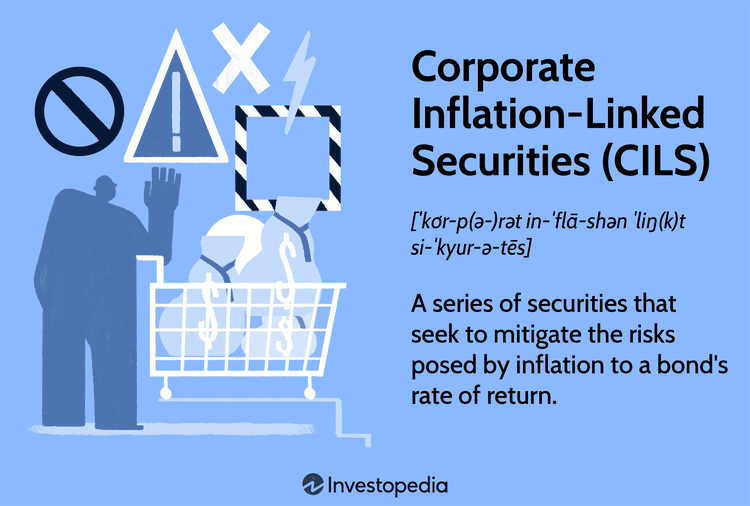

In today's dynamic financial landscape, understanding various financial instruments is crucial for investors and corporations alike. As the market evolves, traditional and modern instruments have become essential in maintaining a balanced and diversified portfolio. This article examines pivotal financial instruments such as corporate bonds, inflation-linked securities, and the increasingly prevalent algorithmic trading practices in financial markets.

Corporate bonds function as a vital tool for companies to raise capital, providing investors with a predictable stream of income. With fluctuations in economic conditions and credit quality impacting their value, these securities remain attractive for those seeking stability amidst market volatility.



Inflation-linked securities offer a protective measure against inflation, ensuring that the returns on investments are not eroded by rising prices. By linking coupon rates to inflation indices, these instruments safeguard purchasing power, ensuring real returns for investors.

Algorithmic trading, leveraging computational power and data analysis, has transformed trading by enabling high-speed and precise trade executions. It incorporates various strategies to capitalize on market inefficiencies, presenting investors with opportunities for enhancing portfolio outcomes. By understanding the interplay between inflation, interest rates, and these financial instruments, market participants can make informed decisions, optimizing their investment strategies.

The exploration of these elements within the framework of inflation and interest rates, two crucial market behavior determinants, underscores their significance for strategic investment decisions. This article aims to equip readers with insights to navigate complex financial systems effectively, fostering informed engagement with evolving market dynamics.

## Table of Contents

## Understanding Corporate Bonds

Corporate bonds are a vital component of the financial markets, serving as a primary mechanism for companies to raise capital. Unlike equity financing, where companies issue shares of stock to attract investment, corporate bonds are a form of debt financing. When a company issues a corporate bond, it essentially borrows money from investors, committing to repay the principal amount at a specified maturity date along with periodic interest payments, known as coupon payments.

Corporate bonds provide a predictable income stream, which is particularly appealing to investors seeking stability and reliability in their investment portfolios. The periodic interest payments offer a dependable return, making these securities popular among conservative investors looking to mitigate risk while [earning](/wiki/earning-announcement) a steady income.

Several factors influence the performance and attractiveness of corporate bonds. One of the primary determinants is the credit quality of the issuing company, often assessed by credit rating agencies like Moody's, Standard & Poor's, and Fitch Ratings. These agencies evaluate the company's financial health and ability to meet its debt obligations, assigning ratings that range from high-quality investment grade to lower-grade speculative, or "junk," bonds. Higher-rated bonds generally offer lower yields, reflecting the reduced risk, whereas lower-rated bonds must offer higher yields to attract investors willing to accept added risk.

Market interest rates significantly impact corporate bond prices. Typically, bond prices move inversely to changes in interest rates. When market interest rates rise, existing bonds with lower coupon rates become less attractive, causing their prices to decline. Conversely, if rates fall, these bonds become more valuable, and their prices tend to increase. This inverse relationship underscores the importance of [interest rate](/wiki/interest-rate-trading-strategies) trends to corporate bond investors.

Economic conditions also play a crucial role in the corporate bond market. In a booming economy, companies are likelier to issue bonds to fund expansion activities, such as acquisitions, research, and development, or infrastructure projects. In contrast, during economic downturns, the risk of default increases, especially for lower-quality bonds, as companies face operational and financial challenges. This can lead to a tightening of credit markets as investors become more risk-averse.

In summary, corporate bonds are key instruments for raising capital, providing predictable income and stability for investors. The pricing and attractiveness of corporate bonds are intricately linked to a company's credit quality, prevailing market interest rates, and overall economic conditions, all of which require careful consideration by investors.

## Inflation-Linked Securities: A Protective Measure

Inflation-linked securities are financial instruments designed to shield investors from the detrimental effects of inflation on bond returns. These securities, including Corporate Inflation-Linked Securities (CILS) and Treasury Inflation-Protected Securities (TIPS), achieve this by linking the coupon payment to an inflation index, typically the Consumer Price Index (CPI). By doing so, the real value of the investment is preserved, offering a mechanism that adjusts both the principal and interest payments in alignment with inflationary changes.

These instruments offer crucial benefits to bond portfolios, particularly in enhancing diversification and reducing interest-rate sensitivity. Traditional fixed-rate bonds suffer from inflation as the purchasing power of interest and principal payments diminishes over time. Conversely, inflation-linked securities adjust their payouts, helping to maintain purchasing power. As such, they are especially attractive in volatile economic conditions where future inflation rates are uncertain.

When comparing CILS and TIPS, each has distinct characteristics that suit different investment strategies and economic contexts. TIPS are U.S. government securities designed to guard against inflation risk by adjusting both the principal and interest based on changes in the CPI, ensuring that the inflation-adjusted principal will be repaid at maturity. On the other hand, CILS are issued by corporations and, while also linked to inflation, they may present a higher risk due to potential issuer default, but often offer higher yields as compensation for this additional risk.

The advantages of TIPS include a government guarantee, which eliminates credit risk, making them a very secure investment. However, this security is often reflected in relatively lower yields compared to corporate bonds. CILS, while riskier, can provide higher returns and introduce a higher degree of portfolio diversification. Furthermore, the performance of CILS can be more sensitive to changes in the issuing corporation’s creditworthiness and market conditions, offering both an opportunity and a risk depending on economic scenarios.

By understanding and utilizing inflation-linked securities, investors can tailor their portfolios to better withstand inflationary pressures, thereby stabilizing returns in environments where inflation is expected to rise. These securities serve as a prudent diversification tool that can diminish the impact of inflation, thereby optimizing the risk-return profile of a bond portfolio in uncertain economic landscapes.

## Impact of Inflation and Interest Rates

Inflation and interest rates are significant factors in the financial markets, affecting the value of investments, consumption, and economic growth. 

Inflation refers to the rate at which the general price level of goods and services rises, eroding the purchasing power of money. This loss of purchasing power affects the real returns on bonds. The real return on a bond is calculated by adjusting the nominal return for inflation:  
$$
\text{Real Return} = \frac{1 + \text{Nominal Return}}{1 + \text{Inflation Rate}} - 1
$$

For instance, if a bond offers a nominal return of 5% and the inflation rate is 3%, the real return approximates to 1.94%, reflecting diminished purchasing power of the returns received.

Interest rates influence the cost of borrowing and the yield on debt securities like bonds. Rising interest rates generally lead to lower bond prices. This inverse relationship is due to the fixed interest payments of existing bonds becoming less attractive compared to new bonds issued at higher rates. Investors receiving lower income from their bond investments may face reduced profitability and capital losses if they sell the bonds before maturity.

Understanding the interaction between inflation and interest rates is vital for strategic investment decisions. Investors need to anticipate inflationary trends and interest rate changes to manage their portfolios effectively. Ignoring these factors could lead to suboptimal decision-making and reduced returns. For instance, during periods of anticipated inflation, investors might shift towards inflation-linked securities or decrease exposure to long-term bonds, which are more sensitive to interest rate fluctuations. Conversely, in a high-interest-rate environment, short-term bonds might be favored to mitigate the potential loss from declining bond prices.

By closely monitoring economic indicators and central bank policies, investors can make informed choices about portfolio allocation, ensuring that they remain aligned with their financial goals even as market conditions evolve.

## Basics of Algorithmic Trading

Algorithmic trading leverages computer algorithms to autonomously execute trades on financial markets, offering high speed and efficiency compared to traditional trading methods. This modern approach utilizes mathematical models and computational power to analyze a multitude of market variables, allowing for decision-making that is both rapid and precise.

Several prominent strategies characterize [algorithmic trading](/wiki/algorithmic-trading). Trend following is a straightforward strategy that identifies sustained movement in an asset's price or trading [volume](/wiki/volume-trading-strategy) and seeks to capitalize on these trends. The core idea is that markets exhibit [momentum](/wiki/momentum), thus offering opportunities for profits by aligning trades with prevailing trends. In contrast, [arbitrage](/wiki/arbitrage) exploits price discrepancies between differing markets or financial instruments, executing trades that benefit from temporary mispricing.

Algorithmic trading's ability to process vast datasets rapidly is one of its primary advantages. This capacity enables the identification of patterns or signals that would be challenging to detect through manual trading. Algorithms are programmed to execute a series of rules based on timing, price, quantity, or any other mathematically defined model. Python, a popular language in this domain because of its versatility, can be used to set up a simple moving average crossover strategy:

```python
import pandas as pd

# Sample moving average crossover strategy
def moving_average(series, window):
    return series.rolling(window=window).mean()

def moving_average_crossover(data, short_window, long_window):
    signals = pd.DataFrame(index=data.index)
    signals['signal'] = 0.0

    # Compute short and long moving averages
    signals['short_mavg'] = moving_average(data['price'], short_window)
    signals['long_mavg'] = moving_average(data['price'], long_window)

    # Generate signals: buy (1) when short moving average above long moving average 
    # and sell (-1) otherwise
    signals['signal'][short_window:] = np.where(signals['short_mavg'][short_window:] 
                                                > signals['long_mavg'][short_window:], 1.0, -1.0)
    return signals

# Sample data
data = pd.DataFrame({'price': [110, 112, 115, 116, 114, 118]})
signals = moving_average_crossover(data, short_window=2, long_window=3)
```

Algorithmic trading offers numerous advantages, including precision and consistency in executing trades. Unlike human traders, algorithms are unaffected by emotions or fatigue, minimizing errors associated with emotional decision-making. Furthermore, algorithms can continuously monitor multiple markets and execute trades simultaneously, significantly improving market efficiency and [liquidity](/wiki/liquidity-risk-premium).

Overall, the deployment of algorithmic trading strategies allows investors to exploit market conditions that require prompt execution and provides the means for comprehensive risk management and portfolio diversification.

## Integrating Bonds, Inflation, and Algorithmic Trading

Algorithmic trading leverages advanced computational techniques to analyze vast datasets concerning bond yields, inflation rates, and prevailing interest levels. This approach allows traders to execute buy and sell orders with high precision and minimal latency, optimizing the decision-making process in fixed-income markets. Algorithmic programs employ various data inputs, such as current and historical yields of corporate bonds and inflation-linked securities, to predict future market conditions and identify profitable trading opportunities.

One critical aspect of using algorithmic trading strategies in bond markets is the effective management of interest rate risk. Algorithms can implement hedging strategies that protect portfolios from adverse movements in interest rates, which can significantly affect bond prices. For example, if an algorithm identifies a potential upward trend in interest rates, it might trigger the purchase of interest rate derivatives or short positions in bonds, acting as a countermeasure to anticipated price declines. 

Algorithmic trading systems can also be programmed to execute arbitrage strategies, capitalizing on inefficiencies between different bond markets or between bonds and related financial instruments. These strategies aim to exploit market discrepancies, such as varying yield spreads, that may arise due to inflation differentials or macroeconomic news.

Practical implementations of algorithmic trading in bond markets provide compelling case studies. For instance, a trading firm could design a strategy that utilizes [machine learning](/wiki/machine-learning) models to analyze historical inflation data along with real-time bond yield information to forecast future rate movements. Such strategies allow the algorithms to adjust trading positions dynamically, enhancing both returns and portfolio stability.

Algorithmic trading is expected to integrate further with emerging technologies like AI, enabling more sophisticated pattern recognition and predictive analytics. These advancements promise to refine risk management techniques and lead to more resilient investment portfolios as they continue to adapt to the evolving complexities of modern financial markets.

## Future Trends and Considerations

Emerging technologies, notably [artificial intelligence](/wiki/ai-artificial-intelligence) (AI) and quantum computing, are poised to significantly influence algorithmic trading strategies in the coming years. AI enhances the ability to analyze vast quantities of data, uncovering patterns and generating insights at unprecedented speed. Machine learning algorithms, capable of self-improvement, are increasingly utilized to optimize trading strategies, enhance risk management, and forecast market movements with greater accuracy. For instance, convolutional neural networks and recurrent neural networks have shown promise in predicting stock price trends by processing time series data and identifying underlying patterns.

Quantum computing, though in nascent stages regarding practical application, offers transformative potential due to its ability to process complex calculations exponentially faster than classical computers. This capability could revolutionize portfolio optimization, option pricing models, and risk assessment. Quantum algorithms such as the Quantum Approximate Optimization Algorithm (QAOA) and the Variational Quantum Eigensolver (VQE) may allow traders to solve optimization problems more efficiently, providing a competitive edge in the fast-paced financial markets.

Investors must remain vigilant and adaptable to the rapidly changing market dynamics and economic conditions to leverage these technological advancements effectively. This includes continuously updating knowledge of financial trends, regulatory changes, and technological innovations that could impact market behavior. Utilizing advanced trading platforms that integrate AI and quantum technologies will likely become essential for optimizing investment outcomes.

Staying informed about developments in blockchain technology and decentralized finance (DeFi) is also crucial, as these areas are increasingly interwoven with traditional financial markets. DeFi technologies, powered by smart contracts, offer possibilities for automating and democratizing financial transactions, which could influence liquidity and market access.

In summary, the integration of cutting-edge technologies such as AI and quantum computing presents immense opportunities and challenges for the trading and investment sectors. Investors and traders will benefit from embracing these innovations, adapting to evolving practices, and maintaining a robust educational foundation to navigate the complexities of modern financial markets effectively.

## Conclusion

A comprehensive understanding of bonds, inflation-linked securities, and algorithmic trading is crucial for navigating today’s financial markets effectively. These instruments and strategies provide avenues for investors and corporations to mitigate risks, optimize returns, and maintain financial stability amidst fluctuating economic conditions. By integrating these tools into their trading strategies, investors can achieve better portfolio diversification and enhanced risk management, ensuring resilience against market [volatility](/wiki/volatility-trading-strategies).

For instance, traditional bonds offer steady income streams but may be susceptible to the erosive effects of inflation on returns. Inflation-linked securities counter this risk by adjusting for inflation, thus preserving the real value of investments. Meanwhile, algorithmic trading introduces efficiency and precision to the trading process, utilizing complex algorithms to analyze market data and execute trades that capitalize on fleeting opportunities. This technological edge can be particularly beneficial when managing large datasets and reacting swiftly to market movements.

To fully harness these benefits, continuous learning is imperative. Financial markets are dynamic and influenced by a myriad of factors, including changes in economic policies, global events, and advancements in technology. As such, staying informed about emerging trends and innovations, such as AI and quantum computing, can offer new ways to approach trading and investment. Engaging with educational resources, industry reports, and technological tools will empower investors to refine their strategies and maximize the potential of their financial investments.

By adopting a strategic and informed approach, investors can navigate the complexities of the financial markets with greater confidence and achieve sustainable growth.

## References & Further Reading

[1]: ["Corporate Bonds: A Guide to Investment and Value"](https://www.fool.com/investing/how-to-invest/bonds/corporate-bonds/) by Richard C. Wilson

[2]: ["Inflation-Linked Bonds: Price Indexation and Valuation"](https://finpricing.com/lib/FiInflationBond.html) by Mark Deacon

[3]: ["Advances in Financial Machine Learning"](https://www.amazon.com/Advances-Financial-Machine-Learning-Marcos/dp/1119482089) by Marcos Lopez de Prado

[4]: ["Handbook of Fixed-Income Securities"](https://www.amazon.com/Handbook-Fixed-Income-Securities-Ninth/dp/1260473899) by Frank J. Fabozzi

[5]: ["Quantitative Finance: Its Development, Mathematical Foundation, and New Investment Strategies"](https://archive.org/details/quantitativefina0000epps) by T. Wake Epps

[6]: ["Algorithmic Trading: Winning Strategies and Their Rationale"](https://books.google.com/books/about/Algorithmic_Trading.html?id=WAlFDwAAQBAJ) by Ernie Chan

[7]: ["Treasury Inflation Protected Securities (TIPS)"](https://www.treasurydirect.gov/indiv/products/prod_tips_glance.htm) - U.S. Treasury Department

[8]: Lima, T., & Sousa, F. R. (2016). ["Corporate Bonds Credit Risk Assessment: Application of Artificial Neural Networks and Classical Models."](https://www.sciencedirect.com/science/article/pii/S0304389424036008) Borsa Istanbul Review.