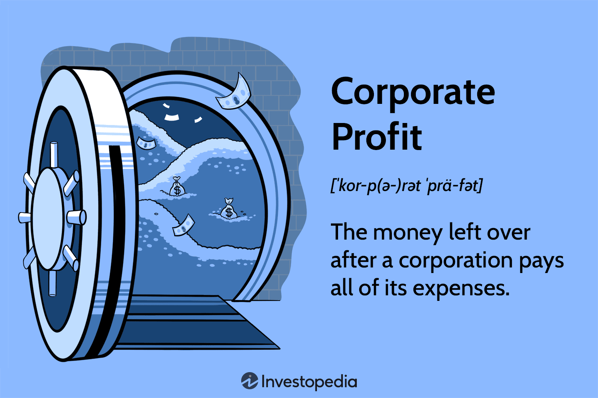

## Table of Contents

## What is corporate profit?

Corporate profit is the money a company makes after it pays for all its costs. When a company sells its products or services, it gets money. But it also has to spend money on things like making the products, paying workers, and other expenses. The profit is what's left over after all these costs are paid.

Profits are important for a company because they show if the business is doing well. If a company makes a lot of profit, it means it is earning more money than it is spending. This extra money can be used to grow the business, pay shareholders, or save for the future. If a company doesn't make a profit, it might need to find ways to cut costs or increase sales to stay in business.

## How is corporate profit calculated?

Corporate profit is calculated by taking the total revenue a company earns and subtracting all its expenses. Revenue is the money a company gets from selling its products or services. Expenses include costs like materials, wages, rent, and other things the company needs to pay for to operate. The difference between revenue and expenses is called the net profit.

Sometimes, companies also look at gross profit, which is different from net profit. Gross profit is calculated by subtracting only the cost of goods sold (COGS) from the total revenue. COGS includes the direct costs of making the products, like raw materials and labor. Gross profit shows how much money a company makes from its products before other expenses like rent and salaries are taken out. Both net profit and gross profit are important for understanding a company's financial health.

## Why is corporate profit important for a business?

Corporate profit is really important for a business because it shows if the company is doing well. When a company makes a profit, it means they are [earning](/wiki/earning-announcement) more money than they are spending on things like making products, paying workers, and other costs. This extra money is called profit, and it's a sign that the business is healthy. If a company keeps making profits, it can grow bigger, pay its shareholders, or save money for the future. Without profit, a company might struggle to stay open and might need to find ways to cut costs or sell more products.

Profits also help a business plan for the future. When a company knows it's making money, it can decide to invest in new projects, like making new products or opening new stores. This can help the company grow and stay competitive. If a company isn't making a profit, it might have to change its plans or even close down. So, profit is like a report card for a business, showing if it's doing well and helping it make smart decisions about what to do next.

## What are the different types of corporate profit?

There are different types of corporate profit that businesses look at to see how they are doing. One type is gross profit. Gross profit is what a company makes after it pays for the things it needs to make its products, like materials and the labor to make them. This is different from total sales because it only looks at the money left after these direct costs are taken out. Gross profit shows how much money a business makes from its products before other costs like rent or salaries are paid.

Another type of corporate profit is net profit. Net profit is what's left after a company pays for all its costs, not just the ones for making products. This includes things like rent, salaries, and other expenses needed to run the business. Net profit is important because it shows the real amount of money a company is making. It tells the owners if the business is doing well overall, and it's the number used to figure out taxes and what to pay shareholders.

There's also operating profit, which is a bit in between gross and net profit. Operating profit looks at the money a company makes after paying for the costs of making products and the costs of running the business day-to-day, like salaries and rent. But it doesn't include other costs like taxes or interest on loans. Operating profit helps a company see how well its main business is doing, without the effects of other financial things.

## How does corporate profit affect a company's financial statements?

Corporate profit affects a company's financial statements a lot. The main financial statement it impacts is the income statement. The income statement shows how much money a company made and spent over a certain time, like a year. At the bottom of the income statement, you'll see the net profit, which is the money left after all costs are paid. This number tells everyone if the company made more money than it spent. If the net profit is high, it means the company did well and made a lot of money. If it's low or negative, it might mean the company needs to find ways to save money or make more sales.

Another financial statement affected by corporate profit is the balance sheet. The balance sheet shows what the company owns, what it owes, and the money shareholders have put into the business. When a company makes a profit, it can keep that money as retained earnings, which is part of the shareholders' equity on the balance sheet. Retained earnings can grow over time if the company keeps making profits, showing that the business is doing well and has money to use for future plans. If the company loses money instead, it might have to use past profits or borrow money, which can change the numbers on the balance sheet and show that the company might be struggling.

## What role does corporate profit play in business strategy?

Corporate profit is really important for a company's business strategy. It helps the company decide what to do next. When a company makes a lot of profit, it can use that money to grow bigger. They might decide to make new products, open new stores, or even buy other companies. Profit also lets a company pay its shareholders, which makes them happy and keeps them investing in the business. If a company isn't making enough profit, it might need to change its strategy. They might have to cut costs, like spending less on making products or paying less for rent. Or they might need to find ways to sell more, like advertising more or lowering prices.

Profit also helps a company plan for the future. When a company knows it's making money, it can feel more confident about trying new things. They might invest in research to come up with new ideas or spend money on technology to make their business run better. If a company isn't making a profit, it might have to be more careful with its plans. They might need to focus on saving money instead of spending it on new projects. So, profit is like a guide for a company, helping it make smart choices about what to do next.

## How do taxes impact corporate profit?

Taxes can take a big chunk out of a company's profit. When a company makes money, it has to pay taxes on that profit to the government. The amount of tax depends on the tax laws where the company is located. After paying taxes, the company's net profit goes down. This means there's less money left for the company to use for things like growing the business, paying shareholders, or saving for the future. So, taxes are a big expense that can make a company's profit smaller.

Companies often try to find ways to pay less in taxes. They might use different strategies to lower their tax bill, like taking advantage of tax deductions or moving some of their business to countries with lower taxes. By paying less in taxes, a company can keep more of its profit. This can help the company have more money to spend on its plans and make it easier to grow. But, it's important for companies to follow the tax laws and not do anything illegal to avoid paying taxes.

## What are common strategies to increase corporate profit?

One common way to increase corporate profit is by cutting costs. Companies can look at all the money they spend and find ways to spend less. This might mean buying materials cheaper, paying less for rent, or finding ways to make products with less labor. Another way to cut costs is by making the business run more smoothly, like using technology to save time and money. When a company spends less money, it can keep more of what it earns as profit.

Another strategy is to increase sales. Companies can do this by selling more of their products or services. They might advertise more to get more customers, or they might lower their prices to attract more buyers. Sometimes, companies make new products or improve old ones to get people to buy more. When a company sells more, it brings in more money, which can lead to higher profits if the costs don't go up too much.

A third way to boost profit is by finding new markets or ways to make money. Companies might start selling their products in new countries or online. They could also start offering new services or find other ways to use what they already have to make more money. By finding new ways to earn, a company can increase its profit without having to cut costs or just sell more of the same old things.

## How does corporate profit influence investment decisions?

Corporate profit is really important when it comes to making investment decisions. When a company makes a lot of profit, it shows that the business is doing well. Investors like to see this because it means the company can grow, pay its shareholders, and save money for the future. If a company keeps making profits, investors might want to put more money into it, hoping that the company will keep doing well and their investment will grow. On the other hand, if a company isn't making much profit or is losing money, investors might be worried. They might decide not to invest or even take their money out, thinking the company might struggle in the future.

Profits also help investors decide where to put their money. If one company is making more profit than another, investors might choose to invest in the company with higher profits. They believe that company is a safer bet and more likely to give them a good return on their investment. Sometimes, investors look at how a company's profit is growing over time. If the profit is getting bigger each year, it might be a sign that the company is on the right track and worth investing in. So, corporate profit is a big part of what investors think about when they decide where to put their money.

## What are the ethical considerations surrounding corporate profit?

When companies try to make more profit, they need to think about what is right and wrong. One big issue is how they treat their workers. If a company cuts costs by paying workers less or making them work in bad conditions, that can hurt people. It's important for companies to make sure they are fair to their employees and give them a safe place to work. Another issue is the environment. If a company makes more profit by polluting or using up resources, it can harm the planet. Companies should try to be good to the environment and find ways to make money without causing damage.

Another ethical thing to think about is how companies deal with their customers. Sometimes, companies might try to trick people or sell them things they don't need just to make more money. This is not right. Companies should be honest and fair to their customers. They should also think about the bigger picture. For example, if a company makes a lot of profit but it makes life worse for the community around it, that's a problem. Companies should try to help the places where they do business and make sure their profits don't come at the cost of others.

## How do economic conditions affect corporate profit?

Economic conditions can have a big impact on how much money a company makes. When the economy is doing well, people have more money to spend. This means they buy more things, which can help companies sell more and make bigger profits. On the other hand, when the economy is not doing well, people might not have as much money. They might spend less, which can make it harder for companies to sell their products and make a profit. Things like interest rates, inflation, and unemployment can all change how much money people have and how much they are willing to spend.

Another way economic conditions affect corporate profit is through costs. When the economy is growing, costs for things like materials and labor might go up because there is more demand. This can make it harder for companies to keep their profits high if they can't raise their prices enough. But if the economy is slow, costs might go down because there is less demand. This can help companies save money and make more profit if they can keep selling their products. So, the health of the economy is really important for how much profit a company can make.

## What advanced metrics are used to analyze corporate profit?

When people want to understand corporate profit better, they often look at advanced metrics like EBITDA, which stands for Earnings Before Interest, Taxes, Depreciation, and Amortization. This number helps show how much money a company is making from its main business before other costs like taxes and interest on loans are taken out. It's a good way to see if the company's core operations are doing well. Another important metric is Return on Equity (ROE), which shows how much profit a company makes with the money shareholders have put into it. A high ROE means the company is using shareholders' money well to make profits.

Another useful metric is the Gross Margin, which shows the percentage of total revenue that is left after paying for the costs of making products. A high gross margin means the company is good at keeping the costs of making things low compared to what they sell them for. Operating Margin is also important because it shows the profit a company makes from its main business after paying for the costs of making products and running the business day-to-day. This helps people see how well the company is managing its regular expenses. Together, these metrics give a detailed picture of a company's profit and how well it's doing financially.

## How do Corporate Profits relate to Economic Indicators?

Corporate profits represent the residual income that companies retain after covering all operational costs, taxes, and other expenses. These profits are a crucial economic indicator, reported by the U.S. Bureau of Economic Analysis (BEA), providing insights into overall business activity and economic health. A clear understanding of the relationship between corporate profits, Gross Domestic Product (GDP), and economic cycles can significantly enhance market trend forecasting and investment decision-making.

Corporate profits tend to move in tandem with economic cycles, acting as a lagging indicator given their reaction to economic activities. During periods of economic expansion, corporate profits generally increase as businesses benefit from heightened consumer demand, increased production capacity, and improved efficiency. Conversely, during economic contractions, profits often decline due to reduced demand and compressed margins.

The relationship between corporate profits and GDP is symbiotic: while GDP measures the total economic output, corporate profits reflect the share of income attributed to businesses from that output. GDP growth can lead to increased profitability, as higher economic output typically spurs greater sales and enhanced capacity utilization. However, it’s crucial to distinguish between real GDP (inflation-adjusted) and nominal GDP when analyzing their impact on profits, as inflation can erode real profit values even when nominal profits appear stable or increasing.

Investors leverage corporate profit data to perform comparative analyses across industries and with historical performance. Such analyses help gauge whether companies are outperforming their peers or facing industry-wide challenges. The profit margin, calculated as the ratio of net income to revenue, serves as a pivotal metric here. High profit margins usually signify robust management and competitive advantages, while shrinking margins may indicate operational inefficiencies or increased competitive pressures.

To illustrate, consider the profit margin formula:

$$
\text{Profit Margin} = \left( \frac{\text{Net Income}}{\text{Revenue}} \right) \times 100
$$

This metric helps in assessing whether a company's profitability trends align with those of the broader economic climate or if specific strategic adjustments may be warranted.

Understanding the nuances of corporate profits and their interaction with economic indicators empowers investors and businesses alike to craft informed, strategic decisions that align with forecasted market developments. This proactive approach is instrumental in maintaining a competitive edge and ensuring sustainable growth.

## What is the interconnection between corporate profits and algo trading?

Algorithmic trading, by using advanced algorithms for executing trades, plays a pivotal role in shaping corporate profits through its influence on market dynamics and investment behaviors. These algorithms are designed to identify and capitalize on market opportunities with efficiency and precision, factors that directly correlate to corporate profitability.

One of the primary ways companies utilize [algorithmic trading](/wiki/algorithmic-trading) is to maximize investment returns and minimize risks. By analyzing vast amounts of market data at high speed, algorithmic trading systems can detect inefficiencies and patterns that are imperceptible to human traders. For instance, [arbitrage](/wiki/arbitrage) strategies, which exploit price differentials of the same asset across different markets, are commonly employed through algorithmic trading. This allows companies to generate profits with minimal risk, thereby enhancing their financial performance. The formula for calculating profit in an algorithmic trading strategy, such as arbitrage, can be expressed as:

$$

\text{Profit} = \sum_{i=1}^{n} (P_{\text{sell},i} - P_{\text{buy},i}) - \text{Transaction Costs}
$$

Where $P_{\text{sell},i}$ and $P_{\text{buy},i}$ are the selling and buying prices of the asset, respectively.

Algorithmic trading also affects corporate strategies and decision-making processes. Companies harness algorithmic systems to implement more precise and data-driven strategies. For example, market timing strategies, which seek to predict future price movements, are refined using [machine learning](/wiki/machine-learning) techniques and vast computational power, allowing firms to adjust their portfolios accordingly and optimize their capital allocation.

Furthermore, the impact of algorithmic trading on market dynamics, such as [liquidity](/wiki/liquidity-risk-premium) and [volatility](/wiki/volatility-trading-strategies), has downstream effects on corporate strategy. Increased liquidity, often a result of algorithmic trading, reduces transaction costs and creates more opportunities for trading, thereby potentially increasing corporate income streams. Conversely, the heightened volatility associated with algorithmic trading can lead to more rigorous risk management practices, where companies must adapt by developing robust hedging strategies to safeguard against unexpected market shifts.

While algorithmic trading offers significant advantages, it also introduces challenges that can influence corporate strategies. Technical failures in algorithmic systems, for instance, can lead to substantial financial losses and reputational damage. Over-optimization, where algorithms are too closely fitted to historical data, can result in poor performance under new market conditions. Consequently, corporate decision-makers must weigh these risks and implement comprehensive governance frameworks to ensure the algorithms function as intended.

The integration of algorithmic trading within corporate investment strategies signifies an evolution in how companies approach markets and profit generation. By leveraging technological advancements, businesses can enhance their financial strategies, but this also requires a meticulous evaluation of dynamic market factors and potential risks. This interplay of algorithmic trading and corporate profits not only fosters refined investment strategies but also necessitates an adaptive corporate environment to thrive amid rapid technological evolution.

## References & Further Reading

[1]: ["Principles of Corporate Finance"](https://en.wikipedia.org/wiki/Principles_of_Corporate_Finance) by Richard A. Brealey, Stewart C. Myers, and Franklin Allen

[2]: ["Algorithmic Trading: Winning Strategies and Their Rationale"](https://www.wiley.com/en-us/Algorithmic+Trading%3A+Winning+Strategies+and+Their+Rationale-p-9781118746912) by Ernest P. Chan

[3]: ["Advances in Financial Machine Learning"](https://www.amazon.com/Advances-Financial-Machine-Learning-Marcos/dp/1119482089) by Marcos Lopez de Prado

[4]: ["Financial Markets"](https://en.wikipedia.org/wiki/Financial_market) by Yale University on Coursera, taught by Professor Robert Shiller

[5]: ["Machine Learning for Algorithmic Trading"](https://github.com/stefan-jansen/machine-learning-for-trading) by Stefan Jansen