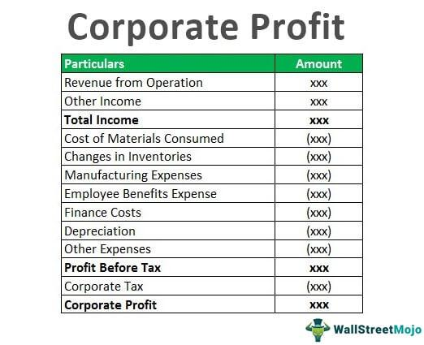

The modern business landscape is marked by a relentless quest for profit, compelling companies to embrace innovative strategies and technological advancements. This evolution is driven by several interconnected elements such as corporate profit mechanisms, economic principles, and algorithmic trading. These factors collectively shape the frameworks that companies operate within today.

Corporate profit mechanisms are foundational in assessing a company's financial health and growth potential. Essentially, corporate profit is the surplus remaining after a company has settled all its expenses. It's a critical indicator used by stakeholders to evaluate business performance and strategic direction. Meanwhile, economic principles guide how businesses navigate market conditions, optimize resources, and maximize returns.



Algorithmic trading, a relatively recent innovation in financial markets, has significantly transformed investment strategies. It employs complex computer algorithms to execute trades at high speed and frequency, far beyond human capabilities. This shift has redefined how traders and investors approach the market, influencing decision-making processes and profitability metrics.

This article examines the synergy between these elements, highlighting how they contribute to defining the contemporary business environment. Understanding the fundamental aspects of corporate profits and the transformative role of algorithmic trading can provide valuable insights into navigating today's complex and dynamic markets. Such understanding is crucial for business leaders and investors aiming to sustain competitiveness and achieve long-term success in their respective industries.

## Table of Contents

## Understanding Corporate Profit Mechanisms

Corporate profit represents the financial surplus a company retains after deducting all its operational expenses. This surplus acts as a critical performance indicator, offering insights into the organizational growth trajectory and the financial health of a business. Corporate profits can be categorized into several distinct measures—operational profits, book profits, and after-tax profits—each providing a unique perspective on the company's financial standing.

Operational profit, also known as operating income, is calculated by subtracting operational expenses (which include costs of goods sold, wages, and depreciation) from the company's gross income. This measure provides insight into the core profitability derived exclusively from the primary business activities, excluding other income streams such as investments or loans.

Book profits, on the other hand, take into account all income and expenditure reflected in the company's financial statements, including non-recurring and extraordinary items. It is essentially the net profit indicated on the financial statements, which can sometimes vary significantly from the actual cash profit due to accounting policies and accruals.

After-tax profits represent the net earnings that remain post the deduction of tax liabilities. This measure is crucial for investors and management since it reflects the amount available for reinvestment in the business, payment of dividends, or as retained earnings.

Profit margins are vital indicators of a company's efficiency and competitiveness. They are calculated as the ratio of profit to revenue, providing a percentage that indicates how much profit is made relative to the sales [volume](/wiki/volume-trading-strategy). Higher profit margins typically signal a company's strong competitive position and operational efficiency. Several types of profit margins exist, such as gross profit margin, operating profit margin, and net profit margin, each offering insight into different aspects of business performance.

Maintaining high profit margins is essential for competitiveness, as it allows companies to withstand cost fluctuations, invest in innovation, and expand market share. Companies strive to enhance these margins through cost-control measures, optimizing pricing strategies, and improvements in operational efficiency.

In essence, understanding the various measures and implications of corporate profit provides business leaders with the insight needed to make informed strategic decisions and ensure the sustainability of the company's financial well-being.

## Corporate Profits and Economic Indicators

Corporate profits represent the residual income that companies retain after covering all operational costs, taxes, and other expenses. These profits are a crucial economic indicator, reported by the U.S. Bureau of Economic Analysis (BEA), providing insights into overall business activity and economic health. A clear understanding of the relationship between corporate profits, Gross Domestic Product (GDP), and economic cycles can significantly enhance market trend forecasting and investment decision-making.

Corporate profits tend to move in tandem with economic cycles, acting as a lagging indicator given their reaction to economic activities. During periods of economic expansion, corporate profits generally increase as businesses benefit from heightened consumer demand, increased production capacity, and improved efficiency. Conversely, during economic contractions, profits often decline due to reduced demand and compressed margins.

The relationship between corporate profits and GDP is symbiotic: while GDP measures the total economic output, corporate profits reflect the share of income attributed to businesses from that output. GDP growth can lead to increased profitability, as higher economic output typically spurs greater sales and enhanced capacity utilization. However, it’s crucial to distinguish between real GDP (inflation-adjusted) and nominal GDP when analyzing their impact on profits, as inflation can erode real profit values even when nominal profits appear stable or increasing.

Investors leverage corporate profit data to perform comparative analyses across industries and with historical performance. Such analyses help gauge whether companies are outperforming their peers or facing industry-wide challenges. The profit margin, calculated as the ratio of net income to revenue, serves as a pivotal metric here. High profit margins usually signify robust management and competitive advantages, while shrinking margins may indicate operational inefficiencies or increased competitive pressures.

To illustrate, consider the profit margin formula:

$$
\text{Profit Margin} = \left( \frac{\text{Net Income}}{\text{Revenue}} \right) \times 100
$$

This metric helps in assessing whether a company's profitability trends align with those of the broader economic climate or if specific strategic adjustments may be warranted.

Understanding the nuances of corporate profits and their interaction with economic indicators empowers investors and businesses alike to craft informed, strategic decisions that align with forecasted market developments. This proactive approach is instrumental in maintaining a competitive edge and ensuring sustainable growth.

## The Rise of Algorithmic Trading

Algorithmic trading represents a sophisticated intersection of finance and technology, leveraging computer algorithms to execute trades at speeds and scales beyond human capabilities. Algorithms, in this context, are sets of rules or processes designed for solving specific trading tasks. By automating trading functions, [algorithmic trading](/wiki/algorithmic-trading) enhances profitability and reduces the manual intervention required in traditional trading environments.

### Basic Concept of Algorithms in Trading

An algorithm in trading is essentially a piece of programmed logic that determines when, what, and how to buy or sell financial instruments. These algorithms rely on various inputs like price, timing, and volume. The use of algorithms enables traders to assess large data sets swiftly and implement trading decisions based on pre-established criteria. For instance, an algorithm could be designed to execute trades when a stock price crosses a particular threshold or when a technical indicator signals a buy or sell condition.

### Common Algorithmic Trading Strategies

Several strategies typify algorithmic trading, each capitalizing on different aspects of market inefficiencies or behaviors:

1. **Arbitrage**:
   Arbitrage strategies exploit price discrepancies across different markets or financial instruments. An algorithm automatically identifies and executes trades to capitalize on these differences before they vanish. For example, if a stock is trading at \$100 on one exchange and \$101 on another, an [arbitrage](/wiki/arbitrage) algorithm could buy the stock on the cheaper exchange and sell on the pricier one, profiting from the \$1 price difference.

2. **Mean Reversion**:
   This strategy is based on the concept that prices will revert to their mean or average over time. An algorithm monitors deviations from the mean price and initiates trades when prices are significantly higher or lower than historically average levels, anticipating that they will revert to these averages. For example, if a stock's typical price range is between \$95 and \$105, an algorithm might buy the stock when it drops below \$95 and sell when it exceeds \$105.

3. **Market Timing**:
   Algorithms using market timing aim to predict the future direction of market prices to enter or [exit](/wiki/exit-strategy) positions at opportune moments. These algorithms analyze patterns or trends in historical data to forecast price movements, leveraging statistical and [machine learning](/wiki/machine-learning) models for precision. Python libraries like NumPy and pandas are often used to implement complex time-series analyses to predict future price actions.

```python
import numpy as np
import pandas as pd

# Sample code to illustrate mean reversion strategy

def mean_reversion_strategy(prices, window=20, threshold=1.5):
    rolling_mean = prices.rolling(window=window).mean()
    rolling_std = prices.rolling(window=window).std()

    buy_signals = (prices < rolling_mean - threshold * rolling_std)
    sell_signals = (prices > rolling_mean + threshold * rolling_std)

    return buy_signals, sell_signals

# Example usage with stock prices data
stock_prices = pd.Series([100, 102, 98, 105, 101, 99, 97, 103])
buy, sell = mean_reversion_strategy(stock_prices)
```

The rapid execution and data analysis capabilities of algorithmic trading have revolutionized the landscape of investment strategies. By exploiting opportunities and mitigating risks in real-time, these algorithms not only optimize returns but also reshape the dynamics of financial markets.

## Impact of Algorithmic Trading on Market Dynamics

Algorithmic trading has become a pivotal force in modern financial markets, profoundly influencing market [liquidity](/wiki/liquidity-risk-premium), [volatility](/wiki/volatility-trading-strategies), and pricing. By employing sophisticated mathematical models and high-speed computational techniques, algorithmic trading enhances market efficiency and cost-effectiveness for investors.

### Improved Market Efficiency and Reduced Transaction Costs

Algorithmic trading improves market efficiency by executing trades at speeds and volumes unattainable by human traders. Automation allows for immediate reaction to market events, leading to more accurate price discovery. This is crucial in a decentralized marketplace where information dissemination and rapid decision-making can be challenging.

The reduction in transaction costs is another significant benefit. Algorithms execute trades in fractions of a second, reducing the bid-ask spread, and consequently the cost to traders. Such efficiency gains are especially beneficial for high-frequency trading ([HFT](/wiki/high-frequency-trading-strategies)) strategies, where profit margins are typically slim. The use of algorithms reduces the impact cost, ensuring traders obtain better execution prices compared to manual trading approaches.

### Challenges: Technical Failures and Over-Optimization

Despite these advantages, algorithmic trading is not without challenges. Technical failures present significant risks. Systemic flaws, such as software bugs or glitches, can lead to erroneous trades, causing market disruptions and substantial financial losses, as illustrated by events such as the "Flash Crash" of May 6, 2010.

Over-optimization, known as curve fitting, poses another challenge. This occurs when algorithms are excessively tailored to past data, compromising their effectiveness in future, unseen market conditions. Over-optimized strategies often perform well in backtests but fail to adapt to evolving market dynamics, leading to potential losses.

### Impact on Market Liquidity and Volatility

Algorithmic trading contributes to improved market liquidity by facilitating a higher volume of trades, thereby enhancing the ease with which assets can be bought or sold without causing significant price shifts. Greater liquidity often leads to tighter spreads and more stable market prices.

However, the impact on market volatility can be dual-edged. On one hand, increased trading volumes can dampen price fluctuations by quickly accommodating buying and selling pressures. On the other hand, the rapid execution speed and volume of trades by algorithms can exacerbate market swings during periods of uncertainty, leading to increased volatility. This paradoxical effect requires careful regulation to ensure market stability.

In summary, while algorithmic trading brings notable benefits, including enhanced market efficiency and reduced transaction costs, it also introduces challenges related to technical robustness and adaptability. The interplay between these factors continues to redefine market dynamics, necessitating ongoing evaluation and regulation to safeguard market integrity.

## Interconnection Between Corporate Profits and Algo Trading

Algorithmic trading, by using advanced algorithms for executing trades, plays a pivotal role in shaping corporate profits through its influence on market dynamics and investment behaviors. These algorithms are designed to identify and capitalize on market opportunities with efficiency and precision, factors that directly correlate to corporate profitability.

One of the primary ways companies utilize algorithmic trading is to maximize investment returns and minimize risks. By analyzing vast amounts of market data at high speed, algorithmic trading systems can detect inefficiencies and patterns that are imperceptible to human traders. For instance, arbitrage strategies, which exploit price differentials of the same asset across different markets, are commonly employed through algorithmic trading. This allows companies to generate profits with minimal risk, thereby enhancing their financial performance. The formula for calculating profit in an algorithmic trading strategy, such as arbitrage, can be expressed as:

$$

\text{Profit} = \sum_{i=1}^{n} (P_{\text{sell},i} - P_{\text{buy},i}) - \text{Transaction Costs}
$$

Where $P_{\text{sell},i}$ and $P_{\text{buy},i}$ are the selling and buying prices of the asset, respectively.

Algorithmic trading also affects corporate strategies and decision-making processes. Companies harness algorithmic systems to implement more precise and data-driven strategies. For example, market timing strategies, which seek to predict future price movements, are refined using machine learning techniques and vast computational power, allowing firms to adjust their portfolios accordingly and optimize their capital allocation.

Furthermore, the impact of algorithmic trading on market dynamics, such as liquidity and volatility, has downstream effects on corporate strategy. Increased liquidity, often a result of algorithmic trading, reduces transaction costs and creates more opportunities for trading, thereby potentially increasing corporate income streams. Conversely, the heightened volatility associated with algorithmic trading can lead to more rigorous risk management practices, where companies must adapt by developing robust hedging strategies to safeguard against unexpected market shifts.

While algorithmic trading offers significant advantages, it also introduces challenges that can influence corporate strategies. Technical failures in algorithmic systems, for instance, can lead to substantial financial losses and reputational damage. Over-optimization, where algorithms are too closely fitted to historical data, can result in poor performance under new market conditions. Consequently, corporate decision-makers must weigh these risks and implement comprehensive governance frameworks to ensure the algorithms function as intended.

The integration of algorithmic trading within corporate investment strategies signifies an evolution in how companies approach markets and profit generation. By leveraging technological advancements, businesses can enhance their financial strategies, but this also requires a meticulous evaluation of dynamic market factors and potential risks. This interplay of algorithmic trading and corporate profits not only fosters refined investment strategies but also necessitates an adaptive corporate environment to thrive amid rapid technological evolution.

## Conclusion

Corporate profit mechanisms and algorithmic trading play pivotal roles in shaping modern economic practices, offering both opportunities and challenges for businesses and investors. Understanding these elements is critical for navigating the complexities of today's markets.

Corporate profit mechanisms serve as essential indicators of a company's financial health and are intricately linked to broader economic indicators such as GDP. They provide insights into a company’s capacity for growth, competitive strategy, and market positioning. Through effective management of operational, book, and after-tax profits, organizations can enhance their financial performance and maintain sustainability in competitive markets.

Algorithmic trading has transformed the financial landscape by allowing trades to be executed at speeds unattainable by human traders, thereby increasing market liquidity and efficiency. However, it also introduces challenges such as market volatility and the potential for systemic risks caused by technical failures or algorithmic errors. As a result, algorithmic trading can significantly impact corporate strategies and investment decisions, influencing risk management practices and profitability outcomes.

The synthesis of corporate profit analysis with algorithmic trading insights offers valuable perspectives for business leaders and investors. By leveraging data analytics and algorithmic technologies, organizations can optimize their financial strategies, maximize returns, and mitigate risks. This integration underscores the importance of adopting an adaptive approach to market analysis and strategic planning.

Looking forward, the landscape of corporate profits and algorithmic trading is likely to evolve, influenced by technological advancements and regulatory changes. Emerging trends such as [artificial intelligence](/wiki/ai-artificial-intelligence) and machine learning could further enhance algorithmic trading capabilities, offering more sophisticated tools for market analysis. However, with these advancements, there also comes the potential need for enhanced regulatory oversight to safeguard market stability and prevent abuses such as market manipulation.

In summary, corporate profit mechanisms and algorithmic trading are not only influential individually but also in their interconnectedness, driving modern economic practices. A robust understanding of these concepts will equip business leaders and investors with the insights necessary to thrive in increasingly complex and dynamic market environments.

## Further Reading and Resources

For those seeking to deepen their understanding of corporate finance and algorithmic trading, there are numerous resources and courses available. These materials span [books](/wiki/algo-trading-books), online platforms, and certification programs, each offering valuable insights and expertise.

### Recommended Books
1. **"Principles of Corporate Finance" by Richard A. Brealey, Stewart C. Myers, and Franklin Allen**: This book provides comprehensive coverage of corporate finance concepts with real-world examples and in-depth theory. It is widely used in academic finance programs.

2. **"Algorithmic Trading: Winning Strategies and Their Rationale" by Ernest P. Chan**: A practical guide to developing and implementing algorithmic strategies, this book is ideal for both beginners and experienced traders.

3. **"Advances in Financial Machine Learning" by Marcos López de Prado**: This book explores the intersection of financial markets and machine learning, offering strategies and case studies on using machine learning for trading.

### Online Courses and Platforms
1. **Coursera - Financial Markets by Yale University**: This course, taught by Professor Robert Shiller, covers the fundamentals of financial markets, including risk management and behavioral finance principles.

2. **edX - Algorithmic Trading and Finance Models with Python, R, and Stata Essential Training**: This course offers practical skills in building trading algorithms using popular programming languages and statistical tools.

3. **Khan Academy - Finance and Capital Markets**: A free resource providing a comprehensive introduction to various finance topics, including investment principles and market dynamics.

### Certifications
1. **Chartered Financial Analyst (CFA) Program**: Administered by the CFA Institute, this globally recognized program offers rigorous training in investment analysis and portfolio management.

2. **Certified Algorithmic Trader (CAT)**: This certification focuses on the technical and strategic aspects of algorithmic trading, offering comprehensive knowledge for those wanting to specialize in this area.

3. **Financial Risk Manager (FRM)**: Offered by the Global Association of Risk Professionals (GARP), this certification emphasizes risk management in financial markets, which is crucial for understanding the risk aspect of trading strategies.

For those interested in coding aspects, aspiring algorithmic traders can benefit from learning Python. Here's a simple example code for calculating moving averages, a common component of trading algorithms:

```python
import numpy as np
import pandas as pd

# Example data: closing prices
data = {'Close': [10, 12, 13, 14, 13, 12, 15, 17, 18]}
df = pd.DataFrame(data)

# Simple Moving Average
df['SMA'] = df['Close'].rolling(window=3).mean()

# Exponential Moving Average
df['EMA'] = df['Close'].ewm(span=3, adjust=False).mean()

print(df)
```

These resources and tools serve as foundational elements for anyone interested in the financial sector, providing knowledge to navigate complex financial markets and develop sophisticated trading strategies.

## References & Further Reading

[1]: ["Principles of Corporate Finance"](https://en.wikipedia.org/wiki/Principles_of_Corporate_Finance) by Richard A. Brealey, Stewart C. Myers, and Franklin Allen

[2]: ["Algorithmic Trading: Winning Strategies and Their Rationale"](https://www.wiley.com/en-us/Algorithmic+Trading%3A+Winning+Strategies+and+Their+Rationale-p-9781118746912) by Ernest P. Chan

[3]: ["Advances in Financial Machine Learning"](https://www.amazon.com/Advances-Financial-Machine-Learning-Marcos/dp/1119482089) by Marcos Lopez de Prado

[4]: ["Financial Markets"](https://en.wikipedia.org/wiki/Financial_market) by Yale University on Coursera, taught by Professor Robert Shiller

[5]: ["Machine Learning for Algorithmic Trading"](https://github.com/stefan-jansen/machine-learning-for-trading) by Stefan Jansen