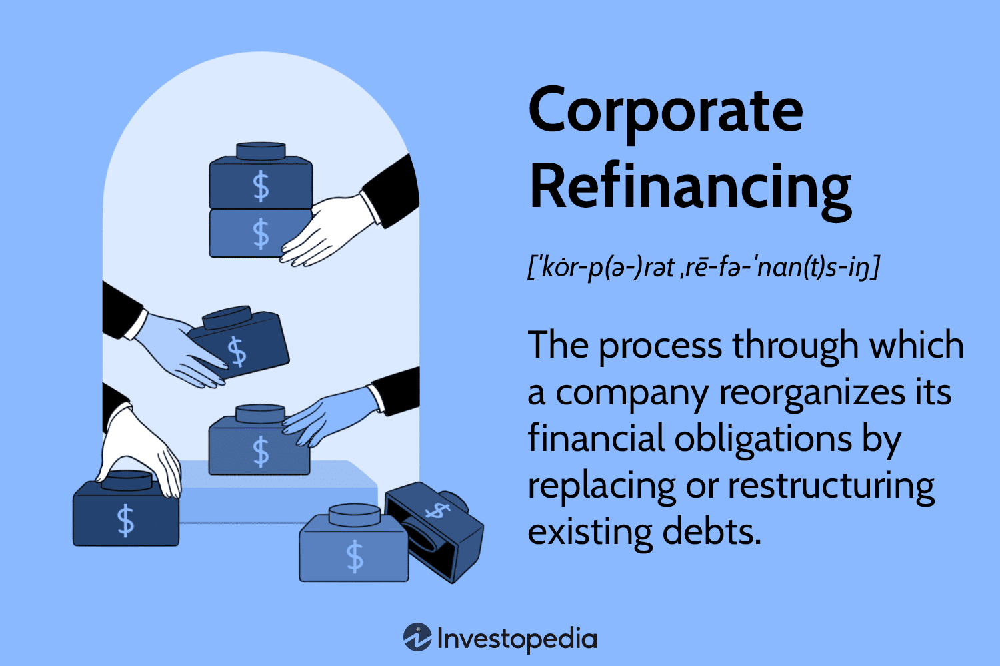

Debt restructuring, financial management, corporate refinancing, and algorithmic trading are pivotal elements in modern finance. These strategies are employed by corporations to enhance their financial health and promote sustainable growth. Debt restructuring involves adjusting the terms of existing debts to relieve financial pressure and ensure liquidity. Financial management encompasses planning and controlling financial resources to maximize profit and reduce costs. Corporate refinancing optimizes debt arrangements to secure better terms and conditions, while algorithmic trading leverages technology to execute high-speed financial transactions with efficiency and precision.

Each of these components plays a critical role in bolstering a company's financial strategy. Debt restructuring can provide a company with the breathing space needed to regain financial stability, while effective financial management aids in the strategic allocation of resources. Corporate refinancing can reduce interest expenses and improve cash flow, aiding long-term financial positioning. Algorithmic trading revolutionizes investment strategies, offering quicker and more data-driven decision-making processes.

Understanding how these financial strategies interconnect allows businesses to navigate complex financial landscapes efficiently. By integrating these elements into their operations, companies stand to solidify their market position, enhance financial resilience, and secure sustainable growth. This article outlines each of these processes, illustrating their strategic significance within corporate finance.

## Table of Contents

## Understanding Debt Restructuring

Debt restructuring is a critical strategy that involves reorganizing debt obligations to modify their terms, thereby alleviating financial stress. This process often entails negotiations between companies and their creditors aiming to adjust payment schedules or reduce interest rates. For instance, a company facing liquidity issues may renegotiate its debt terms to extend the duration of payments or to decrease the prevailing interest rate, providing immediate financial relief.

A primary objective of debt restructuring is to maintain liquidity, especially during periods of financial uncertainty or when a company confronts cash flow challenges. Liquidity, defined as the ability of a firm to meet its short-term obligations, is essential for ongoing operations and can be pivotal in averting insolvency.

Consider a company with a significant debt burden of $1,000,000 at an interest rate of 8% per annum, resulting in an annual interest payment of $80,000. By restructuring this debt to a new interest rate of 5%, the annual interest payment reduces to $50,000. This $30,000 reduction in annual interest expenses can significantly enhance the company's liquidity profile.

Successful debt restructuring not only restores financial stability but can also create new pathways for investment. Once a company stabilizes its financial status, it may find renewed opportunities for investments that were previously inaccessible due to fiscal constraints. This regained financial stability can be instrumental in driving long-term growth, as firms can reallocate resources towards strategic initiatives, capitalize on market opportunities, or enhance their competitive positioning.

Overall, debt restructuring is a powerful tool for companies seeking to navigate financial difficulties and enhance their fiscal resilience. It allows for the reallocation of financial resources and the stabilization of cash flows, ultimately supporting sustained growth and investment opportunities.

## Financial Management Strategies

Effective financial management is fundamental to any thriving business operation, entailing the meticulous planning, organizing, and controlling of financial activities aimed at maximizing profits while minimizing costs. Key strategies in financial management involve a suite of practices and analytical techniques critical for sustaining a company's long-term financial health.

**Budgeting** stands as a cornerstone of financial management, providing a structured framework for forecasting revenues and expenditures. By setting financial targets and allocating resources efficiently, businesses can anticipate potential shortfalls and surpluses, allowing for more agile decision-making. This proactive approach in managing finances helps in maintaining operational efficiency across various departments.

Another vital component is **risk management**, which involves identifying, assessing, and prioritizing risks to mitigate potential negative impacts on the business. Effective risk management ensures that companies can navigate uncertainties in market conditions, interest rates, and currency fluctuations. This typically involves creating risk models and using financial instruments to hedge against adverse developments. One common technique is the Value at Risk (VaR) model, which estimates potential losses in value of an asset or portfolio under normal market conditions over a set period.

**Financial analysis** is integral to understanding a company's financial performance and guiding future business decisions. This involves scrutinizing financial statements to assess profitability, liquidity, and solvency metrics. Ratios such as the Current Ratio, Return on Equity (ROE), and Debt-to-Equity Ratio are often used to provide insights into financial health and operational efficiency. For instance, the Current Ratio, calculated as:

$$
\text{Current Ratio} = \frac{\text{Current Assets}}{\text{Current Liabilities}}
$$

helps in assessing a company’s capability to meet its short-term obligations. Similarly, ROE provides insights into how efficiently a company uses shareholders' equity to generate profits:

$$
\text{ROE} = \frac{\text{Net Income}}{\text{Shareholders' Equity}}
$$

In the current digital age, leveraging data analytics and [machine learning](/wiki/machine-learning) can significantly enhance financial analysis capabilities, allowing for deeper insights and more accurate financial forecasts. Programming languages such as Python have facilitated this process with libraries like Pandas for data manipulation and Matplotlib for visualization. For example, Python code can automate the calculation of key financial ratios, providing real-time insights that inform strategic decisions.

The integration of financial management strategies is crucial for informed corporate refinancing and investment decisions. Careful analysis of financial data aids in identifying opportunities for refinancing existing debt under more favorable terms, ultimately supporting profitability and growth objectives. In conclusion, a robust financial management strategy enables businesses to navigate the complexities of modern financial landscapes effectively, ensuring sustainable growth and competitive advantage.

## Corporate Refinancing Explained

Corporate refinancing is an essential financial strategy employed by companies seeking to reorganize their existing debt obligations. This process allows organizations to achieve more favorable terms and conditions, which can significantly enhance their financial health and strategic flexibility. Refinancing typically aims to lower interest expenses by capitalizing on more favorable market conditions, thus reducing the cost of borrowing. Additionally, it can involve the extension of debt maturity dates, thereby improving a company's cash flow management by reducing the burden of near-term debt repayments.

The refinancing process begins with a comprehensive evaluation of a company's current debt structures and the prevailing market conditions. This assessment is crucial for identifying opportunities to optimize financial outcomes. Companies may consider various factors such as [interest rate](/wiki/interest-rate-trading-strategies) trends, inflation expectations, and their own credit ratings. Through this evaluation, organizations can determine whether refinancing would result in tangible benefits, such as cost savings or improved [liquidity](/wiki/liquidity-risk-premium) positions.

A strategic refinancing initiative can serve as a powerful tool to reinforce a company's financial standing. For instance, during periods of interest rate cuts, refinancing presents an opportunity to lock in lower borrowing costs. Similarly, if a company has recently experienced an improvement in its credit rating, it may obtain better terms from lenders, such as reduced interest rates or more flexible repayment schedules. Therefore, corporate refinancing can be aligned with broader financial strategies to strengthen an organization's balance sheet and support its long-term growth objectives.

In summary, corporate refinancing is not merely a tactical maneuver but a strategic decision that impacts multiple facets of a company's financial framework. By effectively managing existing liabilities and leveraging improved market conditions, companies can enhance their financial resilience and ensure sustainable growth.

## Algorithmic Trading in Finance

Algorithmic trading involves the use of complex mathematical models and automated systems to execute trades at speeds and frequencies that are beyond the capacity of humans. This technique relies on algorithms, which are sets of rules or instructions encoded in software, to make decisions about buying or selling financial securities in various markets, especially stock markets. The primary appeal of [algorithmic trading](/wiki/algorithmic-trading) is its ability to process vast amounts of data and execute trades swiftly, which is essential for taking advantage of small price discrepancies and trends that may only exist momentarily.

The process of algorithmic trading typically involves the following steps: market data collection, data analysis, signal generation, and trade execution. Algorithms can assess key variables such as price, [volume](/wiki/volume-trading-strategy), and timing to identify trading opportunities. They employ pre-defined criteria to trigger actions, often using a combination of historical data and statistical models to forecast market movements. For example, moving averages, a common algorithmic trading strategy, calculates the average of a security's price over a specified number of periods ($\text{MA}_t = \frac{1}{N} \sum_{i=0}^{N-1} P_{t-i}$), and makes buy/sell decisions based on whether the current price moves above or below this average.

Algorithmic trading significantly enhances market efficiency by ensuring that financial markets operate smoothly and fairly. These algorithms help maintain liquidity, as they are capable of executing large volumes of trades with minimal impact on stock prices. This efficiency helps in narrowing spreads and reduces transaction costs for all market participants, thereby facilitating better risk management and more effective investment strategies. 

Moreover, the application of sophisticated risk management techniques is enabled through algorithmic systems that can dynamically hedge positions based on real-time data. Portfolio managers utilize algorithms not only for executing trades but also for optimizing portfolios, adjusting asset allocations, and hedging against risk. Considerations like Sharpe ratio optimization or variance minimization ($\text{Minimize } (w^T\Sigma w) \text{ subject to } w^T\mu = \text{target return}$) become more manageable and precise with algorithmic assistance.

The transformative impact of algorithmic trading can be seen across various financial sectors, from equities to foreign exchange, commodities, and derivatives. As a result, businesses have had to rethink traditional methods of finance and investment. The shift toward automated, data-driven decision-making processes reflects a broader trend in finance toward leveraging technology to gain a competitive edge. As technology continues to evolve, algorithmic trading is poised to play an even more significant role in shaping financial markets and strategies.

## Integrating Debt Restructuring and Refinancing

Combining debt restructuring with refinancing strategies offers a multidimensional approach to enhancing a company’s financial health. By doing so, businesses can simultaneously mitigate financial stress and improve their debt profiles. 

Debt restructuring typically involves renegotiating the terms of existing debt agreements to alleviate financial pressure, such as modifying repayment schedules or lowering interest rates. This process provides immediate relief by improving cash flow and allowing companies to maintain liquidity, which is crucial during periods of financial strain or economic uncertainty.

Refinancing, on the other hand, is aimed at replacing existing debt with new debt that has more favorable terms. This could involve securing lower interest rates, extending the maturity of loans, or altering the currency denomination of the debt to suit current financial goals and economic conditions. Corporate refinancing can reduce interest expenses and improve cash flow management, thereby positioning companies strategically for future growth opportunities.

When integrated cohesively, these two financial strategies allow firms to manage existing liabilities more effectively. At the same time, they open avenues for new financing opportunities, which can be instrumental in supporting expansion projects, technological upgrades, or market diversification. For instance, by alleviating immediate financial burdens through restructuring, companies can then seek refinancing options under less pressure, enabling them to secure more advantageous terms.

Furthermore, this integration can enhance a firm's bargaining position with creditors by demonstrating proactive financial management practices. A company that has successfully managed its debt obligations through restructuring and selected optimal refinancing terms can potentially strengthen its credit profile, facilitating better access to future financing and fostering investor confidence.

Ultimately, the strategic alignment of debt restructuring and refinancing not only addresses present financial exigencies but also secures a stable platform for sustainable growth and increased financial resilience. As such, companies should consider these strategies as complementary components of a robust financial management framework.

## Challenges and Considerations

Refinancing and debt restructuring, although beneficial, pose several challenges that businesses need to navigate carefully. One of the primary challenges involves the costs associated with these financial strategies. These costs can include fees for legal and financial advisory services, potential penalties for early debt repayment, and the administrative expenses related to restructuring processes. Moreover, refinancing may involve upfront fees or origination fees, which can be substantial depending on the size and terms of the new debt arrangement.

Another significant consideration is the potential impact on a company's credit ratings. Both refinancing and restructuring can affect a firm's creditworthiness. For instance, while successful restructuring can improve a company's financial situation in the long term, the immediate effect might be viewed negatively by credit rating agencies, which could lower the credit rating temporarily. This decrease in credit ratings can increase the cost of borrowing and may limit access to additional credit facilities in the future.

Analyzing the market environment is vital before proceeding with refinancing or restructuring. Economic conditions, interest rates, and sector-specific trends can significantly influence the outcomes of these strategies. For instance, undertaking refinancing when interest rates are high may not yield the desired cost savings and could further strain the financial situation of the company.

Additionally, evaluating the company’s financial health is crucial. Firms must assess their cash flow projections, balance sheets, and operational efficiency to ensure that restructuring or refinancing will provide the expected benefits. This assessment helps in identifying whether the company will be able to meet new debt obligations without compromising operational stability.

To navigate the complexities and inherent risks, businesses should engage financial advisors and legal experts. These professionals offer valuable insights and guidance on structuring deals most advantageously. Financial advisors can assist in assessing feasibility and aligning the refinancing or restructuring plan with the company’s strategic objectives. Legal advisors, on the other hand, play a crucial role in ensuring compliance with relevant regulations and mitigating potential legal pitfalls.

The logistical aspects of executing these financial strategies can also be challenging. Coordinating with multiple creditors, restructuring terms without disrupting business operations, and ensuring transparent communication with stakeholders require meticulous planning and execution.

Overall, while refinancing and debt restructuring can provide strategic advantages, their implementation must be approached with caution. Companies should prepare comprehensively by analyzing costs, market conditions, and their financial position, and seek professional guidance to address any legal, logistical, or strategic challenges effectively.

## Conclusion

Debt restructuring, financial management, corporate refinancing, and algorithmic trading represent essential components of a robust corporate strategy. These elements collectively enable companies to fortify their financial resilience and promote sustainable growth. By implementing debt restructuring, enterprises can adjust debt obligations to enhance liquidity and maintain operational stability during financial uncertainties. Sound financial management practices, including budgeting and risk management, ensure the efficient allocation of resources, supporting informed decision-making and long-term profitability.

Corporate refinancing allows businesses to reorganize existing debts under more favorable terms, reducing interest expenses and improving cash flow management, thereby strengthening the company's financial position. Furthermore, algorithmic trading provides a technological edge by employing automated systems to execute trades at high speed and efficiency, facilitating better risk management and investment strategies.

Mastering these financial tools is vital for navigating the complexity of today's dynamic financial markets. Companies that adeptly integrate these components into their strategic framework can secure a competitive advantage, adapting swiftly to market changes and seizing emerging opportunities for expansion and innovation. In essence, these strategies lay the groundwork for enduring success in a continually evolving economic environment.

## References & Further Reading

[1]: ["Financial Management: Theory & Practice"](https://www.amazon.com/Financial-Management-Practice-Eugene-Brigham/dp/130563229X) by Eugene F. Brigham and Michael C. Ehrhardt

[2]: ["Algorithmic Trading: Winning Strategies and Their Rationale"](https://www.wiley.com/en-us/Algorithmic+Trading%3A+Winning+Strategies+and+Their+Rationale-p-9781118746912) by Ernest P. Chan

[3]: ["Advanced Financial Risk Management: Tools and Techniques for Integrated Credit Risk and Interest Rate Risk Management"](https://www.wiley.com/en-us/Advanced+Financial+Risk+Management%3A+Tools+and+Techniques+for+Integrated+Credit+Risk+and+Interest+Rate+Risk+Managements+-p-9780470821268) by Donald R. Van Deventer, Kenji Imai, and Mark Mesler

[4]: ["Valuation: Measuring and Managing the Value of Companies"](https://www.amazon.com/Valuation-Measuring-Managing-Companies-Finance/dp/1119610885) by McKinsey & Company Inc.

[5]: ["Principles of Corporate Finance"](https://www.wallstreetmojo.com/corporate-finance/) by Richard A. Brealey, Stewart C. Myers, and Franklin Allen