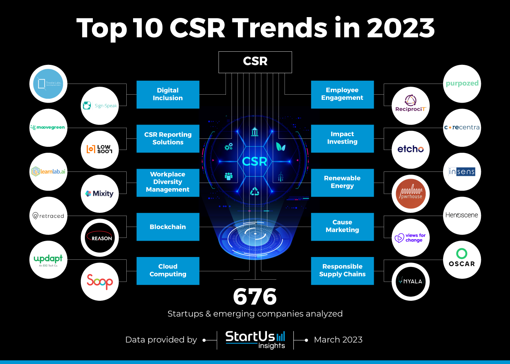

## Table of Contents

## What is Corporate Social Responsibility (CSR)?

Corporate Social Responsibility (CSR) is when a company decides to do good things for the world around it. It's not just about making money, but also about helping people and the planet. Companies can do this by being kind to the environment, treating their workers well, and helping out in the communities where they work.

CSR can take many forms. For example, a company might use less energy to help the environment, or they might give money to schools and hospitals. They might also make sure their factories are safe and that their workers are happy and healthy. By doing these things, companies show that they care about more than just their profits.

## Why is CSR important for businesses?

CSR is important for businesses because it helps them be seen as good members of society. When a company does good things for the environment and the community, people feel better about buying their products or services. This can make customers loyal and even attract new ones who want to support responsible companies. Plus, it can make employees proud to work there, which can help the company keep good workers and attract new talent.

Also, CSR can help a business in the long run. By taking care of the environment and treating people well, a company can avoid problems like bad publicity or legal issues. For example, if a company uses less energy, it might save money on bills and also help the planet. If it treats its workers well, it might avoid strikes or lawsuits. So, CSR can actually save money and prevent headaches for businesses, making it a smart choice for the future.

## What are some common CSR activities companies engage in?

Companies often do things like giving money to charities or helping out in their local communities. They might build schools or hospitals, or give money to help people who are poor or sick. They might also do things like planting trees or cleaning up trash to help the environment. These activities show that the company cares about more than just making money.

Another common CSR activity is making sure their factories and offices are safe and good places to work. Companies might give their workers fair pay, good health care, and safe working conditions. They might also try to use less energy or make less pollution, which helps the planet. By doing these things, companies show they care about their workers and the world around them.

Some companies also focus on being honest and fair in how they do business. They might make sure they don't bribe anyone or treat people unfairly. They might also be open about how they make their products and where their materials come from. This helps build trust with customers and shows that the company is responsible and ethical.

## How has the focus of CSR evolved over the years?

In the past, CSR was mostly about companies giving money to charities or doing nice things for the community. It was seen as something extra that companies did, not something they had to do. Companies would often talk about their CSR activities in their yearly reports to show they were good citizens, but it wasn't always a big part of their business plan. The focus was on helping others and making the company look good, but it wasn't always tied to the company's main goals.

Over time, the focus of CSR has changed a lot. Now, it's not just about giving money away; it's about making sure the company is responsible in everything it does. Companies are now expected to care about the environment, treat their workers well, and be honest in their business practices. CSR has become a key part of how companies plan for the future. They see it as a way to make their business stronger and more sustainable, not just a nice thing to do. This shift shows that people now expect companies to be good citizens in all areas of their work, not just in their charity work.

## What are the current trends in CSR for 2023?

In 2023, one big trend in CSR is focusing on the environment. Companies are trying harder to reduce their carbon footprint and fight climate change. They are using more renewable energy, like solar and wind power, and they are making their products in ways that are kinder to the planet. This is important because people are more worried about the environment now, and they want to buy from companies that care about the earth.

Another trend is about being fair and inclusive. Companies are working to make sure everyone is treated equally, no matter their race, gender, or where they come from. They are also trying to help their workers have a good work-life balance and feel happy and healthy at work. This is important because it helps companies keep good workers and make their customers feel good about supporting them.

A third trend is using technology to make CSR better. Companies are using data and new tools to track how well they are doing with their CSR goals. They can see where they need to improve and show people how they are making a difference. This helps build trust with customers and shows that the company is serious about being responsible.

## How do companies measure the impact of their CSR initiatives?

Companies measure the impact of their CSR initiatives by looking at different things. They might count how much money they have given to charities or how many trees they have planted. They can also ask people in the community if they feel the company is doing good things. Sometimes, companies use surveys or feedback forms to see if their workers are happy and if they feel the company is treating them well. By collecting this information, companies can see if their CSR efforts are working and where they can do better.

Another way companies measure CSR impact is by using special tools and software. These tools help them keep track of their environmental impact, like how much energy they use or how much waste they produce. Companies might also look at their business results to see if their CSR efforts are helping them make more money or attract more customers. By using these tools, companies can see the big picture of their CSR work and make smart decisions about what to do next.

## What role does technology play in modern CSR strategies?

Technology plays a big role in modern CSR strategies. It helps companies do their CSR work better and faster. For example, companies use special software to keep track of how much energy they use or how much waste they make. This helps them see where they can be kinder to the environment. Technology also helps companies talk to their customers and workers about their CSR efforts. They can use social media or apps to share what they are doing and get feedback from people.

Another way technology helps with CSR is by making it easier to measure the impact of CSR initiatives. Companies can use data and analytics tools to see if their efforts are working. They can look at numbers to see if they are using less energy or if more people are happy with their work. This helps companies know where they need to improve and how they can do better in the future. By using technology, companies can make sure their CSR work is effective and shows real results.

## How can CSR contribute to sustainable development goals?

CSR can help with sustainable development goals by making companies do good things for the world. These goals are like a list of things countries want to do to make the world a better place, like ending poverty, fighting climate change, and making sure everyone has good health care and education. When companies focus on CSR, they can help with these goals. For example, if a company uses less energy and makes less pollution, it helps fight climate change. If a company gives money to schools or hospitals, it helps make sure everyone can get education and health care.

CSR also helps companies work better with governments and other groups to reach these goals. Companies can join projects that help the community, like building wells for clean water or planting trees to make the air cleaner. By working together, they can make a bigger difference. Plus, when companies do good things, they can encourage other companies to do the same. This creates a cycle of good actions that can help reach the sustainable development goals faster. So, CSR is not just good for companies; it's good for the whole world.

## What are the challenges companies face when implementing CSR programs?

One big challenge companies face when implementing CSR programs is figuring out what to focus on. There are so many good things they could do, like helping the environment, treating workers well, or giving money to charities. It can be hard to decide which ones are most important and will make the biggest difference. Companies also need to make sure their CSR efforts fit with their main business goals. If they spend too much time and money on CSR, it might hurt their profits, which can make it hard to keep doing good things in the long run.

Another challenge is measuring the impact of CSR programs. It's not always easy to see if the company's efforts are really making a difference. For example, if a company plants trees, it might take years to see if it helps the environment. Companies need to use special tools and data to track their progress, but sometimes the results are not clear. They also need to tell people about what they are doing in a way that is honest and easy to understand. If people don't believe the company is really trying to help, it can hurt their reputation and make their CSR efforts less effective.

## How do global regulations influence CSR practices?

Global regulations play a big role in how companies do their CSR work. Governments around the world are making rules that say companies have to care about things like the environment and treating workers well. For example, some countries have laws that make companies report how much pollution they make or how they treat their workers. These rules push companies to do better with their CSR efforts because they have to follow the law. If they don't, they might get in trouble or have to pay fines.

These regulations also make it easier for companies to work together on big problems like climate change. When many countries have similar rules, companies can share ideas and work on projects that help the whole world. For example, if lots of countries have laws about reducing carbon emissions, companies can join together to find new ways to use less energy. This helps make their CSR efforts stronger and more effective. Global regulations show companies that CSR is not just a nice thing to do, but something they have to do to be part of the world economy.

## What advanced strategies can companies employ to enhance their CSR impact?

Companies can use smart technology to make their CSR work better. They can use special software to keep track of how much energy they use or how much waste they make. This helps them see where they can be kinder to the environment. They can also use data and analytics tools to see if their efforts are working. For example, they can look at numbers to see if they are using less energy or if more people are happy with their work. By using technology, companies can make sure their CSR work is effective and shows real results.

Another way companies can enhance their CSR impact is by working with other groups. They can join projects with governments, non-profits, and other companies to make a bigger difference. For example, they can work together to build schools or hospitals in poor areas or to plant trees to help the environment. By working together, they can share ideas and resources, which makes their CSR efforts stronger. Plus, when companies work with others, they show they are serious about making the world a better place, which can make people trust them more.

## How can companies integrate CSR into their core business strategy for long-term success?

Companies can make CSR a big part of their main business plan by thinking about it from the start. They can set goals for CSR that go along with what they want to achieve in their business. For example, if a company wants to grow, it can also aim to help the environment or treat its workers well. By making CSR part of their main plan, companies can make sure they are doing good things while also making money. This helps them stay successful in the long run because people will trust them more and want to buy from them.

Another way companies can integrate CSR into their core business strategy is by making it a part of their everyday work. They can train their workers to think about CSR in everything they do, from how they make products to how they sell them. Companies can also use special tools and software to keep track of their CSR efforts and see if they are working. By doing this, they can make sure they are always improving and making a positive impact. This not only helps the world but also makes the company stronger and more respected, which is good for long-term success.

## References & Further Reading

[1]: Lopez de Prado, M. (2018). ["Advances in Financial Machine Learning."](https://www.amazon.com/Advances-Financial-Machine-Learning-Marcos/dp/1119482089) Wiley.

[2]: Jansen, S. (2020). ["Machine Learning for Algorithmic Trading: Predictive models to extract signals from market and alternative data for systematic trading strategies with Python."](https://www.amazon.com/Machine-Learning-Algorithmic-Trading-alternative/dp/1839217715) Packt Publishing.

[3]: Carroll, A. B., & Buchholtz, A. K. (2006). ["Business & Society: Ethics and Stakeholder Management."](https://www.amazon.com/Business-Society-Sustainability-Stakeholder-Management/dp/1285734297) Cengage Learning.

[4]: Crane, A., Matten, D., & Spence, L. J. (2019). ["Corporate Social Responsibility: Readings and Cases in Global Context."](https://papers.ssrn.com/sol3/papers.cfm?abstract_id=2322817) Routledge.

[5]: Rangan, V. K., Chase, L., & Karim, S. (2015). ["The Truth About CSR."](https://hbr.org/2015/01/the-truth-about-csr) Harvard Business Review. 

[6]: Chan, E. P. (2008). ["Quantitative Trading: How to Build Your Own Algorithmic Trading Business."](https://github.com/ftvision/quant_trading_echan_book) Wiley.

[7]: Aronson, D. R. (2007). ["Evidence-Based Technical Analysis: Applying the Scientific Method and Statistical Inference to Trading Signals."](https://onlinelibrary.wiley.com/doi/book/10.1002/9781118268315) Wiley.