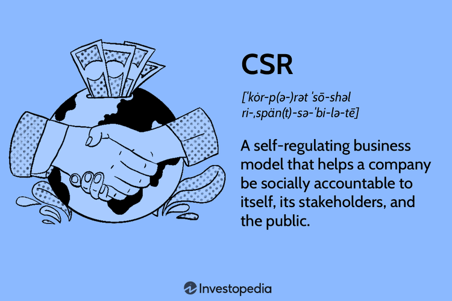

In an era where business operations and ethical considerations are increasingly intertwined, Corporate Social Responsibility (CSR) and Business Ethics have become integral to strategic corporate management. As companies face growing pressure from consumers, investors, and regulatory bodies to act responsibly, these concepts form the foundation for long-term sustainable business practices.

Corporate Social Responsibility is a model that encourages organizations to contribute positively to society while remaining accountable to their stakeholders. CSR goes beyond profit-making to include concerns for environmental sustainability, ethical labor practices, community engagement, and governance. By aligning corporate values with societal expectations, businesses can enhance their reputations and ensure operational congruity with the communities they serve.

Business Ethics, on the other hand, serve as a compass guiding corporate conduct with principles such as transparency, fairness, and accountability. These ethics foster an environment in which companies can thrive sustainably, balancing the interests of various stakeholders including employees, customers, and shareholders. Ethical business practices not only support CSR initiatives but also play a critical role in establishing a robust framework for corporate decision-making processes.

The intersection of CSR and ethical business practices with modern financial strategies is particularly significant in Algorithmic Trading (Algo Trading). Algo Trading uses sophisticated algorithms to execute trades at unprecedented speeds and volumes, raising specific ethical considerations. These include questions of transparency in algorithmic design, equitable access to trading technologies, and the overall impact on market stability. 

Understanding the nuances of CSR and business ethics can illuminate their implications for businesses engaged in algo trading, paving the way for responsible investment strategies that prioritize market integrity and societal welfare. This article will unravel the complexities of CSR, classify its types, and assess its impact on businesses, particularly those within the fast-paced world of algorithmic trading, outlining how these principles can guide companies toward sustainable financial ecosystems.

## Table of Contents

## Understanding CSR in Business

Corporate Social Responsibility (CSR) is a concept where businesses integrate social and environmental concerns into their operations and interactions with stakeholders. It serves as a guiding framework that encourages companies not only to pursue profit but also to consider the broader impact they have on society. This dual focus on financial success and social accountability forms the backbone of CSR.

CSR encompasses several dimensions, including environmental, ethical, philanthropic, and economic responsibilities. Environmental responsibility refers to the commitment of companies to reduce their ecological footprint. This could involve adopting sustainable practices like reducing waste, minimizing emissions, and using renewable resources. Ethical responsibility involves conducting business in a manner that is fair and ethical, ensuring transparency and integrity in all dealings. Philanthropic responsibility reflects a company’s willingness to contribute to societal well-being, often through charitable donations and community involvement. Economic responsibility, while aiming for profitability, also considers the economic impact the company has on its stakeholders, including fair employee compensation and responsible pricing strategies.

Engagement in CSR has tangible benefits for companies. One of the most significant advantages is the enhancement of brand reputation. By demonstrating a commitment to ethical practices and societal welfare, businesses can differentiate themselves from competitors, making them more attractive to consumers who value corporate responsibility. Studies have shown that consumers are increasingly inclined to support businesses perceived as ethical and socially responsible.

Moreover, CSR alignment can foster stronger stakeholder relationships, as it reflects a company's commitment to values that resonate with the public and investors alike. This alignment can enhance trust and loyalty, serving as a foundation for long-term business success. Companies that effectively implement CSR strategies often experience heightened employee satisfaction as well, because employees tend to feel more engaged and motivated when their work aligns with their personal values and contributes to the greater good.

In conclusion, CSR is more than a business strategy; it is a commitment to sustainable and ethical practices that benefit not only the company but also society and the environment at large. By fostering a balance between profit and responsibility, businesses can achieve long-term success and contribute to the welfare of future generations.

## The Role of Business Ethics

Business ethics are integral to guiding corporate conduct, rooted in principles of transparency, fairness, and accountability. These principles ensure that businesses operate in a manner consistent with societal expectations, fostering trust and integrity both internally and externally.

The role of business ethics in promoting sustainable operations cannot be overstated. Ethical business practices underpin efforts to develop long-term strategies that are not only profitable but also environmentally and socially responsible. By embedding ethical considerations into their core operations, companies can anticipate challenges, mitigate risks, and seize opportunities that align with sustainable development goals.

Business ethics significantly influence a company's Corporate Social Responsibility (CSR) initiatives. CSR is largely driven by the ethical obligations of a business towards its stakeholders, encompassing consumers, employees, suppliers, and the broader community. Ethical business practices ensure that CSR programs are authentic and effectively align with a company's values and objectives, enhancing their credibility and impact.

Several key ethical theories provide a framework for making decisions within business contexts:

1. **Consequentialism**: This theory emphasizes the outcomes of actions. In a business setting, this translates to practices that achieve positive results for all stakeholders. Companies may evaluate the consequences of their operational decisions on the community and environment, making adjustments to promote beneficial outcomes.

2. **Deontology**: This approach is principle-based and focuses on the inherent morality of actions rather than their consequences. Within businesses, deontological ethics guide adherence to duties and obligations, such as fairness in employee treatment and honesty in advertising.

3. **Virtue Ethics**: This theory centers on the character and virtues of individuals. In a corporate context, it highlights the importance of fostering a culture where ethical behavior is encouraged and rewarded. Employees feel empowered to act ethically when the organization consistently promotes virtues like honesty, courage, and respect.

4. **Justice and Fairness**: This perspective examines how benefits and burdens are distributed among society's members. Businesses driven by justice prioritize equitable resource distribution, fair treatment of stakeholders, and unbiased decision-making processes.

By leveraging these ethical theories, businesses can develop robust frameworks for ethical decision-making, ensuring that their operational strategies are aligned with both internal values and external societal expectations. This alignment bolsters a company's reputation, drives competitive advantage, and supports long-term sustainability. Businesses can thus harness ethics not merely as a compliance tool but as a transformative strategy that actively contributes to their CSR objectives and overall mission.

## Types of CSR

Corporate Social Responsibility (CSR) is commonly classified into four primary categories: environmental, ethical, philanthropic, and financial responsibility. Each category emphasizes different facets of responsible business practices, encouraging companies to develop well-rounded strategies that positively impact society and the environment.

**Environmental Responsibility** focuses on the sustainable management of natural resources and reducing a company's ecological footprint. This includes actions to minimize pollution, conserve energy, and manage waste effectively. Companies might invest in renewable energy projects, utilize eco-friendly materials, and adopt energy-efficient practices. These actions not only help in reducing environmental degradation but often lead to cost savings in the long term by improving operational efficiencies.

**Ethical Responsibility** emphasizes the importance of ethical business practices and integrity in corporate conduct. This encompasses fair labor practices, transparent operations, and respect for human rights. Ethical responsibility ensures that a company’s activities do not exploit individuals or communities and adhere to laws and international standards. Policies might include fair wage practices, promoting diversity and inclusivity, and implementing strict anti-corruption measures, thereby fostering trust and loyalty among consumers and employees.

**Philanthropic Responsibility** involves companies actively participating in social causes and contributing to the welfare of society. This form of CSR encourages businesses to allocate resources—such as time, money, or expertise—to support community initiatives, education, and charitable organizations. Philanthropic activities can range from sponsoring local events to substantial donations to causes like health, education, or poverty alleviation.

**Financial Responsibility**, sometimes referred to as economic responsibility, revolves around the idea of conducting business in a manner that is profitable while also providing economic value to society. This involves balancing stakeholder interests, sustainable financial growth, and reinvesting in local communities and economies. Financially responsible companies ensure their operations are profitable over the long term, reducing the risk of financial mismanagement that could harm employees, shareholders, and the broader economy.

Understanding these types of CSR is vital for businesses aiming to craft comprehensive strategies that align with their core values and missions. By recognizing their unique strengths and challenges in each category, companies can tailor their CSR initiatives to achieve meaningful and sustainable outcomes for both business and society.

## Benefits of Implementing CSR Strategies

Corporate Social Responsibility (CSR) strategies offer several tangible benefits for businesses beyond fulfilling ethical obligations. By weaving CSR into their operational fabric, companies can enhance market valuation and uplift brand recognition, positioning themselves as leaders in responsible business practices.

Firstly, CSR initiatives have a direct impact on market valuation. Companies demonstrating responsibility towards environmental, social, and governance ([ESG](/wiki/esg-investing)) criteria are increasingly favored by investors. This preference is reflected in the rising trend of sustainable investing, where investors prioritize businesses with strong CSR commitments. The correlation between CSR activities and share price appreciation underscores the importance investors place on responsible business conduct in their investment decisions.

Enhanced brand recognition is another significant benefit of CSR. Consumers today are more conscious of the ethical practices of the brands they support. Companies with well-publicized CSR initiatives are perceived as trustworthy and socially responsible, which fosters customer loyalty. This positive perception can translate into increased sales and market share, as consumers are more likely to support brands that align with their values.

Risk mitigation is a crucial advantage of CSR strategies. Ethical business practices embedded within CSR help prevent legal disputes and reputational damage associated with non-compliance and unethical conduct. By adhering to CSR principles, companies can minimize the risk of regulatory fines and sanctions, safeguarding their financial stability and long-term viability.

Internally, CSR has profound effects on employee satisfaction and retention. Employees are increasingly seeking to work for companies that reflect their values and contribute positively to society. By implementing CSR initiatives, companies create a sense of purpose and belonging among employees, fostering a positive work culture. This alignment of corporate and personal values enhances employee morale, leading to increased productivity and reduced turnover rates. A lower turnover rate directly translates to cost savings related to recruitment and training, further benefiting the company's bottom line.

In conclusion, CSR strategies offer multifaceted benefits that span financial performance, brand reputation, risk management, and workforce satisfaction. By investing in CSR, companies not only fulfill societal expectations but also drive sustainable business growth.

## CSR in the Context of Algo Trading

Algorithmic trading, commonly known as algo trading, utilizes complex algorithms to automate and execute trades at significantly high speeds and volumes. While this approach offers numerous advantages such as increased efficiency and reduced transaction costs, it also presents distinctive Corporate Social Responsibility (CSR) challenges and opportunities.

One major ethical consideration in algo trading is the transparency of algorithms. Transparency is fundamental to ensuring that the algorithms used are not only effective but also align with ethical standards. Lack of transparency can lead to manipulation and unfair practices, undermining trust in financial markets. To address this, companies involved in algo trading must prioritize clear and open communication about the algorithms' design, capabilities, and performance metrics. This transparency ensures that stakeholders understand the methodologies behind trading decisions.

Another significant aspect of CSR in algo trading is the equitable access to trading technology. The rapid advancement of [algorithmic trading](/wiki/algorithmic-trading) technologies can exacerbate inequalities between large financial institutions and smaller market participants. Ensuring fair access to cutting-edge trading technologies is essential in promoting market inclusivity and preventing the concentration of market power in the hands of a few. This can be achieved through policies that favor democratization of financial technologies and provide smaller entities with the necessary tools to compete.

The impact of algorithmic trading on market stability is also a vital CSR consideration. High-frequency trading, a subset of algo trading, can contribute to increased market [volatility](/wiki/volatility-trading-strategies) and the risk of flash crashes—sudden, severe drops in market prices within extremely short timeframes. Companies practicing algo trading must incorporate risk management strategies in their CSR policies to mitigate potential destabilizing effects on markets. This involves implementing algorithms designed to bolster market stability rather than contribute to erratic price swings.

The integration of CSR principles into algo trading can foster more responsible investment strategies and lead to the development of sustainable financial markets. By adhering to ethical guidelines and implementing transparent and inclusive practices, companies can enhance market integrity and investor confidence. Furthermore, aligning algo trading with CSR goals supports long-term economic stability and growth.

In conclusion, while algorithmic trading introduces unique CSR challenges, it also offers opportunities for cultivating responsible and sustainable financial practices. By prioritizing transparency, equitable technology access, and market stability, firms can effectively integrate CSR into their algo trading operations, ultimately contributing to a more ethical and balanced financial ecosystem.

## Case Studies: CSR in Action

Leading companies such as Starbucks and General Motors have become exemplars of Corporate Social Responsibility (CSR) integrated into their core operations, reflecting a significant positive impact on society and serving as benchmarks for industry-wide best practices.

Starbucks is renowned for its comprehensive CSR approach which emphasizes environmental stewardship, ethical sourcing, and community involvement. The company has committed to reducing its carbon footprint through strategic initiatives such as energy-efficient store designs and investment in renewable energy. For instance, Starbucks aims to store more carbon than it emits, eliminate waste, and conserve water by 2030[^1^]. Furthermore, it has developed ethical sourcing guidelines for its coffee supply chain, ensuring fair trade practices and improving the livelihoods of farmers. Starbucks' partnership with Conservation International exemplifies its commitment to fostering sustainable coffee production.

General Motors (GM) illustrates another robust CSR model focusing on sustainability and community empowerment. GM has made strides in reducing its environmental impact by committing to an all-electric vehicle future. The company aims to achieve carbon neutrality in its global products and operations by 2040, significantly reducing emissions associated with traditional combustion engines[^2^]. Additionally, GM invests in initiatives that promote diversity, equity, and inclusion within its workforce and the wider community, recognizing the social dimensions of CSR.

Examining these case studies reveals effective practices that other businesses can adopt. For both companies, embedding CSR into business strategy aligns with long-term sustainability goals. The commitment goes beyond regulatory compliance, integrating environmental and social considerations into daily operations. Such an approach not only enhances brand reputation but also fosters customer loyalty and secures a competitive advantage.

By undertaking targeted CSR activities, Starbucks and GM have demonstrated that corporate citizenship can drive substantial societal benefits, from reducing environmental impact to promoting social equity. These examples illustrate the potential of CSR to shape industry standards and contribute to broader societal goals.

[^1^]: Starbucks - Environmental Impact [sustainability](https://www.starbucks.com/responsibility)
[^2^]: General Motors - Sustainability Initiatives [sustainability](https://www.gm.com/sustainability)

## Implementing CSR Strategies: A Roadmap

Assessing the current CSR landscape within an organization is a foundational step in identifying areas where improvements are necessary. This assessment involves a comprehensive evaluation of existing CSR activities, policies, and their impacts on stakeholders, as well as comparisons with industry benchmarks. By doing so, organizations can pinpoint strengths to leverage further and weaknesses that necessitate strategic intervention.

Developing a strategic CSR plan is a multifaceted process that demands diligent stakeholder engagement. Stakeholders encompass employees, customers, suppliers, community members, and shareholders, each bringing diverse perspectives and needs. Actively involving these groups in CSR planning ensures that initiatives not only align with organizational goals but also resonate with broader societal expectations. Collaborative dialogue with stakeholders can uncover unique insights into societal needs and potential partnership opportunities that can enhance CSR initiatives.

Setting measurable goals is crucial for the success of a CSR strategy. These goals should be defined with clarity and specificity, encompassing both short-term and long-term objectives. Tools such as the SMART criteria (Specific, Measurable, Achievable, Relevant, and Time-bound) can help structure these goals effectively. Clear metrics allow organizations to track their progress accurately, facilitating adjustments to strategies as required and ensuring that CSR efforts produce tangible benefits.

Continuous monitoring and evaluation form the backbone of sustainable CSR practices. Through regular reviews, organizations can assess the efficacy of their CSR activities, ensuring that they continue to align with both evolving stakeholder expectations and business objectives. Utilizing data analytics can greatly enhance this process, allowing for detailed insights into how CSR efforts impact various elements of the organization and community.

Organizations can leverage recognized standards like ISO 26000 to guide their CSR implementation. ISO 26000 provides guidelines on integrating social responsibility into an organization's values and practices. It covers core aspects such as human rights, labor practices, the environment, fair operating practices, consumer issues, and community involvement. Utilizing ISO 26000 helps ensure that CSR strategies are both comprehensive and aligned with international norms, enhancing credibility and fostering trust among stakeholders.

In summary, successful CSR implementation is not a one-time project but an ongoing journey of aligning business practices with societal goals. By systematically assessing the current landscape, engaging stakeholders, setting precise goals, and adhering to standards like ISO 26000, companies can construct effective CSR strategies that not only enhance their reputation but also contribute positively to society and the environment.

## Conclusion

Corporate Social Responsibility (CSR) and business ethics are fundamental to modern business strategy. These elements play a vital role in driving sustainable economic development by aligning corporate operations with societal needs and ethical standards. Such alignment not only fosters trust among stakeholders but also enhances a company's long-term success and sustainability.

For companies engaged in algorithmic trading (algo trading), the integration of CSR is particularly pertinent. Algorithmic trading, characterized by high-speed and high-[volume](/wiki/volume-trading-strategy) transactions, raises unique ethical considerations, including the potential for unequal access to technology and impacts on market stability. By embracing CSR, companies can navigate these challenges more responsibly. This involves ensuring algorithm transparency, promoting fair technology access, and considering the broader impacts on financial ecosystems.

Incorporating CSR in algo trading can balance profit motives with ethical standards, leading to more stable and equitable financial markets. This balance not only mitigates risks but also fosters a positive reputation, offering a competitive advantage in increasingly socially conscious markets.

The future of business success hinges on bridging profitability with responsibility. Companies adept at integrating CSR and business ethics into their core strategies will not only thrive economically but will also contribute positively to society. This approach not only ensures compliance with evolving regulatory standards but also aligns with the growing global emphasis on sustainability and ethical business practices. Ultimately, sustainable business practices reflect a commitment to the broader goals of economic development and societal well-being.

## References & Further Reading

[1]: Carroll, A. B., & Buchholtz, A. K. (2014). ["Business and Society: Ethics, Sustainability, and Stakeholder Management"](https://books.google.com/books/about/Business_Society_Ethics_Sustainability_S.html?id=TeLdDQAAQBAJ). Cengage Learning.

[2]: Porter, M. E., & Kramer, M. R. (2006). ["Strategy and Society: The Link Between Competitive Advantage and Corporate Social Responsibility"](https://www.emerald.com/insight/content/doi/10.1108/sd.2007.05623ead.006/full/html). Harvard Business Review, 84(12), 78-92.

[3]: Bendell, J. (2005). ["In Whose Name? The Accountability of Corporate Social Responsibility"](https://www.tandfonline.com/doi/full/10.1080/09614520500075813). Development in Practice, 15(3-4), 362-375.

[4]: Lopez de Prado, M. (2018). ["Advances in Financial Machine Learning"](https://www.amazon.com/Advances-Financial-Machine-Learning-Marcos/dp/1119482089). Wiley.

[5]: Zalesky, J., & Bennani, Y. (2017). ["Algorithmic Trading and the Impact on the Market"](https://www.sciencedirect.com/science/article/pii/S0957417422006479). Annals of Operations Research, 249(1-2), 127-141.

[6]: Friedman, M. (1970). ["The Social Responsibility of Business is to Increase Its Profits"](https://www.nytimes.com/1970/09/13/archives/a-friedman-doctrine-the-social-responsibility-of-business-is-to.html). The New York Times Magazine.