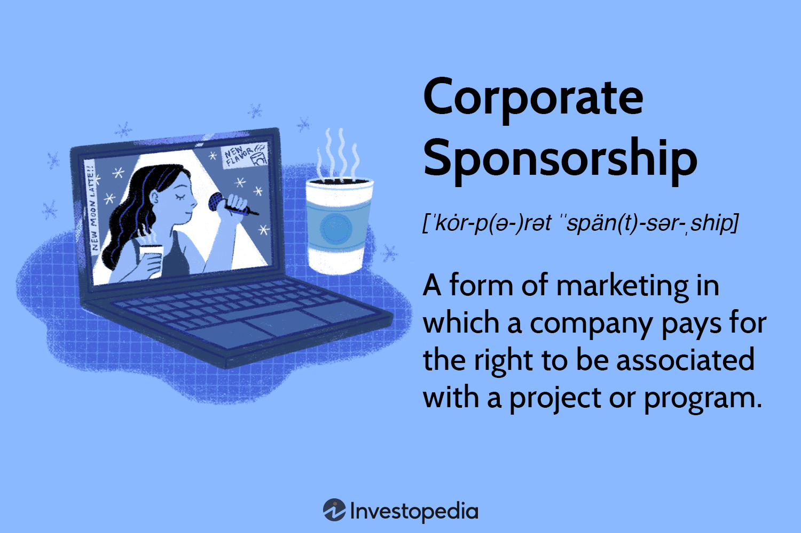

In today's corporate landscape, sponsorship serves as a critical marketing tool, enhancing brand visibility and extending a company's reach across diverse sectors. Corporate sponsorships offer the opportunity to reinforce brand identity while facilitating substantial financial and social contributions. These partnerships can be instrumental in aligning a brand with well-regarded events or causes, effectively employing the 'halo effect' to boost public perception and drive consumer engagement. However, sponsorship is not without its complexities, especially when intersecting with areas like algorithmic trading, where rapid technological advancements and volatile market dynamics introduce unique considerations. 

The convergence of corporate sponsorship with algorithmic trading highlights both opportunities and potential risks. Sponsorships in this context can aid trading firms in elevating their market presence and attracting investors through strategic alliances. However, such partnerships also expose sponsors to the inherent unpredictability of financial markets, where associations with trading firms may affect brand equity depending on market conditions and ethical practices.

This article examines both the benefits and potential pitfalls of corporate sponsorship, providing a comprehensive analysis tailored to contemporary business needs. By exploring the intersection of sponsorship and algorithmic trading, we aim to deliver crucial insights for businesses to enhance sponsorship effectiveness and mitigate associated risks.

## Table of Contents

## Understanding Corporate Sponsorship

Corporate sponsorship is a sophisticated marketing strategy in which a company allocates resources to be associated with a specific entity or event. This association is not merely about goodwill; it is a strategic transaction aimed at amplifying brand visibility and influence. Unlike philanthropy, where charitable motives predominate, sponsorship is more of a business arrangement where both parties expect a return on their investment.

This interaction often manifests as brand placement or promotional involvement in partnerships. These partnerships are commonly seen across various sectors, including sports, cultural events, or even financial trading platforms. For instance, when a company sponsors a sports team, its logo may be prominently displayed on team uniforms and at event venues, thereby capturing the attention of the team's fanbase.

A significant aspect of sponsorship is the leverage of the 'halo effect'. This concept refers to the transfer of positive perceptions from the sponsored entity to the sponsor's brand. For example, a brand associated with a highly esteemed cultural festival may benefit from the positive image and acceptance that the festival holds among its audience. This relationship can significantly enhance the sponsor's brand identity by capitalizing on the prestige or popularity of the sponsored event or entity.

Nonetheless, the success of this beneficial relationship hinges on strategic and demographic alignment between the sponsor and the sponsored entity. Both parties must ensure that their values, target audiences, and goals align to maximize the effectiveness of the sponsorship. A mismatched partnership might not only fail to deliver desired results but could also pose risks such as brand dilution or negative public perception.

In conclusion, corporate sponsorship is a powerful tool for enhancing brand visibility and establishing strategic alliances. However, it requires careful planning and alignment to unleash its full potential while minimizing accompanying risks.

## Benefits of Corporate Sponsorship

Corporate sponsorship is a powerful tool that can significantly enhance a company's brand visibility and reputation, primarily by aligning with popular or socially conscious causes. For example, when a company sponsors an environmental campaign or a charitable event, it not only promotes its brand but also signals its commitment to social responsibility. This alignment can strengthen the public perception of the brand, making it more relatable and trustworthy in the eyes of consumers.

One of the key advantages of corporate sponsorship is its potential to generate substantial returns on investment (ROI). Sponsorships often lead to increased consumer engagement, which can foster brand loyalty. When consumers perceive a brand as supporting causes they care about, they are more inclined to buy its products and services, leading to higher sales and profit margins. Metrics such as customer lifetime value (CLV) and customer acquisition cost (CAC) can be insightful in evaluating the financial impact of sponsorships.

Sponsorships also provide a unique platform for launching co-branded campaigns. These initiatives can simultaneously promote new products and support social causes, creating a win-win situation for the brand and the community. For example, a company might introduce a new product with a special edition linked to a cause, where a portion of the sales proceeds go to a charitable fund. This type of campaign appeals to socially conscious consumers and enhances the brand's image as a proactive and caring entity.

Effectively engaging target demographics is another benefit of corporate sponsorship. By associating a brand with events or entities that resonate with their audience, companies can reach their desired demographic more effectively. For instance, sponsoring a major sporting event or music festival that draws a specific crowd allows brands to directly interact with potential customers in a relevant setting, enhancing engagement and recall.

Lastly, corporate sponsorship facilitates networking opportunities and the building of business relationships, paving the way for future collaborations. By entering sponsorship agreements, companies often find themselves interacting with other influential businesses and individuals. These interactions can lead to the development of partnerships that extend beyond the initial scope of the sponsorship, fostering collaborative projects and innovations that can propel both parties forward.

In summary, corporate sponsorship is a multifaceted strategy that enhances brand visibility and reputation, provides a solid ROI through consumer engagement, and opens new avenues for product promotions. It also effectively targets key demographics and creates valuable networking opportunities, underscoring its importance in strategic brand management.

## Risks Associated with Corporate Sponsorship

Corporate sponsorships, while offering significant benefits, [carry](/wiki/carry-trading) inherent risks that organizations must carefully manage. A primary concern is reputational risk, which occurs when the sponsored entity encounters a controversy or public backlash. This negative perception, whether justified or not, can directly impact the sponsoring company's brand image. A high-profile example of this is when major sponsors withdrew support from athletes or events involved in scandals, to protect their reputational interests.

The dependency on the performance and image of the sponsored entity also introduces financial risks. Companies may experience losses if the sponsored party fails to meet expectations or if the association does not yield the anticipated promotional value. This reliance underscores the importance of strategic alignment and thorough vetting processes in sponsorship decisions.

Conflicts over creative or operational control between sponsors and sponsored parties present another risk. Disagreements on marketing strategies, event management, or brand usage can strain relationships, potentially leading to underperformance of the sponsorship agreement or premature termination. Clear communication and well-defined contractual terms are essential to mitigate such conflicts.

Ambush marketing poses a unique challenge, where rival companies attempt to associate themselves with an event without paying sponsorship fees, thereby diluting the value of formal sponsorships. This practice can confuse consumers and reduce the exclusivity and effectiveness of a sponsorship deal. Preventive measures include securing intellectual property rights and implementing robust protective clauses in sponsorship agreements.

Legal and compliance issues are especially pertinent in international sponsorships. Navigating the varied legal landscapes, cultural nuances, and regulatory requirements of different countries adds complexity to sponsorship arrangements. Failure to comply with local laws can result in legal penalties, damaging both financial standing and reputation. To address these risks, companies should invest in comprehensive legal counsel and maintain an up-to-date understanding of international regulations.

## Sponsorship in Algorithmic Trading

Algorithmic trading represents a technology-driven financial strategy that relies on advanced algorithms to execute trades at speeds and frequencies beyond human capabilities. In this competitive field, strategic sponsorships play a significant role in enhancing the profile and operations of trading firms. Sponsorships can bolster a firm's brand credibility by showcasing their associations with established corporate entities, thus attracting discerning investors. These alliances are invaluable, offering firms access to emerging tools, sophisticated technologies, and critical insights necessary for maintaining competitive advantages in a constantly evolving market.

For instance, collaborating with a technology partner through sponsorship can provide [algorithmic trading](/wiki/algorithmic-trading) firms with state-of-the-art software solutions, thereby optimizing trading performance and operational efficiency. This alignment not only strengthens the firm's technological backbone but also fosters innovation, crucial for thriving in a sector marked by rapid advancements.

However, risks are inherent in these sponsorships, primarily due to the volatile nature of financial markets. The swift and often unpredictable market fluctuations can adversely affect the public perception of brands linked to algorithmic trading. A downturn in market conditions, or association with a firm experiencing financial distress, can lead to negative repercussions for the sponsors' reputations. Furthermore, any mismanagement or ethical violations by the trading firm can cast an unfavorable light on sponsors, thereby endangering their brand equity.

For example, if a sponsored trading firm engages in unethical practices or experiences a significant trading misstep, the negative publicity could extend to associated sponsors, impacting their public image. This underscores the importance of sponsors carefully vetting potential partnerships to ensure alignment with their values and reputational standards.

In conclusion, while sponsorships in algorithmic trading offer substantial benefits, including enhanced credibility and technological access, sponsors must navigate these opportunities cautiously. Accurate assessment and management of associated risks are crucial to safeguarding brand integrity and realizing the potential of strategic collaborations.

## Mitigating Sponsorship Risks

Mitigating the risks associated with corporate sponsorship requires a structured approach encompassing due diligence, strategic agreements, constant monitoring, crisis management, and data-driven evaluation.

Conducting thorough due diligence is the cornerstone of understanding both the potential benefits and inherent risks of any sponsorship arrangement. This process involves a comprehensive assessment of the sponsored entity's market position, reputation, and historical context. Due diligence also extends to evaluating the legal, financial, and ethical frameworks within which the entity operates. This ensures that the sponsoring company aligns itself with partners that reflect its values and objectives. 

Drafting clear sponsorship agreements is essential for safeguarding interests. Such agreements should include reputation management clauses that define the responsibilities and expectations of each party. Additionally, contingency plans must be incorporated to address potential reputational damage or financial losses. These legally binding documents should reflect shared objectives, delineate control over creative outputs, and outline procedures for terminating the partnership under specified conditions.

Regular monitoring of the sponsored entity is imperative for timely identification of any emerging issues or shifts in public perception. This involves keeping a close watch on public relations, media coverage, and consumer feedback. Tools such as sentiment analysis and social listening platforms can facilitate this process by providing real-time insights into public opinion. Through ongoing surveillance, sponsors can be proactive in managing their brand’s image and swiftly address unfavorable developments.

Developing a robust crisis management strategy is crucial for quickly addressing any fallout from negative sponsorship scenarios. This strategy should include a predefined communication plan outlining the roles and actions required at various stages of a crisis. Companies need to ensure that spokespersons are prepared to engage with stakeholders transparently and authentically, thus maintaining trust and credibility during turbulent times.

Leveraging data analytics is instrumental in continuously evaluating the effectiveness of sponsorship activities. Organizations can apply advanced data tools to assess engagement metrics, conversion rates, and brand sentiment. By analyzing this data, sponsors can adjust their strategies to optimize their return on investment. The integration of [machine learning](/wiki/machine-learning) algorithms enables the prediction of future trends and potential risks, allowing for more informed decision-making. 

In conclusion, by implementing these strategic measures, companies can effectively manage the complexities of sponsorship and harness its full potential to bolster their brand while minimizing exposure to adverse outcomes.

## Conclusion

Corporate sponsorship stands as a dynamic tool that offers significant opportunities when aligned and managed effectively. Its dual nature as both a marketing asset and a potential risk requires businesses to approach sponsorships with strategic foresight. By thoroughly understanding the benefits and risks, companies can formulate sponsorship strategies that are not only resilient but also adaptable to changing circumstances.

In the context of algorithmic trading, sponsorships have the potential to transcend traditional marketing functions by enhancing operational capabilities and enriching brand perception. They provide a gateway to innovative tools and partnerships that can drive competitive advantage. However, the inherently volatile nature of financial markets underscores the necessity for sponsors to anticipate and navigate potential challenges. Sponsorships in this sector necessitate an awareness of both market dynamics and ethical considerations to mitigate the risk of negative associations.

Ultimately, the success of sponsorship initiatives across any sector hinges on meticulous planning and strategic alignment. Businesses must ensure that their sponsorship activities reflect their brand values and objectives, while also implementing rigorous management practices. By maintaining a proactive approach, companies can leverage sponsorships to foster growth, strengthen brand identity, and build enduring business relationships.

## References & Further Reading

[1]: Walliser, B., Roschk, H., & Carrillat, F. A. (2008). "[A School of Thought Perspective on the Impact of Sponsorship: Influence of Social Identification and Participation on a Sponsor's Image](https://www.scirp.org/reference/referencespapers?referenceid=2198954)." Journal of Business Research.

[2]: Tripathi, A. (2021). "[Corporate Sponsorship as a Marketing Tool: Benefits and Challenges](https://pmc.ncbi.nlm.nih.gov/articles/PMC8200548/)." Journal of Marketing and Management, Vol. 12, No. 2, 2021, pp. 45-60.

[3]: Stock, H., & Watson, S. (2003). "Introduction to Econometrics." Pearson. [Chapter 14: Financial Markets and Fairness].

[4]: Handel, B. R., & Schwartzstein, J. (2018). "[Algorithmic Trading and Market Efficiency Informed Feedback](https://www.jstor.org/stable/26297974)." Journal of Economic Perspectives, 32(3), 75-97.

[5]: Stahmer, R., & Dimant, D. (2016). "Sponsorship Opportunities: The Intersection of Brand Management and Financial Markets." Harvard Business Review, [online]. Available at: [HBR](https://hbr.org/2016/06)

[6]: Lopez de Prado, M. (2018). ["Advances in Financial Machine Learning,"](https://www.amazon.com/Advances-Financial-Machine-Learning-Marcos/dp/1119482089) Wiley. 

[7]: Jansen, S. (2020). "[Machine Learning for Algorithmic Trading: Predictive Models to Extract Signals from Market and Alternative Data](https://github.com/stefan-jansen/machine-learning-for-trading)."