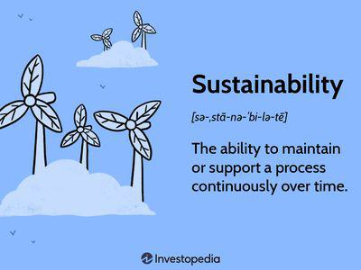

In today's business landscape, sustainability is not merely a buzzword but an essential strategic goal that aligns business operations with the broader needs of the world. As environmental and social concerns continue to escalate, the importance of corporate sustainability has surged to the forefront of business priorities. Companies are increasingly recognizing the necessity to incorporate sustainability into their core strategies, aiming for a balanced approach that includes environmental stewardship, social equity, and economic viability.

This article investigates the foundational elements of business sustainability and their significance in contemporary corporate strategies. A particular focus is placed on the role of algorithmic trading in advancing sustainable goals. Algorithmic trading, with its capability to process vast datasets efficiently, holds the potential to revolutionize sustainable investing by seamlessly integrating Environmental, Social, and Governance (ESG) criteria into trading decisions. This intersection of sustainability and innovative financial strategies not only aids in achieving better corporate responsibility but also enhances a company's competitive advantage in the market.



Understanding the broader implications of sustainability in business operations is crucial, especially when considering the potential of algorithmic trading and technology-driven approaches. By fostering a deeper integration of sustainability principles into financial strategies, businesses can work towards a more responsible and ethical future that benefits both society and the environment.

## Table of Contents

## Understanding Corporate Sustainability

Corporate sustainability is a strategic approach that prioritizes maintaining long-term environmental health, social well-being, and economic viability within business operations. This approach recognizes that businesses, while seeking profits, have an inherent responsibility to consider and mitigate their broader impact on the world. To this end, corporate sustainability is structured around three essential pillars: environmental, social, and economic.

The environmental pillar focuses on reducing the ecological footprint of businesses. This involves sustainable resource management, minimizing waste, and initiating green practices aimed at preserving natural ecosystems. A commitment to environmental sustainability requires companies to adopt practices that combat climate change, preserve biodiversity, and reduce emissions. Such practices not only safeguard natural resources but also enhance a company's reputation and compliance with regulatory standards.

The social pillar emphasizes corporate social responsibility (CSR), ensuring that businesses operate ethically and support community well-being. This includes promoting fair trade practices, ensuring employee welfare, enhancing community engagement, and fostering diversity and inclusion within workplaces. By prioritizing social sustainability, companies can build trust and loyalty among customers and employees, thereby securing long-term success through positive relationships and corporate citizenship.

The economic pillar, sometimes referred to as the governance pillar, involves the implementation of ethical economic practices and transparent governance frameworks. This includes financial performance, sustainable economic growth, and adherence to ethical standards and compliance. Businesses must operate with integrity, transparency, and accountability to promote sustainable economic practices, thereby ensuring their own viability while contributing positively to the economy.

These three pillars collectively provide a comprehensive framework for organizations to achieve a balance between profitability and sustainability, demonstrating that long-term success is intertwined with the well-being of the environment and society. Each pillar acts as a guide for businesses to not only focus on their financial bottom line but also to consider the broader impacts of their actions on the world.

## The Three Pillars of Sustainability

The concept of sustainability in business is fundamentally built on three interconnected pillars: environmental, social, and economic. Each of these pillars addresses distinct yet interrelated aspects that are crucial for achieving holistic and long-term sustainability objectives.

### Environmental Pillar
The Environmental Pillar prioritizes the reduction of ecological footprints through the adoption of sustainable practices and technologies. Businesses are increasingly focusing on sustainable resource management, which involves efficient use of natural resources to minimize waste and environmental impact. Waste reduction initiatives, such as recycling and composting, are common strategies employed to decrease the amount of waste sent to landfills. Furthermore, green initiatives that include renewable energy sources, such as solar and wind power, are essential components of this pillar. By implementing these practices, companies can mitigate their impact on climate change and contribute to the global effort to preserve the ecosystem.

### Social Pillar
The Social Pillar emphasizes corporate responsibility towards individuals and communities. It promotes the well-being of employees by ensuring fair labor practices, health and safety measures, and opportunities for professional development. Furthermore, businesses are encouraged to engage with and support their local communities, contributing to social cohesion and economic stability. Fair trade practices are an integral part of the social commitment, ensuring that suppliers, especially in developing countries, receive equitable compensation for their goods and services. This pillar acknowledges that companies operate within a broader social context and that their actions can have profound impacts on human lives.

### Economic Pillar
Often referred to as the governance pillar, the Economic Pillar underscores the importance of ethical and transparent business operations that ensure sustainable growth. It involves compliance with laws and regulations, as well as adherence to ethical standards in all business dealings. Corporate transparency in financial and non-financial reporting is essential to maintain stakeholder trust and confidence. This pillar also addresses the need for businesses to implement strategies that not only guarantee economic viability but also distribute economic benefits fairly among stakeholders. By focusing on ethical economic practices, businesses can achieve financial success while contributing to societal prosperity.

## Algorithmic Trading and Sustainability

Algorithmic trading represents the modern intersection of technology and financial markets, efficiently promoting sustainable investing by leveraging automated pre-programmed instructions. At its core, [algorithmic trading](/wiki/algorithmic-trading) utilizes sophisticated mathematical models and computer algorithms to execute trades at speeds and frequencies unimaginable to human traders.

The incorporation of Environmental, Social, and Governance ([ESG](/wiki/esg-investing)) criteria into trading strategies is transforming how investments are managed. ESG criteria are metrics used to evaluate a company's adherence to sustainable practices, where "E" refers to environmental considerations like energy use and waste management, "S" stands for social factors such as community impact and employee relations, and "G" denotes governance factors like board diversity and business ethics.

By integrating ESG data into algorithmic trading, traders can enhance the evaluation and selection process of stocks and other securities. Automated systems can process vast amounts of ESG data, which are often unstructured and complex, in ways that are efficient and accurate. Through [machine learning](/wiki/machine-learning) and natural language processing, algorithms can analyze sustainability reports, regulatory filings, and market sentiment to assess a company's sustainability practices.

Consider the following Python pseudocode illustrating the potential integration of ESG criteria into an algorithmic trading strategy:

```python
import random

class Stock:
    def __init__(self, name, environmental, social, governance):
        self.name = name
        self.environmental = environmental
        self.social = social
        self.governance = governance

def evaluate_stock(stock):
    # Simple algorithm to rate a stock based on ESG criteria
    esg_score = (0.3 * stock.environmental + 
                 0.3 * stock.social + 
                 0.4 * stock.governance)
    return esg_score

# Example stock data
stocks = [Stock("CompanyA", 70, 85, 90), Stock("CompanyB", 60, 65, 80)]

def select_sustainable_investments(stocks):
    sustainable_stocks = [stock for stock in stocks if evaluate_stock(stock) > 75]
    return sustainable_stocks

# Execution
chosen_stocks = select_sustainable_investments(stocks)
for stock in chosen_stocks:
    print(f"Selected {stock.name} with ESG Score: {evaluate_stock(stock)}")
```

This example shows a rudimentary model where stocks are evaluated based on weighted ESG scores, highlighting those meeting a desirable threshold. Such strategies exemplify how algorithmic trading can promote sustainable investing by prioritizing companies with solid sustainability commitments.

Importantly, algorithmic trading's unparalleled data processing capabilities allow for real-time responsiveness to market changes influenced by sustainability metrics. Additionally, these systems enable comprehensive [backtesting](/wiki/backtesting) of ESG-related strategies, helping investors understand potential risks and returns under different scenarios.

Overall, algorithmic trading empowers investors by providing tools to incorporate sustainability considerations effectively, aligning financial goals with broader environmental and social objectives.

## The Impact of Sustainability on Business

Businesses that prioritize sustainability can experience numerous advantages, impacting both their reputation and operational success. One of the primary benefits is the enhancement of public image. As consumers become more environmentally and socially conscious, they tend to favor companies that demonstrate genuine commitment to sustainable practices. This preference translates into increased customer loyalty, as customers are more likely to support businesses that align with their values. 

The shift towards sustainable practices can also lead to operational efficiencies. By implementing eco-friendly technologies and processes, businesses can reduce waste and resource consumption, leading to cost savings. For example, energy-efficient systems and waste reduction strategies often result in decreased utility bills and lower raw material costs. Such efficiencies can significantly enhance a company's competitiveness and profitability, as they allow businesses to reinvest savings into other areas of the organization.

Moreover, the alignment of sustainability with financial performance is increasingly supported by empirical evidence. Studies indicate that companies integrating environmental, social, and governance (ESG) criteria into their business strategies tend to outperform their peers in terms of stock market and accounting performance. This correlation can be attributed to the fact that sustainability-focused companies are often better equipped to manage risks and seize opportunities associated with global challenges, such as climate change and resource scarcity.

Furthermore, sustainable practices can enhance a company's ability to attract and retain top talent. Employees, especially millennials and Gen Z, increasingly seek employers with values that resonate with their personal beliefs, particularly regarding environmental and social responsibility. This alignment can lead to a more motivated and engaged workforce, further driving operational success.

In summary, sustainability is no longer a peripheral concern but a core strategic objective that can significantly influence a business's reputation, customer relationships, operational efficiencies, and financial performance. Embracing sustainability not only supports environmental and social goals but also serves as a crucial component in ensuring long-term viability and success in today's competitive marketplace.

## How to Implement a Sustainability Strategy

To achieve corporate sustainability, businesses must integrate the principles of people, planet, purpose, and profit, embedding them into their corporate culture. This multifaceted approach demands a strategic consolidation of goals, robust stakeholder engagement, and the incorporation of sustainable practices across every level of operations. 

**Establishing Clear Sustainability Goals**

The first step in implementing a sustainable strategy involves setting clear, actionable goals. These objectives should align with the broader vision of sustainability, addressing environmental impact, social responsibilities, and economic viability. Goals should be specific, measurable, achievable, relevant, and time-bound (SMART). For instance, a company might aim to reduce its carbon footprint by 30% over five years or achieve zero waste through recycling and reuse initiatives. Setting defined targets provides a roadmap and enables the organization to monitor progress effectively.

**Engaging Stakeholders**

Engagement with stakeholders is paramount, as sustainability is a collective responsibility. Stakeholders, including employees, customers, suppliers, investors, and community members, should be actively involved in the development and execution of sustainability strategies. This involvement ensures alignment of organizational objectives with societal expectations and enhances the credibility of corporate sustainability efforts. Regular communication channels, feedback mechanisms, and collaborative initiatives are necessary to foster transparency and trust.

**Incorporating Sustainable Practices Across Operations**

Integrating sustainability into business operations requires the adoption of practices that minimize environmental impact and promote social equity. This might include energy-efficient processes, sustainable supply chain management, and initiatives to enhance employee well-being. For example, businesses can implement energy-saving technologies, switch to renewable energy sources, or establish policies for ethical sourcing. Training programs can also educate employees about the importance of sustainability and their role in achieving corporate goals.

**Leveraging Technology and Data-Driven Strategies**

Advanced technologies, particularly AI and algorithmic trading, play a pivotal role in enhancing sustainability efforts. These technologies can process extensive datasets to provide insights into environmental impacts, resource use, and potential sustainability risks. For example, AI algorithms can analyze data to optimize energy consumption within facilities or assess the sustainability performance of different supply chain configurations. Moreover, data analytics can track and report on progress toward sustainability objectives, enabling real-time adjustments and informed decision-making.

Algorithmic trading, specifically, can be utilized to prioritize investments in companies with strong Environmental, Social, and Governance (ESG) credentials. Traders can program algorithms to identify investment opportunities that align with sustainability criteria, thereby supporting the transition towards a greener economy. Here is a simple Python example illustrating how an algorithm can incorporate ESG criteria into trading decisions:

```python
def select_investments(companies, esg_threshold):
    selected = []
    for company in companies:
        if company['esg_score'] >= esg_threshold:
            selected.append(company['name'])
    return selected

# Example use
companies = [
    {'name': 'Company A', 'esg_score': 75},
    {'name': 'Company B', 'esg_score': 60},
    {'name': 'Company C', 'esg_score': 80}
]

esg_threshold = 70
selected_companies = select_investments(companies, esg_threshold)
print("Selected companies for investment:", selected_companies)
```

The successful implementation of a sustainability strategy requires consistent evaluation and refinement. By incorporating a holistic approach that leverages technology, engages stakeholders, and adheres to well-defined goals, businesses can significantly bolster their sustainability initiatives, contributing to a more sustainable future for all.

## The Role of AI in Enhancing Sustainability

Artificial Intelligence (AI) has emerged as a powerful tool in advancing sustainability efforts. The ability of AI systems to process large volumes of data rapidly and accurately makes them invaluable for gaining insights into various sustainability domains, including environmental impact, resource efficiency, and social outcomes. By analyzing complex datasets, AI can enhance both the credibility and effectiveness of sustainability initiatives.

One of the key contributions of AI is its capacity to manage and interpret environmental data. For example, AI algorithms can analyze satellite imagery to monitor deforestation, track wildlife populations, or assess the impact of natural disasters. This real-time data allows organizations to respond swiftly to environmental changes, thereby minimizing adverse impacts. Furthermore, AI-driven models can calculate carbon footprints of organizations, helping them understand and mitigate their contributions to climate change.

Resource management is another critical area where AI plays a significant role. Predictive analytics, powered by machine learning, can optimize energy consumption in real-time. For example, smart grid systems use AI to balance load distribution and predict energy demand patterns, significantly increasing energy efficiency. In agriculture, AI technologies can optimize the use of water and fertilizers by predicting weather patterns and soil conditions, contributing to more sustainable farming practices.

AI also enhances social sustainability by improving workplace safety and equity. AI systems can analyze data from sensors worn by employees to detect risky behaviors or conditions, allowing for timely interventions that enhance worker safety. In addition, AI can help identify unconscious biases in recruitment processes or workplace interactions, promoting a more inclusive environment.

Machine learning models are particularly useful in predicting future sustainability risks. These models can incorporate historical data and current trends to forecast potential threats to sustainability, such as resource shortages, environmental degradation, or social unrest. This predictive power allows organizations to proactively adjust their strategies, ensuring alignment with long-term sustainability goals.

Here is an example Python code snippet using machine learning to predict energy consumption, a typical task relevant to optimizing resource use:

```python
import pandas as pd
from sklearn.model_selection import train_test_split
from sklearn.ensemble import RandomForestRegressor
from sklearn.metrics import mean_absolute_error

# Load dataset containing historical energy consumption data
data = pd.read_csv('energy_consumption.csv')

# Define features and target variable
X = data.drop('energy_usage', axis=1)
y = data['energy_usage']

# Split the data into training and testing sets
X_train, X_test, y_train, y_test = train_test_split(X, y, test_size=0.2, random_state=42)

# Initialize and train a Random Forest Regressor
model = RandomForestRegressor(n_estimators=100, random_state=42)
model.fit(X_train, y_train)

# Make predictions and evaluate the model
predictions = model.predict(X_test)
mae = mean_absolute_error(y_test, predictions)
print(f'Mean Absolute Error: {mae}')
```

This example demonstrates how AI can be implemented in practice to support sustainability by forecasting energy needs accurately, allowing for improved resource management.

In summary, AI is pivotal in enhancing sustainability by offering greater precision and depth in data analysis and predictions. It enables organizations to not only understand and mitigate current sustainability challenges but also anticipate future risks, fostering informed decision-making aligned with sustainable practices.

## Conclusion

The integration of sustainability into business operations is not only desirable but essential for achieving long-term success and resilience. Modern businesses face an increasingly complex array of challenges where environmental and social considerations play pivotal roles. As such, sustainability has moved beyond being a mere ethical choice to becoming a strategic imperative that can directly influence a company's bottom line.

Leveraging technology, specifically algorithmic trading and [artificial intelligence](/wiki/ai-artificial-intelligence) (AI), serves as a powerful means to meet dynamic sustainability goals. Algorithmic trading enables businesses to incorporate Environmental, Social, and Governance (ESG) criteria into trading strategies, ensuring investment decisions align with corporate sustainability initiatives. These automated systems have the capacity to process extensive datasets swiftly, analyzing various sustainability indices that aid investors in making informed decisions.

Similarly, AI offers businesses valuable tools to enhance their sustainability endeavors. With the ability to analyze large swaths of data, AI can deliver insights on aspects such as environmental impact and resource optimization. Machine learning models predictive of sustainability risks further empower companies to anticipate and mitigate potential issues, fostering informed decision-making that aligns with sustainable practices.

Overall, this integration of sustainability transcends traditional profit motives and emphasizes a broader understanding of success. Companies that embed these principles within their operational frameworks not only contribute to societal and environmental welfare but also position themselves as leaders in innovation and responsibility. This holistic approach paves the way for success that resonates beyond the corporate sphere, benefiting broader society and the global ecosystem.

## References & Further Reading

[1]: "Corporate Sustainability: Integrating Performance and Reporting" by Ann Brockett and Zabihollah Rezaee.

[2]: "Sustainable Investing: Revolutions in Theory and Practice" by Cary Krosinsky and Sophie Purdom.

[3]: "Algorithmic Trading and DMA: An Introduction to Direct Access Trading Strategies" by Barry Johnson.

[4]: "Responsible Investing: Concepts, Trends, and Practices" by Matthew W. Sherwood and Julia Pollard.

[5]: "Sustainable Investing: Revolutions in Theory and Practice" by Cary Krosinsky and Nick Robins.

[6]: "The Handbook of Sustainable and Responsible Investment" by Cary Krosinsky, Nick Robins, and Stephen Viederman.