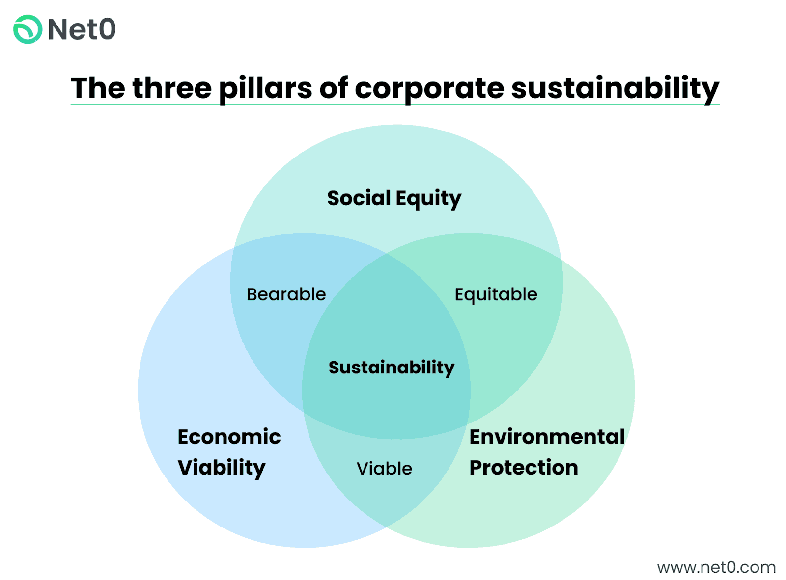

## Table of Contents

## What is corporate sustainability?

Corporate sustainability is about how companies work in a way that is good for the planet and the people, while also making money. It means that businesses try to use resources wisely, reduce pollution, and treat their workers and the community fairly. This approach helps companies to be successful over a long time, not just for a short while.

Companies that focus on sustainability often look at three main areas: the environment, social issues, and how they run their business. For the environment, they might use less energy or recycle more. For social issues, they might make sure their workers are safe and happy, and support local communities. In terms of business, they might be honest and open about what they do. By thinking about these things, companies can help make the world a better place while still doing well in their business.

## Why are sustainability pillars important for businesses?

The sustainability pillars, which are the environment, social issues, and how a business is run, are really important for companies. They help businesses think about more than just making money. By focusing on these pillars, companies can make sure they are not hurting the planet or the people around them. This can help them use resources better, like using less energy or water, and it can also help them make less waste and pollution. When companies do this, they can save money and also make their customers and workers happier because they are doing good things for the world.

Also, thinking about social issues and how to run the business well is important. Companies that care about their workers and the community can build a good reputation. This means they treat their workers fairly, pay them well, and make sure they work in safe places. They also try to help the community around them, maybe by giving money to schools or helping with local projects. When businesses run in an honest and open way, people trust them more. This trust can help the company do better over time because people want to buy from and work for companies that do the right thing.

In the end, the sustainability pillars help businesses be successful for a long time. By taking care of the environment, being good to people, and running the business well, companies can keep making money while also making the world a better place. This is important because it helps businesses last longer and do well, not just for a short time but for many years.

## What are the common pillars of corporate sustainability?

The common pillars of corporate sustainability are the environment, social issues, and how a business is run. These three areas help companies think about more than just making money. For the environment, companies try to use less energy, water, and other resources. They also work to reduce waste and pollution. This helps them use resources better and save money.

For social issues, companies focus on treating their workers fairly and helping the community. They make sure their workers are safe, paid well, and happy. They also support local projects and give back to the community. This builds a good reputation and makes people trust the company more.

The last pillar is about how the business is run. Companies need to be honest and open about what they do. This means they follow the rules and are clear about their actions. By running the business well, companies can keep their customers and workers happy. Together, these pillars help businesses be successful for a long time while also doing good for the world.

## How do environmental sustainability practices benefit a company?

Environmental sustainability practices help a company in many ways. When a company uses less energy and water, and makes less waste and pollution, it can save a lot of money. For example, by using energy-efficient lights or recycling materials, a company can lower its bills. This means the company can spend that money on other important things, like growing the business or paying workers better. Also, when a company takes care of the environment, it can get special rewards or tax breaks from the government. This can make the company even more profitable.

Another benefit is that customers and workers like companies that care about the environment. When people see a company trying to be green, they feel good about buying from it or working for it. This can help the company attract more customers and the best workers. A good reputation for being environmentally friendly can also make the company stand out from others. This can lead to more sales and a stronger brand. In the end, environmental sustainability practices can help a company do well over a long time, not just for a short while.

## What role does social responsibility play in corporate sustainability?

Social responsibility is a big part of corporate sustainability. It means that companies care about their workers and the community around them. When a company treats its workers well, it makes sure they are safe, paid fairly, and happy at work. This can make the workers more loyal and work harder, which is good for the company. Also, when a company helps the community, like giving money to schools or supporting local projects, it builds a good reputation. People trust and like companies that do good things for others.

Being socially responsible also helps companies in the long run. When a company is known for being good to its workers and the community, it can attract more customers and the best workers. People want to buy from and work for companies that care about more than just making money. This can lead to more sales and a stronger business. In the end, social responsibility helps companies be successful over time while also making the world a better place.

## How can a company integrate economic sustainability into its operations?

Economic sustainability means a company makes money in a way that lasts a long time. To do this, a company needs to use its money wisely. It can save money by using less energy and water, and by recycling more. This helps lower costs and makes the company more profitable. Also, a company can invest in new ideas and technology that help it grow. By being smart with money and looking for ways to save and grow, a company can keep making money for a long time.

Another way to integrate economic sustainability is by making sure the company is strong and can handle changes. This means having a good plan for the future and being ready for things like changes in the market or new laws. A company can also make sure it is not relying too much on one thing, like one product or one customer. By spreading out its risks and being ready for change, a company can keep making money even when things get tough. This helps the company last longer and be successful over time.

## What are some examples of successful corporate sustainability initiatives?

One example of a successful corporate sustainability initiative is IKEA's focus on renewable energy. IKEA has invested in wind and solar power to make its stores and factories use less energy from non-renewable sources. This helps the environment and also saves IKEA money on energy bills. IKEA also works to use materials that are good for the environment, like using wood from sustainable forests. By doing these things, IKEA shows it cares about the planet and can still make money.

Another example is Unilever's Sustainable Living Plan. Unilever tries to help people live better lives while also helping the planet. They do this by making products that are good for the environment and by helping people in the communities where they work. For example, Unilever has programs to help farmers grow crops in ways that are good for the land. They also work to reduce the amount of waste they make and use less water. By focusing on these things, Unilever builds a good reputation and keeps making money in a way that lasts a long time.

## How do companies measure the impact of their sustainability efforts?

Companies measure the impact of their sustainability efforts by looking at different things. They might check how much energy or water they use and see if they are using less over time. They also look at how much waste and pollution they make and try to make it less. Companies often use special numbers called metrics to keep track of these things. For example, they might measure how many tons of CO2 they release into the air or how many gallons of water they save. By comparing these numbers from year to year, companies can see if their efforts to be more sustainable are working.

Another way companies measure their sustainability impact is by asking people. They might survey their workers to see if they feel safe and happy at work. They can also ask customers if they think the company is doing a good job with the environment and the community. Companies sometimes use scores or ratings from outside groups that look at how sustainable a company is. These scores can help show if a company is doing better over time. By looking at all these different things, companies can understand how well they are doing with sustainability and where they can do better.

## What challenges do companies face when implementing sustainability pillars?

Companies face many challenges when they try to be more sustainable. One big challenge is the cost. It can be expensive to start using green energy or to change how they make things to be better for the environment. Companies might need to spend a lot of money on new machines or training for workers. This can be hard, especially if the company is not making a lot of money already. Another challenge is that sometimes the rules about what companies can do to be sustainable are different in different places. This can make it hard for companies that work in many countries to follow all the rules.

Another challenge is getting everyone in the company to care about sustainability. Some workers might not understand why it's important or might not want to change how they do things. It can take time and effort to teach everyone about sustainability and to make sure they are all working together. Also, companies need to keep making money while they try to be more sustainable. This can be tough because some changes might make things cost more or take longer. Companies need to find a balance between being good to the planet and people, and still making money to stay in business.

## How can technology be leveraged to enhance corporate sustainability?

Technology can help companies be more sustainable in many ways. One way is by using smart machines and software to keep track of how much energy and water they use. These tools can find where a company is wasting resources and suggest ways to use less. For example, sensors can turn off lights in empty rooms, and special programs can help plan the best routes for delivery trucks to save on gas. By using technology, companies can save money and be kinder to the environment at the same time.

Another way technology helps is by making it easier to recycle and use less waste. Machines can sort different materials like plastic and paper so they can be reused. Also, 3D printing can make things with less material than traditional ways. Technology can also help companies talk to their customers and workers about sustainability. Apps and websites can share information about what the company is doing to help the planet and get feedback from people. This makes everyone feel part of the effort to be more sustainable.

## What are the future trends in corporate sustainability?

In the future, more companies will use technology to be sustainable. They will use things like artificial intelligence and big data to find ways to save energy and reduce waste. For example, AI can help plan the best routes for delivery trucks to use less gas. Also, more companies will use renewable energy like solar and wind power. This will help them be kinder to the environment and save money on energy bills. Technology will also help companies talk to their customers and workers about sustainability, making everyone feel part of the effort.

Another trend will be a bigger focus on social issues. Companies will try harder to treat their workers well and help the community. They might pay their workers more fairly and make sure they work in safe places. Companies will also support local projects and help people in the areas where they work. This will help build a good reputation and make people trust the company more. In the end, companies that care about both the environment and people will do better over time.

## How can companies align their sustainability pillars with global standards and frameworks?

Companies can align their sustainability pillars with global standards and frameworks by following guidelines like the United Nations Sustainable Development Goals (SDGs) and the Global Reporting Initiative (GRI). These frameworks give companies clear goals to aim for, like using less energy, helping the community, and being honest about how they run their business. By using these standards, companies can make sure they are doing things that are good for the world and that people will recognize and understand. This also helps companies show others that they are serious about being sustainable.

Another way companies can align with global standards is by getting certifications like ISO 14001 for environmental management or B Corp certification for overall social and environmental performance. These certifications show that a company meets certain standards for being sustainable. They can help companies improve their practices and also make it easier for them to tell customers and workers about their efforts. By following these global standards and frameworks, companies can make sure their sustainability efforts are recognized and respected around the world.

## References & Further Reading

[1]: "Corporate Sustainability: Integrating Performance and Reporting" by Ann Brockett and Zabihollah Rezaee.

[2]: "Sustainable Investing: Revolutions in Theory and Practice" by Cary Krosinsky and Sophie Purdom.

[3]: "Algorithmic Trading and DMA: An Introduction to Direct Access Trading Strategies" by Barry Johnson.

[4]: "Responsible Investing: Concepts, Trends, and Practices" by Matthew W. Sherwood and Julia Pollard.

[5]: "Sustainable Investing: Revolutions in Theory and Practice" by Cary Krosinsky and Nick Robins.

[6]: "The Handbook of Sustainable and Responsible Investment" by Cary Krosinsky, Nick Robins, and Stephen Viederman.