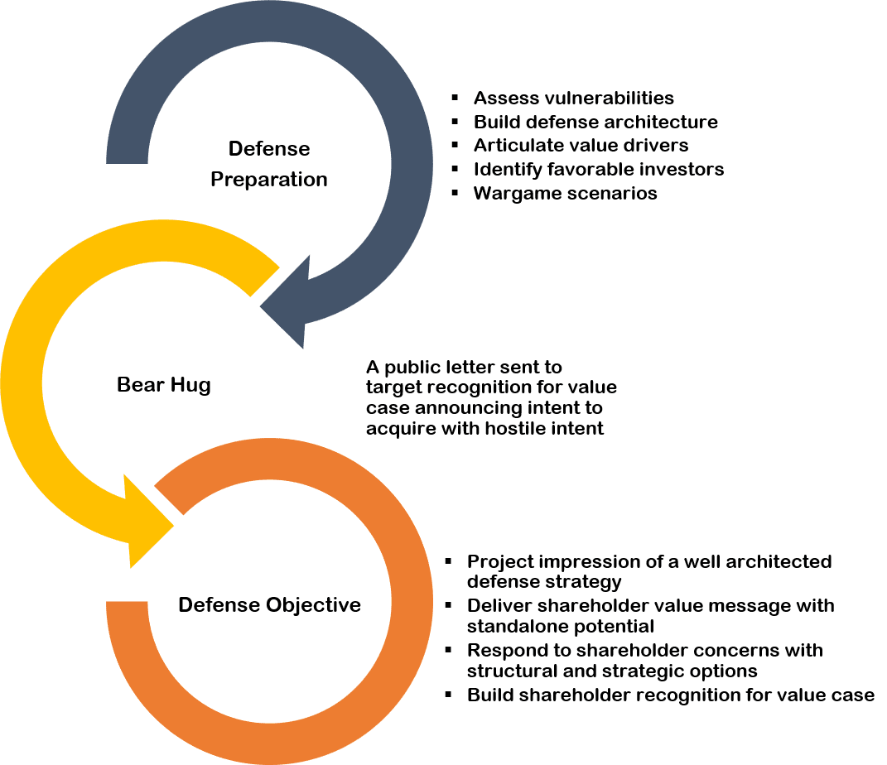

## Table of Contents

## What is a corporate takeover?

A corporate takeover happens when one company buys another company. The company that buys is called the acquirer, and the company that gets bought is called the target. The acquirer wants to own the target because it can help them grow bigger, enter new markets, or get new technology.

There are different ways a takeover can happen. Sometimes, the two companies agree to the deal and it's friendly. Other times, the acquirer might try to buy the target even if the target's leaders don't want to sell. This is called a hostile takeover. In a hostile takeover, the acquirer might buy shares directly from the shareholders to gain control.

## How does a corporate takeover affect shareholders?

When a company gets taken over, it can affect the people who own shares in the company. If the takeover price is higher than what the shares are worth now, shareholders can make more money by selling their shares at the new, higher price. This is good for them. But if the takeover happens in a way that the shareholders don't like, they might feel unhappy. They might think the new owners won't run the company as well, or they might not agree with the new direction the company is going.

Sometimes, a takeover can lead to changes in the company that might not be good for shareholders in the long run. For example, if the new owners decide to sell off parts of the company or make big changes, the value of the shares might go down. Shareholders need to watch what's happening and decide if they want to keep their shares or sell them. It's important for them to think about how the takeover might change the future of the company and their investment.

## What are the common types of corporate takeovers?

There are a few common types of corporate takeovers. One type is a friendly takeover, where the company being bought agrees to the deal. The leaders of both companies talk and decide that it's a good idea for one to buy the other. This is usually a smooth process because everyone agrees.

Another type is a hostile takeover, where the company being bought doesn't want to be bought. The company trying to buy it will go straight to the shareholders and try to buy their shares. This can be a tough situation because the leaders of the company being bought might not like the idea, but if enough shareholders sell their shares, the takeover can still happen.

There's also a type called a reverse takeover, which is a bit different. In a reverse takeover, a smaller company buys a bigger company, usually by using the bigger company's stock. This can be a way for the smaller company to grow quickly without spending a lot of cash. It's less common but can be very important for the companies involved.

## What is a takeover defense and why is it important for shareholders?

A takeover defense is a strategy that a company uses to make it harder for another company to buy it. These strategies are important because they help protect the company and its shareholders from being bought in a way that might not be good for them. If a company thinks that a takeover might hurt its value or not be in the best interest of its shareholders, it might use a defense to stop the takeover or make it more difficult.

These defenses can be important for shareholders because they give the company time to find a better deal or to show shareholders why the takeover might not be a good idea. If a takeover happens too quickly, shareholders might not have enough time to understand what's going on and make a good decision about their shares. By using a takeover defense, the company can protect the interests of its shareholders and make sure that any takeover happens in a way that is fair and beneficial for everyone involved.

## What are the basic takeover defense strategies a company might employ?

One common defense strategy is the "poison pill." This is when a company makes its stock less attractive to the company trying to buy it. For example, they might let shareholders buy more shares at a discount if someone tries to take over. This makes it more expensive for the other company to buy enough shares to take over. The goal is to make the takeover too costly or complicated, so the other company might give up.

Another strategy is called the "golden parachute." This means that if the company gets taken over, the top leaders get big payments or benefits. This can make the takeover more expensive for the company trying to buy it. It also makes the leaders less likely to want the takeover to happen, because they might lose their jobs. This can help the company stay independent if the leaders and shareholders think that's best.

A third strategy is the "white knight" defense. If a company doesn't want to be bought by one buyer, it might look for a different company to buy it instead. This other company is called a "white knight" because it's seen as a friendlier option. The original company might think that the white knight will treat it better or offer a better deal. This can help the company avoid a takeover that its shareholders don't like.

## How can shareholders influence a company's takeover defense strategy?

Shareholders can influence a company's takeover defense strategy by voting on important decisions. When a company is thinking about using a defense strategy, it might need to get approval from its shareholders. If enough shareholders vote yes, the company can go ahead with the strategy. If shareholders don't like the strategy, they can vote no and stop it from happening. This gives shareholders a big say in how the company protects itself from takeovers.

Shareholders can also talk to the company's leaders and tell them what they think. If many shareholders are worried about a takeover, they might write letters or go to meetings to share their thoughts. The leaders might listen to what the shareholders say and change their plans. This way, shareholders can help the company choose the best defense strategy that protects their interests. By working together, shareholders can make sure the company does what's best for them during a takeover attempt.

## What are the potential benefits of a successful takeover defense for shareholders?

When a company successfully defends itself against a takeover, it can be good for shareholders because it keeps the company independent. This means the company can keep doing what it's been doing, which might be working well. If shareholders like how the company is run and think it will do well in the future, they might be happy that the company stays the same. They can keep their shares and hope the value will go up over time.

Another benefit is that a successful defense can give the company time to find a better deal. Sometimes, another company might come along with a better offer that's more fair to shareholders. By defending against the first takeover, the company can look for other options. This way, shareholders might get a better price for their shares or a deal that's more in line with what they want for the company's future.

## What are the risks and downsides of aggressive takeover defense strategies?

When a company uses aggressive takeover defense strategies, it can sometimes hurt the company and its shareholders. One big risk is that these strategies can make the company's stock less valuable. For example, if a company uses a poison pill, it might make the stock price drop because investors think the company is hard to buy and might not grow as fast. This can be bad for shareholders who want their shares to be worth more money. Also, aggressive defenses can make the company look like it's not open to good deals, which might scare away other companies that could have offered a better price.

Another downside is that these strategies can be very expensive. Using things like golden parachutes or hiring lawyers to fight off a takeover can cost a lot of money. This money comes out of the company's profits, which means less money for shareholders. If the company spends too much on defense and doesn't get a better deal, shareholders might end up worse off than if they had just accepted the first offer. It's important for the company to think carefully about whether the defense is worth the cost, because spending too much can hurt the company's financial health and the value of shareholders' investments.

## How do poison pills and golden parachutes work as defense mechanisms?

A poison pill is a way for a company to make itself less attractive to someone trying to buy it. If another company tries to take over, the poison pill lets the company's shareholders buy more shares at a lower price. This makes it more expensive for the company trying to buy it because they have to buy more shares to get control. The goal is to make the takeover so costly that the other company gives up. By using a poison pill, the company can protect itself and give its shareholders a chance to keep their investment safe.

Golden parachutes are another defense strategy. They work by giving big payments or benefits to the company's top leaders if the company gets taken over. This makes the takeover more expensive for the company trying to buy it because they have to pay these extra costs. It also makes the leaders less likely to want the takeover to happen because they might lose their jobs but get a big reward if they stay. By using golden parachutes, the company can make the takeover less appealing and protect itself from being bought in a way that might not be good for its shareholders.

## What role do regulatory bodies play in corporate takeovers and defense strategies?

Regulatory bodies have a big job when it comes to corporate takeovers and defense strategies. They make sure that everything is done fairly and follows the law. For example, in the United States, the Securities and Exchange Commission (SEC) watches over takeovers to make sure companies tell the truth about what they're doing. If a company is using a defense strategy like a poison pill, the SEC might check to make sure it's not breaking any rules. They want to protect shareholders and make sure they have all the information they need to make good decisions.

Sometimes, regulatory bodies can even stop a takeover if they think it's not good for competition or the economy. For instance, the Federal Trade Commission (FTC) might look at a takeover and decide it would make one company too powerful in its market. If that happens, they might say no to the takeover to keep the market fair for everyone. This helps make sure that takeovers don't hurt other businesses or consumers. By keeping an eye on things, regulatory bodies help make sure that takeovers and defense strategies are used in ways that are fair and good for everyone involved.

## How can shareholders assess the long-term impact of a takeover defense on their investments?

Shareholders can assess the long-term impact of a takeover defense on their investments by looking at how the company performs after the defense is used. If the company stays independent and continues to grow and make profits, the defense might have been good for shareholders. They can check the company's financial reports and stock price to see if the value of their shares goes up over time. It's also important to see if the company can find better deals or partnerships after defending itself. If the company can do well on its own, shareholders might be happy with the defense strategy.

On the other hand, if the defense strategy hurts the company's stock price or makes it hard for the company to grow, it might not be good for shareholders in the long run. For example, if the company spends a lot of money on defense and doesn't get a better offer, shareholders might lose money. They should also think about whether the defense makes the company look less attractive to other investors or partners. By watching these things, shareholders can decide if the defense was worth it and what it means for their investments over time.

## What advanced strategies can shareholders employ to protect their interests during a hostile takeover?

Shareholders can protect their interests during a hostile takeover by working together to influence the company's decisions. They can vote on important issues, like whether to accept or reject a takeover offer. If many shareholders agree, they can stop the takeover or push for a better deal. Shareholders can also talk to the company's leaders and tell them what they want. By sharing their thoughts and concerns, they might be able to change the company's plans and make sure the takeover happens in a way that's good for them. This teamwork can help shareholders keep control and protect their investments.

Another strategy shareholders can use is to sell their shares strategically. If they think the takeover offer is too low, they can hold onto their shares and wait for a better price. Sometimes, selling shares to a friendly buyer, or "white knight," can help the company avoid a hostile takeover. Shareholders can also use their shares to vote against the takeover or to support a defense strategy. By being smart about when and how they sell their shares, shareholders can influence the outcome of the takeover and make sure they get the best possible deal for their investments.

## References & Further Reading

[1]: Gaughan, P. A. (2010). ["Mergers, Acquisitions, and Corporate Restructurings"](https://onlinelibrary.wiley.com/doi/book/10.1002/9781119380771). John Wiley & Sons.

[2]: Bebchuk, L. A., Coates IV, J. C., & Subramanian, G. (2002). ["The Powerful Antitakeover Force of Staggered Boards: Theory, Evidence, and Policy."](http://www.law.harvard.edu/programs/corp_gov/papers/2002.bebchuk-coates-subramanian.theory.pdf) Stanford Law Review, 54(5), 887-951.

[3]: Lipton, M., & Rowe, P. (2002). ["Poison Pills: Practical Implications for Directors."](https://theliptonarchive.org/wp-content/uploads/1056060_1.pdf) Harvard Law School Forum on Corporate Governance.

[4]: Hirschey, M., & John, K. (1990). ["Corporate Governance and Shareholder Rights: A Survey of Empirical Evidence."](https://www.emerald.com/insight/content/doi/10.1108/s1569-3732(2009)0000013016/full/html) Financial Management, 19(4), 59-72.

[5]: Narang, M. (2009). ["Inside the Black Box: A Simple Guide to Quantitative and High Frequency Trading."](https://www.amazon.com/Inside-Black-Box-Quantitative-Frequency/dp/1118362411) John Wiley & Sons.

[6]: Korajczyk, R. A., & Sadka, R. (2004). ["Are Momentum Profits Robust to Trading Costs?"](https://papers.ssrn.com/sol3/papers.cfm?abstract_id=305282) The Journal of Finance, 59(3), 1039-1082.

[7]: DePamphilis, D. (2019). ["Mergers, Acquisitions, and Other Restructuring Activities: An Integrated Approach to Process, Tools, Cases, and Solutions"](https://shop.elsevier.com/books/mergers-acquisitions-and-other-restructuring-activities/depamphilis/978-0-12-815075-7). Academic Press.

[8]: O’Hara, M. (2015). ["High Frequency Trading: On the Cutting Edge of Financial Markets."](https://www.sciencedirect.com/science/article/pii/S0304405X15000045) Annual Review of Economics, 7(1), 275-295.