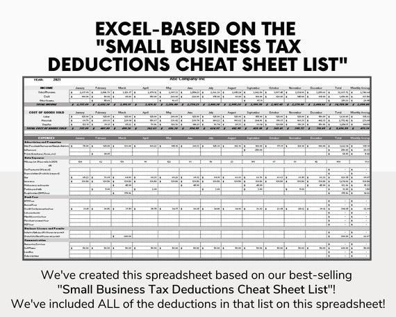

## Table of Contents

## What is corporate tax and why is it important for businesses?

Corporate tax is a tax that companies have to pay on their profits. It's like income tax, but for businesses instead of people. Governments set the rules on how much tax companies need to pay, and these rules can be different in each country. When a company makes money, it calculates its profit by subtracting its costs from its income. Then, it pays a percentage of that profit as tax to the government.

This tax is important for businesses because it affects how much money they have left after paying all their expenses. If the corporate tax rate is high, companies might have less money to reinvest in their business, like buying new equipment or hiring more staff. It also influences where companies choose to do business. Some countries have lower corporate taxes, so companies might decide to set up their operations there to pay less tax. Understanding corporate tax helps businesses plan better and make smart financial decisions.

## How is corporate tax calculated?

Corporate tax is calculated based on a company's taxable income. First, a company figures out its total income from all its business activities. Then, it subtracts all the costs and expenses it had to run the business. These costs can include things like salaries, rent, and the cost of goods sold. The amount left after subtracting these costs is the company's profit. This profit is what the company uses to calculate its corporate tax.

To find out how much tax a company owes, it multiplies its profit by the corporate tax rate set by the government. For example, if a company made a profit of $100,000 and the tax rate is 20%, the company would owe $20,000 in corporate tax. Different countries have different tax rates, so a company might pay more or less depending on where it is located. Also, there are sometimes special rules or deductions that can lower the amount of tax a company has to pay.

## What are the different types of corporate tax rates?

There are different types of corporate tax rates that governments can use. One common type is a flat rate, where all companies pay the same percentage of their profits as tax, no matter how big or small they are. Another type is a progressive rate, where companies that make more money pay a higher percentage of their profits in tax. This is similar to how personal income tax works for people. Some countries also have a tiered system, where the tax rate changes depending on how much profit a company makes, but it's not as simple as just going up as the profit goes up.

Governments can also use different rates for different kinds of businesses. For example, small businesses might get a lower tax rate to help them grow. Some industries, like manufacturing or technology, might have special tax rates to encourage investment in those areas. Additionally, there are sometimes special tax rates or incentives for companies that do things like invest in green energy or create jobs in certain areas. All these different types of rates can make corporate tax pretty complicated, but they're used to try and balance fairness with encouraging economic growth.

## What is the difference between federal and state corporate taxes?

Federal corporate tax is a tax that companies pay to the national government. It's the same for all companies in the country, no matter where they are located. The federal government sets the tax rate, and companies calculate their tax based on their profits. This money helps pay for things like national defense, highways, and social programs that benefit everyone in the country.

State corporate tax is different because it's a tax that companies pay to the government of the state where they do business. Each state can have its own tax rate, and some states don't have a corporate tax at all. This means that a company might pay different amounts of tax depending on which state it's in. The money from state corporate taxes helps pay for things like schools, roads, and other services in that state. So, companies have to think about both federal and state taxes when they plan their finances.

## What are common corporate tax deductions businesses can claim?

Businesses can claim a lot of different things as deductions to lower their corporate tax. One common deduction is the cost of goods sold. This means the money a business spends to make or buy the products they sell. If a company spends money on raw materials, manufacturing, or buying products from a supplier, they can subtract these costs from their income before they calculate their tax. Another big deduction is employee salaries and benefits. The money a business pays its workers can be taken off their total income, which means they pay less tax on their profits.

There are also deductions for business expenses like rent, utilities, and office supplies. If a company rents an office or a store, they can deduct the rent they pay. The same goes for the electricity and water bills, and even the cost of paper and pens. Businesses can also deduct money they spend on advertising and marketing to promote their products or services. Travel expenses, like the cost of flights and hotels for business trips, can be claimed too. All these deductions help businesses reduce their taxable income, so they end up paying less in corporate tax.

## How can businesses maximize their tax deductions legally?

Businesses can maximize their tax deductions by keeping careful records of all their expenses. This means saving receipts and invoices for everything they buy or pay for, like office supplies, rent, and utilities. By doing this, they can make sure they don't miss any deductions they're allowed to claim. It's also important for businesses to stay up-to-date with tax laws, because these laws can change and new deductions might become available. For example, if the government introduces a new deduction for businesses that invest in green technology, a company could save money by switching to more eco-friendly equipment.

Another way businesses can maximize their deductions is by working with a good tax professional. A tax advisor can help a business find all the deductions they're eligible for and make sure they're claiming them correctly. They can also give advice on how to structure the business to take advantage of tax benefits. For instance, a tax advisor might suggest setting up a retirement plan for employees, which can be a deductible expense. By following these strategies, businesses can legally reduce their taxable income and keep more of their profits.

## What are the implications of international corporate taxation?

International corporate taxation can be really complicated for businesses that work in different countries. Each country has its own rules about taxes, and these rules can be different from one another. When a company makes money in another country, it might have to pay taxes there, but it might also have to pay taxes in its home country. This can lead to something called double taxation, where a company ends up paying tax on the same money twice. To avoid this, countries often have tax treaties with each other. These treaties help companies figure out how much tax they should pay in each country and make sure they don't get taxed twice on the same income.

Another big thing to think about with international corporate taxation is how it can affect where companies choose to do business. Some countries have lower tax rates to attract businesses, and this can make companies want to move their operations there. This is called tax competition, and it can lead to big companies setting up in places with the lowest taxes, even if that's not where they do most of their work. This can be a problem because it might mean that countries lose out on tax money they need for things like schools and roads. It's a tricky balance for governments to set tax rates that are fair but still attractive to businesses.

## How do tax treaties affect corporate tax obligations?

Tax treaties are agreements between two countries that help businesses figure out their tax obligations when they work in both places. They stop companies from having to pay taxes on the same money twice, which is called double taxation. For example, if a company from the United States makes money in Germany, a tax treaty between the U.S. and Germany can decide how much tax the company should pay in each country. This makes things simpler and fairer for the company, so it knows exactly what it needs to pay.

These treaties also help set rules about things like what kind of income can be taxed and where. They can say that certain types of income, like dividends or interest, should only be taxed in one country or at a lower rate. This can make it easier for companies to plan their finances because they know what to expect. Without these treaties, companies might avoid doing business in certain countries because the tax rules are too complicated or too expensive. So, tax treaties help keep international business running smoothly.

## What are the recent changes in corporate tax laws that businesses should be aware of?

In recent years, there have been a few big changes in corporate tax laws that businesses need to know about. One big change is the global minimum tax rate that many countries agreed to. This means that big companies can't just move to countries with very low tax rates to avoid paying taxes. The idea is to make sure that companies pay at least a certain amount of tax, no matter where they are. This can affect where businesses choose to operate and how much tax they end up paying.

Another change that's happening in some places is the way businesses can claim deductions. Governments are looking at making rules stricter so that companies can't use too many deductions to lower their taxes too much. For example, some countries are limiting how much interest companies can deduct when they borrow money. This means that businesses need to be careful about how they manage their finances and what expenses they claim as deductions. Keeping up with these changes is important for businesses to plan their taxes well and avoid any surprises.

## How does corporate tax planning influence business strategy?

Corporate tax planning is a big part of how businesses make their plans. When a company thinks about its taxes, it looks at how much it will have to pay and how it can pay less. This can change where a company decides to do business. If one country has lower taxes, a company might want to move there or set up a part of its business there. It also affects how a company spends its money. If a company knows it can get a tax break for buying new equipment or hiring more people, it might decide to do those things to save on taxes.

Tax planning also helps businesses decide how to structure their money. Companies might choose to borrow money or invest in certain ways because of the tax benefits. For example, if a company can deduct the interest it pays on a loan, it might decide to borrow more money. This can help the company grow, but it also means it needs to be careful about how much debt it takes on. By thinking about taxes, businesses can make smarter choices about where to spend their money and how to grow, which can make a big difference in how successful they are.

## What are the penalties for non-compliance with corporate tax regulations?

If a business does not follow corporate tax rules, it can face big penalties. These penalties can be fines, which are extra amounts of money the company has to pay. The fines can be a lot, depending on how serious the mistake was and how long the company was not following the rules. Sometimes, the government can also charge interest on the tax that was not paid on time. This means the company has to pay even more money.

In really bad cases, the government might take legal action against the company. This can lead to even bigger fines or even jail time for the people in charge of the company. Not following tax rules can also hurt the company's reputation. Other businesses and customers might not want to work with a company that breaks the law. So, it's really important for businesses to make sure they follow all the tax rules to avoid these problems.

## How can businesses use tax incentives and credits to reduce their tax liability?

Businesses can use tax incentives and credits to lower the amount of tax they need to pay. Tax incentives are special breaks that governments give to companies to encourage them to do certain things, like investing in new technology or creating jobs in certain areas. For example, if a company decides to build a new factory in a part of the country where there aren't many jobs, the government might give them a tax break to help them out. This can mean the company pays less tax on its profits, which gives them more money to spend on growing their business.

Tax credits work a bit differently. Instead of just lowering the amount of tax a company has to pay, tax credits can sometimes give the company money back. For instance, if a company spends money on research and development, it might get a tax credit that reduces its tax bill by more than the amount it spent. This can be a big help for businesses that want to innovate and create new products. By taking advantage of these incentives and credits, businesses can save money on taxes and use it to grow and improve their operations.

## What is an overview of understanding corporate tax?

Corporate tax constitutes a significant portion of national revenue and is a crucial aspect of business financial planning. It is a direct tax levied on the net income or profit of corporations. The net income is primarily calculated by deducting allowable expenses from total revenue, adhering strictly to the accounting and tax laws specific to each country. Understanding the fundamentals of corporate tax involves recognizing both the statutory tax rates and the effective tax rates, which might differ based on taxable income adjustments, deductions, and credits.

### Variability in Corporate Tax Systems

Globally, corporate tax rates and systems vary significantly, influencing how multinational corporations structure their operations and investments. For instance, some countries, like Ireland, offer relatively low corporate tax rates to attract foreign investment, whereas others may levy higher rates to increase domestic revenue. Variations also exist in terms of tax bases, with some nations offering tax incentives or tax holidays for specific industries or economic zones.

### Calculations and Filing Requirements

Corporate tax calculations begin with the determination of gross income, which involves the aggregation of all earnings, sales, and other revenue streams. From this total, tax-deductible expenses such as operating costs, wages, and depreciation are subtracted to ascertain the taxable income. The formula for computing corporate tax is:

$$
\text{Corporate Tax} = \text{Taxable Income} \times \text{Corporate Tax Rate}
$$

Filing requirements for corporate tax necessitate timely submission of tax returns, which detail income and deductions, to the respective tax authorities. Companies need to meticulously maintain records and often require the assistance of tax professionals to ensure compliance and accuracy in filings.

### Strategic Implications of Corporate Tax

Corporate tax significantly impacts business strategy, particularly in terms of cash flow management and reinvestment potentials. Companies aim to optimize their tax liabilities, often through strategies that align with business goals and investment plans. Understanding global tax landscapes can provide strategic advantages in terms of structuring operations to minimize tax exposure while maximizing profit retention.

### Global Trends and Regulatory Changes

Corporate tax regulations are subject to change in response to global economic conditions, policy shifts, and international agreements. Recent trends indicate a move towards greater tax transparency and cooperation among nations to combat tax evasion and profit shifting. Initiatives like the OECD's Base Erosion and Profit Shifting (BEPS) project aim to create a fairer international tax framework. These changes can affect multinational companies by altering their tax planning strategies and necessitating increased compliance vigilance.

As businesses continue to expand across borders, staying abreast of these evolving corporate tax regulations becomes critical for sustaining competitive advantage and ensuring legal compliance.

## References & Further Reading

[1]: Bergstra, J., Bardenet, R., Bengio, Y., & Kégl, B. (2011). ["Algorithms for Hyper-Parameter Optimization."](https://papers.nips.cc/paper/4443-algorithms-for-hyper-parameter-optimization) Advances in Neural Information Processing Systems 24.

[2]: ["Advances in Financial Machine Learning"](https://www.amazon.com/Advances-Financial-Machine-Learning-Marcos/dp/1119482089) by Marcos Lopez de Prado

[3]: ["Evidence-Based Technical Analysis: Applying the Scientific Method and Statistical Inference to Trading Signals"](https://www.amazon.com/Evidence-Based-Technical-Analysis-Scientific-Statistical/dp/0470008741) by David Aronson

[4]: ["Machine Learning for Algorithmic Trading"](https://github.com/stefan-jansen/machine-learning-for-trading) by Stefan Jansen

[5]: ["Quantitative Trading: How to Build Your Own Algorithmic Trading Business"](https://www.amazon.com/Quantitative-Trading-Build-Algorithmic-Business/dp/1119800064) by Ernest P. Chan