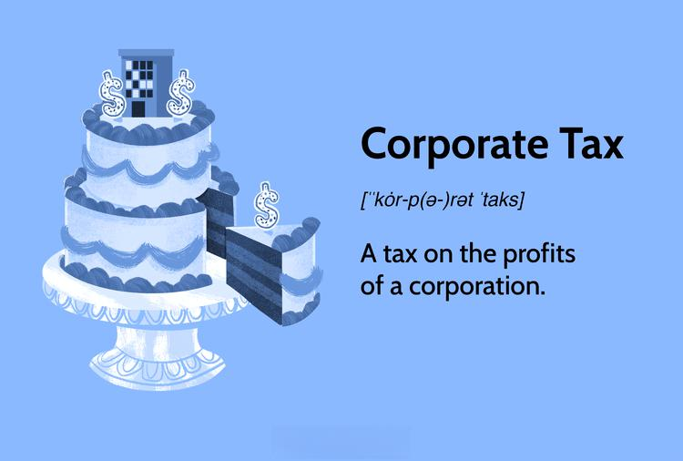

Welcome to the comprehensive guide on corporate tax, business taxes, tax deductions, and algo trading. This article is designed to provide businesses with a thorough understanding of how to optimize their tax strategies in conjunction with the rapidly growing field of algorithmic trading. Corporate tax obligations and relevant deductions are pivotal to effective financial management, impacting overall profitability and strategic planning.

Businesses engaged in algorithmic trading face unique tax considerations due to the high volume and frequency of transactions. This guide will illustrate the interaction between algorithmic trading and taxation, offering clarity on how companies can manage their tax responsibilities while capitalizing on trading innovations. Algorithmic trading, characterized by the use of computer algorithms to execute trades, presents opportunities for increased liquidity, reduced costs, and enhanced market strategies. Therefore, understanding its tax implications is essential for businesses seeking technological advancement.



Strategies to align tax planning with algorithmic trading can lead to significant economic benefits. By harmonizing these elements, companies can optimize their financial performance and stay competitive in the evolving market landscape. This guide encourages businesses to explore these interactions and leverage relevant strategies for tax efficiency and innovation in trading practices.

## Table of Contents

## Understanding Corporate Tax: An Overview

Corporate tax constitutes a significant portion of national revenue and is a crucial aspect of business financial planning. It is a direct tax levied on the net income or profit of corporations. The net income is primarily calculated by deducting allowable expenses from total revenue, adhering strictly to the accounting and tax laws specific to each country. Understanding the fundamentals of corporate tax involves recognizing both the statutory tax rates and the effective tax rates, which might differ based on taxable income adjustments, deductions, and credits.

### Variability in Corporate Tax Systems

Globally, corporate tax rates and systems vary significantly, influencing how multinational corporations structure their operations and investments. For instance, some countries, like Ireland, offer relatively low corporate tax rates to attract foreign investment, whereas others may levy higher rates to increase domestic revenue. Variations also exist in terms of tax bases, with some nations offering tax incentives or tax holidays for specific industries or economic zones.

### Calculations and Filing Requirements

Corporate tax calculations begin with the determination of gross income, which involves the aggregation of all earnings, sales, and other revenue streams. From this total, tax-deductible expenses such as operating costs, wages, and depreciation are subtracted to ascertain the taxable income. The formula for computing corporate tax is:

$$
\text{Corporate Tax} = \text{Taxable Income} \times \text{Corporate Tax Rate}
$$

Filing requirements for corporate tax necessitate timely submission of tax returns, which detail income and deductions, to the respective tax authorities. Companies need to meticulously maintain records and often require the assistance of tax professionals to ensure compliance and accuracy in filings.

### Strategic Implications of Corporate Tax

Corporate tax significantly impacts business strategy, particularly in terms of cash flow management and reinvestment potentials. Companies aim to optimize their tax liabilities, often through strategies that align with business goals and investment plans. Understanding global tax landscapes can provide strategic advantages in terms of structuring operations to minimize tax exposure while maximizing profit retention.

### Global Trends and Regulatory Changes

Corporate tax regulations are subject to change in response to global economic conditions, policy shifts, and international agreements. Recent trends indicate a move towards greater tax transparency and cooperation among nations to combat tax evasion and profit shifting. Initiatives like the OECD's Base Erosion and Profit Shifting (BEPS) project aim to create a fairer international tax framework. These changes can affect multinational companies by altering their tax planning strategies and necessitating increased compliance vigilance.

As businesses continue to expand across borders, staying abreast of these evolving corporate tax regulations becomes critical for sustaining competitive advantage and ensuring legal compliance.

## Business Taxes: What Companies Need to Know

Businesses, in addition to corporate tax, often encounter a range of other tax obligations, such as value-added tax (VAT), sales tax, and property tax. These taxes can significantly impact a company's financial planning and compliance strategy. 

**Diverse Business Taxes**

1. **Value-Added Tax (VAT)**: This consumption tax is levied on the added value of goods and services at each stage of production or distribution. Businesses need to calculate VAT on their sales and might also be eligible to reclaim VAT on purchases. The rate and application of VAT can vary significantly across jurisdictions, influencing how companies manage their supply chain and pricing models.

2. **Sales Tax**: Primarily a state-level tax in countries like the United States, sales tax is collected at the point of sale from customers. The variability in sales tax rates and exemptions across different states and localities requires businesses to have precise systems in place to ensure accurate tax collection and remittance.

3. **Property Tax**: Typically imposed on real estate owned by businesses, property tax rates depend on the location and assessed value of the property. This tax can influence decisions related to property investment and development.

**Impact of Business Taxes by Industry and Location**

The tax burden on businesses can vary widely across industries and geographies. For instance, industries such as retail, which are heavily dependent on physical sales, face substantial sales tax considerations. Conversely, digital goods and services might encounter different VAT schemes in the European Union compared to the United States, where they could be less burdened by traditional sales tax structures.

Geographically, taxes such as property tax depend significantly on the location, with urban areas generally imposing higher rates due to increased property values. This geographical variance necessitates region-specific tax strategies to optimize operational costs.

**Indirect Taxes and Business Operations**

Indirect taxes, such as VAT and sales tax, present both opportunities and challenges. Efficient management of these taxes can lead to optimized cash flows, as they are typically passed on to the consumer. However, the complexity of compliance, especially for international operations, can pose significant administrative burdens. Businesses must ensure robust accounting systems to handle indirect tax transactions accurately.

**Significance of Accurate Record-Keeping and Timely Payments**

Maintaining diligent records and adhering to tax deadlines is critical for businesses to prevent costly penalties and interest charges. Accurate records are essential not only for compliance but also for strategic financial planning, enabling businesses to predict tax liabilities and make informed decisions. Companies can leverage digital tax management solutions to streamline the compliance process, ensuring that tax returns are filed correctly and payments are made punctually.

By understanding and effectively managing the various business taxes, companies can bolster compliance, minimize operational costs, and optimize their financial strategies within different legal frameworks.

## Leveraging Tax Deductions to Optimize Profitability

Tax deductions serve as critical instruments for businesses seeking to minimize their taxable income and enhance profitability. By strategically utilizing available deductions, companies can not only comply with tax regulations but also bolster their financial performance and reinvestment capacity.

### Types of Tax Deductions

**Operating Expenses:** Businesses can deduct ordinary and necessary expenses incurred during regular operations. These typically include rent, utilities, salaries, and office supplies. For example, a company might deduct the costs related to maintaining an office space, such as rent and electricity.

**Capital Expenditures:** While capital expenditures (CapEx) are initially considered assets, businesses can claim depreciation over time. Depreciation deductions allow companies to recover the cost of assets gradually, as opposed to immediate deduction. The Modified Accelerated Cost Recovery System (MACRS) is often used in the U.S. to determine depreciation deductions. For instance, if a company purchases new machinery, it can depreciate the cost over the machine's useful life, thus reducing taxable income over several years.

**Employee Benefits:** Deductions are available for costs related to employee benefits, including health insurance, retirement contributions, and training programs. These deductions serve the dual purpose of lowering taxable income and enhancing employee satisfaction and productivity.

### Strategic Use of Tax Deductions

To align tax deductions with growth and reinvestment plans, businesses should adopt a strategic approach:

1. **Long-term Planning:** Evaluate potential capital expenditures and operational costs in light of tax implications. Forecasting future tax liabilities and aligning them with growth objectives enables more informed decision-making.

2. **Tax-efficient Structures:** Consider structuring investments in a tax-efficient manner, such as leasing vs. buying assets, to maximize tax advantages.

3. **Reinvestment Opportunities:** Utilize tax savings to fund internal projects or external investments, fostering an environment of continuous growth and innovation.

### Common Mistakes and Best Practices

**Common Mistakes:**
- Overlooking eligible deductions due to lack of detailed record-keeping.
- Mismatching the timing of deductions with the fiscal year in which expenses were incurred.
- Misclassifying expenses, which can lead to incorrect deduction claims.

**Best Practices:**
- Maintain meticulous records to ensure every eligible deduction is captured.
- Regularly consult with tax professionals to stay updated on changing tax laws and deduction opportunities.
- Use accounting software to automate and optimize the deduction claiming process.

### Deductions for Algorithmic Trading Activities

Businesses engaged in [algorithmic trading](/wiki/algorithmic-trading) can leverage specific deductions to reduce their tax burden. These may include:

- **Technology Investments:** Costs associated with acquiring and maintaining trading algorithms, software, and related technological infrastructure can be deducted over time.
- **R&D Expenses:** If the development of trading algorithms involves research and development, businesses may qualify for R&D tax credits, further reducing taxable income.
- **Transaction Costs:** Expenses incurred from executing trades using algorithmic systems, such as brokerage fees, may also be deductible.

By understanding and strategically employing tax deductions, businesses can significantly impact their bottom line, leading to enhanced profitability and sustainability.

## Algorithmic Trading: A Game Changer for Enterprises

Algorithmic trading, often referred to as algo trading or black-box trading, involves the use of computer algorithms to automate the process of trading. This innovation allows trades to be executed at high speed and frequency, considerably faster than any human trader could achieve. Algo trading has become a cornerstone of modern financial markets due to its ability to improve market efficiencies and provide consistent trading opportunities.

The increasing adoption of algorithmic trading in financial markets is driven by its potential to enhance [liquidity](/wiki/liquidity-risk-premium), minimize transaction costs, and offer a competitive edge. By executing orders at the best possible prices and adjusting rapidly to market conditions, algo trading contributes to more efficient price discovery and tighter bid-ask spreads. This technological edge enables businesses to optimize their trading strategies and capitalize on fleeting market conditions, which could otherwise be difficult to exploit manually.

The success of algorithmic trading relies on key technologies and strategies, including quantitative models, statistical analysis, and [artificial intelligence](/wiki/ai-artificial-intelligence). These systems process vast amounts of market data in real-time, identifying patterns and executing trades based on pre-defined criteria without human intervention. Python has emerged as a popular programming language in this domain due to its extensive libraries and robust community support for data analysis and [machine learning](/wiki/machine-learning). A simple example of a trading algorithm in Python could look like this:

```python
import numpy as np
import pandas as pd

# Example strategy: Simple Moving Average Crossover
def moving_average_crossover(data, short_window=40, long_window=100):
    data['short_mavg'] = data['close'].rolling(window=short_window, min_periods=1).mean()
    data['long_mavg'] = data['close'].rolling(window=long_window, min_periods=1).mean()
    data['signal'] = 0
    data['signal'][short_window:] = np.where(data['short_mavg'][short_window:] > data['long_mavg'][short_window:], 1, 0)
    data['position'] = data['signal'].diff()
    return data

# Load data (example: daily stock prices)
data = pd.read_csv('stock_data.csv', parse_dates=True, index_col='date')
signals = moving_average_crossover(data)

print(signals.tail())
```

Regulatory frameworks play a crucial role in the algo trading landscape, imposing rules that govern market behavior and ensure fair trading practices. These regulations can significantly impact corporate tax obligations related to algorithmic trading activities. For instance, tax treatment of profits generated by algorithmic trading may vary across jurisdictions, depending on how the trading activities are characterized (e.g., business income vs. capital gains).

Compliance with these regulations is essential for businesses to avoid penalties and maintain their reputational standing. Regulatory bodies such as the U.S. Securities and Exchange Commission (SEC) and the European Securities and Markets Authority (ESMA) have established guidelines to oversee algorithmic trading practices, including requirements for risk management and transparency. Adhering to these guidelines not only ensures legal compliance but also enhances the stability and integrity of the financial markets. 

In summary, algorithmic trading represents a transformative shift in how enterprises approach trading activities, offering remarkable benefits while posing new challenges in terms of regulation and tax implications. As financial markets continue to evolve, businesses must navigate these complexities to fully leverage the opportunities algorithmic trading presents.

## Strategic Integration: Navigating Tax Implications of Algorithmic Trading

Combining tax strategies with algorithmic trading requires a comprehensive understanding of both tax legislation and trading algorithms. Businesses involved in algorithmic trading need to be aware of the various tax obligations arising from their trading activities. Profits generated through algorithmic trading, often characterized by high-frequency and high-[volume](/wiki/volume-trading-strategy) transactions, are subject to capital gains tax or corporate income tax, depending on the jurisdiction and the holding period of the financial instruments.

### Managing Tax Liabilities from Algo Trading Profits

To effectively manage tax liabilities arising from algo trading, corporations must categorize their trading activities correctly under prevailing tax laws. For instance, short-term capital gains, typically taxed at a higher rate, apply to securities held for less than a year, whereas long-term capital gains may benefit from reduced tax rates. Understanding this distinction is critical for optimizing tax liability.

Moreover, businesses can leverage specific algorithms to realize capital losses, which can offset capital gains and thus reduce the overall taxable income. Employing strategies such as tax-loss harvesting can be effectively integrated into algorithmic trading models. In Python, implementing such a strategy involves tracking price movements and executing sell orders to recognize losses, as shown in the example below:

```python
def tax_loss_harvesting(portfolio, current_prices):
    for stock, purchase_price in portfolio.items():
        if current_prices[stock] < purchase_price:
            sell(stock)

tax_loss_harvesting({'AAPL': 150, 'GOOGL': 2500}, {'AAPL': 145, 'GOOGL': 2450})
```

### International Tax Treatment

Algorithmic trading's cross-border nature necessitates an understanding of international tax laws. The tax treatment of algo trading income can vary widely, with some jurisdictions imposing specific taxes on automated trading or transaction taxes. It is essential for businesses to stay informed about the tax treaties between countries, especially if their trading activities span multiple jurisdictions. Double taxation agreements (DTAs) can mitigate instances where income might be taxed in more than one country, aiding in maximizing after-tax returns.

### Balancing Risk, Compliance, and Efficiency

Incorporating algorithmic trading into a business model requires careful balancing of risk management, compliance, and tax efficiency. Risk models must accommodate tax implications, ensuring that trading strategies do not inadvertently lead to higher tax liabilities or non-compliance penalties. Businesses should pursue a tax structure that aligns with their risk appetite, using derivative instruments for hedging while taking into account the tax efficiency of such maneuvers.

Maintaining compliance involves robust record-keeping systems that document all trades and tax-related calculations. Automated reporting tools can streamline the generation of tax documentation, providing thorough audit trails. Additionally, artificial intelligence can optimize tax planning by simulating various trading scenarios and their tax outcomes.

### Case Studies of Successful Integration

Several businesses have successfully integrated algorithmic trading and tax strategies. For instance, hedge funds often use complex algorithms to generate alpha, all while employing tax consultants to devise structures that defer tax liabilities. Such integration is illustrated by firms allowing gains to compound pre-tax through offshore fund structures, effectively delaying taxation until repatriation.

In conclusion, while algorithmic trading presents an opportunity for enhanced profitability, it also introduces substantial tax considerations. By strategically navigating these tax implications, businesses can optimize their trading operations while maintaining compliance and maximizing after-tax profits.

## Conclusion: Aligning Corporate Tax Strategy and Trading Innovation

Aligning corporate tax strategies with the innovative force of algorithmic trading presents substantial advantages for modern businesses. A comprehensive understanding of various tax obligations and deductions is crucial for optimizing financial efficiency and ensuring compliance with regulatory standards. Tax obligations range from corporate income taxes to various forms of indirect taxes like VAT and sales tax, all of which can significantly impact a company's financial planning and strategic operations. Businesses can unlock significant cost savings and enhance profitability by effectively utilizing tax deductions related to operational expenses, capital investments, and specific technological costs associated with algorithmic trading activities.

Algorithmic trading is rapidly becoming a cornerstone of modern business strategy, offering enhanced market efficiency, reduced transaction costs, and improved competitiveness. Its growing prevalence necessitates a nuanced understanding of the associated tax implications. This includes the proper classification of trading income, awareness of jurisdiction-specific tax treatments, and the potential for distinct deductions associated with high-frequency trading operations. As algorithmic trading continues to evolve, it can reshape how businesses operate within financial markets, making it imperative for companies to integrate these practices into their broader tax strategies effectively.

Seeking expert advice is recommended for optimizing both tax and trading strategies. Tax professionals can navigate the complexities of tax regulations, ensuring compliance while maximizing deductions. Simultaneously, experts in algorithmic trading can provide insights into deploying trading systems that align with a firm's risk management and financial goals.

Future trends in taxation and algorithmic trading may significantly influence corporate strategies and necessitate adaptive approaches. As governments and regulatory bodies adapt to the digitalization and automation of trading processes, new tax frameworks may emerge. Moreover, advancements in artificial intelligence and machine learning could redefine algorithmic trading techniques, presenting new opportunities and challenges from both trading and taxation viewpoints. Staying informed and agile will be crucial for businesses aiming to capitalize on the synergistic potential of strategic tax management and algorithmic trading innovation.

## References & Further Reading

[1]: Bergstra, J., Bardenet, R., Bengio, Y., & Kégl, B. (2011). ["Algorithms for Hyper-Parameter Optimization."](https://papers.nips.cc/paper/4443-algorithms-for-hyper-parameter-optimization) Advances in Neural Information Processing Systems 24.

[2]: ["Advances in Financial Machine Learning"](https://www.amazon.com/Advances-Financial-Machine-Learning-Marcos/dp/1119482089) by Marcos Lopez de Prado

[3]: ["Evidence-Based Technical Analysis: Applying the Scientific Method and Statistical Inference to Trading Signals"](https://www.amazon.com/Evidence-Based-Technical-Analysis-Scientific-Statistical/dp/0470008741) by David Aronson

[4]: ["Machine Learning for Algorithmic Trading"](https://github.com/stefan-jansen/machine-learning-for-trading) by Stefan Jansen

[5]: ["Quantitative Trading: How to Build Your Own Algorithmic Trading Business"](https://www.amazon.com/Quantitative-Trading-Build-Algorithmic-Business/dp/1119800064) by Ernest P. Chan