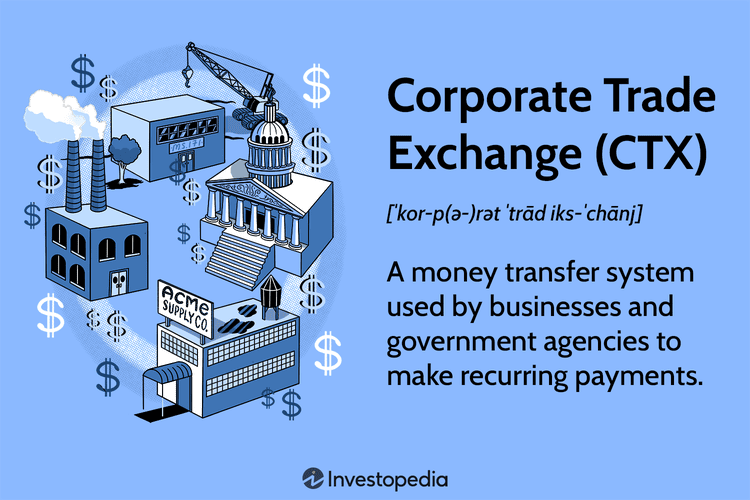

In the rapidly evolving world of financial transactions, CTX Corporate Trade Exchange payment systems stand as a pivotal innovation. Today’s financial landscape demands more streamlined, efficient, and secure transaction mechanisms, making CTX systems integral to modern business operations. Originating as an enhancement to earlier electronic funds transfer methods, these systems have redefined how corporations and government entities process recurring electronic payments, significantly increasing efficiency and accuracy.

At the core of CTX payment systems lies the ability to consolidate multiple invoices within a single transaction, an advancement that addresses both logistical and financial management challenges. This functionality not only simplifies accounting processes but also enhances the transparency and traceability of financial exchanges, a critical requirement for organizations handling extensive payment volumes. Furthermore, as digital payments become the norm, the functionalities offered by CTX systems are increasingly essential for organizations striving to maintain competitive edges in their respective fields.



In parallel, the emergence of algorithmic trading, which utilizes computer algorithms to automate and optimize trading strategies, aligns closely with the capabilities of CTX systems. By integrating algorithmic trading techniques, businesses can further leverage CTX systems to optimize transaction execution, reduce processing time, and minimize human error. The intersection of these technologies represents a transformative shift in how financial transactions are executed, offering unprecedented speed and precision.

For businesses and government agencies that manage large transaction volumes, comprehending the features and advantages of CTX systems is crucial. These organizations must not only stay abreast of how these systems function but also understand their implications in the context of broader financial strategies, including the use of advanced trading techniques. As both CTX payment systems and algorithmic trading continue to evolve, their role in shaping the future of financial transactions is undeniably significant, with ongoing developments promising even greater efficiencies and innovations.

## Table of Contents

## What is the Corporate Trade Exchange (CTX)?

The Corporate Trade Exchange (CTX) is a sophisticated electronic funds transfer system that is widely employed by both corporate entities and government agencies. This system is specifically designed to facilitate recurring and bulk payments through a single electronic funds transfer, thereby streamlining financial transactions and interactions. CTX systems enable the efficient handling of large volumes of financial transactions, making them integral to modern financial operations.

The emergence of CTX as a successor to the earlier Corporate Trade Payment (CTP) platform marked a significant advancement in financial transaction systems. CTX was developed to enhance the efficiency and accuracy of transaction processing and record-keeping capabilities. This evolution from CTP to CTX illustrates progress in electronic payment systems, focusing on improved resource management and data handling for financial transactions.

One of the core functionalities of the CTX system is its capacity to manage multiple invoices within a single transaction. This capability is of particular benefit to businesses and government entities that negotiate extensive invoicing. By consolidating multiple payments into a single transfer, CTX reduces administrative overhead and streamlines bookkeeping processes. At its core, the CTX system employs a standardized format that includes an addendum record. This record provides crucial details necessary for tracking and associating payments with their respective invoices, ensuring precision in financial reporting.

The use of CTX payments is pivotal for effective tracking and management of financial transactions. Given its ability to seamlessly administer multiple invoices in a single transaction, CTX stands as a critical tool for organizations looking to enhance operational efficiency and accuracy in financial dealings.

## How CTX Payment Systems Work

Operating through an Automated Clearing House (ACH) system, Corporate Trade Exchange (CTX) payment systems enable swift and efficient clearing of transactions, typically within a day. The ACH network provides a reliable backbone for electronic financial exchanges, thus ensuring that transactions are processed promptly, enhancing cash flow management for businesses.

A CTX payment transaction begins with a trading partner agreement between involved parties. This agreement lays the groundwork for authorizing fund transfers, establishing a structured protocol that both parties adhere to for executing payments seamlessly. The formality and precision of this agreement prevent unauthorized access and ensure that only duly sanctioned transactions are conducted.

A distinctive feature of CTX payments is the inclusion of an addendum record with each transaction. This addendum record is integral to the CTX payment structure; it contains crucial details required for comprehensive payment tracking and recipient identification. The addendum record acts as a supplementary data field where information such as remit advice, sender details, and other transaction-specific data can be encoded. This transparency ensures that the recipient is clearly identifiable and allows for the tracking of each payment's journey.

CTX systems also allow for the consolidation of multiple invoices within a single transaction. This capability is especially beneficial for businesses managing bulk transactions, where processing individual invoices could be cumbersome and time-consuming. By bundling multiple invoices into one CTX payment, businesses can significantly streamline their accounts payable processes, reducing the administrative burden and minimizing errors.

The precision and efficiency of CTX payments make them a preferred option for organizations that require robust transaction management capabilities. These systems cater not just to the needs of large corporations, but also to government entities handling substantial volumes of complex financial transactions. As the financial landscape continues to evolve, the application of CTX systems is likely to expand, reinforcing their role in optimizing transactional efficiency.

## Algorithmic Trading and CTX Systems

Algorithmic trading, often referred to as algo trading, leverages advanced computer programs to execute trades at speeds and frequencies that are impossible for a human trader. These programs operate on algorithmic strategies that are predefined by quantitative modelers or financial engineers. Typically, they involve executing large volumes of trades without human intervention, relying on complex mathematical models and algorithms to decide on trade timing, price, and quantity based on multiple market parameters and conditions.

Incorporating [algorithmic trading](/wiki/algorithmic-trading) into Corporate Trade Exchange (CTX) systems offers several significant advantages. Firstly, it optimizes transaction execution by utilizing sophisticated algorithms that monitor market conditions in real-time, thereby improving the timing and pricing of trades. This capability allows businesses to execute transactions almost instantaneously at the most favorable rates, thus reducing the slippage that often occurs due to market [volatility](/wiki/volatility-trading-strategies) or human delay.

Another key advantage of integrating algo trading with CTX systems is cost reduction. By automating transactions, businesses can significantly cut down on operational expenses associated with manual trade execution, such as personnel costs and errors due to human oversight. Moreover, automated systems can process transactions more efficiently and at a larger scale without additional cost increments, which is particularly beneficial for companies that handle large financial volumes.

Additionally, algo trading reduces the possibility of human error in transaction processes. By relying on pre-programmed algorithms, the potential for mistakes due to emotional trading decisions or manual input errors is minimized. This reliability is crucial in the high-stakes environment of financial markets where errors can lead to substantial financial losses.

The fusion of algorithmic trading with CTX systems also enhances agility and responsiveness within financial operations. With the ability to quickly adapt to changing market conditions and execute trades in real time, businesses can respond more swiftly to both opportunities and threats. This increased agility is particularly valuable in volatile markets where conditions can change dramatically in seconds.

To effectively integrate these technologies, it is essential for businesses to comprehend the interplay between algorithmic trading mechanisms and CTX systems. Such understanding enables firms to devise strategies that leverage the strengths of both technology frameworks. For example, while CTX can handle bulk transactions efficiently, algo trading optimizes the timing and conditions of such transactions. 

Moreover, businesses can harness [machine learning](/wiki/machine-learning) and [artificial intelligence](/wiki/ai-artificial-intelligence) within algo trading systems to continuously learn from market data and refine trading strategies. Python, a preferred language for developing algorithmic trading systems, provides a wide array of libraries such as NumPy, Pandas, and Scikit-learn that facilitate data analysis and algorithm development.

```python
import numpy as np
import pandas as pd
from sklearn.linear_model import LinearRegression

# Example of a simple linear regression model for predicting stock prices
def predict_stock_prices(historical_data):
    # Converting timestamp to a numerical format for regression analysis
    historical_data['Date_ordinal'] = pd.to_datetime(historical_data['Date']).map(pd.Timestamp.toordinal)

    X = historical_data[['Date_ordinal']]
    y = historical_data['Close']  # assuming 'Close' is the column for closing prices

    # Fit linear regression model
    model = LinearRegression()
    model.fit(X, y)

    # Predict future stock prices
    future_dates = pd.DataFrame({'Date': pd.date_range(start=historical_data['Date'].max(), periods=30)})
    future_dates['Date_ordinal'] = pd.to_datetime(future_dates['Date']).map(pd.Timestamp.toordinal)

    predictions = model.predict(future_dates[['Date_ordinal']])

    return future_dates['Date'], predictions

# Sample usage
historical_data = pd.DataFrame({
    'Date': ['2023-09-01', '2023-09-02', '2023-09-03'],
    'Close': [100, 102, 105]
})

future_dates, predicted_prices = predict_stock_prices(historical_data)
```

In summary, merging algorithmic trading with CTX systems offers significant potential to enhance transaction efficiency, reduce costs, and minimize human error. For businesses looking to capitalize on these opportunities, a deep understanding of both algorithmic trading technologies and CTX systems is essential to remain competitive in a fast-evolving financial landscape.

## Advantages and Considerations of Using CTX

CTX systems offer a range of benefits that make them a valuable tool for organizations dealing with numerous financial transactions. One of the core advantages of CTX systems is their ability to provide comprehensive record-keeping. This functionality is particularly useful when managing multiple invoices within a single payment transaction. The inclusion of detailed addendum records with each transaction ensures that both parties involved have access to all necessary information, facilitating a more streamlined reconciliation process and helping to reduce administrative overhead.

Moreover, CTX systems facilitate seamless business-to-business (B2B) transactions. They help simplify payment processes and reduce complexities often encountered when conducting large-scale financial operations. By using a single electronic funds transfer to manage multiple payments, companies can minimize the risk of errors and delays associated with handling numerous individual transactions. This capability not only enhances operational efficiency but also contributes to improved cash flow management, a critical [factor](/wiki/factor-investing) for businesses of all sizes.

However, adopting CTX systems entails certain considerations that organizations must address. One significant aspect is ensuring compliance with technical standards. This involves setting up systems to support the specific data formats and communication protocols required by CTX, which may demand significant investment in new technology or system upgrades. Additionally, establishing partner agreements is crucial, as they govern the terms and conditions under which transactions are conducted. These agreements must be carefully negotiated to align with both parties' requirements and capabilities.

For companies that integrate algorithmic trading with CTX systems, a thorough understanding of both technologies is essential. Algorithmic trading can significantly enhance the efficiency of financial operations by automating the execution of trades based on predefined criteria. When integrated with CTX, it can optimize transaction execution, reduce costs, and minimize human error. However, leveraging these benefits requires a detailed knowledge of how algorithmic trading algorithms function and how they can be tailored to work effectively within the CTX framework. Businesses must also ensure robust security measures are in place to protect sensitive financial data in both the CTX and trading environments.

In summary, while the advantages of CTX systems are considerable, successful implementation requires careful planning and consideration of both technical and operational factors. For firms using algorithmic trading within this context, expertise in both areas is crucial to fully realize the potential benefits.

## Real-World Applications of CTX and Algo Trading

Various sectors have implemented the Corporate Trade Exchange (CTX) systems to enhance the efficiency and accuracy of their payment processes. The finance sector, in particular, has significantly benefited from the streamlined capabilities of CTX systems. These systems facilitate seamless business-to-business (B2B) transactions by consolidating multiple invoices into a single payment, thereby reducing the complexities and potential errors associated with bulk financial transactions.

In the manufacturing industry, CTX systems are employed to manage supply chain payments effectively. By ensuring timely payments to suppliers and minimizing the administrative burden associated with handling numerous individual transactions, manufacturers maintain robust supplier relationships and streamline their financial operations. This application highlights the importance of CTX systems in industries where efficiency and precision in financial transactions are paramount.

Government agencies also utilize CTX systems to manage large volumes of transactions efficiently. These systems help in processing recurring payments, such as employee salaries and vendor payments, with enhanced record-keeping and accountability. The adoption of CTX systems in government operations underscores their relevance in sectors requiring meticulous financial management.

Algorithmic trading plays a critical role in modern trading environments, driving the execution of trades with speed and accuracy. In stock markets, algorithmic trading enables the swift execution of buy and sell orders based on pre-set criteria, enhancing market [liquidity](/wiki/liquidity-risk-premium) and reducing transaction costs. Similarly, in [cryptocurrency](/wiki/cryptocurrency) exchanges, algorithmic trading ensures rapid response to market changes, optimizing profitability and reducing human intervention.

The combination of CTX systems and algorithmic trading is increasingly being adopted to optimize transactional speed and accuracy in complex markets. By integrating CTX systems with algorithmic trading techniques, businesses can achieve enhanced agility in financial operations. This integration allows for automated tracking of large-scale transactions, ensuring compliance with regulatory requirements while minimizing the risk of errors.

Case studies across various industries demonstrate the impact of these technologies. For instance, firms that have integrated CTX systems with algorithmic trading have reported significant reductions in operational costs and improvements in financial precision. The automation of trading processes in conjunction with streamlined payment systems offers a competitive edge by expediting transaction processing and freeing resources for strategic investment.

As technology continues to advance, the applications of CTX systems and algorithmic trading are expected to expand further, offering more industries the opportunity to leverage these tools for enhanced financial management and operational excellence.

## Conclusion

CTX Corporate Trade Exchange payment systems serve as a fundamental component of contemporary financial transactions, enabling the effective handling of extensive payment volumes. These systems provide a streamlined approach to complex financial exchanges, addressing the need for efficiency and reliability in large-scale transactions. As algorithmic trading technologies evolve, their synergy with CTX systems holds transformative potential for the financial industry. The integration of sophisticated trading algorithms within CTX frameworks can enhance transaction speed, reduce operational costs, and minimize human error, creating a robust financial ecosystem.

Understanding and harnessing these technologies is essential for businesses aiming to thrive in an increasingly digital economy. Companies that effectively implement CTX and algorithmic trading can gain a competitive edge by optimizing transaction execution and maintaining precise financial records. The fusion of these technologies supports scalable and agile financial operations, positioning businesses to adapt swiftly to market demands.

Looking forward, advancements in payment systems and trading algorithms promise to further revolutionize financial transaction handling. Anticipated developments may introduce new efficiencies, such as real-time settlement capabilities and enhanced data analytics, driving innovation across financial sectors. Embracing these innovations will be critical for businesses and government agencies seeking to enhance their financial processes and maintain competitiveness in the digital age.

## References & Further Reading

[1]: ["The Handbook of High Frequency Trading"](https://www.amazon.com/Handbook-High-Frequency-Trading-Gregoriou-ebook/dp/B00TH0LWHY) by Greg N. Gregoriou

[2]: ["Algorithmic Trading and DMA: An introduction to direct access trading strategies"](https://www.amazon.com/Algorithmic-Trading-DMA-introduction-strategies/dp/0956399207) by Barry Johnson

[3]: ["Automated Trading with R: Quantitative Research and Platform Development"](https://link.springer.com/book/10.1007/978-1-4842-2178-5) by Chris Conlan

[4]: ["The Journal of Trading"](https://en.wikipedia.org/wiki/Journal_of_Trading) - A publication focusing on trading strategies and the application of algorithmic trading.

[5]: ["Asset Pricing under Asymmetric Information"](https://www.princeton.edu/~markus/research/papers/book0.pdf) by Markus K. Brunnermeier