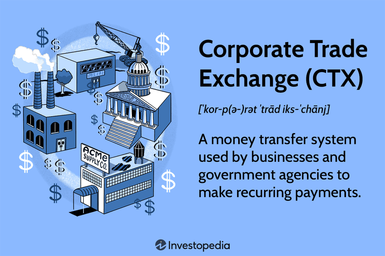

The evolution of corporate trade payments and business payment systems represents a significant chapter in the history of financial transactions. At the heart of this development was the Corporate Trade Payment (CTP) system, introduced in 1983. Designed to facilitate corporate and government transactions via the Automated Clearing House (ACH) system, CTP aimed to streamline and adapt the existing ACH framework to better accommodate the needs of commercial transactions. Its initial introduction brought about critical benefits like reduced postage and bank fees, which marked a significant advancement in electronic fund transfers. However, as technology advanced, the limitations of CTP became increasingly apparent, necessitating newer, more flexible solutions.

The Corporate Trade Exchange (CTX) emerged in the late 1990s as the successor to CTP, addressing many of the inefficiencies and limitations that plagued its predecessor. CTX introduced significant improvements, including enhanced data handling capabilities and support for multiple invoices per transaction. Based on the ANSI X12 standard, CTX improved data interchange standards, offering businesses a more robust and adaptable system for automating recurring payments and enhancing organizational efficiency.



This article also explores the implications of algorithmic trading within the context of modern payment systems. Algorithmic trading, characterized by the use of computer algorithms to automatically execute orders, has revolutionized the speed, accuracy, and efficiency of transaction processing. Its integration with systems like CTX presents numerous synergies, particularly in adapting to real-time market changes and optimizing financial operations.

Understanding these systems' evolution is crucial for grasping both the complexities and advancements in corporate trade payments. The current trends in business payment systems reflect these advancements, marked by the digitalization surge and fintech innovations. Developments such as blockchain technology, real-time payment processing, and the integration of AI and machine learning are enabling smarter, faster, and more secure transactions.

As business payment systems continue to advance, the historical lessons from CTP and CTX provide a valuable framework for future innovations. The integration of sophisticated algorithmic trading techniques is poised to play a pivotal role in future payment systems, suggesting a future rich with possibilities as these systems become increasingly integrated and efficient. Businesses that maintain adaptability and awareness of these trends will undoubtedly be better positioned to capitalize on these innovations, ensuring optimal financial operations in an ever-evolving landscape.

## Table of Contents

## What Was Corporate Trade Payment (CTP)?

Corporate Trade Payment (CTP) represented an early innovation in the field of electronic fund transfers, launched in 1983 to facilitate corporate and government payments through the Automated Clearing House (ACH) system. The ACH network was initially designed to manage recurring payments such as payroll and utility bills. However, its limited capacity for handling commercial transactions prompted the introduction of CTP, which sought to streamline these processes by offering a digital alternative to paper-based methods.

One of the main objectives of the CTP system was to mitigate the inherent limitations of the ACH system at the time. Primarily, these limitations included slow processing times and a lack of support for additional transaction information, which were seen as barriers to the efficient management of commercial transactions. By transitioning from traditional methods such as checks to electronic payments, CTP significantly reduced the costs associated with postage and bank fees.

Despite its innovative foundation, the CTP system eventually faced challenges due to its inherent rigidity and lack of flexibility. While it provided a crucial step forward in electronic payment processing during the early 1980s, it struggled to adapt to the rapid technological advancements and evolving market demands of subsequent decades. This inability to evolve led to its gradual obsolescence and the rise of more advanced systems that could offer greater flexibility and data processing capabilities.

In terms of design and functionality, CTP facilitated corporate payments by electronically debiting and crediting accounts, thereby reducing manual intervention and errors associated with paper-based processes. The automation of transactions not only increased efficiency but also enhanced record-keeping accuracy, particularly for businesses managing substantial daily transaction volumes. Nonetheless, the limited capacity for encoding and processing additional information or payment advice within the system posed significant challenges, particularly for businesses aiming to automate accounts receivable processes.

Thus, while CTP was a pioneering development in electronic payments, its eventual decline underscored the need for continuous innovation and adaptability in financial systems to keep pace with changing business landscapes and technological progress.

## Understanding the Limitations of CTP

Corporate Trade Payment (CTP) faced several challenges that ultimately led to its decline. One of the primary issues was its inability to adapt swiftly to the rapidly advancing technological landscape and the increasing demand for more sophisticated electronic transactions. This rigidity in adaptation limited its utility and appeal to businesses increasingly reliant on electronic payment solutions.

A significant shortcoming of the CTP system was its limited data capabilities. This system struggled with the encoding and processing of additional information or payment advice alongside the transaction data. The inability to attach detailed remittance information within transactions posed substantial challenges for businesses. The limited data capacity restricted companies' ability to perform comprehensive transaction tracking and reconciliation, leaving substantial room for errors and inefficiencies.

Moreover, the lack of standardization within the CTP framework complicated the automation processes for businesses, particularly for automating accounts receivable functions. The absence of uniform standards meant that businesses had to invest additional resources and time to customize solutions that could integrate CTP into their existing financial systems. This lack of integration capability created barriers to achieving streamlined and efficient payment operations.

These cumulative limitations ultimately signaled the need for a more proficient and adaptable system, setting the stage for the development and adoption of the Corporate Trade Exchange (CTX). The advent of CTX aimed to overcome these challenges by introducing improvements in data handling and standardizing processes to facilitate smoother and more efficient electronic transactions.

## The Rise of Corporate Trade Exchange (CTX)

The Corporate Trade Exchange (CTX) emerged in the late 1990s as an evolution from the previous Corporate Trade Payment (CTP) system, addressing fundamental limitations and introducing significant improvements to corporate payment processes. One of the critical advancements offered by CTX is its capability to allow comprehensive tracking of payments. This feature ensures that businesses can maintain meticulous records of their financial transactions, facilitating better financial management and auditing.

In addition to enhanced tracking capabilities, CTX supports handling multiple invoices within a single transaction. This functionality is particularly beneficial for organizations managing bulk transactions, as it streamlines the payment process, reduces transaction costs, and minimizes the potential for errors associated with multiple individual payments. The ability to consolidate invoices in this manner increases efficiency and reduces administrative overheads.

The CTX format is based on the ANSI X12 standard, which is crucial for electronic data interchange (EDI). This standardization ensures that CTX is both adaptive and robust, capable of integrating seamlessly with various business systems. The use of ANSI X12 provides a framework that facilitates the consistent exchange of information across different platforms and organizations, thereby enhancing interoperability among various payment systems.

Today, CTX is widely used to automate recurring payments, significantly improving organizational efficiency. By automating these payments, businesses can ensure timely payment processing, improve cash flow management, and allocate resources more effectively. The CTX system's ability to automate and manage complex payment processes contributes to a more streamlined financial operation and supports the modern business's need for agility and precision in financial transactions.

## Integration with Algorithmic Trading

Algorithmic trading plays a pivotal role in enhancing the efficiency of business payment systems, such as the Corporate Trade Exchange (CTX). By employing complex mathematical models and algorithms, these systems optimize the execution of financial transactions, ensuring they are conducted with greater speed, precision, and cost-effectiveness.

The application of algorithms within payment systems facilitates real-time processing, enabling transactions to adapt instantaneously to market shifts. This adaptability is crucial for maintaining competitive edges in volatile markets, where traditional transaction methods may lag. Algorithms can process and analyze large datasets rapidly, identifying patterns and executing trades at milliseconds that human traders cannot match. This enhances both the accuracy and timeliness of transactions.

Efficiency gains are realized through algorithmic optimization techniques that streamline the reconciliation of payments and invoices. Algorithms can automate these processes, reducing manual intervention and minimizing errors. This is particularly beneficial for corporate entities handling numerous transactions, as it ensures consistent service quality and enhances the overall reliability of payment systems.

The integration of [algorithmic trading](/wiki/algorithmic-trading) with corporate payment systems also supports enhanced transactional security. Algorithms can detect anomalies and potential frauds by analyzing transaction patterns and flags discrepancies. This proactive approach mitigates risk and protects organizational assets.

Python, with its versatility and vast libraries such as NumPy and Pandas, is often used for implementing algorithmic strategies in payment systems. Below is a simple example of a Python script that might be used for processing and automating payment reconciliation tasks:

```python
import pandas as pd

def reconcile_payments(payments_df, invoices_df):
    # Merge dataframes to find matching transactions
    reconciled_df = pd.merge(payments_df, invoices_df, on='transaction_id', how='inner')

    # Identify unmatched transactions
    unmatched_payments = payments_df[~payments_df['transaction_id'].isin(reconciled_df['transaction_id'])]
    unmatched_invoices = invoices_df[~invoices_df['transaction_id'].isin(reconciled_df['transaction_id'])]

    return reconciled_df, unmatched_payments, unmatched_invoices

# Example usage:
payments = pd.DataFrame({'transaction_id': [1, 2, 3], 'amount': [100, 200, 300]})
invoices = pd.DataFrame({'transaction_id': [2, 3, 4], 'amount': [200, 300, 400]})

reconciled, unmatched_p, unmatched_i = reconcile_payments(payments, invoices)

print("Reconciled Transactions:\n", reconciled)
print("Unmatched Payments:\n", unmatched_p)
print("Unmatched Invoices:\n", unmatched_i)
```

In summary, the integration of algorithmic trading into corporate payment systems like CTX fosters a more dynamic, efficient, and secure financial ecosystem. As algorithms continue to evolve, they will further streamline business operations, enabling organizations to leverage data-driven insights for strategic decision-making.

## Current Trends in Business Payment Systems

Modern business payment systems are in a state of rapid transformation, driven largely by digitalization and the advent of fintech innovations. These technologies are redefining how businesses process, secure, and manage payments.

A significant trend shaping business payment systems is the incorporation of blockchain technology. Blockchain offers a decentralized and transparent approach to handling transactions, which enhances security and reduces the risk of fraud. The immutable nature of blockchain records ensures that transactions are traceable and verifiable, providing an additional layer of trust in financial dealings. This technology is being increasingly adopted across various industries to streamline processes and facilitate cross-border transactions.

Real-time payment processing is another critical development. This trend addresses the traditional delays associated with banking transactions, allowing money to be transferred almost instantly. It improves cash flow management for businesses and enhances customer satisfaction by providing instantaneous transaction confirmations. The implementation of systems like the U.S.'s RTP network or the European SEPA Instant Credit Transfer scheme exemplifies the move towards faster, more efficient payment methods.

Enhanced security measures have become a focal point as cyber threats continue to evolve. Multi-[factor](/wiki/factor-investing) authentication, tokenization, and encryption methods are being integrated into payment systems, ensuring that sensitive information remains protected against unauthorized access. These security enhancements are essential for maintaining customer trust and safeguarding business operations.

The integration of [artificial intelligence](/wiki/ai-artificial-intelligence) (AI) and [machine learning](/wiki/machine-learning) into business payment systems is facilitating smarter and more efficient transactions. AI algorithms can analyze transaction patterns to detect anomalies, predict fraudulent activities, and optimize payment processes. For example, machine learning models can be used to automate reconciliation processes in accounts payable and receivable, reducing manual effort and improving accuracy.

Consider a Python example of using a machine learning model to classify transactions as legitimate or fraudulent:

```python
from sklearn.model_selection import train_test_split
from sklearn.ensemble import RandomForestClassifier
from sklearn.metrics import accuracy_score

# Sample data: transactions with features and labels
X = [[amount, time_of_day, location, merchant_type] for transaction in transactions]
y = [1 if transaction.is_fraud else 0 for transaction in transactions]  # 1 for fraud, 0 for legitimate

# Split data into train and test sets
X_train, X_test, y_train, y_test = train_test_split(X, y, test_size=0.3, random_state=42)

# Initialize and train the Random Forest model
model = RandomForestClassifier(n_estimators=100, random_state=42)
model.fit(X_train, y_train)

# Predict and evaluate the model
y_pred = model.predict(X_test)
accuracy = accuracy_score(y_test, y_pred)
print(f"Model Accuracy: {accuracy:.2f}")
```

This example demonstrates how businesses can leverage machine learning to enhance the security and efficiency of their payment systems.

Overall, the current trends in business payment systems indicate a move towards greater speed, security, and intelligence in financial transactions. The alignment of these systems with advanced technologies not only meets the increasing demands of modern businesses but also sets the stage for future innovations.

## Conclusion

As business payment systems evolve, the lessons from Corporate Trade Payment (CTP) and Corporate Trade Exchange (CTX) remain relevant. CTP's initial innovation laid the groundwork, while CTX offered enhanced functionality and adaptability, reflecting ongoing advancements in payment systems. Understanding this progression is crucial as we consider future developments.

With the continuous advancement of technology, integrating sophisticated algorithmic trading techniques is anticipated to play a pivotal role in the evolution of payment systems. Algorithmic trading facilitates rapid, precise, and efficient transaction processing, adjusting in real time to market changes. These algorithms can optimize cash flow management and improve [liquidity](/wiki/liquidity-risk-premium), making them indispensable for future payment infrastructures.

To leverage these innovations effectively, businesses must stay informed and adaptive. They need to embrace emerging technologies, such as blockchain and artificial intelligence, which offer increased security and speed. The ability to swiftly integrate these technologies can provide competitive advantages, streamlining financial operations and enhancing decision-making.

Looking ahead, the future holds promising opportunities as payment systems become more integrated and efficient. Connectivity and interoperability between different systems are expected to increase, fueled by advances in digitalization and fintech. This will facilitate seamless transactions and data exchanges, improving both efficiency and customer experiences.

In conclusion, as business payment systems advance, they will likely embrace more complex algorithms and data-driven insights, leading to significant improvements in transaction processes. Businesses that remain proactive in their adoption of these technologies will be better positioned to thrive in the evolving financial landscape.

## References & Further Reading

[1]: Automated Clearing House Association (1983). ["ACH: The Electronic Payment Network."](https://paymentslearningcenter.org/ach-automated-clearing-house) National Automated Clearing House Association.

[2]: ["ANSI X12 Standard Overview."](https://www.edi2xml.com/blog/ansi-asc-x12-standards-overview/) American National Standards Institute.

[3]: Capon, N. (2004). ["Corporate Trade Payments via the Automated Clearing House Network."](https://www.investopedia.com/terms/c/corporate-trade-payment.asp) The Journal of Business Finance & Accounting.

[4]: Gomber, P., Arndt, B., Lutat, M., & Uhle, T. (2011). ["High-Frequency Trading."](https://papers.ssrn.com/sol3/papers.cfm?abstract_id=1858626) A Survey on Market Impact, Regulation, and Research Agenda.

[5]: Chakravorti, S. & Roson, R. (2006). ["Platform Competition in Two-Sided Markets: The Case of Payment Networks."](https://www.degruyter.com/document/doi/10.2202/1446-9022.1092/html) Review of Network Economics, 5(1), 118-142.

[6]: Narayanan, A., Bonneau, J., Felten, E., Miller, A., & Goldfeder, S. (2016). ["Bitcoin and Cryptocurrency Technologies: A Comprehensive Introduction."](https://press.princeton.edu/books/hardcover/9780691171692/bitcoin-and-cryptocurrency-technologies) Princeton University Press. 

[7]: Serrano, R., & Fernandez, J. (2016). ["Integrating Blockchain with ERP Systems."](https://www.researchgate.net/publication/374742873_Article_ERP_with_Blockchain) International Journal of Business and Systems Research.  

[8]: Lopez de Prado, M. (2018). ["Advances in Financial Machine Learning."](https://www.amazon.com/Advances-Financial-Machine-Learning-Marcos/dp/1119482089) Wiley.