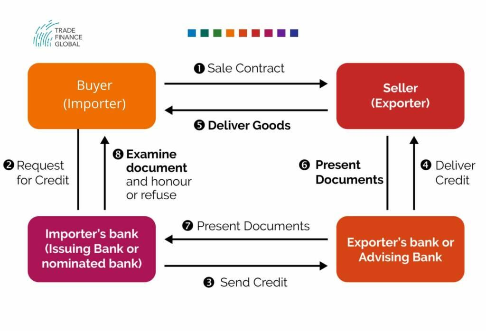

## Table of Contents

## What is corporate trade payment?

Corporate trade payment is a way for businesses to pay each other for goods or services without using cash. Instead of money, they might use other things they have, like extra products or services they don't need. This can be helpful when a company is short on cash but still needs to keep doing business. It's like trading or bartering, but on a bigger scale between companies.

For example, a company that makes furniture might trade some of its chairs to a tech company in exchange for computer equipment. Both companies get what they need without spending cash. This can also help companies save money on taxes because they are not dealing with cash transactions. It's a smart way for businesses to keep operating smoothly even when money is tight.

## Why is corporate trade payment important for businesses?

Corporate trade payment is important for businesses because it helps them keep going even when they don't have a lot of cash. Imagine a company that makes toys but doesn't have enough money to buy the materials it needs. By trading some of its toys with another company that has the materials, both companies can keep working without spending cash. This can be a lifesaver for businesses that are struggling to stay afloat.

It also helps businesses save money on taxes. When companies trade goods or services instead of using cash, they might not have to pay as much in taxes. This can make a big difference for a company's bottom line. Plus, corporate trade payment can help build stronger relationships between businesses. When companies trade with each other, they get to know each other better and might find new ways to work together in the future.

## What are the common methods of corporate trade payment?

One common method of corporate trade payment is bartering. This is when two companies trade goods or services directly with each other without any money changing hands. For example, a restaurant might trade meals to a cleaning company in exchange for cleaning services. This helps both companies get what they need without spending cash.

Another method is using trade exchanges or barter networks. These are like special clubs where businesses can join and trade with other members. They use a kind of fake money called trade credits instead of real cash. A company can earn trade credits by offering its goods or services to other members, and then use those credits to get things they need from other members. This can be really helpful for businesses that want to save cash but still keep trading.

Sometimes, companies also use countertrade. This is when a company agrees to buy something from another company, but instead of paying with money, they agree to give something else in return. For example, a car manufacturer might buy steel from a steel company and pay for it by sending cars back to the steel company. Countertrade can be more complicated than simple bartering, but it's another way for businesses to trade without using cash.

## How does the process of corporate trade payment work?

The process of corporate trade payment starts when two companies agree to trade goods or services instead of using cash. For example, a bakery might need new ovens but doesn't have enough money to buy them. They could trade some of their baked goods to a company that sells ovens. Both companies talk and agree on what they will trade and how much it's worth. Once they agree, they make the trade. The bakery gets the ovens it needs, and the oven company gets some delicious baked goods.

Sometimes, companies use trade exchanges to make these trades easier. A trade exchange is like a club where businesses join and trade with each other using trade credits instead of real money. A company can earn trade credits by offering its goods or services to other members of the exchange. Then, they can use those credits to get things they need from other members. This way, businesses can keep trading even when they're short on cash. It's like a big community where everyone helps each other out.

## What are the key components of a corporate trade payment system?

A corporate trade payment system has a few key parts that make it work smoothly. First, there needs to be an agreement between the companies involved. They have to talk and decide what they will trade and how much it's worth. This can be simple, like trading baked goods for ovens, or more complex, like using trade credits in a trade exchange. The agreement is important because it makes sure both companies are happy with the trade and know what to expect.

Another key part is the method of trade. Companies can use direct bartering, where they trade goods or services straight with each other. Or, they might join a trade exchange, which acts like a big club where businesses trade using fake money called trade credits. Some companies also use countertrade, where they agree to buy something and pay for it with something else instead of cash. The method of trade helps businesses keep going even when they don't have a lot of money.

## What are the benefits of using electronic payment systems in corporate trade?

Using electronic payment systems in corporate trade makes things a lot easier and faster. Instead of waiting for checks or dealing with cash, companies can send and receive payments with just a few clicks. This means they can get the things they need more quickly and keep their business running smoothly. It also cuts down on the time and money spent on handling paper payments, which can be a big help for businesses trying to save costs.

Electronic payment systems are also safer and more secure than using cash or checks. They use special codes and protections to keep transactions safe from fraud or theft. This gives businesses peace of mind knowing their money is secure. Plus, electronic systems keep a clear record of all transactions, making it easier to track and manage payments. This can be really useful for keeping good records and making sure everything is done correctly.

## How do international trade payments differ from domestic ones?

International trade payments can be more complicated than domestic ones because they involve different countries with different rules and currencies. When companies trade across borders, they have to deal with exchange rates, which is how much one country's money is worth compared to another's. This can make prices go up or down and add extra costs. Also, there are more rules to follow, like import and export laws, which can make the whole process take longer and be more expensive.

Another big difference is the way payments are made. For international trade, companies often use special methods like letters of credit or wire transfers. A letter of credit is like a promise from a bank that the payment will be made once certain conditions are met. Wire transfers are quick ways to send money from one country to another, but they can also be costly. These methods help make sure the payment goes through safely, but they add steps and costs that you don't usually see in domestic trade.

Despite these challenges, international trade payments can open up new opportunities for businesses. Trading with companies in other countries can help a business grow and reach new customers. But it's important for companies to understand the extra steps and costs involved so they can plan and manage their international trades well.

## What are the risks associated with corporate trade payments and how can they be mitigated?

Corporate trade payments can come with some risks. One big risk is that one company might not keep their part of the deal. For example, if a bakery trades baked goods for ovens, the oven company might not send the ovens on time or at all. This can cause big problems for the bakery that was counting on those ovens. Another risk is that the value of what's being traded might change. If a company trades something and then the price of that thing goes down, they might feel like they got a bad deal. Also, there can be tax issues if the trade isn't reported correctly.

To lower these risks, companies can take a few steps. First, they should always have a clear agreement in writing that spells out what each company will do and when. This can help make sure both sides stick to the deal. Companies can also use trade exchanges, which act like a middleman and can help make sure trades are fair and safe. It's also a good idea to keep good records of all trades and check with a tax expert to make sure everything is done right. By being careful and planning ahead, companies can make corporate trade payments work well for them.

## What role do banks play in facilitating corporate trade payments?

Banks play a big part in helping companies with their trade payments, especially when it comes to international trade. They offer services like letters of credit, which are like promises from the bank that the payment will be made once certain conditions are met. This helps make sure that both companies feel safe about the trade. Banks also handle wire transfers, which are quick ways to send money from one country to another. These services help businesses trade with confidence, knowing that their payments will go through safely and on time.

Besides helping with payments, banks can also give advice and support to companies. They can help businesses understand the rules and risks of trading across borders. Banks might also offer loans or other financial help if a company needs cash to make a trade work. By working with banks, companies can manage their trade payments better and grow their business without worrying too much about the money side of things.

## How have technological advancements impacted corporate trade payment mechanisms?

Technological advancements have made corporate trade payments a lot easier and faster. In the past, companies had to use checks or cash, which could take a long time to send and receive. Now, with electronic payment systems, businesses can send and receive money with just a few clicks. This means they can get the things they need more quickly and keep their business running smoothly. Electronic systems also use special codes and protections to keep transactions safe from fraud or theft, giving businesses peace of mind.

Another big change is the use of blockchain and cryptocurrencies in corporate trade. Blockchain is like a big, secure list that keeps track of all trades and payments. It makes sure that once a trade is recorded, it can't be changed or deleted. This adds an extra layer of safety and trust to the trade process. Cryptocurrencies, like Bitcoin, can be used for payments too, especially in international trade where different currencies can be a problem. These technologies are still new, but they're making it easier for businesses to trade with each other, no matter where they are in the world.

## What are the emerging trends in corporate trade payment solutions?

One big trend in corporate trade payment solutions is the use of blockchain technology. Blockchain is like a special kind of record-keeping that makes sure all trades and payments are safe and can't be changed once they're recorded. This helps businesses trust each other more when they trade, especially if they're in different countries. Another trend is the growing use of cryptocurrencies like Bitcoin for payments. These digital currencies can make it easier for companies to trade across borders without worrying about different kinds of money.

Another trend is the rise of smart contracts. These are like automatic agreements that use technology to make sure both sides do what they promised. For example, if a company agrees to trade baked goods for ovens, a smart contract can make sure the ovens are sent before the payment is made. This cuts down on the risk that one company won't keep their part of the deal. Also, more companies are using mobile apps and online platforms to handle their trade payments. These tools make it easy to send and receive payments from anywhere, anytime, making the whole process faster and simpler.

## How can a company optimize its corporate trade payment strategy for efficiency and cost-effectiveness?

To optimize its corporate trade payment strategy, a company should first focus on clear agreements and good communication with trading partners. This means having written contracts that spell out what each side will do and when. By making sure everyone understands the deal, the company can avoid surprises and disagreements. Using trade exchanges can also help because they act like a middleman and can make sure trades are fair and safe. Plus, keeping good records of all trades is important for managing payments and dealing with taxes correctly.

Another way to improve efficiency and save money is by using electronic payment systems. These systems make sending and receiving payments quick and easy, cutting down on the time and cost of handling paper payments. They also keep transactions safe with special protections against fraud. Companies can also look into new technologies like blockchain and smart contracts. Blockchain keeps a secure record of all trades, while smart contracts can automatically make sure both sides stick to the deal. By using these tools and staying up-to-date with new trends, a company can make its trade payments work better and save money.

## References & Further Reading

[1]: Automated Clearing House Association (1983). ["ACH: The Electronic Payment Network."](https://paymentslearningcenter.org/ach-automated-clearing-house) National Automated Clearing House Association.

[2]: ["ANSI X12 Standard Overview."](https://www.edi2xml.com/blog/ansi-asc-x12-standards-overview/) American National Standards Institute.

[3]: Capon, N. (2004). ["Corporate Trade Payments via the Automated Clearing House Network."](https://www.investopedia.com/terms/c/corporate-trade-payment.asp) The Journal of Business Finance & Accounting.

[4]: Gomber, P., Arndt, B., Lutat, M., & Uhle, T. (2011). ["High-Frequency Trading."](https://papers.ssrn.com/sol3/papers.cfm?abstract_id=1858626) A Survey on Market Impact, Regulation, and Research Agenda.

[5]: Chakravorti, S. & Roson, R. (2006). ["Platform Competition in Two-Sided Markets: The Case of Payment Networks."](https://www.degruyter.com/document/doi/10.2202/1446-9022.1092/html) Review of Network Economics, 5(1), 118-142.

[6]: Narayanan, A., Bonneau, J., Felten, E., Miller, A., & Goldfeder, S. (2016). ["Bitcoin and Cryptocurrency Technologies: A Comprehensive Introduction."](https://press.princeton.edu/books/hardcover/9780691171692/bitcoin-and-cryptocurrency-technologies) Princeton University Press. 

[7]: Serrano, R., & Fernandez, J. (2016). ["Integrating Blockchain with ERP Systems."](https://www.researchgate.net/publication/374742873_Article_ERP_with_Blockchain) International Journal of Business and Systems Research.  

[8]: Lopez de Prado, M. (2018). ["Advances in Financial Machine Learning."](https://www.amazon.com/Advances-Financial-Machine-Learning-Marcos/dp/1119482089) Wiley.