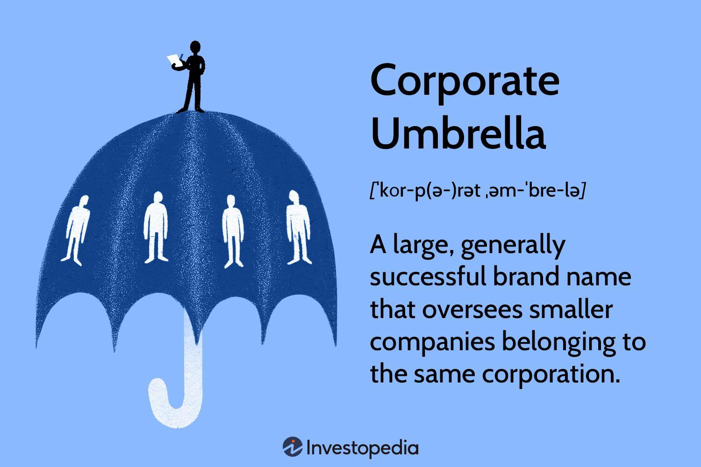

In today’s fast-paced business environment, companies often employ intricate structures to manage their operations and investments. One such structure is the corporate umbrella model, which can be advantageous for diversifying revenue streams and leveraging brand power. This model typically involves a large, overarching corporation that provides financial backing, brand recognition, and operational support to its various subsidiaries. These subsidiaries, while benefiting from the parent company’s resources, maintain a certain degree of operational independence, allowing them to explore distinct markets or specializations.

However, like any corporate strategy, the corporate umbrella model comes with its own set of challenges and disadvantages. Managing multiple subsidiaries under one corporate umbrella can lead to issues such as rigidity in operations, coordination challenges across diverse sectors or geographical locations, and a potential lack of accountability. These issues can hinder the ability of subsidiaries to innovate or respond swiftly to market changes.



This article aims to explore the disadvantages of the corporate umbrella structure, especially in contexts involving algorithmic trading and other complex business ventures. Companies engaged in algorithmic trading, which rely on rapid decision-making and adaptability, may find that the corporate umbrella model poses unique challenges, particularly with respect to regulatory requirements and the need for swift technological integration. Ultimately, understanding these disadvantages can help businesses refine their strategies to leverage the benefits of a corporate umbrella model while minimizing potential downsides.

## Table of Contents

## Understanding Corporate Umbrella Structures

A corporate umbrella structure is characterized by a large corporation that operates through a collection of smaller, semi-autonomous companies or subsidiaries. This organizational strategy allows the central corporation to manage a diverse range of businesses under one consolidated brand. The corporate umbrella provides significant advantages that include financial support, enhanced brand recognition, and comprehensive operational assistance to its subsidiaries.

Financial backing is a primary benefit of the corporate umbrella model. The parent company can allocate resources effectively, ensuring that subsidiaries have the fiscal means to pursue growth opportunities and manage day-to-day operations. This financial support can manifest in forms such as direct investment, favorable loan terms, or shared financial services.

Brand recognition is another strategic advantage. The overarching brand creates a unified image that subsidiaries can leverage to increase their market visibility and credibility. Subsidiaries gain consumer trust more rapidly by being associated with a well-established brand, which can lead to an expanded customer base and higher sales revenue. This confluence of branding enhances marketing efforts, as each entity within the umbrella can contribute to and benefit from the collective brand's reputation.

Operational support is further facilitated by shared services across the corporate structure. Functions such as human resources, legal support, and information technology services can be centralized, reducing redundancy and costs. This centralized approach provides subsidiaries access to advanced systems and processes that they might not be able to afford independently. 

While subsidiaries benefit from these shared resources, they also retain a degree of operational independence. This autonomy enables them to make decisions tailored to their specific market environments and operational needs, fostering innovation and responsiveness. Each subsidiary can focus on its core business operations while aligning with the strategic objectives set by the parent corporation.

In conclusion, the corporate umbrella structure is a strategic model designed to harness the collective strengths of its subsidiaries while offering them financial, brand, and operational support. This symbiosis enables both the parent company and its subsidiaries to thrive, albeit within a framework that balances independence with central oversight.

## Disadvantages of Corporate Umbrella Structures

Despite the apparent advantages, corporate umbrella structures can present several significant challenges that impact their effectiveness and efficiency. These challenges often stem from issues related to rigidity, coordination, and a lack of accountability within the organizational framework.

With multiple subsidiaries operating under a single corporate umbrella, the inflexibility inherent in such structures can impede innovation and growth. Subsidiaries may find themselves bound by stringent corporate policies and procedures that apply universally across the umbrella. While these regulations are intended to promote coherence and consistency, they can stifle creativity and hinder subsidiaries from adapting quickly to market changes or exploring innovative business solutions. In essence, the centralization of decision-making processes under the corporate umbrella can restrict the autonomy of individual subsidiaries, resulting in missed opportunities for innovation.

Coordination challenges are another significant disadvantage of corporate umbrellas, particularly when subsidiaries are spread across varied geographical regions or industry sectors. The breadth of operations under one umbrella can lead to miscommunication and operational inefficiencies. For instance, subsidiaries might operate under different regulatory environments, cultural contexts, or market conditions, which necessitate distinct strategies and operational approaches. Misalignment in these areas can create friction, leading to delays and inconsistencies in the implementation of business strategies.

Furthermore, the lack of accountability within corporate umbrella structures can also pose risks. When responsibilities and decision-making powers are distributed across a broad structure, pinpointing accountability for failures or suboptimal performance can be difficult. This diffusion of accountability can result in a culture where underperformance is not adequately addressed, potentially leading to systemic inefficiencies.

In summary, while the corporate umbrella model can centralize resources and brand strength, it also brings challenges such as rigidity, coordination difficulties, and accountability issues. These challenges require careful management and strategic adjustments to ensure that the benefits of the structure are fully realized without being overshadowed by its inherent disadvantages.

## Impact on Algorithmic Trading Firms

The corporate umbrella structure presents distinct challenges for [algorithmic trading](/wiki/algorithmic-trading) firms, primarily due to the necessity for swift decision-making and adaptability. Algorithmic trading relies heavily on the ability to process large datasets and execute trades at millisecond speeds. However, a centralized corporate policy, inherent in umbrella structures, might not align with the dynamic nature of markets, resulting in regulatory challenges and delays in decision-making processes.

Centralized policies can hinder the agility of algorithmic trading operations. When decision-making processes are bogged down by corporate bureaucracy, the speed advantage critical for algorithmic trading diminishes. This is particularly problematic when regulatory requirements need to be met swiftly. For instance, if a new regulatory change is announced, trading algorithms might require immediate adjustments to comply. Centralized structures often slow down this response time due to layers of approval, potentially leading to non-compliance or financial losses.

Moreover, the coordination required to integrate cutting-edge technological solutions across various subsidiaries can be complex and problematic. Subsidiaries under a corporate umbrella may operate on different technological platforms or systems, making seamless integration challenging. This can prevent the efficient deployment and operation of advanced trading algorithms, which rely on harmonized systems for optimal performance.

To illustrate, consider a scenario where a corporate umbrella oversees multiple trading platforms. If each subsidiary uses a different system architecture or coding language, integrating a unified algorithmic trading strategy can become cumbersome. Python, often used for algorithmic trading due to its rich libraries like NumPy and pandas, might face compatibility issues if other subsidiaries employ differing programming languages. Hence, the lack of standardization can impede the rapid deployment of algorithmic strategies.

Ultimately, these challenges underscore the need for algorithmic trading firms within corporate umbrellas to advocate for more decentralized decision-making processes. Allowing subsidiaries the autonomy to adapt quickly to technological and regulatory changes could enhance their competitive edge.

## Financial Implications

Adverse financial situations experienced by a subsidiary within a corporate umbrella can significantly affect the entire corporate structure. When one subsidiary faces financial difficulties, it can create a ripple effect, leading to a decline in the overall perception of the corporate umbrella. This downturn in perception can, in turn, negatively impact share prices and diminish investor confidence across the board.

One of the primary reasons for this interconnected financial impact lies in the brand association under the corporate umbrella. Investors and stakeholders often perceive subsidiaries as part of a singular entity. Consequently, any negative financial development in one subsidiary can prompt concerns about potential vulnerabilities in other parts of the corporate group. This perception not only affects investor sentiment but can also lead to a loss of market value as stock prices respond to these concerns.

Additionally, the financial backing provided by the corporate umbrella can lead subsidiaries to engage in riskier ventures than they might independently. Subsidiaries may assume that the overarching company's financial resources will shield them from the repercussions of taking significant financial risks. In some scenarios, this can result in a moral hazard, where subsidiaries willingly take unwarranted risks due to the perceived safety net offered by the larger corporation.

To illustrate this point with a simple Python example, consider a simulation where a subsidiary decides to undertake a financial venture with varying levels of risk based on the perceived security from the corporate umbrella:

```python
import numpy as np

def evaluate_risk(venture_risk, umbrella_support):
    """Evaluate financial impact of a venture with risk and umbrella support"""
    outcome = np.random.choice(['Success', 'Failure'], p=[1 - venture_risk, venture_risk])
    if outcome == 'Failure':
        if umbrella_support:
            return "Loss mitigated by corporate umbrella"
        else:
            return "Significant financial loss"
    return "Venture successful"

# Parameters: venture risk and umbrella support
venture_risk = 0.4  # 40% risk of failure
umbrella_support = True

result = evaluate_risk(venture_risk, umbrella_support)
print(result)
```

In this example, a subsidiary with a 40% risk of failure undertakes a financial venture. The presence of umbrella support likely mitigates losses from unsuccessful ventures, potentially encouraging riskier endeavors than advisable. Such risk-taking behavior can accumulate over time, leading to potential financial distress, impacting not only the individual subsidiary but also reverberating through the entire corporate structure.

Hence, while the corporate umbrella model provides numerous strategic benefits, acknowledging and managing these financial implications are crucial to maintaining a healthy and secure financial ecosystem within the corporate structure.

## Case Study: Corporate Scandals and Their Ripple Effects

Corporate scandals within umbrella structures reveal the interconnected risks inherent in such configurations. One prominent example is the Volkswagen emissions scandal, where deceptive practices in a single subsidiary led to widespread reputational damage affecting the entire Volkswagen Group. In 2015, it was discovered that Volkswagen had installed software in diesel engines to cheat emissions tests, a decision that originated in a specific division but had ramifications throughout the conglomerate.[^1]

The fallout from the scandal was not confined to legal and financial penalties, although these were substantial, with Volkswagen facing billions in fines and settlements. The reputational damage extended to various other brands under the Volkswagen Group umbrella, such as Audi and Porsche, which also experienced a decline in consumer trust and sales. This scenario underscores how issues within one part of a corporate structure can tarnish the image of the entire network, ultimately affecting all subsidiaries.

Another illustrative case is the Toshiba accounting scandal, where it was revealed that the company had been inflating its profits for years. This scandal, originating from questionable practices within certain divisions, led to a massive loss of investor confidence and a significant drop in Toshiba’s stock value. The interconnected nature of the corporate umbrella meant that the scandal did not just affect the divisions directly involved but also raised questions about the corporate governance practices throughout the group, thereby impacting associated business units and tarnishing their market perception.[^2]

These instances highlight a key disadvantage of the corporate umbrella model: the potential for reputational risk to ripple across all entities under the umbrella. When one subsidiary engages in unethical or illegal activities, the damage can extend to other parts of the organization, leading to decreased customer loyalty, loss of market share, and challenges in maintaining strong brand equity across all subsidiaries. Such risks emphasize the importance of robust governance and compliance strategies to prevent isolated incidents from escalating into corporate-wide crises.

[^1]: Hotten, R. (2015). Volkswagen: The scandal explained. BBC News. Retrieved from https://www.bbc.com/news/business-34324772

[^2]: Soble, J., & Alderman, L. (2015). Toshiba Seeks to Clear Air After an Accounting Scandal. The New York Times. Retrieved from https://www.nytimes.com/2015/09/15/business/international/toshiba-annual-meeting.html

## Mitigation Strategies

To address the inherent disadvantages of corporate umbrella structures, companies need to adopt a multidimensional approach focused on improving compliance, fostering agility, and enhancing communication. 

Enhanced compliance frameworks are critical for alleviating issues like coordination challenges and operational inefficiencies. By implementing robust compliance measures, companies can ensure that subsidiaries adhere to standardized policies and procedures, thereby reducing miscommunication and ensuring alignment with corporate objectives. Regular audits serve as a vital component of these compliance frameworks, providing a mechanism to monitor and evaluate subsidiary performance and adherence to established guidelines. Audits can identify potential areas of risk or mismanagement, enabling timely corrective measures.

Moreover, fostering stronger communication channels across subsidiaries is vital for mitigating coordination challenges. Effective communication can bridge geographical or sectoral divides, ensuring that all subsidiaries are aligned with the overall strategic goals of the corporate umbrella. This includes deploying technology-driven communication tools and platforms that facilitate real-time information sharing and collaboration, thereby reducing inefficiencies.

Agility in decision-making is another pivotal strategy. Subsidiaries are often constrained by rigid corporate policies, hindering their ability to innovate or respond swiftly to market changes. By emphasizing agile methodologies and promoting decentralized decision-making processes, subsidiaries can operate with greater independence. This flexibility enables them to tailor their strategies to specific market needs and react promptly to emerging opportunities or threats.

Introducing agile practices can be supported by technology. For example, companies can employ tools such as Python for data analytics to quickly adapt to market changes. Below is a simple Python code snippet that can help a subsidiary analyze market trends:

```python
import pandas as pd

# Load market data
data = pd.read_csv('market_data.csv')

# Calculate moving average to identify market trends
data['MovingAverage'] = data['Price'].rolling(window=5).mean()

# Identify buying signals
buy_signals = data[data['Price'] < data['MovingAverage']]

print("Buy signals based on moving average:")
print(buy_signals)
```

By employing such data-driven decision-making tools, subsidiaries can independently analyze market data, enhancing their ability to make informed strategic decisions swiftly.

In conclusion, addressing the disadvantages inherent in corporate umbrella structures involves a diligent focus on enhanced compliance, agile decision-making, and effective communication. These strategies not only mitigate the potential risks but also empower subsidiaries to leverage the benefits of being part of a larger corporate entity.

## Conclusion

The corporate umbrella model, while beneficial for creating diversified revenue streams and leveraging brand presence, poses risks that require meticulous management. Its inherent complexity means that companies may face difficulties in maintaining agility and quick adaptability. This is particularly relevant for sectors such as algorithmic trading, where the ability to quickly respond to market changes is crucial. In these fields, the traditional constraints of a corporate umbrella structure—such as rigid corporate policies and potential communication barriers—can be detrimental to performance. Therefore, introducing more autonomy and flexibility within subsidiaries could enhance responsiveness and efficiency.

By recognizing and understanding the disadvantages of a corporate umbrella structure, businesses can better strategize to capitalize on its benefits while mitigating potential negative impacts. This strategic balance involves integrating robust compliance mechanisms, fostering agile decision-making processes, and ensuring effective communication across all parts of the organization. Through such efforts, companies can optimize the advantages of the model without being encumbered by its challenges.

## References & Further Reading

[1]: Hotten, R. (2015). ["Volkswagen: The scandal explained."](https://www.bbc.com/news/business-34324772) BBC News.

[2]: Soble, J., & Alderman, L. (2015). ["Toshiba Seeks to Clear Air After an Accounting Scandal."](https://businessethicscases.blogspot.com/2017/03/toshiba-abuses-accounting-policy-when.html) The New York Times.

[3]: Bergstra, J., Bardenet, R., Bengio, Y., & Kégl, B. (2011). ["Algorithms for Hyper-Parameter Optimization."](https://dl.acm.org/doi/10.5555/2986459.2986743) Advances in Neural Information Processing Systems 24.

[4]: ["Advances in Financial Machine Learning"](https://www.amazon.com/Advances-Financial-Machine-Learning-Marcos/dp/1119482089) by Marcos Lopez de Prado

[5]: ["Evidence-Based Technical Analysis: Applying the Scientific Method and Statistical Inference to Trading Signals"](https://www.amazon.com/Evidence-Based-Technical-Analysis-Scientific-Statistical/dp/0470008741) by David Aronson

[6]: ["Machine Learning for Algorithmic Trading"](https://www.amazon.com/Machine-Learning-Algorithmic-Trading-alternative/dp/1839217715) by Stefan Jansen

[7]: ["Quantitative Trading: How to Build Your Own Algorithmic Trading Business"](https://github.com/LucindaYa/quant-resources/blob/master/Quantitative%20Trading%20How%20to%20Build%20Your%20Own%20Algorithmic%20Trading%20Business.pdf) by Ernest P. Chan