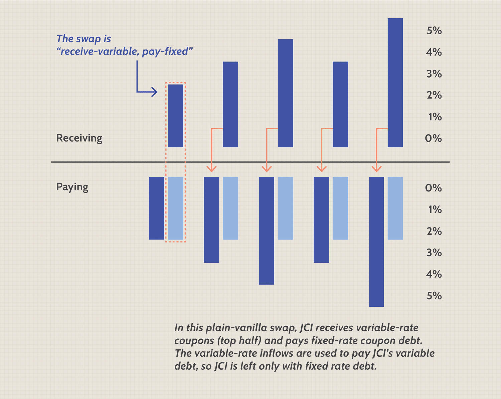

## Table of Contents

## What are derivatives and how do they work?

Derivatives are financial instruments whose value is based on the value of an underlying asset, like stocks, bonds, commodities, or currencies. They are called "derivatives" because their value is derived from something else. For example, if you buy a derivative that is based on the price of gold, the value of that derivative will go up or down depending on what happens to the price of gold. People use derivatives for many reasons, such as to hedge against risks or to speculate on future price movements.

Here's how they work: Imagine you think the price of oil is going to go up in the future. You could buy a futures contract, which is a type of derivative, that gives you the right to buy oil at today's price at a specific date in the future. If the price of oil does go up, you can buy it at the lower price you locked in with the futures contract and then sell it at the higher market price, making a profit. On the other hand, if you own a company that needs oil and you're worried the price might go up, you could use the same futures contract to lock in today's price and protect your business from rising costs. This is called hedging.

## What is risk hedging and why is it important for corporations?

Risk hedging is like buying insurance for a business. It means using financial tools, like derivatives, to protect against bad things that might happen, such as prices going up or down too much. For example, if a company uses a lot of oil and the price of oil might go up, they can use a futures contract to lock in today's price for the future. This way, even if the price of oil goes up, the company won't have to pay more than they planned.

This is important for corporations because it helps them plan better and stay safe from big surprises. If a company knows how much they will have to pay for something important, like oil or wheat, they can make better budgets and not worry about sudden price changes ruining their plans. This stability helps them focus on growing their business instead of worrying about what might go wrong.

## How can derivatives be used for risk hedging in a corporate setting?

In a corporate setting, derivatives can be used for risk hedging by locking in prices for goods or services that the company needs. Imagine a company that makes plastic products and needs a lot of oil to make them. If the price of oil is going up and down a lot, it can be hard for the company to plan its costs. By using a futures contract, which is a type of derivative, the company can agree to buy oil at today's price at a future date. This means they don't have to worry if the price of oil goes up because they already locked in a good price.

Using derivatives for risk hedging also helps a company manage currency risks. If a company does business in different countries, it might get paid in different currencies. If one currency gets weaker compared to another, the company could lose money. To protect against this, the company can use a currency swap or a forward contract, which are types of derivatives. These tools let the company exchange one currency for another at a set rate in the future, so they know exactly how much money they will have, no matter what happens to the exchange rates. This makes it easier for the company to plan and stay financially stable.

## What are the most common types of derivatives used by corporations for hedging?

The most common types of derivatives used by corporations for hedging are futures contracts, options, and swaps. Futures contracts let a company agree to buy or sell something, like oil or wheat, at a set price on a future date. This helps the company know what they will pay for things they need, even if prices change a lot. For example, an airline might use futures contracts to lock in the price of jet fuel.

Options give a company the right, but not the obligation, to buy or sell something at a set price before a certain date. This is useful if a company wants to protect against price changes but also wants the chance to benefit if prices move in their favor. For instance, a farmer might buy an option to sell their crops at a good price, but if the market price goes up even more, they can choose not to use the option and sell at the higher price.

Swaps are agreements between two parties to exchange cash flows or other financial instruments. They are often used to manage [interest rate](/wiki/interest-rate-trading-strategies) risks or currency risks. For example, if a company has a loan with a variable interest rate and they want to make sure their payments stay the same, they can use an interest rate swap to exchange their variable rate for a fixed rate. Similarly, a company doing business in different countries might use a currency swap to protect against changes in exchange rates.

## Can you explain the difference between forwards, futures, options, and swaps in the context of corporate hedging?

Forwards and futures are both agreements to buy or sell something at a set price on a future date, but they have some key differences. A forward contract is a private agreement between two parties, often customized to fit their specific needs. For example, a company might use a forward contract to lock in the price of a raw material they need. Futures contracts, on the other hand, are standardized and traded on exchanges, making them easier to buy and sell. A corporation might use futures to hedge against price changes in commodities like oil or wheat, ensuring they know what they'll pay in the future.

Options give a company more flexibility than forwards or futures. An option gives the right, but not the obligation, to buy or sell something at a set price before a certain date. This means a company can protect itself from price increases while still being able to benefit if prices go down. For instance, a company might buy an option to buy oil at a certain price, but if the market price drops, they can choose not to use the option and buy at the lower market rate. This flexibility can be very valuable for corporations looking to hedge risks without losing potential gains.

Swaps are different from forwards, futures, and options because they involve exchanging cash flows or other financial instruments. A common type of swap is an interest rate swap, where a company might swap a variable interest rate on a loan for a fixed rate, helping them manage their debt costs more predictably. Another type is a currency swap, used by companies doing business in multiple countries to protect against fluctuations in exchange rates. By using swaps, corporations can better manage their financial risks and ensure more stable cash flows.

## What are the potential benefits of using derivatives for risk management in a corporation?

Using derivatives for risk management helps a corporation plan better and avoid big surprises. When a company uses derivatives like futures or options, it can lock in prices for things they need, like oil or wheat. This means they know exactly how much they will have to pay in the future, even if prices go up a lot. For example, if an airline uses futures to lock in the price of jet fuel, they can budget better and not worry about sudden price jumps hurting their business. This stability makes it easier for the company to focus on growing and improving, instead of worrying about what might go wrong.

Derivatives also help companies manage other types of risks, like changes in interest rates or currency values. If a company has a loan with a variable interest rate, they can use an interest rate swap to exchange that variable rate for a fixed rate. This way, their loan payments stay the same, making it easier to plan their finances. Similarly, if a company does business in different countries, they can use currency swaps to protect against changes in exchange rates. This means they know how much money they will have, no matter what happens to the value of different currencies. By using derivatives, corporations can create a safer and more predictable financial environment, which is good for their long-term success.

## What are the risks associated with using derivatives for hedging, and how can these be mitigated?

Using derivatives for hedging can be risky because they are complicated and can lead to big losses if not managed well. If the market moves in the opposite direction than expected, a company might lose money on the derivative while still having to deal with the original risk. For example, if a company uses a futures contract to lock in the price of oil, but the price of oil goes down instead of up, they might have to buy oil at a higher price than the market rate. Also, derivatives can be hard to understand, and if a company makes a mistake in how they use them, it can lead to big financial problems.

To mitigate these risks, companies need to be careful and have good plans in place. They should make sure they understand how the derivatives work and use them in a way that matches their overall risk management strategy. It's important to have clear rules and limits on how much they can use derivatives, and to keep a close eye on how they are doing. Companies can also work with experts in derivatives to help them make better decisions and avoid common mistakes. By being careful and having a good plan, companies can use derivatives to manage risks without getting into too much trouble.

## How does a corporation decide which derivatives to use for hedging specific risks?

When a corporation decides which derivatives to use for hedging, they first need to figure out what risks they want to protect against. This could be things like changes in the price of things they need to buy, like oil or wheat, or changes in interest rates or currency values. Once they know what risks they want to hedge, they look at different types of derivatives, like futures, options, and swaps, to see which ones will work best for their situation. For example, if they want to lock in the price of oil, they might choose a futures contract because it lets them agree to buy oil at today's price for a future date.

The corporation also thinks about how much flexibility they need. If they want the chance to benefit if prices move in their favor, they might choose options, which give them the right but not the obligation to buy or sell at a set price. If they are worried about interest rates or currency values, they might use swaps to exchange one type of payment for another. The company will also consider the costs of using different derivatives and how easy they are to manage. By carefully matching the right derivative to the specific risk they want to hedge, the corporation can protect itself and plan for the future more confidently.

## What are some real-world examples of corporations successfully using derivatives for risk hedging?

One real-world example is Southwest Airlines. They used futures contracts to lock in the price of jet fuel. By doing this, they protected themselves when the price of oil went up a lot. Other airlines had to pay more for fuel, but Southwest knew exactly how much they would spend, which helped them keep their costs down and stay competitive. This strategy helped Southwest make more money and keep their ticket prices lower than other airlines.

Another example is Coca-Cola. They use currency swaps to manage the risk of changing exchange rates. Coca-Cola sells its products all over the world, so they get paid in different currencies. If one currency gets weaker compared to another, it could hurt their profits. By using currency swaps, Coca-Cola can exchange one currency for another at a set rate in the future. This helps them know exactly how much money they will have, no matter what happens to the exchange rates. This stability helps Coca-Cola plan better and keep their business growing.

## How do regulatory frameworks affect the use of derivatives for corporate hedging?

Regulatory frameworks play a big role in how corporations use derivatives for hedging. Governments and financial authorities make rules to make sure that using derivatives is safe and fair. These rules can say things like how much money a company has to put aside when they use derivatives, what kinds of derivatives they can use, and how they have to report what they are doing. For example, after the 2008 financial crisis, new rules were made to make derivatives markets more transparent and to reduce risks. This means companies have to be more careful and follow strict guidelines when they use derivatives.

Even though these rules can make it harder for companies to use derivatives, they also help make the financial system safer. Companies have to show that they are using derivatives in a responsible way and not taking too many risks. This can make it easier for them to plan and manage their risks, because they know everyone else has to follow the same rules. Overall, regulatory frameworks help make sure that using derivatives for hedging is done in a way that protects both the company and the broader financial system.

## What advanced strategies can corporations employ using derivatives for more complex risk management?

Corporations can use advanced strategies with derivatives to manage more complex risks by combining different types of derivatives in a smart way. For example, they might use a strategy called a "collar," which involves buying a put option to protect against a price drop and selling a call option to help pay for the put option. This way, the company can limit how much they might lose if prices go down, while also capping how much they can gain if prices go up. Another advanced strategy is "delta hedging," which involves adjusting the number of options or futures contracts a company holds to keep their exposure to price changes at a certain level. This can help them manage risks more precisely, especially when prices are moving a lot.

Another strategy corporations might use is "dynamic hedging," where they change their derivative positions as market conditions change. This can be more effective than a static hedge because it allows the company to respond to new information and keep their risk at the level they want. For example, if a company is worried about the price of oil and it starts to go up, they might increase their use of futures contracts to lock in more of the price. By using these advanced strategies, corporations can manage complex risks better and make their financial planning more stable and predictable.

## How can the effectiveness of a derivatives hedging strategy be measured and evaluated?

To measure and evaluate the effectiveness of a derivatives hedging strategy, a corporation looks at how well it protects them from the risks they wanted to manage. They compare the costs and benefits of using the derivatives to what would have happened if they didn't use them. For example, if a company used futures to lock in the price of oil, they would see if their costs were lower than if they had bought oil at the market price. They also check if the strategy helped them plan better and avoid big surprises. By looking at these things, the company can see if the hedging strategy worked and if it was worth the money and effort.

Another way to evaluate the effectiveness is by looking at financial metrics like the company's earnings [volatility](/wiki/volatility-trading-strategies) and cash flow stability. If the hedging strategy made the company's earnings more predictable and kept their cash flows steady, it's a sign that it worked well. Companies also use risk management software and models to see how their hedging strategies perform under different market conditions. This helps them understand if the strategy is strong enough to handle different kinds of risks. By using these methods, corporations can decide if their derivatives hedging strategy is effective and make changes if needed to improve it.

## References & Further Reading

[1]: Hull, J. C. (2018). ["Options, Futures, and Other Derivatives."](https://www.semanticscholar.org/paper/Options%2C-Futures%2C-and-Other-Derivatives-Hull/89bdee500c8623864fc9eb7a471546aa713acc44) Pearson.

[2]: Lopez de Prado, M. (2018). ["Advances in Financial Machine Learning."](https://books.google.com/books/about/Advances_in_Financial_Machine_Learning.html?id=oU9KDwAAQBAJ) Wiley.

[3]: Aronson, D. R. (2007). ["Evidence-Based Technical Analysis: Applying the Scientific Method and Statistical Inference to Trading Signals."](https://onlinelibrary.wiley.com/doi/book/10.1002/9781118268315) Wiley.

[4]: Jansen, S. (2020). ["Machine Learning for Algorithmic Trading."](https://github.com/stefan-jansen/machine-learning-for-trading) Packt Publishing.

[5]: Chan, E. P. (2008). ["Quantitative Trading: How to Build Your Own Algorithmic Trading Business."](https://github.com/ftvision/quant_trading_echan_book) Wiley.

[6]: Black, F., & Scholes, M. (1973). ["The Pricing of Options and Corporate Liabilities."](https://www.cs.princeton.edu/courses/archive/fall09/cos323/papers/black_scholes73.pdf) Journal of Political Economy, 81(3), 637-654.

[7]: Glasserman, P. (2003). ["Monte Carlo Methods in Financial Engineering."](https://link.springer.com/book/10.1007/978-0-387-21617-1) Springer.

[8]: Froot, K. A., Scharfstein, D. S., & Stein, J. C. (1993). ["Risk Management: Coordinating Corporate Investment and Financing Policies."](https://onlinelibrary.wiley.com/doi/full/10.1111/j.1540-6261.1993.tb05123.x) Journal of Finance, 48(5), 1629-1658.