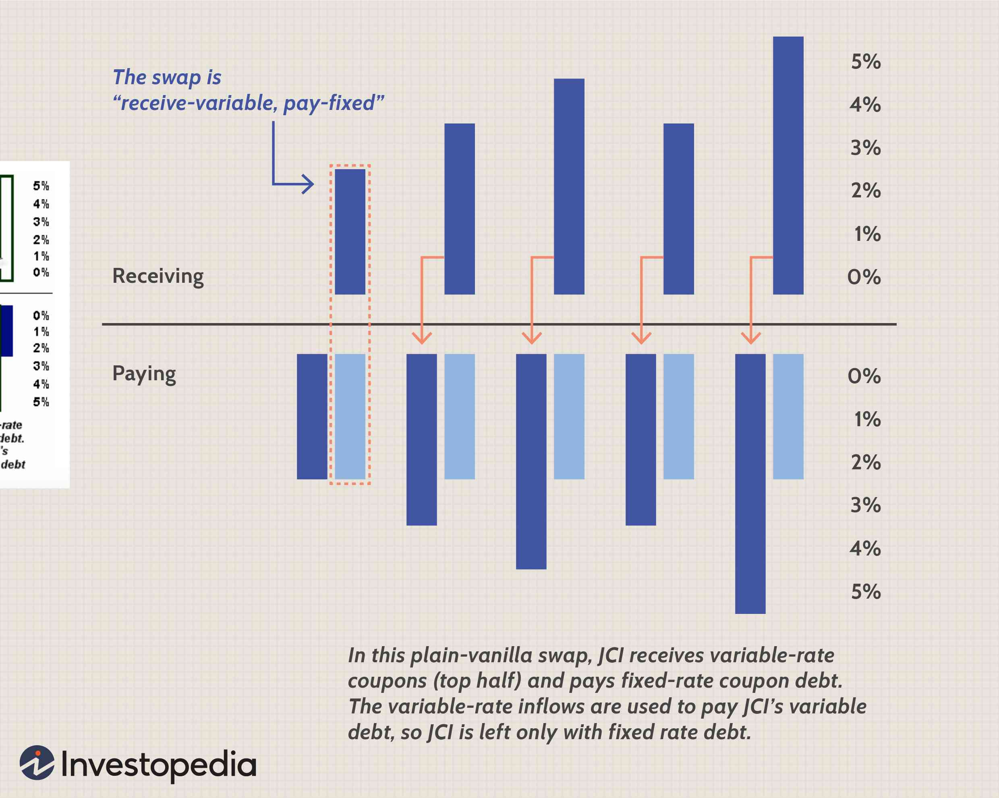

In today's dynamic financial markets, risk management has become a cornerstone for corporations aiming to safeguard their profitability and stability. The volatility and interconnected nature of global markets necessitate effective strategies to anticipate and mitigate potential financial threats. Corporate hedging, derivatives, and algorithmic trading are pivotal tools in this endeavor. These instruments and strategies offer corporations sophisticated methods to protect against unpredictable market movements, currency fluctuations, and interest rate changes.

Corporate hedging allows businesses to offset potential losses in other investments through the strategic use of financial instruments. By stabilizing cash flows and mitigating market volatility, hedging helps companies maintain profit margins even amidst economic turbulence. Derivatives—financial contracts whose value is based on underlying assets, rates, or indices—serve as essential instruments in risk management. They provide opportunities for hedging and speculation while necessitating careful attention to their inherent risks.



Algorithmic trading represents a technological advancement in the field, utilizing computer programs to execute trades rapidly and efficiently. This method supports precise execution of hedging strategies and reduces transaction costs, although it requires stringent controls to manage associated risks.

This article will explore the relationship between risk management and these financial tools, examining their operation, benefits, and potential downsides. By understanding and implementing these concepts, businesses are better equipped to make informed decisions that protect their financial wellbeing. With a robust risk management framework, companies can navigate the complexities of the financial markets, ensuring stability and success in an ever-changing economic landscape.

## Table of Contents

## Understanding Risk Management

Risk management is a fundamental aspect of corporate finance, encompassing the identification, analysis, and response to risk factors that may impact a corporation's financial health. In an increasingly volatile financial landscape, effective risk management strategies are vital for companies to minimize potential losses and seize opportunities for growth.

A comprehensive risk management framework typically includes several key components: risk assessment, risk mitigation, and continuous monitoring. Risk assessment involves evaluating the risks associated with various financial exposures, such as fluctuations in currency exchange rates, interest rate movements, or commodity prices. This process often employs quantitative tools to measure risk, such as Value at Risk (VaR) and stress testing techniques.

Risk mitigation follows assessment and is focused on implementing strategies to reduce or eliminate identified risks. For corporations, this may involve utilizing financial instruments like hedging, derivatives, and [algorithmic trading](/wiki/algorithmic-trading) systems. These tools can be strategically employed to offset potential losses from adverse market movements, thereby stabilizing cash flows and protecting profit margins. For instance, hedging with derivatives like options or futures can provide insurance against unfavorable price changes.

Continuous monitoring is crucial to ensure that risk management strategies remain effective under changing market conditions. This involves regularly reviewing and adjusting risk exposures, as well as ensuring compliance with regulatory requirements. The integration of advanced technologies like [machine learning](/wiki/machine-learning) in algorithmic trading can enhance monitoring capabilities by providing real-time data analysis and adaptive decision-making processes.

In summary, risk management is a dynamic process requiring constant evaluation and adaptation. By effectively incorporating tools such as hedging, derivatives, and algorithmic trading into their risk management practices, companies can better manage financial uncertainties and position themselves to capitalize on market opportunities.

## Corporate Hedging Strategies

Corporate hedging involves the strategic use of financial instruments to offset the potential financial losses that a corporation might incur due to fluctuations in market conditions. This technique is essential for maintaining financial stability and safeguarding profit margins. There are several common hedging strategies that corporations can employ:

### Forward Contracts
Forward contracts are agreements between two parties to buy or sell an asset at a predetermined future date and price. They are private and customizable agreements, allowing companies to tailor contracts specifically to their needs. Forward contracts are particularly useful for businesses looking to hedge against currency or commodity price fluctuations, providing them with certainty over future costs or revenues.

### Futures
Futures are standardized contracts traded on exchanges to buy or sell assets at a future date and price. Unlike forward contracts, futures are regulated and offer greater [liquidity](/wiki/liquidity-risk-premium). They are commonly used for hedging in industries such as agriculture, energy, and finance. For example, an airline company might use futures to hedge against volatile oil prices, ensuring that fuel costs remain predictable.

### Options
Options are financial derivatives that give the holder the right, but not the obligation, to buy or sell an asset at a predetermined price within a specified timeframe. There are two main types of options: calls and puts. Options offer flexibility and can be used to hedge against various risks, such as equity price fluctuations. For instance, a company holding stock options can limit potential losses by purchasing put options as a form of insurance.

### Swaps
Swaps are derivative contracts through which two parties exchange financial instruments or cash flows. The most common types are [interest rate](/wiki/interest-rate-trading-strategies) swaps and currency swaps. These tools allow companies to manage exposure to fluctuations in interest rates or foreign exchange rates. A corporation with a loan in foreign currency might use a currency swap to mitigate the risk of unfavorable exchange rate movements, stabilizing cash flows and balance sheets.

### Real-world Examples
An illustrative case of effective corporate hedging is the usage of fuel hedging by airline companies. By securing the price of fuel in advance through contracts, airlines can shield themselves from sharp price increases, ensuring stable operational costs. Another example is a multinational corporation using currency swaps to neutralize the impact of currency movements on international revenue streams, preserving their profitability in a volatile foreign exchange environment.

Overall, corporate hedging strategies are crucial in assisting companies to stabilize cash flows, protect profit margins, and reduce exposure to market [volatility](/wiki/volatility-trading-strategies). By deploying forward contracts, futures, options, and swaps, businesses can effectively manage risks associated with fluctuating market conditions and maintain financial health.

## The Role of Derivatives in Risk Management

Derivatives are financial instruments whose value is contingent upon the performance of an underlying asset, benchmark, or rate. These instruments serve several purposes, including hedging, risk management, and speculation. By their nature, derivatives enable corporations to transfer risk associated with fluctuations in market variables, thereby bolstering financial stability and predictability.

Key types of derivatives include futures, options, swaps, and forward contracts. 

1. **Futures Contracts** are standardized agreements to buy or sell a specified quantity of an asset at a predetermined price at a future date. They are primarily traded on exchanges, which provides liquidity and reduces credit risk. For instance, a company anticipating an increase in raw material costs might use futures to lock in current prices, thereby stabilizing future operating expenses.

2. **Options** offer the right, but not the obligation, to buy or sell an asset at a predetermined price before the expiration date. They provide flexibility in hedging decisions, enabling the investor to capitalize on favorable market movements while limiting downside risk. For example, a call option can serve as insurance against rising asset prices for a buyer.

3. **Swaps** are private agreements between two parties to exchange cash flows at specified intervals. Common variants include interest rate swaps, which involve exchanging fixed interest payments for floating ones, and currency swaps, which help in managing foreign exchange risk. Swaps can be tailored to meet specific risk management needs, offering customizability absent in other derivative products.

4. **Forward Contracts** are similar to futures but are typically traded over-the-counter, making them customizable in terms of contract terms and asset quantity. This flexibility allows businesses to tailor contracts precisely to their risk exposure needs.

Despite their utility in risk mitigation, derivatives also present inherent risks. These include market risk, which arises from unfavorable movements in underlying asset prices, and credit risk, which pertains to the counterparty's creditworthiness. Additionally, the complexity of these instruments can obscure true risk exposure, leading to potential financial instability if not managed carefully.

Risk management strategies involving derivatives require vigilant oversight and a deep understanding of both the instruments and the underlying market dynamics. Only by continually monitoring and adjusting derivative positions can corporations effectively use these financial tools to protect against adverse market conditions while capitalizing on financial opportunities. 

By integrating derivatives into a well-rounded risk management strategy, companies can enhance their resilience to market volatility, ensuring long-term financial health and strategic flexibility.

## Algorithmic Trading in Risk Management

Algorithmic trading utilizes advanced computer programs to execute trades across various financial markets with remarkable speed and precision. This method significantly enhances risk management practices by allowing corporations to administer hedging strategies more efficiently and economically. With the ability to handle large volumes of data and execute trades within fractions of a second, algorithmic trading mitigates the inefficiencies associated with human execution.

One of the primary advantages of algorithmic trading in risk management is its capacity to execute complex strategies that would be challenging if not impossible for human traders to perform manually. These strategies often involve multiple variables and conditions that need to be processed swiftly to capitalize on fleeting market opportunities. Algorithmic trading systems also reduce human error and emotional bias, providing a more consistent approach to trading.

Consider an example where a corporation seeks to hedge against currency fluctuations. An algorithmic trading program can monitor the foreign exchange market continuously and execute trades instantaneously when specific market conditions align with predefined risk parameters. This level of automation allows for more adaptive and reactive risk management.

However, the deployment of algorithmic trading strategies also introduces certain risks, particularly those associated with high-frequency trading ([HFT](/wiki/high-frequency-trading-strategies)). The rapid nature of HFT can lead to significant market disruptions if not properly managed. Therefore, corporations must implement robust systems and controls to alleviate such risks. This includes developing algorithms that can handle market anomalies and prevent erroneous trades from escalating.

Furthermore, algorithmic trading systems require vigilant maintenance and calibration to adapt to changing market conditions and regulatory requirements. Continuous monitoring and iterative improvement of these systems are essential to maintaining their effectiveness and reliability.

In summary, algorithmic trading represents a significant advancement in risk management capabilities, enabling corporations to execute hedging strategies with unprecedented speed and accuracy. However, it demands substantial investment in technology, expertise, and control systems to realize its full potential and mitigate its inherent risks.

## Integrating Risk Management, Hedging, Derivatives, and Algorithmic Trading

Integrating risk management, hedging, derivatives, and algorithmic trading involves creating a cohesive strategy that leverages the strengths of each component to manage financial risks effectively. These elements need to work in concert, as they offer distinct but complementary benefits. Through sophisticated integration, corporations can construct a robust financial strategy capable of weathering market fluctuations and maximizing profit potential.

Firstly, risk management serves as the backbone of this integration by identifying and evaluating potential financial threats. Effective risk management requires detailed knowledge of financial markets and the specific risk profile of the organization. This understanding lays the groundwork for implementing hedging strategies.

Hedging strategies utilize financial instruments to neutralize or mitigate risk exposure. Common instruments include derivatives such as futures, options, and swaps, which can protect against adverse price movements. For example, a futures contract allows a company to lock in prices for future transactions, thus eliminating uncertainty about price fluctuations.

Derivatives are not only tools for hedging but also versatile instruments for speculation and [arbitrage](/wiki/arbitrage). They enable companies to adjust exposures to various types of risk, such as interest rate changes or commodity price swings, thereby achieving more stable financial outcomes. This requires a deep understanding of derivative markets and their underlying assets.

Algorithmic trading introduces technological efficiencies by using computer algorithms to execute trades at high speed. It enhances the precision of implementing hedging strategies, especially in complex and volatile markets. Algorithms can systematically buy or sell derivative contracts, ensuring that the hedging portfolio is adjusted in real-time to match market conditions. This is achieved through intricate programming and data analytics, often utilizing machine learning techniques to predict market movements and optimize decision-making processes.

The integration of these tools demands a customized approach that aligns with the company's risk tolerance and business objectives. Each corporation's risk profile is unique, influenced by factors such as industry, market position, and financial goals. Therefore, developing a tailored strategy is crucial.

Consider a simple Python algorithm that assists in deciding when to execute hedging via options:

```python
import numpy as np

def should_hedge(current_price, target_price, volatility, risk_tolerance):
    # Calculate standard deviation
    std_deviation = np.std(volatility)

    # Decision rule based on risk tolerance
    if current_price < target_price * (1 - risk_tolerance):
        return "Buy put option for hedging"
    elif current_price > target_price * (1 + risk_tolerance):
        return "Buy call option to hedge upward risk"
    else:
        return "Hold - No hedging needed"

current_price = 100
target_price = 110
volatility = [0.05, 0.06, 0.07, 0.08]  # Sample volatility data
risk_tolerance = 0.05

decision = should_hedge(current_price, target_price, volatility, risk_tolerance)
print(decision)
```

In conclusion, integrating risk management with hedging, derivatives, and algorithmic trading requires a harmonious blend of strategic foresight, market expertise, and technological proficiency. By adopting a tailored approach that considers a company's unique financial landscape, businesses can construct a formidable defense against market unpredictability, thereby securing a stable financial future.

## Challenges and Considerations

Incorporating financial instruments such as hedging, derivatives, and algorithmic trading into a corporate risk management strategy provides numerous advantages in managing financial risk. However, these sophisticated tools also pose significant challenges that businesses must address to harness their potential effectively.

One of the primary challenges is the inherent complexity of these instruments. Each tool and strategy requires a profound understanding of both quantitative finance and market dynamics. For instance, derivatives, whether options or futures, rely on various variables that must be precisely modeled to determine their pricing and risk exposure. This complexity necessitates advanced mathematical and computational techniques to forecast potential outcomes accurately. Consider the Black-Scholes Model for options pricing, which involves partial differential equations requiring robust analytical and numerical methods to solve. Without proper expertise, mismanagement can lead to substantial financial losses.

Regulatory compliance presents another significant hurdle. Financial markets are subject to a growing number of regulations that vary across jurisdictions, and companies must ensure that their use of these instruments complies with legal standards. This is particularly pertinent in the case of algorithmic trading, which can involve high-frequency trades executed in microseconds. Regulatory bodies like the U.S. Securities and Exchange Commission (SEC) and the European Securities and Markets Authority (ESMA) impose stringent requirements to mitigate risks such as market abuse and technology failures. Staying abreast of these regulatory changes is crucial for corporations to avoid legal penalties and maintain operational integrity.

Systemic risks also pose a concern when employing these financial instruments. The interconnectedness of financial markets means that the failure of one component can trigger widespread repercussions. This was starkly illustrated during the 2008 financial crisis, where the misuse of derivatives like mortgage-backed securities contributed to a massive financial downturn. Corporations must, therefore, establish robust risk assessment protocols and contingency plans to mitigate systemic threats.

To address these challenges effectively, corporations must invest in building adequate expertise and resources. This involves not only hiring skilled professionals with expertise in quantitative finance, risk management, and regulatory compliance but also developing sophisticated technological infrastructure to support these operations. Continuous education is essential to ensure staff are adept at navigating the fast-evolving landscape of financial innovation and market shifts.

Understanding market conditions is crucial as well. Regular analysis of economic indicators, technological advancements, and geopolitical developments can inform better risk management decisions. Corporations should also foster an adaptive culture that encourages agility and responsiveness to change. By continually monitoring and adjusting their strategies, businesses can better anticipate and withstand market volatility.

In summary, while hedging, derivatives, and algorithmic trading offer compelling advantages for corporate risk management, they present substantial challenges that require considerable expertise, regulatory awareness, and an adaptive approach. By acknowledging and preparing for these challenges, corporations can optimize their risk management strategies and secure their financial positions in the ever-fluctuating market environment.

## Conclusion

Incorporating hedging, derivatives, and algorithmic trading into a comprehensive risk management strategy can significantly enhance a corporation's ability to manage financial risk. These financial instruments and strategies offer corporations powerful means to both mitigate exposure to adverse market movements and capitalize on opportunities within the financial markets. However, effective deployment of these tools requires a deep understanding of their mechanisms and potential pitfalls.

While hedging allows companies to protect against unfavorable price fluctuations, derivatives provide leverage and flexibility but also introduce the risk of significant losses if not managed correctly. Algorithmic trading enhances the speed and precision of executing trades but necessitates robust infrastructure and risk controls to prevent adverse outcomes from high-frequency operations.

Staying informed of market dynamics and regulatory changes is crucial. As financial markets grow increasingly complex, a nuanced approach to integrating these strategies is essential. Corporations must ensure that they develop tailored strategies consistent with their specific risk profiles and business objectives. This involves continuous education and adaptation strategies to maintain competitive advantage.

Looking ahead, technological advancements such as [artificial intelligence](/wiki/ai-artificial-intelligence) and machine learning are poised to further impact risk management practices, offering new opportunities for refined decision-making and risk assessment. These advancements promise efficiency and precision in predicting market trends, but also present challenges, such as ensuring data integrity and managing sophisticated technologies. As these tools evolve, the role of expert financial managers becomes increasingly important in harnessing their potential while safeguarding against their risks.

## References & Further Reading

[1]: Hull, J. C. (2018). ["Options, Futures, and Other Derivatives."](https://www.semanticscholar.org/paper/Options%2C-Futures%2C-and-Other-Derivatives-Hull/89bdee500c8623864fc9eb7a471546aa713acc44) Pearson.

[2]: Lopez de Prado, M. (2018). ["Advances in Financial Machine Learning."](https://books.google.com/books/about/Advances_in_Financial_Machine_Learning.html?id=oU9KDwAAQBAJ) Wiley.

[3]: Aronson, D. R. (2007). ["Evidence-Based Technical Analysis: Applying the Scientific Method and Statistical Inference to Trading Signals."](https://onlinelibrary.wiley.com/doi/book/10.1002/9781118268315) Wiley.

[4]: Jansen, S. (2020). ["Machine Learning for Algorithmic Trading."](https://github.com/stefan-jansen/machine-learning-for-trading) Packt Publishing.

[5]: Chan, E. P. (2008). ["Quantitative Trading: How to Build Your Own Algorithmic Trading Business."](https://github.com/ftvision/quant_trading_echan_book) Wiley.

[6]: Black, F., & Scholes, M. (1973). ["The Pricing of Options and Corporate Liabilities."](https://www.cs.princeton.edu/courses/archive/fall09/cos323/papers/black_scholes73.pdf) Journal of Political Economy, 81(3), 637-654.

[7]: Glasserman, P. (2003). ["Monte Carlo Methods in Financial Engineering."](https://link.springer.com/book/10.1007/978-0-387-21617-1) Springer.

[8]: Froot, K. A., Scharfstein, D. S., & Stein, J. C. (1993). ["Risk Management: Coordinating Corporate Investment and Financing Policies."](https://onlinelibrary.wiley.com/doi/full/10.1111/j.1540-6261.1993.tb05123.x) Journal of Finance, 48(5), 1629-1658.