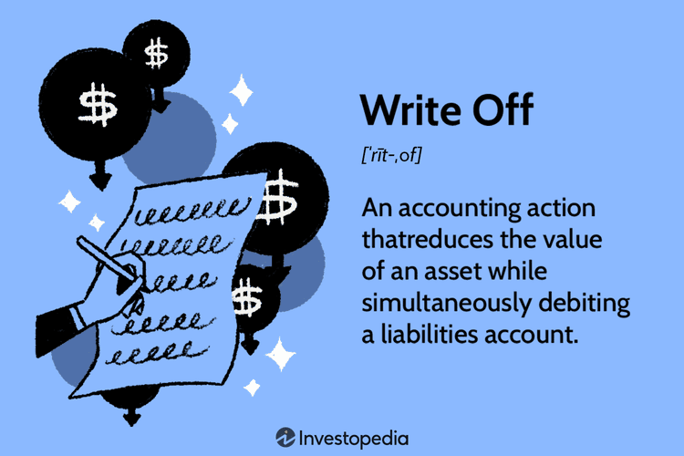

## Table of Contents

## What is a write-off in corporate finance?

A write-off in corporate finance is when a company decides that an asset is no longer worth what it used to be. This can happen if the asset loses value or becomes unusable. When a company writes off an asset, it removes the value of that asset from its balance sheet. This means the company acknowledges that the asset won't bring in any future money and it won't be able to sell it for much.

Write-offs can affect a company's taxes. When a company writes off an asset, it can sometimes claim a tax deduction. This means the company pays less in taxes because the asset's value is no longer counted as part of its income. Write-offs are important for keeping a company's financial records accurate and up-to-date. They help show a true picture of what the company owns and how much it is worth.

## Why do companies use write-offs?

Companies use write-offs to keep their financial records accurate. When an asset loses value or becomes unusable, it's important for the company to show this change on their balance sheet. By writing off the asset, the company removes its value from the books, which helps give a true picture of what the company owns and how much it is worth. This is important for making good business decisions and for showing investors and creditors the real financial health of the company.

Another reason companies use write-offs is to manage their taxes. When an asset is written off, the company can sometimes claim a tax deduction. This means they can pay less in taxes because the asset's value is no longer counted as part of their income. This can help the company save money and improve its cash flow. So, write-offs are not just about keeping records straight; they can also be a smart financial move.

## How does a write-off affect a company's financial statements?

When a company does a write-off, it changes the numbers on its financial statements. The main change happens on the balance sheet, where the company lists what it owns and what it owes. If an asset is written off, its value is taken away from the total assets. This makes the total assets number smaller. If the write-off is big, it can make the company look less valuable on paper.

The write-off also shows up on the income statement. Here, the company records how much money it made and spent. When an asset is written off, the company records this as an expense. This makes the net income, or profit, go down. A lower net income can make the company look less profitable to investors and might affect how much tax the company has to pay. So, write-offs change the way a company's financial health is shown in its reports.

## What are the common types of write-offs in a corporate setting?

In a corporate setting, common types of write-offs include bad debts and obsolete inventory. Bad debts happen when a company can't collect money that customers owe them. This often happens if a customer goes bankrupt or can't pay for other reasons. When a company realizes it won't get this money back, it writes off the bad debt. This means they remove the amount from their accounts receivable and record it as an expense. Obsolete inventory is another type of write-off. This happens when a company's products become outdated or unsellable. Instead of keeping these items on the [books](/wiki/algo-trading-books) as assets, the company writes them off, recognizing that they won't be able to sell them for much, if at all.

Another common write-off is for property, plant, and equipment (PP&E). Over time, these assets can wear out or become outdated. When they can no longer be used or are not worth as much as before, the company writes them off. This reduces the value of the assets on the balance sheet and records the loss as an expense on the income statement. Impairment losses are also a type of write-off. These occur when the value of an asset drops suddenly, often due to changes in the market or damage to the asset. When this happens, the company must write down the asset to its new, lower value, affecting both the balance sheet and the income statement.

## Can you explain the difference between a write-off and a write-down?

A write-off and a write-down are both ways a company can say an asset is worth less than before, but they are a bit different. A write-off is when a company decides an asset is totally worthless. They take the whole value of the asset off their books. This often happens with things like bad debts or inventory that can't be sold. When a company does a write-off, it shows up as a big expense on their income statement and makes their total assets go down a lot on the balance sheet.

A write-down is when a company says an asset is still worth something, but less than before. They lower the value of the asset on their books, but they don't take it all the way off. This can happen if an asset like a machine loses some value because it's old or broken. A write-down also shows up as an expense on the income statement, but it's usually smaller than a write-off. On the balance sheet, the total assets go down, but not as much as with a write-off.

Both write-offs and write-downs help companies keep their financial records honest and up-to-date. They show everyone what the company really owns and how much it's worth. But write-offs are for when an asset is completely useless, while write-downs are for when it's just worth less than before.

## What are the tax implications of write-offs for a corporation?

When a corporation does a write-off, it can affect the taxes they have to pay. A write-off means the company says an asset is worthless and takes its value off their books. This can help the company because they can claim a tax deduction for the amount of the write-off. A tax deduction is like a discount on their taxes. It reduces the company's taxable income, which means they pay less in taxes. So, write-offs can save the company money on taxes.

But there are rules about what can be written off and when. The tax laws say which kinds of write-offs are allowed and how much a company can claim. Sometimes, the tax savings from a write-off might not be as big as the company hopes. Also, if the company gets money back later for something they wrote off, like a bad debt, they might have to pay more taxes. So, while write-offs can help with taxes, companies need to follow the rules carefully to make sure they get the benefits right.

## How do companies decide when to take a write-off?

Companies decide when to take a write-off by looking at their assets and seeing if they are still worth what they used to be. They do this by checking if an asset has lost value or can't be used anymore. For example, if a customer can't pay back a loan, the company might decide to write off that bad debt. Or if a product they make is no longer popular and can't be sold, they might write off the inventory. Companies use rules and guidelines to help them decide when an asset is really worthless and needs to be written off.

Sometimes, companies also think about how a write-off will affect their taxes. If they can get a tax deduction by writing off an asset, it might make sense to do it sooner rather than later. But they have to follow the tax laws carefully to make sure they do it right. Companies also need to think about how a write-off will look to investors and others who look at their financial statements. A big write-off can make the company seem less valuable or less profitable, so they need to weigh all these things before deciding to take a write-off.

## What are the potential impacts of write-offs on a company's stock price?

When a company takes a write-off, it can make their stock price go down. This happens because write-offs make the company look less valuable on paper. When investors see that the company's assets are worth less than before, they might think the company is not doing as well. This can make them want to sell their shares, which pushes the stock price down. Also, if the write-off is big, it can make the company's profit look smaller, which can scare investors away.

But sometimes, a write-off can be good news for the stock price. If investors think the write-off was a smart move to clean up the company's books and make things more honest, they might see it as a good sign. They might think the company is getting rid of bad assets and focusing on better ones. This can make them want to buy more shares, which can push the stock price up. It all depends on how investors see the write-off and what they think it means for the company's future.

## How should write-offs be disclosed in financial reporting?

When a company does a write-off, it needs to tell people about it in its financial reports. This is important because it helps everyone know what's going on with the company's money. The company has to write about the write-off in the notes to their financial statements. These notes explain why they did the write-off, how much money it involved, and what kind of asset they wrote off. This way, people like investors and regulators can see the full picture of the company's financial health.

The write-off also shows up in the main parts of the financial statements. On the income statement, the write-off is listed as an expense, which makes the company's profit look smaller. On the balance sheet, the value of the asset that was written off is taken away from the total assets. This makes the company look less valuable on paper. By showing the write-off in both the notes and the main statements, the company keeps its financial reporting honest and clear.

## What are some strategies to manage and minimize the need for write-offs?

Companies can manage and minimize the need for write-offs by being careful about who they lend money to and what they buy. They should check if customers can really pay back loans before giving them money. This can help avoid bad debts. For inventory, companies should keep an eye on what's selling and what's not. If something isn't selling, they can try to sell it at a discount or find another use for it before it becomes worthless.

Another way to minimize write-offs is by taking good care of their assets. Companies should fix machines and equipment when they break and keep them updated so they don't lose value too quickly. They can also sell old assets before they become completely useless. By doing these things, companies can keep their assets worth more for longer and reduce the need for write-offs.

## How do write-offs relate to corporate governance and ethical considerations?

Write-offs are important in corporate governance because they show how honest a company is about its money. Good governance means following rules and being open about what's happening with the company's assets. When a company does a write-off, it should explain why in its financial reports. This helps everyone, like investors and regulators, trust the company more. If a company doesn't do write-offs properly, it might look like they're hiding problems, which can hurt their reputation and get them in trouble.

Ethically, write-offs should be done fairly and honestly. Companies shouldn't use write-offs to make their profits look bigger or smaller than they really are. For example, if a company writes off a big asset just to get a tax break, that could be seen as unethical. It's important for companies to be clear and truthful about why they're doing write-offs. This builds trust with everyone who cares about the company's financial health, like shareholders and employees.

## What advanced accounting techniques can be used to optimize the use of write-offs in complex corporate structures?

In complex corporate structures, companies can use advanced accounting techniques like consolidation and segment reporting to optimize the use of write-offs. Consolidation means combining the financial statements of different parts of the company into one big report. This helps see the whole picture and decide where write-offs should happen. For example, if one part of the company has a lot of bad debts, they might write those off and show it in the consolidated report. Segment reporting breaks the company into smaller pieces and shows how each piece is doing. This can help find where write-offs are needed and make sure they are done in the right places without affecting the whole company too much.

Another technique is using impairment testing, which is a way to check if an asset's value has gone down a lot. Companies can do this regularly to catch problems early and decide if a write-off is needed. This is especially useful in big companies with lots of different assets. Also, tax planning can be important. Companies can plan their write-offs to get the best tax benefits, but they need to follow the tax rules carefully. By using these techniques, companies can manage their write-offs better and keep their financial reports honest and clear.

## References & Further Reading

[1]: Bergstra, J., Bardenet, R., Bengio, Y., & Kégl, B. (2011). ["Algorithms for Hyper-Parameter Optimization."](https://papers.nips.cc/paper/4443-algorithms-for-hyper-parameter-optimization) Advances in Neural Information Processing Systems 24.

[2]: ["Advances in Financial Machine Learning"](https://www.amazon.com/Advances-Financial-Machine-Learning-Marcos/dp/1119482089) by Marcos Lopez de Prado

[3]: ["Evidence-Based Technical Analysis: Applying the Scientific Method and Statistical Inference to Trading Signals"](https://www.amazon.com/Evidence-Based-Technical-Analysis-Scientific-Statistical/dp/0470008741) by David Aronson

[4]: ["Machine Learning for Algorithmic Trading"](https://github.com/PacktPublishing/Machine-Learning-for-Algorithmic-Trading-Second-Edition) by Stefan Jansen

[5]: ["Quantitative Trading: How to Build Your Own Algorithmic Trading Business"](https://books.google.com/books/about/Quantitative_Trading.html?id=j70yEAAAQBAJ) by Ernest P. Chan