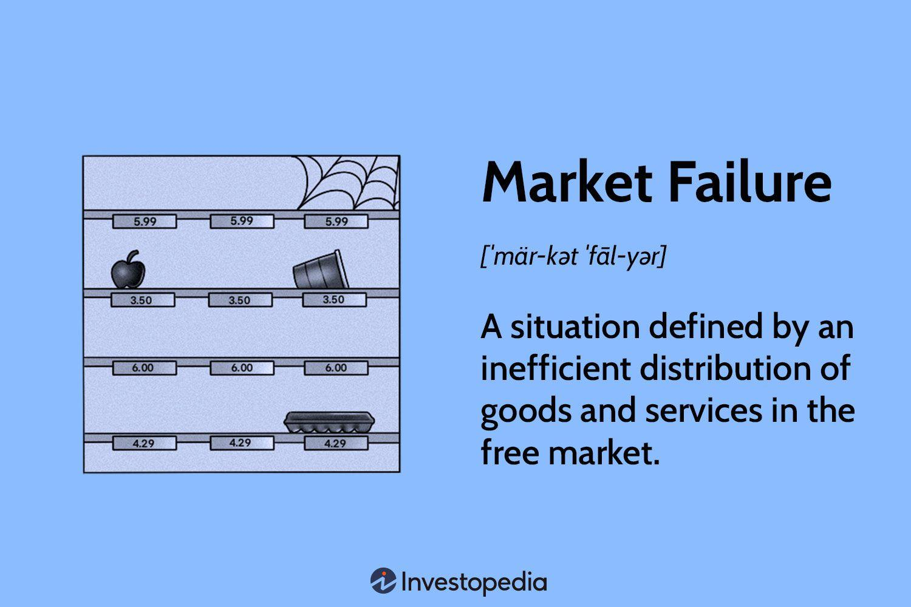

In the contemporary financial landscape, the interconnected nature of economic correction, market failure, market regulation, and algorithmic trading plays an instrumental role in shaping market dynamics. Each of these concepts—economic correction, market failure, market regulation, and algorithmic trading—stands as a critical pillar in understanding and navigating the complex financial systems of today.

Economic correction refers to the market's natural mechanism of adjusting overvalued asset prices, ensuring that valuations are aligned with fundamental economic indicators. Unlike market crashes that denote abrupt and significant price declines, economic corrections are typically more moderate and serve the long-term health of markets by mitigating the formation of asset bubbles. Understanding the conditions and impacts of these corrections can equip investors with strategies to safeguard their portfolios from inevitable market downturns.

Market failure, on the other hand, represents a situation where the allocation of goods and services by a free market is not efficient, often leading to negative outcomes such as monopolies or negative externalities where the societal costs of market activities are not reflected in market prices. Recognizing the signs of market failure allows policymakers to intervene with targeted regulations that aim at restoring market efficiencies, often through policies that address public goods or externalities.

Market regulation emerges as a significant tool for preventing such market failures and maintaining systemic stability. Regulations are crafted to ensure transparency, protect against fraud, and preserve competitive conditions within markets. While effective regulations can promote market stability, excessive or poorly designed regulations may stifle innovation and competitiveness. Thus, understanding the fine balance in regulatory measures is essential for both market participants and regulators tasked with safeguarding market integrity.

In recent years, algorithmic trading has revolutionized market operations by using complex algorithms to execute trades at speeds and volumes unattainable by human traders. While this enhances market liquidity and efficiency, it also introduces potential risks such as flash crashes—rapid and deep market sell-offs triggered by automated trading systems. The regulatory challenges posed by algorithmic trading are significant, as traditional oversight mechanisms often struggle to keep pace with technological advances.

For investors, policymakers, and traders, a comprehensive understanding of these concepts is indispensable. The synergy between economic correction, market failure, market regulation, and algorithmic trading requires a nuanced approach where each interacts dynamically with the others. As we advance, the interdependence of these elements will likely intensify, underscoring the need for adaptable strategies that can withstand the unpredictable nature of financial markets. This article will explore these interactions, providing a clearer comprehension of their roles in sustaining the stability and robustness of global markets.

## Table of Contents

## Understanding Economic Correction

Economic correction is a term referring to a brief, often sharp, reversal of a market trend, typically following a prolonged rise in stock prices or asset values. This phenomenon usually results in a 10% to 20% decline in market indexes or individual asset prices, allowing markets to reassess asset valuations and address any imbalances that might have developed due to overly optimistic investor behaviors. Unlike market crashes, which are characterized by abrupt and severe price declines often driven by widespread panic and fundamental economic disruptions, economic corrections are generally less severe and may not be accompanied by a downturn in economic indicators.

Economic corrections occur for several reasons. They often represent a natural part of the market cycle, acting as a mechanism to curb speculative excesses and realign prices with underlying economic realities. Various factors, such as changes in monetary policy, geopolitical events, shifts in investor sentiment, or emerging market data, can trigger these corrections. For instance, central banks' decisions to alter interest rates may lead investors to reevaluate the discount rates used in asset pricing, thereby prompting adjustments in market valuations.

Recent history provides numerous examples of economic corrections. The correction in December 2018, which saw the S&P 500 fall nearly 20% from its peak, was largely attributed to global trade tensions and concerns over rising interest rates. Another example is the COVID-19-induced market downturn in early 2020, which, after an initial sharp decline, turned into one of the fastest recoveries driven by aggressive fiscal and monetary policy interventions.

Economic corrections play a critical role in maintaining a balanced market. By tempering speculative excesses and fostering an environment where asset prices more accurately reflect intrinsic values, corrections help avert the formation of financial bubbles. Moreover, they provide buying opportunities for investors by creating entry points at more reasonable valuations. This cyclical price adjustment process helps sustain investor confidence by establishing more stable market conditions over the long term.

Investors can prepare for and respond to economic corrections by maintaining a diversified portfolio structured to withstand short-term market [volatility](/wiki/volatility-trading-strategies). Employing strategies such as dollar-cost averaging, where investments are regularly purchased over time regardless of market conditions, can mitigate risks associated with market fluctuations. Additionally, having a long-term investment perspective allows investors to focus beyond the transient dips associated with corrections, reducing the temptation to make impulsive decisions driven by short-term market movements.

Overall, understanding the mechanics and implications of economic corrections equips investors with the perspective needed to navigate periods of market volatility effectively, ensuring informed decisions that align with broader financial objectives.

## Market Failure and Its Implications

Market failure occurs when a market fails to allocate resources efficiently, leading to a loss of economic and social welfare. The causes of market failure can be attributed to several factors including externalities, public goods, information asymmetries, and monopolistic practices, among others.

Externalities are costs or benefits incurred by third parties who are not involved in the economic transaction. They can be negative, such as pollution, or positive, such as the benefits of education. When externalities are present, markets can fail because the private cost or benefit does not reflect the social cost or benefit, leading to overproduction or underproduction. For example, a factory emitting pollution does not bear the full cost of its environmental impact, causing more pollution than would be socially optimal.

Public goods are another cause of market failure. These are goods that are non-excludable and non-rivalrous, meaning that once they are provided, it is difficult to prevent anyone from using them, and one person's use does not reduce availability to others. Examples include national defense and public parks. Since individuals cannot be effectively charged for their use, private markets may underprovide them, necessitating government intervention.

Information asymmetry refers to situations where one party in a transaction has more or better information than the other. This can lead to market failures such as adverse selection and moral hazard. For instance, in the insurance market, the insured may have more information about their health than the insurer, leading to adverse selection where those most likely to file a claim are also the most likely to purchase insurance.

Market failure can have significant consequences for economies and societies. It can lead to inefficient resource allocation, reduced consumer and producer surplus, and welfare losses. For instance, during the financial crisis of 2008, a lack of regulation and transparency resulted in market failures in the financial sector, leading to widespread economic downturn.

Economic theories play a crucial role in predicting and addressing market failure. Theories such as the Coase Theorem suggest that under certain conditions, private negotiations can resolve externalities. However, in cases where transaction costs are high or property rights are not clearly defined, government intervention may be necessary.

Case studies offer tangible examples of market failures and their impacts. The Deepwater Horizon oil spill in 2010 is a case where environmental externalities were not adequately addressed, leading to extensive ecological and economic damage. Similarly, the underprovision of affordable housing in urban areas highlights the challenges of addressing public goods failures within market structures.

In conclusion, market failure represents a critical challenge within economies, necessitating a mixture of private and public interventions to correct inefficiencies and restore equilibrium. Understanding these dynamics helps policymakers devise strategies that mitigate the negative impacts of these failures.

## The Role of Market Regulation

Market regulation plays a critical role in maintaining the stability and efficiency of financial markets by preventing market failures. Market failures may occur due to various reasons, including information asymmetry, monopolies, and externalities that lead to inefficient outcomes, hindering the optimal allocation of resources. Regulations aim to rectify these inefficiencies by setting rules that govern market operations and behaviors.

Various types of market regulations exist, each serving a specific purpose. Some common forms include:

1. **Antitrust Laws**: Designed to prevent monopolies and promote competition, antitrust laws discourage practices that restrict competition, such as price-fixing and collusion.

2. **Securities Regulations**: These are intended to ensure transparency and fairness in the trading of securities. They typically require companies to disclose financial information, ensuring that investors have access to necessary data to make informed decisions.

3. **Environmental Regulations**: By addressing negative externalities, such as pollution, these regulations aim to align private costs with social costs, thus promoting sustainable business practices.

4. **Consumer Protections**: These regulations ensure that products and financial services are safe and fairly priced, helping to prevent exploitation and misinformation.

Regulations can yield both positive and negative outcomes. When effectively implemented, they can enhance market stability by reducing fraud, promoting fairness, and protecting investors. An example of successful regulation is the Dodd-Frank Wall Street Reform and Consumer Protection Act, introduced in the aftermath of the 2008 financial crisis. This act improved transparency and reduced the risks associated with large financial institutions, contributing to overall market stability.

However, overly stringent or poorly designed regulations can stifle innovation, reduce market [liquidity](/wiki/liquidity-risk-premium), and create unintended economic consequences. For instance, the Sarbanes-Oxley Act, while enhancing corporate accountability, has been criticized for imposing significant compliance costs on businesses, particularly smaller firms.

The debate over the need for more or less regulation in financial markets is ongoing. Proponents of increased regulation argue that tighter controls are necessary to prevent crises and protect consumers. In contrast, opponents contend that excessive regulation can hinder economic growth and market efficiency, advocating for a more laissez-faire approach.

Ultimately, striking the right balance between market freedom and regulatory oversight is essential. A robust regulatory framework should adapt to evolving market conditions, employing flexible strategies that account for technological advances and global economic trends. The challenge lies in developing regulations that effectively mitigate risks without imposing unnecessary burdens on market participants, ensuring that financial markets remain both dynamic and resilient.

## The Impact of Algorithmic Trading

Algorithmic trading, often referred to as algo trading, involves the use of computer algorithms to automate trading strategies. These algorithms, driven by complex mathematical models, make decisions about the timing, price, and [volume](/wiki/volume-trading-strategy) of stock orders. Algorithms can rapidly process market data and execute orders much faster than human traders, thus enhancing market efficiency by narrowing bid-ask spreads and augmenting liquidity.

One significant advantage of [algorithmic trading](/wiki/algorithmic-trading) is its ability to improve market efficiency. Algorithms can quickly identify [arbitrage](/wiki/arbitrage) opportunities, allowing trades to be executed at optimal prices within milliseconds. This contributes to a more efficient market by ensuring that assets are accurately priced. Moreover, algorithmic trading enhances liquidity, offering a greater volume of orders matching buyers and sellers, thus facilitating smoother market operations.

Despite these advantages, algorithmic trading carries potential risks. Flash crashes, rapid and deep market declines followed by swift recoveries, are often attributed to these algorithms. A notable example is the 2010 Flash Crash, where U.S. stock indices suffered a significant and abrupt drop due to a large algorithmic trade. Additionally, the speed and volume at which trades occur can exacerbate market volatility, making markets more unpredictable and potentially leading to massive sell-offs.

Regulatory challenges accompany algorithmic trading, primarily due to its capacity to destabilize markets. Regulators are tasked with developing rules that curtail the risks associated with high-frequency trading while preserving its benefits. Measures include implementing circuit breakers and imposing restrictions on order types to prevent runaway algorithms from triggering flash crashes. However, creating effective regulations is complicated by the rapid pace of technological advancements in trading platforms.

Algo trading also plays a role in economic corrections and market failures. During economic corrections, algorithms may react to market signals by offloading large quantities of assets, intensifying the downward pressure on prices. In the context of market failures, algorithmic trading can both mitigate and exacerbate failures. While algorithms might correct inefficiencies by executing arbitrage opportunities, they can also create feedback loops that lead to systemic disruptions if not properly managed.

In summary, while algorithmic trading revolutionizes financial markets by enhancing efficiency and liquidity, it also introduces significant risks and regulatory challenges. Recognizing the interconnectedness of these risks with economic corrections and market failures is crucial for developing robust strategies that safeguard market integrity.

## Interconnections and Future Outlook

Economic correction, market failure, market regulation, and algorithmic trading are closely interlinked elements that shape the dynamics of contemporary financial markets. Understanding their interplay is critical for assessing future market trends and stability.

### Interconnected Dynamics

**Economic Correction and Market Failure:** Economic corrections are natural adjustments in the financial markets that address overpriced assets and restore balance. These corrections can be viewed as a response to market failures. Market failures, such as the inability to price public goods correctly or address externalities, often lead to inefficient market outcomes. When markets deviate significantly from equilibrium, corrections can help realign prices with intrinsic values, though this process may also lead to temporary instability and investor panic.

**Market Regulation's Role:** Market regulation serves as a guardrail to prevent severe market failures. Regulatory frameworks aim to address information asymmetry, monopolistic tendencies, and systemic risks that could lead to market imbalances. Regulations can thus facilitate smoother economic corrections by providing stability and reducing the risk of abrupt crashes. For instance, after the 2008 financial crisis, stringent regulations, such as the Dodd-Frank Act, were implemented to enhance oversight and prevent future systemic failures.

**Algorithmic Trading's Influence:** Algorithmic trading, characterized by high-speed, automated transactions, impacts market efficiency and liquidity. While it can enhance market efficiency by narrowing bid-ask spreads and increasing trading volumes, it also poses potential risks, such as sudden "flash crashes" resulting from algorithmic errors or unforeseen interactions. These events can contribute to market failures if unchecked, highlighting the need for effective regulatory oversight.

### Technological Influence

Technology is a formidable force shaping financial market strategies. Algorithmic trading exemplifies how technological advances redefine market operations, offering both opportunities for enhanced efficiency and challenges related to volatility. The increasing deployment of [machine learning](/wiki/machine-learning) and [artificial intelligence](/wiki/ai-artificial-intelligence) in trading strategies promises more sophisticated predictive models and risk management practices. However, it also demands updated regulatory frameworks to address new types of risks.

### Future Evolution

Looking ahead, the landscape of economic corrections, market failures, market regulations, and algorithmic trading is likely to be influenced by several factors:

- **Technological Advancements:** Continued innovation in computing power and data analytics will enable more refined trading algorithms. Quantum computing, in particular, may revolutionize financial modeling and decision-making processes.

- **Economic and Social Factors:** Global economic trends, such as inflation, shifting labor markets, and geopolitical tensions, will influence market dynamics. Social factors, including changing consumer behaviors and demographic trends, may also drive economic corrections and necessitate regulatory adjustments.

- **Environmental Considerations:** As sustainability becomes a greater priority, shifts towards green energy and responsible investing may lead to new market regulations and corrections aligned with these values.

### Conclusion

The interconnected nature of economic correction, market failure, market regulation, and algorithmic trading underscores the complexity of global financial markets. As these elements continue to evolve, a comprehensive understanding is essential for investors, policymakers, and regulators to safeguard market stability. Recognizing the significant role of technology and adapting to emerging economic, social, and environmental trends will be crucial steps in navigating future challenges and harnessing opportunities in financial markets.

## Conclusion

The financial landscape is an intricate web of interconnected elements, including economic correction, market failure, market regulation, and algorithmic trading. Each of these components plays a pivotal role in maintaining the stability and efficiency of global markets. Economic corrections act as a self-regulating mechanism, preventing overvaluations and ensuring market health. A comprehensive understanding of these corrections enables investors and policymakers to anticipate and respond effectively to market fluctuations, thereby mitigating severe financial disruptions.

Market failure highlights the imperfections within markets, where the allocation of resources is not efficient, leading to societal and economic concerns. Regulations are paramount in mitigating these failures, as they establish guidelines and standards to maintain market equilibrium and prevent abuses that could disrupt market integrity. However, regulation requires a balanced approach, as over-regulation could stifle innovation and market dynamics, while under-regulation may allow for systemic risks to proliferate.

Algorithmic trading, with its capacity to analyze vast datasets and execute trades at unprecedented speeds, enhances market liquidity and efficiency but also introduces risks like flash crashes and increased volatility. These phenomena underscore the necessity for robust regulatory frameworks that can adapt to the rapid technological advances in trading systems.

For investors, understanding these concepts aids in making informed decisions, aiding in risk management and optimizing returns. Regulators must strive to create flexible policies that protect market participants while fostering innovation. Policymakers are tasked with the challenge of understanding the complex interplay between these elements to craft laws that promote financial stability and economic growth.

Persistent research and adaptive strategies are vital to navigate the evolving market challenges. As technological advancements and global economic conditions continuously reshape the financial sector, stakeholders must remain vigilant and agile, ready to adapt to new paradigms.

The financial markets are inherently dynamic and require a holistic comprehension of the mechanisms at play to ensure their robustness and resilience. Acknowledging the synergy between economic corrections, market failures, regulatory measures, and algorithmic trading is critical to safeguarding the global financial system's integrity. Understanding these components will pave the way for more stable and prosperous economic landscapes in the future.

## References & Further Reading

[1]: Rosenberg, A. (2016). ["The Dodd-Frank Act: Too Big Not to Fail?"](https://www.philadelphiafed.org/the-economy/banking-and-financial-markets/banking-policy-review-did-dodd-frank-end-too-big-to-fail), University of St. Thomas Law Journal.

[2]: Shleifer, A. (2000). ["Inefficient Markets: An Introduction to Behavioral Finance."](https://academic.oup.com/book/27761) Oxford University Press.

[3]: Haldane, A.G. (2010). ["Patience and Finance"](https://www.bankofengland.co.uk/-/media/boe/files/speech/2010/patience-and-finance-speech-by-andrew-haldane.pdf?la=en&hash=65EFC080D7B019521F9D84CAD5F03B4AD89573F7), Oxford China Business Forum, Beijing.

[4]: Lo, A.W. (2017). ["Adaptive Markets: Financial Evolution at the Speed of Thought."](https://books.google.com/books/about/Adaptive_Markets.html?id=Q4d7DwAAQBAJ) Princeton University Press.

[5]: MacKenzie, D. (2006). ["An Engine, Not a Camera: How Financial Models Shape Markets."](https://academic.oup.com/mit-press-scholarship-online/book/20588) The MIT Press.

