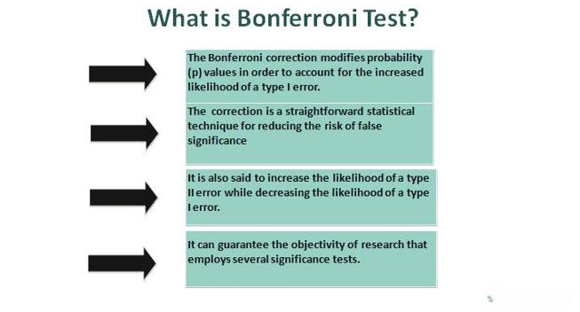

Algorithmic trading has significantly transformed the landscape of financial markets by automating trade execution through advanced computer programs. This evolution in trading methods offers remarkable advantages, including the ability to execute trades under optimal conditions with minimal human intervention. Algorithmic trading systems utilize complex algorithms designed to analyze market data effectively, execute trading strategies, and adapt to changing market conditions swiftly.

Key processes integral to algorithmic trading include rectification, amendment, and correction, each playing a critical role in ensuring the accuracy and efficacy of trading strategies. Rectification involves identifying and correcting errors or inaccuracies within trading algorithms. It is essential for maintaining the integrity of the trading process and preventing erroneous trades that could result in significant financial loss. Regular audits and reviews of algorithms help in preemptively identifying areas that require rectification.



Amendment refers to the continuous adjustment of algorithms to align with evolving market conditions. These updates may involve modifying algorithm parameters or incorporating new data feeds to better capture market dynamics, ensuring that strategies remain competitive and responsive to current conditions. An effective amendment process is crucial for optimizing trading performance and mitigating risks.

Correction mechanisms are designed to dynamically adjust algorithm performance in real-time, based on feedback from market data and observed anomalies. This adaptability is vital in responding to rapid market fluctuations, enabling trading systems to maintain robustness and stability. By implementing correction processes, algorithmic traders can reduce potential drawdowns and enhance the resilience of their trading strategies.

Understanding these processes is vital for traders and developers leveraging algorithmic systems to maximize returns and minimize risks. Ensuring the continuous refinement of algo trading strategies demands a comprehensive grasp of rectification, amendment, and correction procedures. This article will delve into these concepts and explore the methodologies involved in enhancing the performance and reliability of algorithmic trading systems, providing a guide for those seeking to navigate the complexities of modern financial markets.

## Table of Contents

## Understanding Algorithmic Trading

Algorithmic trading employs pre-defined instructions executed by computer programs to perform trades automatically in financial markets, capitalizing on the advantages of speed and computational capacity. This automation allows traders to undertake transactions with precision and without direct human intervention, enabling them to swiftly respond to evolving market conditions.

The foundation of [algorithmic trading](/wiki/algorithmic-trading) lies in sophisticated algorithms designed to analyze market data and make strategic decisions. These algorithms, often based on complex mathematical models, evaluate numerous market variables such as price fluctuations, trading volumes, and historical trends to identify optimal trading opportunities.

Key features of algorithmic trading include high-frequency trading ([HFT](/wiki/high-frequency-trading-strategies)), which involves executing orders at incredibly fast speeds, often in fractions of a second. This characteristic is complemented by the system's ability to handle vast amounts of data with efficiency, ensuring that trading decisions are based on comprehensive market analysis.

Here is a simple illustration of a trading algorithm using Python:

```python
def simple_moving_average(prices, window_size):
    return sum(prices[-window_size:]) / window_size

def trading_signal(prices, short_window, long_window):
    short_avg = simple_moving_average(prices, short_window)
    long_avg = simple_moving_average(prices, long_window)
    if short_avg > long_avg:
        return "Buy"
    elif short_avg < long_avg:
        return "Sell"
    else:
        return "Hold"

# Example usage
prices = [100, 102, 104, 103, 105, 107, 110]
signal = trading_signal(prices, short_window=3, long_window=5)
print(f"Trading signal: {signal}")
```

Maintaining the accuracy of these algorithms is critical because errors can lead to significant financial losses. Discrepancies, whether due to flawed logic or data inaccuracies, can result in incorrect trading decisions, emphasizing the need for stringent oversight and regular updates to ensure alignment with current market conditions.

## Rectification in Algo Trading

Rectification in algorithmic trading involves addressing and correcting errors or inaccuracies that arise within trading algorithms. These errors can disrupt the proper functioning of algorithms, preventing them from executing trades effectively. Common issues necessitating rectification include logic errors, inconsistencies in data feeds, and incorrect generation of trading signals.

Logic errors occur when the algorithm's code does not correctly implement the intended trading strategy. For example, an algorithm might buy instead of selling due to a simple coding mistake. These errors require immediate correction to prevent unintended trades that could result in financial loss.

Data feeding inconsistencies can stem from discrepancies in the market data input into the algorithms. This might include missing data points, delayed data transmissions, or inaccuracies in price feeds. Such inconsistencies can cause the algorithm to make decisions based on erroneous information, leading to flawed trading actions.

Incorrect trading signals arise when the algorithm incorrectly interprets market data, producing wrong buy or sell signals. This might occur due to errors in the algorithm's decision-making logic or due to faulty models that misread market conditions.

Timely rectification is crucial as unresolved errors can lead to significant financial implications. Without prompt action, these issues could result in erroneous trades that accumulate losses quickly, especially in high-frequency trading environments where decisions are made in fractions of a second.

Routine audits and reviews are essential practices for traders and developers to ensure algorithms are performing optimally. They should regularly backtest the algorithm against historical data to identify any flaws and verify that the algorithm aligns with the set trading strategies and parameters. Additionally, implementing automated testing frameworks can aid in early detection of errors, ensuring that the algorithms remain accurate and responsive to market changes. Here is a basic example of how one might set up a testing framework in Python using a trading simulation environment:

```python
def simulate_trading(algorithm, historical_data):
    """Simulate trading algorithm on historical data and check for errors."""
    for data_point in historical_data:
        try:
            decision = algorithm.execute_trade(data_point)
            log_trade(decision)
        except Exception as e:
            log_error(e)
            rectify_algorithm(algorithm, e)

def rectify_algorithm(algorithm, error):
    """Rectify algorithm based on encountered error."""
    # Analyze the error and update algorithm logic
    pass

def log_trade(decision):
    """Log trading decision."""
    print(f"Executed trade: {decision}")

def log_error(error):
    """Log error details for rectification."""
    print(f"Error encountered: {error}")

# Example usage
historical_data = load_historical_data()
my_algorithm = TradingAlgorithm()
simulate_trading(my_algorithm, historical_data)
```

In this framework, `simulate_trading` processes historical data to identify and rectify potential errors in the algorithm. The key to effective rectification is proactive monitoring and iterative refinement, ensuring the algorithm remains robust and capable of executing the intended trading strategy accurately.

## Amendment Processes in Trading Algorithms

Amendment processes in trading algorithms are crucial for adapting to evolving market conditions and enhancing the effectiveness of trading strategies. This involves modifying existing algorithmic structures to integrate new strategies or respond to significant shifts in market dynamics. As markets are inherently volatile and influenced by a multitude of factors, the need for such amendments is both frequent and essential. 

Amendments can take various forms, such as parameter adjustments, which directly alter the algorithm’s risk exposure level or optimize profit potential. For example, a change in interest rates might lead a trader to adjust stop-loss limits or take-profit points within their algorithm to better harmonize with the new economic environment. Furthermore, incorporating new data sources is an integral amendment process. Utilizing alternative datasets, such as social media sentiment analysis or macroeconomic indicators, provides deeper insights and potentially lucrative signals that can enhance decision-making processes.

Another aspect of the amendment process is the recalibration of [machine learning](/wiki/machine-learning) models, which might involve retraining models with updated data to capture new patterns or trends within the market. Here’s a simple Python script to illustrate updating a trading model based on new data:

```python
from sklearn.ensemble import RandomForestClassifier
import pandas as pd

# Load new market data
new_data = pd.read_csv('new_market_data.csv')
features = new_data.drop('target', axis=1)
target = new_data['target']

# Initialize the algorithm
model = RandomForestClassifier(n_estimators=100, random_state=42)

# Re-train model with new data
model.fit(features, target)

# Save the updated model
import joblib
joblib.dump(model, 'updated_trading_model.pkl')
```

This code snippet demonstrates the retraining and updating of a machine learning model using a fresh set of data, aligning the trading algorithm with the latest market insights.

Effective amendment processes ensure that trading systems remain not only competitive but also relevant and responsive to current market realities. By methodically refining algorithms, traders are better equipped to maximize returns while minimizing associated risks. Furthermore, maintaining an agile approach to amendments allows traders to harness emerging opportunities without being constrained by outdated strategies, thereby strengthening the overall robustness and resilience of their trading frameworks.

## Correction Mechanisms in Algorithmic Trading

Correction mechanisms in algorithmic trading refer to sophisticated processes designed to continuously adjust and enhance the performance of trading algorithms in real-time. These mechanisms are integral to modern trading systems, ensuring that strategies remain adaptive and responsive to ever-changing market conditions.

One of the primary components of correction mechanisms is automatic recalibration. Algorithms can be programmed to detect and respond to market feedback and data anomalies. By continuously monitoring key metrics and adjusting parameters dynamically, these systems can maintain optimal performance even during volatile periods. For instance, a trading algorithm may alter its risk thresholds or modify asset allocations based on detected variations in [volatility](/wiki/volatility-trading-strategies) or [liquidity](/wiki/liquidity-risk-premium).

The importance of correction mechanisms cannot be overstated, as they are crucial in preventing errors that might arise from sudden market shifts. These shifts could include unexpected geopolitical events, economic announcements, or rapid price movements due to high-frequency trading activities. Correction processes can mitigate the risk of substantial financial losses by quickly adapting trade strategies to align with new market realities.

A practical example of a correction mechanism is the implementation of a feedback loop where the algorithm continuously evaluates its performance based on predefined criteria such as win/loss ratios, latency, or slippage. Algorithms can be coded to self-adjust when deviations from targets are detected. For instance, a Python snippet for such a feedback loop may look like this:

```python
def adjust_parameters(trading_algorithm, target_metric, current_metric):
    if current_metric < target_metric:
        trading_algorithm.increase_aggressiveness()
    else:
        trading_algorithm.decrease_aggressiveness()

# Simulate market feedback
market_conditions = get_current_market_conditions()
adjust_parameters(algo, target_profit_ratio, market_conditions['profit_ratio'])
```

This function adjusts the trading algorithm's aggressiveness based on whether the current profit ratio falls below the target.

Continual testing and refinement of correction mechanisms are vital. This involves not only algorithm [backtesting](/wiki/backtesting) against historical data but also stress-testing under simulated market conditions to evaluate the robustness of the trading strategies. By adopting innovative technologies such as machine learning, traders can enhance these correction mechanisms. Machine learning models can identify complex patterns and correlations that are not evident through traditional analysis. This capability not only improves correction accuracy but also accelerates the adaptation speed of the trading systems.

In conclusion, correction mechanisms are an indispensable part of any advanced algorithmic trading strategy, providing a framework for real-time optimization and adjustment. As trading environments become more complex, the sophistication of these mechanisms will likely increase, making them even more essential for traders aiming to maintain competitive and resilient trading operations.

## The Role of Technology in Rectification, Amendment, and Correction

Advanced technology significantly enhances the accuracy and efficiency of trading algorithms by providing robust tools for rectification, amendment, and correction. Among these technologies, Artificial Intelligence (AI) and Machine Learning (ML) are particularly influential. AI and ML technologies enable the automatic adjustment and optimization of trading algorithms. These systems can dynamically adapt to real-time data inputs, identifying discrepancies and applying corrective measures without human intervention. 

The capability of AI and ML to process vast quantities of market data is invaluable. These technologies utilize sophisticated data analysis techniques to glean insights that would be unattainable through manual analysis. For instance, natural language processing algorithms can scan news articles and social media for information that might affect market conditions, integrating this data into trading strategies promptly.

```python
# Example of a simple ML model using Python with scikit-learn
from sklearn.linear_model import LinearRegression
from sklearn.model_selection import train_test_split
import numpy as np

# Generating synthetic market data
np.random.seed(0)
X = np.random.rand(100, 1) * 10  # Feature: market indicators
y = 2.5 * X.squeeze() + np.random.randn(100) * 2  # Target: asset price

# Splitting the data into training and testing sets
X_train, X_test, y_train, y_test = train_test_split(X, y, test_size=0.2, random_state=42)

# Training a simple linear regression model
model = LinearRegression()
model.fit(X_train, y_train)

# Predicting and evaluating the model on test data
predictions = model.predict(X_test)
```

Furthermore, technological advancements streamline the amendment process of algorithms by reducing the time needed for recalibrations. Traditional manual processes are labor-intensive and slow, often becoming less effective with rapid market changes. Automation through technology facilitates instantaneous updates to algorithmic parameters, ensuring that trading strategies remain aligned with prevailing market conditions.

Being at the forefront of technological innovation allows traders to integrate the latest strategies into their frameworks effectively. Continuous advancements in computational power and data analytics capability support the seamless implementation of these strategies, which are critical for maintaining competitiveness in fast-evolving financial markets. By capitalizing on cutting-edge technology, traders can minimize the risks associated with human error and ensure their trading systems are both efficient and responsive.

## Conclusion

In algorithmic trading, the processes of rectification, amendment, and correction are critical to maintaining the effectiveness and reliability of trading strategies. These processes ensure that trading algorithms are working as intended, adhering to set parameters and adapting to ever-changing market conditions. To achieve this, continuous monitoring becomes paramount. With the aid of advanced technological tools such as Artificial Intelligence (AI) and Machine Learning (ML), traders can efficiently enhance the performance of their algorithmic trading systems. These tools facilitate quick adjustments and management of large volumes of market data, enabling more precise and timely trades.

Understanding and applying these concepts provides traders with the necessary skills to navigate the complexities of financial markets. As market conditions and technologies evolve, it is crucial that trading strategies and tools are updated to maintain competitiveness. This evolution may involve incorporating new market data, adjusting risk parameters, or utilizing enhanced algorithmic strategies based on fresh insights from AI and ML algorithms.

Implementing robust processes for rectification, amendment, and correction allows for more resilient algorithmic trading systems, ensuring their capability to adapt and thrive in dynamic environments. By systematically applying these processes, traders can secure the long-term success of their algorithmic trading ventures, ensuring that their strategies remain profitable and aligned with the latest market trends.

## References & Further Reading

[1]: Bergstra, J., Bardenet, R., Bengio, Y., & Kégl, B. (2011). ["Algorithms for Hyper-Parameter Optimization."](https://papers.nips.cc/paper/4443-algorithms-for-hyper-parameter-optimization) Advances in Neural Information Processing Systems 24.

[2]: Lopez de Prado, M. (2018). ["Advances in Financial Machine Learning"](https://www.amazon.com/Advances-Financial-Machine-Learning-Marcos/dp/1119482089). Wiley.

[3]: Aronson, D. R. (2007). ["Evidence-Based Technical Analysis: Applying the Scientific Method and Statistical Inference to Trading Signals"](https://onlinelibrary.wiley.com/doi/book/10.1002/9781118268315). Wiley.

[4]: Jansen, S. (2020). ["Machine Learning for Algorithmic Trading"](https://github.com/stefan-jansen/machine-learning-for-trading). Packt Publishing.

[5]: Chan, E. P. (2009). ["Quantitative Trading: How to Build Your Own Algorithmic Trading Business"](https://github.com/ftvision/quant_trading_echan_book). Wiley.