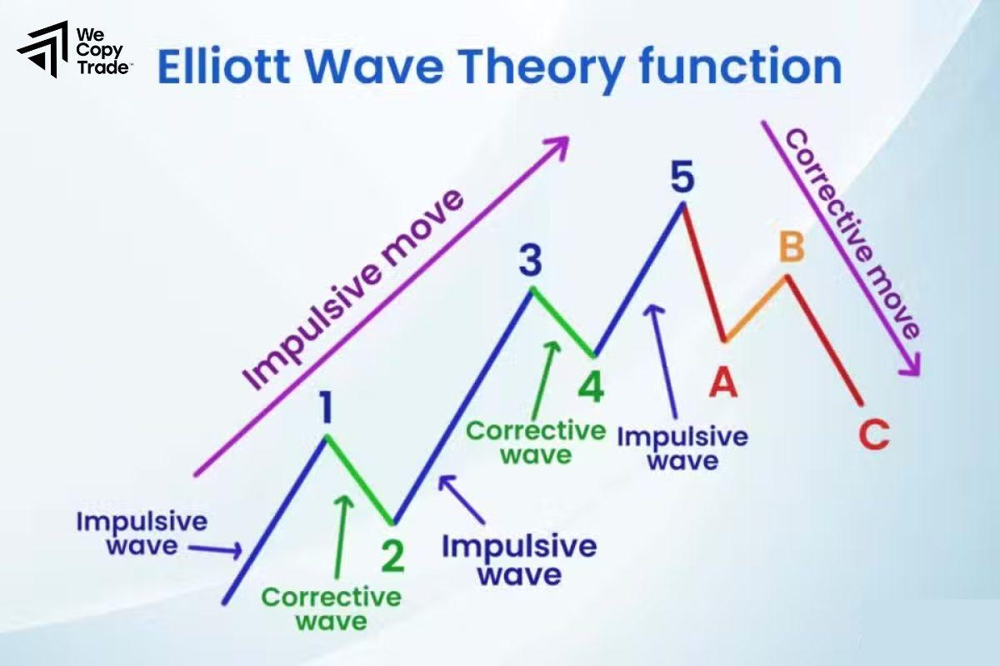

## Table of Contents

## What are corrective waves in the context of technical analysis?

Corrective waves are part of the Elliott Wave Theory, which is a method used in technical analysis to predict future price movements in financial markets. In this theory, markets move in repeating cycles made up of impulsive waves and corrective waves. Impulsive waves are the main trend movements, while corrective waves are the movements against the main trend. These corrective waves are important because they help traders understand when a market might be taking a break from its main trend before continuing in the same direction.

Corrective waves can be more complex and harder to predict than impulsive waves. They often appear in three distinct patterns: zigzags, flats, and triangles. A zigzag correction is a sharp move against the trend followed by a retracement and another move against the trend. A flat correction involves more sideways movement, where the price moves against the trend, then retraces almost fully, and moves against the trend again. Triangles are formed by converging trend lines and indicate a period of consolidation before the market resumes its main trend. Understanding these patterns can help traders make better decisions about when to enter or exit trades.

## How do corrective waves differ from impulsive waves?

In Elliott Wave Theory, corrective waves and impulsive waves are the two main types of waves that make up market cycles. Impulsive waves are the strong moves that follow the main trend of the market. They go in the same direction as the bigger trend and are made up of five smaller waves. These waves show that the market is moving with a lot of energy and strength in the direction of the trend.

On the other hand, corrective waves go against the main trend. They are the market's way of taking a break or pulling back before continuing in the direction of the main trend. Corrective waves are made up of three smaller waves and can be more complex and harder to predict than impulsive waves. They help traders see when the market might be resting before it starts moving strongly again in the direction of the trend.

## What are the basic types of corrective waves?

Corrective waves come in three basic types: zigzags, flats, and triangles. A zigzag is a sharp move against the trend, followed by a retracement, and then another move against the trend. It's like the market takes a quick step back, then a small step forward, and then another step back. Zigzags are easy to spot because they have a clear 'zigzag' shape on the price chart.

Flats are different. They involve more sideways movement. In a flat, the price moves against the trend, then retraces almost fully, and moves against the trend again. It's like the market is trying to move but keeps coming back to the same place. Flats can be tricky because they don't move as much as zigzags.

Triangles are the third type. They form when the price moves in a way that creates converging trend lines. This means the highs and lows of the price get closer together over time. Triangles show that the market is taking a break and getting ready to move strongly again in the direction of the main trend. They can be a bit harder to spot but are important for understanding when the market might start moving again.

## Can you explain the structure of a simple zigzag corrective wave?

A simple zigzag corrective wave is made up of three smaller waves labeled A, B, and C. In a zigzag, wave A moves sharply against the main trend. This is like the market taking a quick step back. After wave A, wave B comes along and retraces some of the move made by wave A. Wave B is smaller than wave A and goes in the direction of the main trend. It's like the market taking a small step forward after stepping back.

Then, wave C follows and moves against the main trend again, often going even further than wave A. Wave C completes the zigzag pattern. It's like the market taking another step back, but this time it might go further than the first step. The whole zigzag pattern looks like a sharp 'Z' on the price chart, making it easy to spot.

## How does a flat corrective wave pattern form?

A flat corrective wave pattern forms when the price moves against the main trend, then retraces almost fully, and moves against the trend again. In a flat, the first wave, called wave A, moves against the trend. This is like the market taking a step back. After wave A, the second wave, called wave B, comes along and retraces most of the move made by wave A. Wave B goes in the direction of the main trend and brings the price back to almost where it started before wave A. It's like the market is trying to move but keeps coming back to the same place.

Then, the third wave, called wave C, moves against the trend again. Wave C is about the same size as wave A, and it finishes the flat pattern. The whole flat pattern looks like the market is moving sideways because wave B brings the price back to where it was before wave A started. Flats can be tricky to spot because they don't move as much as other patterns, but they are important for understanding when the market might be taking a break before moving strongly again in the direction of the main trend.

## What is a triangle corrective wave and when does it typically occur?

A triangle corrective wave is a pattern where the price moves in a way that makes the highs and lows come closer together over time. This creates a shape that looks like a triangle on the price chart. In a triangle, there are five smaller waves labeled A, B, C, D, and E. Waves A, C, and E move against the main trend, while waves B and D move in the direction of the main trend. The triangle shows that the market is taking a break and getting ready to move strongly again in the direction of the main trend.

Triangles typically occur when the market is in a period of consolidation. This means the market is not sure which way to go next, so it moves back and forth within a smaller range. Triangles often happen near the end of a larger trend, right before the market makes a big move. They can be a bit harder to spot than other patterns, but they are important for traders because they can signal when the market is about to break out and start moving strongly again.

## How can one identify a corrective wave on a price chart?

To identify a corrective wave on a price chart, you need to look for patterns that go against the main trend. The main trend is the overall direction the price is moving, either up or down. A corrective wave will move in the opposite direction of this trend. For example, if the main trend is going up, a corrective wave will move down. These waves usually form specific patterns like zigzags, flats, or triangles. By looking at the shape and movement of the price, you can spot these patterns and know you are seeing a corrective wave.

When you're looking at a price chart, pay attention to how the price moves in smaller waves within the corrective wave. A zigzag corrective wave will have three smaller waves: A, B, and C. Wave A moves against the trend, wave B retraces some of wave A, and wave C moves against the trend again. A flat corrective wave also has three waves: A, B, and C, but wave B retraces almost all of wave A, making the price move sideways. A triangle corrective wave has five smaller waves: A, B, C, D, and E, and the price moves in a way that makes the highs and lows come closer together. By recognizing these smaller waves and patterns, you can identify corrective waves and understand what the market might do next.

## What are the common mistakes traders make when analyzing corrective waves?

One common mistake traders make when analyzing corrective waves is misidentifying them. Sometimes, traders think a corrective wave is the start of a new trend. This happens because corrective waves can look a lot like the beginning of a new trend, especially if they are strong and move a lot. But, if traders don't wait to see the whole pattern, they might enter a trade too early and lose money when the market goes back to the main trend.

Another mistake is not understanding the different types of corrective waves. There are zigzags, flats, and triangles, and each one has its own shape and rules. If traders don't know these patterns well, they might get confused and make wrong guesses about what the market will do next. It's important to study and practice recognizing these patterns so you can tell them apart and make better trading decisions.

## How do corrective waves fit into the larger Elliott Wave Theory?

In the Elliott Wave Theory, markets move in repeating cycles made up of impulsive waves and corrective waves. Impulsive waves are the big moves that follow the main trend, while corrective waves are the smaller moves that go against it. This theory helps traders understand how the market works by showing that big trends are made up of smaller parts. Impulsive waves have five smaller waves, and corrective waves have three or more. Together, they make up the whole pattern of the market's movement.

Corrective waves are important because they show when the market is taking a break from the main trend. They can be zigzags, flats, or triangles, and each one has its own shape and rules. By understanding corrective waves, traders can see when the market might be getting ready to move strongly again in the direction of the main trend. This helps them make better decisions about when to buy or sell. So, corrective waves are a key part of the Elliott Wave Theory, helping traders see the whole picture of the market's movement.

## What advanced techniques can be used to predict the end of a corrective wave?

One advanced technique to predict the end of a corrective wave is using Fibonacci retracement levels. These levels help traders see how far a corrective wave might go before it stops and the main trend starts again. Traders draw lines on the price chart from the start to the end of the last impulsive wave. Then, they look at where the price might stop during the corrective wave. Common Fibonacci levels like 38.2%, 50%, and 61.8% can show where the corrective wave might end. If the price reaches one of these levels and starts moving back in the direction of the main trend, it could mean the corrective wave is over.

Another technique is using [momentum](/wiki/momentum) indicators like the Relative Strength Index (RSI) or the Moving Average Convergence Divergence (MACD). These tools help traders see if the market is losing or gaining strength. If the RSI or MACD shows that the market's momentum is getting weaker during a corrective wave, it might mean the wave is about to end. Traders can look for signs like the RSI moving out of oversold territory or the MACD lines crossing, which could signal that the corrective wave is finished and the main trend is about to start again. By combining these techniques, traders can get a better idea of when a corrective wave might end and make smarter trading choices.

## How do corrective waves influence trading strategies?

Corrective waves are important for traders because they help them see when the market might be taking a break from the main trend. When traders know a corrective wave is happening, they can adjust their trading strategies to take advantage of this. For example, if a trader sees a corrective wave going against the main trend, they might decide to wait until it finishes before entering a trade. This way, they can be sure they are following the main trend and not getting caught in a short-term move that goes the other way. Understanding corrective waves helps traders make better decisions about when to buy or sell, which can lead to more successful trades.

Another way corrective waves influence trading strategies is by helping traders set their stop-loss and take-profit levels. If a trader knows a corrective wave might go to a certain Fibonacci level, they can set their stop-loss just below that level to protect their trade. They can also set their take-profit level where they think the main trend will start again after the corrective wave ends. By using corrective waves in their strategies, traders can manage their risks better and increase their chances of making money. So, knowing about corrective waves is a key part of a smart trading plan.

## What are some real-world examples of corrective waves in major financial markets?

In 2008, during the global financial crisis, the stock market experienced a big drop. This was the main trend, but there were times when the market went up a bit before going back down again. These short periods of going up were corrective waves. For example, in October 2008, the S&P 500 index fell a lot, but then it had a small rise in early November. This small rise was a corrective wave against the main downward trend. Traders who knew about corrective waves might have waited for this wave to finish before selling their stocks, hoping to avoid the bigger drop that came after.

Another example happened in the [forex](/wiki/forex-system) market with the EUR/USD currency pair in 2014. The main trend was that the euro was getting weaker against the dollar. But there were times when the euro got a bit stronger before it kept getting weaker. These were corrective waves. In May 2014, the EUR/USD pair went down a lot, but then it had a small rise in June. This small rise was a corrective wave. Traders who understood these waves might have waited for the euro to finish getting a bit stronger before selling it, hoping to make money when it got weaker again.

## References & Further Reading

[1]: Prechter, R. R. (2005). ["Elliott Wave Principle: Key to Market Behavior."](https://www.amazon.com/Elliott-Wave-Principle-Market-Behavior/dp/1616040459) John Wiley & Sons.

[2]: Frost, A. J., & Prechter, R. R. (1998). ["Elliott Wave Principle: A Critical Appraisal."](https://www.amazon.com/Elliott-Wave-Principle-Market-Behavior/dp/0471988499) Elliott Wave International.

[3]: Jansen, S. (2020). ["Machine Learning for Algorithmic Trading: Predictive models to extract signals and build portfolios"](https://github.com/stefan-jansen/machine-learning-for-trading) Packt Publishing.

[4]: Chan, E. P. (2009). ["Quantitative Trading: How to Build Your Own Algorithmic Trading Business"](https://github.com/ftvision/quant_trading_echan_book) John Wiley & Sons.

[5]: Lopez de Prado, M. (2018). ["Advances in Financial Machine Learning"](https://www.amazon.com/Advances-Financial-Machine-Learning-Marcos/dp/1119482089) John Wiley & Sons.

[6]: Aronson, D. (2006). ["Evidence-Based Technical Analysis: Applying the Scientific Method and Statistical Inference to Trading Signals"](https://www.amazon.com/Evidence-Based-Technical-Analysis-Scientific-Statistical/dp/0470008741) John Wiley & Sons.