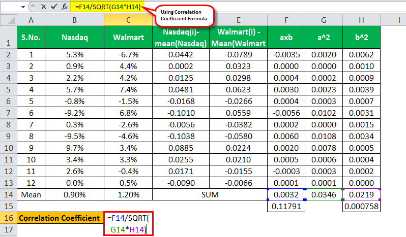

In the ever-evolving world of financial markets, understanding the correlation between stocks and market indicators is crucial for successful trading strategies. These correlations are essential because they reflect how different financial assets and indicators move relative to one another, providing insight that can lead to informed trading decisions. Traders and investors leverage these correlations to predict market trends, assess risk, and optimize portfolio performance.

Algorithmic trading has harnessed these correlations to transform traditional trading methods, enabling quicker and more efficient decision-making. This technologically driven approach employs complex mathematical models and sophisticated algorithms to analyze massive datasets, identifying patterns and correlations that might be imperceptible to the human eye. As a result, algorithmic trading can execute orders at speeds and frequencies far beyond the capability of human traders.



By exploring the relationship between stocks and market indicators, we can better comprehend the fundamental concepts that drive market movements. Correlation analysis allows traders to anticipate price patterns and manage risk effectively. Positive correlations indicate that stock prices and market indicators move in the same direction, while negative correlations suggest opposite movements, both of which can impact trading strategies significantly.

As we examine how algorithmic trading utilizes these correlations, it's important to recognize the dual role of correlation analysis: not only does it help in identifying trading opportunities, but it also plays a key role in risk management. Effective portfolio management often relies on diversifying assets, using correlation data to construct a mix of investments that reduce risk exposure.

By the end of this article, you will have a comprehensive understanding of how correlation analysis supports modern trading techniques. From measuring and analyzing statistical relationships to applying these insights within the framework of algorithmic trading, a thorough grasp of correlations provides a competitive edge in the financial markets.

## Table of Contents

## Understanding Stock and Market Indicator Correlations

At the core of financial analytics lies the concept of correlation, a statistical measure that quantifies the extent to which two variables move in relation to each other. In the context of the stock market, these variables often include stock prices and various market indicators such as indices, interest rates, or economic data. The correlation coefficient, denoted typically as $r$, ranges between -1 and 1. A value of 1 signifies a perfect positive correlation, where the movements of the stock and the indicator are directly proportional. Conversely, a value of -1 indicates a perfect negative correlation, suggesting inverse movements. A correlation of zero implies no relationship between the variables.

Understanding stock and market indicator correlations is crucial for traders, as it assists in anticipating price patterns and making informed decisions. A positive correlation suggests that as the market indicator rises, the stock price tends to increase as well. For instance, if a certain stock is known to be positively correlated with the S&P 500 index, a rise in the index could signal a potential rise in the stock's price. In contrast, a negative correlation indicates that the stock and the indicator generally move in opposite directions.

Statistical tools are essential in measuring and analyzing these correlations. The most common method used is the Pearson correlation coefficient, which measures the linear relationship between two variables and is calculated as:

$$
r = \frac{n(\sum xy) - (\sum x)(\sum y)}{\sqrt{[n\sum x^2 - (\sum x)^2][n\sum y^2 - (\sum y)^2]}}
$$

where $x$ and $y$ represent the variables in question, and $n$ is the number of observations. This formula evaluates how linear the relationship is between the stock and the indicator.

For detecting non-linear correlations, other methods such as the Spearman's rank correlation and Kendall rank correlation can be employed. These non-parametric tests are particularly useful when the data does not meet the assumptions required for Pearson's coefficient, such as normality and homoscedasticity.

Advanced software platforms and libraries in programming languages, such as Python, simplify the process of computing these coefficients. Python, for instance, offers libraries such as NumPy and pandas for handling complex datasets and calculating correlations efficiently. Here is a basic example using Python to calculate the Pearson correlation coefficient:

```python
import pandas as pd

# Example data
data = {
    'StockPrice': [100, 102, 103, 105, 107],
    'MarketIndicator': [2000, 2025, 2040, 2065, 2100]
}

# Create a DataFrame
df = pd.DataFrame(data)

# Calculate Pearson correlation
correlation = df['StockPrice'].corr(df['MarketIndicator'])
print(f"Pearson Correlation Coefficient: {correlation}")
```

Given its predictive power, correlation analysis is foundational for traders aiming to refine their trading models and strategies, helping them identify patterns or anomalies in stock movements relative to market indicators. This understanding not only assists in capitalizing on potential market opportunities but also plays a pivotal role in risk management and portfolio optimization. Through meticulous analysis of these correlations, traders can enhance their predictive accuracy and strategic response to market dynamics.

## Calculating Correlation Coefficients

Correlation coefficients are pivotal in evaluating the relationship between stocks and market indicators. These coefficients, which range from -1 to 1, provide a statistical measure of how closely two variables move in relation to each other. Establishing a strong understanding of correlation enables traders to make informed predictions about market behavior, aiding in strategy development and risk management.

### Techniques for Calculating Correlation

Several statistical methods are employed to calculate correlation coefficients, each with its own characteristics and suitable applications:

1. **Pearson Correlation Coefficient**: This is the most commonly used measure for linear relationships between two continuous variables. The coefficient, denoted as $r$, is calculated using the formula:
$$
   r = \frac{\sum (X_i - \bar{X})(Y_i - \bar{Y})}{\sqrt{\sum (X_i - \bar{X})^2 \sum (Y_i - \bar{Y})^2}}

$$

   Here, $X_i$ and $Y_i$ are individual data points for variables $X$ and $Y$, and $\bar{X}$ and $\bar{Y}$ are their respective means. Pearson's correlation is particularly effective for datasets with a normal distribution but may not accurately represent non-linear relationships.

2. **Kendall Rank Correlation Coefficient**: This non-parametric method is used to measure the ordinal association between two variables. It is less sensitive to outliers and is given by:
$$
   \tau = \frac{(C - D)}{\frac{1}{2}n(n-1)}

$$

   Where $C$ is the number of concordant pairs, $D$ is the number of discordant pairs, and $n$ is the total number of pairs. This method is useful in scenarios where data do not meet the assumptions of Pearson correlation (such as normal distribution).

3. **Spearman’s Rank Correlation Coefficient**: Another non-parametric measure that assesses how well the relationship between two variables can be described by a monotonic function. It is calculated as:
$$
   \rho = 1 - \frac{6 \sum d_i^2}{n(n^2 - 1)}

$$

   Here, $d_i$ is the difference between the ranks of each pair of values, and $n$ is the number of paired rankings. Like Kendall's tau, Spearman's coefficient is beneficial for handling ordinal data or non-linear trends.

### Computational Tools

The complexity involved in manually calculating these correlations, particularly with large datasets, necessitates the use of computational tools. Software platforms such as Python, with libraries like `pandas` and `numpy`, offer built-in functions to simplify these computations. For instance, in Python, Pearson correlation can be computed as follows:

```python
import pandas as pd

# Assuming df is a DataFrame with columns 'stock' and 'indicator'
correlation = df['stock'].corr(df['indicator'])
```

These technological aids allow traders to quickly assess and apply correlation metrics, facilitating more sophisticated analysis and model development.

### Application in Trading Strategies

Understanding and applying these correlation calculations empower traders to develop robust trading models. By recognizing patterns and evaluating relationships, traders can devise strategies that anticipate market movements. Tactics like pairs trading and [arbitrage](/wiki/arbitrage) are often built upon the foundation of correlation analysis, allowing for efficient response to dynamic market conditions.

In summary, the proper calculation and interpretation of correlation coefficients are essential for evaluating and enhancing trading strategies. Employing advanced statistical methods and computational tools enables a more nuanced understanding of market dynamics, fostering improved decision-making and strategic precision in financial trading.

## Application in Algorithmic Trading

Algorithmic trading represents a sophisticated fusion of finance and technology, leveraging correlation analysis for more informed decision-making in financial markets. These trading systems rely on automated models that process real-time correlation data, enabling traders to make swift, well-informed trades. By harnessing the power of algorithms, traders gain the ability to efficiently recognize and capitalize on correlation-driven market opportunities.

One primary application of correlation data in [algorithmic trading](/wiki/algorithmic-trading) is identifying and exploiting arbitrage opportunities. Arbitrage trading capitalizes on price discrepancies between correlated assets across different markets or platforms. By recognizing these discrepancies, algorithms can execute trades rapidly, ensuring that traders capture maximum profit from relatively minor price variations before the market corrects itself.

Another trading strategy benefiting from correlation analysis is pairs trading. This approach involves identifying two historically correlated stocks or financial instruments. When their price relationship diverges, traders can take long and short positions accordingly, anticipating a return to their mean price relationship. Algorithmic systems continuously analyze correlation data to detect these divergence points, executing trades with precision and speed.

Risk management also benefits significantly from correlation analytics. Automated models can assess the risk exposure of various assets and develop hedging strategies based on real-time data. By understanding how different assets correlate under varying market conditions, traders can create portfolios that are diversified, hence reducing overall risk. Algorithms tailor risk management strategies, such as adjusting leverage and employing stop-loss orders, based on the correlation data they process.

The core of these trading strategies lies in rapid execution and continuous data processing, both made possible by algorithmic systems. Algorithms typically implement mathematical models and employ programming languages such as Python to process correlation data efficiently. The use of Python's libraries, like NumPy and pandas, offers tools for calculating correlation coefficients and mapping real-time data, which are crucial for executing sophisticated trading strategies. For instance, a simple Python implementation to calculate the Pearson correlation coefficient between two data sets could resemble the following:

```python
import numpy as np

def calculate_pearson_correlation(data1, data2):
    return np.corrcoef(data1, data2)[0, 1]

# Example usage:
data1 = [1, 2, 3, 4, 5]
data2 = [5, 6, 7, 8, 9]
correlation = calculate_pearson_correlation(data1, data2)
print(f"Pearson correlation coefficient: {correlation}")
```

Through continuous evaluation of correlations, algorithmic trading systems equip traders with enhanced ability to maneuver in ever-shifting financial landscapes. These algorithms provide a competitive market edge by processing vast amounts of data quickly and accurately, allowing traders to make informed decisions and maximize their trading potential. As technology progresses, the precision and flexibility of these systems in dealing with correlation data will undoubtedly advance, offering even greater insights and efficiencies in market operations.

## Correlation and Risk Management

In trading, correlation analysis is integral not only for identifying lucrative opportunities but also for effective risk mitigation. A core principle within risk management is diversification, which can be optimized by utilizing assets with low or negative correlations. This approach minimizes overall risk exposure by ensuring that adverse movements in certain assets do not uniformly affect the entire portfolio.

The strategic application of correlation analysis is evident in various risk management practices. For instance, hedging mechanisms often depend on correlation data to offset potential losses in one asset by taking an opposite position in another highly correlated asset. Similarly, stop-loss orders, which are designed to limit an investor's loss on a security position, rely on correlation metrics to determine appropriate [exit](/wiki/exit-strategy) points in relation to market fluctuations.

To maintain a resilient portfolio, traders must continuously monitor correlation shifts. These shifts may occur due to changing market conditions, geopolitical events, or economic developments, necessitating timely portfolio adjustments to preserve the intended risk balance. The formula for the correlation coefficient can be pivotal in this monitoring process, often calculated as follows:

$$

r_{xy} = \frac{\sum (x_i - \bar{x})(y_i - \bar{y})}{\sqrt{\sum (x_i - \bar{x})^2 \sum (y_i - \bar{y})^2}} 
$$

where $r_{xy}$ is the correlation coefficient between variables $x$ and $y$, $\bar{x}$ and $\bar{y}$ are their respective means, and the sums range over the data points.

Effective risk management through correlation analysis significantly enhances portfolio stability, providing a safeguard against market volatilities. For traders and investors, the confidence derived from a well-balanced and stable portfolio often translates to an increased willingness to engage in market activities. This stability is crucial, as it not only protects capital but also supports the strategic pursuit of profit. As conditions evolve, maintaining an understanding of how these correlations function will remain essential for risk mitigation and optimized portfolio performance.

## Challenges and Limitations

Despite its utility, correlation analysis in trading is subject to several challenges. These challenges arise primarily from the dynamic nature of financial markets and the inherent statistical complexities involved in calculating and interpreting correlations.

Market conditions are dynamic, and this variability often leads to changes in correlations over time. For instance, a stock that is positively correlated with a particular market index during a bull market might show different correlation characteristics during a bear market. This temporal instability can significantly affect trading models, which often rely on historical correlation data to predict future trends. Therefore, continuously updating and adjusting these models is essential to maintain their relevance and accuracy.

Another significant challenge is the misconception that high correlation implies causation. A high correlation between two variables does not necessarily mean that one causes the other to move. This statistical phenomenon can lead to spurious correlations—meaningless relationships that occur by chance and not due to any causal link. For example, a stock might show high correlation with an unrelated economic indicator purely due to coincidental data patterns. Such misleading correlations can skew analysis and result in poor trading decisions if not identified and addressed properly.

Understanding the time-frame sensitivity and stability of correlations is equally crucial for accurate forecasting. Correlations can vary significantly across different time frames. Short-term correlations can differ from those observed over longer periods. Consequently, traders need to choose the appropriate time frame for their analysis based on their trading strategy and goals. This choice is pivotal, as inconsistent correlations across time frames can lead to erroneous interpretations and flawed trading strategies.

To mitigate these risks associated with erroneous interpretations of correlation data, traders must exercise caution and flexibility. Employing robust statistical methods to differentiate between significant and spurious correlations is vital. Furthermore, sensitivity analyses can help assess how changes in market conditions might impact correlations and trading models. By remaining vigilant to these challenges and limitations, traders can better utilize correlation analysis as part of a comprehensive trading approach.

## Conclusion

Correlation analysis remains an indispensable tool in modern trading and algorithmic systems. By understanding and applying correlation data, traders can significantly optimize their strategies for opportunity exploitation and risk management. Correlations enable traders to anticipate market movements and adjust strategies accordingly, whether for executing trades or hedging investments.

As technologies evolve, so too will the methods and models for assessing correlations. The latest algorithms and computational models continuously offer newer insights and efficiencies. These advancements allow traders to process vast amounts of market data swiftly and accurately, improving predictive accuracy and decision-making speed. For instance, [machine learning](/wiki/machine-learning) models can analyze historical and real-time data to detect emerging correlation patterns that might not be apparent through traditional methods.

Understanding the nuances of stock correlation and market indicators provides a competitive advantage in algorithmic trading. Mastery of these correlations allows traders to identify opportunities such as arbitrage and pairs trading, and to implement effective risk management strategies. Employing correlation data effectively ensures that portfolios are adjusted in response to market dynamics, enhancing long-term stability and returns.

Investors and traders should consistently explore and integrate these evolving methods to refine their trading strategies and improve market understanding. By leveraging advanced analytical techniques and maintaining a robust understanding of correlation dynamics, market participants can enhance performance and maintain a competitive edge. As markets and technologies advance, the precision and efficacy of correlation analysis will continue to grow, offering profound benefits to those who adeptly apply this knowledge.

## References & Further Reading

[1]: Bergstra, J., Bardenet, R., Bengio, Y., & Kégl, B. (2011). ["Algorithms for Hyper-Parameter Optimization."](https://dl.acm.org/doi/10.5555/2986459.2986743) Advances in Neural Information Processing Systems 24.

[2]: ["Advances in Financial Machine Learning"](https://www.amazon.com/Advances-Financial-Machine-Learning-Marcos/dp/1119482089) by Marcos Lopez de Prado

[3]: ["Evidence-Based Technical Analysis: Applying the Scientific Method and Statistical Inference to Trading Signals"](https://www.amazon.com/Evidence-Based-Technical-Analysis-Scientific-Statistical/dp/0470008741) by David Aronson

[4]: ["Machine Learning for Algorithmic Trading"](https://github.com/stefan-jansen/machine-learning-for-trading) by Stefan Jansen

[5]: ["Quantitative Trading: How to Build Your Own Algorithmic Trading Business"](https://www.amazon.com/Quantitative-Trading-Build-Algorithmic-Business/dp/1119800064) by Ernest P. Chan