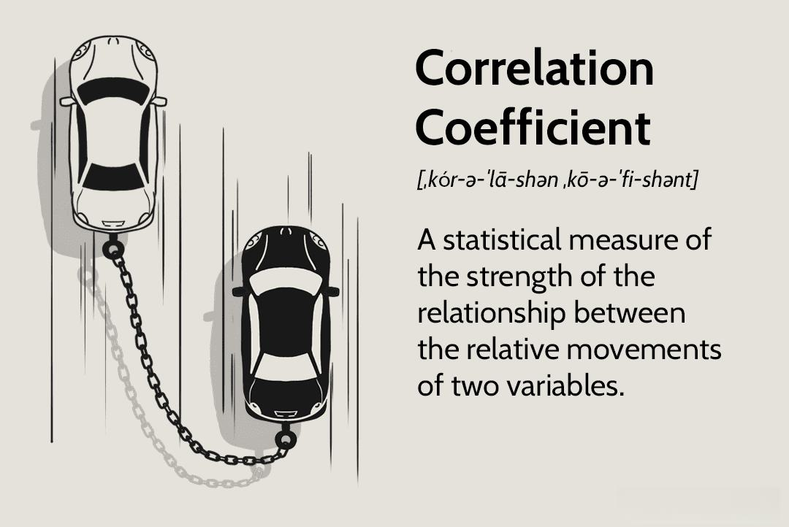

Understanding the interconnectedness of financial metrics is crucial for effective investment analysis in modern finance. Among these metrics, the correlation coefficient is a key statistical tool used to determine relationships between variables. The correlation coefficient, often represented by the symbol $r$, ranges from -1 to +1, indicating the strength and direction of a linear relationship between two variables. An $r$ value of +1 signifies a perfect positive correlation, -1 indicates a perfect negative correlation, and 0 suggests no linear relationship.

Algorithmic trading, or algo trading, significantly relies on financial metrics like the correlation coefficient to enhance trading strategies and optimize investment outcomes. This approach involves using computer algorithms to execute trades based on pre-set criteria, leveraging the power of statistical analysis and historical data. By incorporating correlation analysis, algorithmic models can rapidly identify patterns and trends that inform trading decisions, adjusting strategies in real-time to market dynamics.



This article examines how financial metrics, particularly the correlation coefficient, influence investment analysis within algo trading frameworks. By exploring this intricate network, we aim to unravel how such metrics enable more precise and dynamic decisions in algorithmic trading. The integration of statistical tools and financial data drives the evolution of trading strategies, allowing traders to navigate complex markets with greater confidence and efficiency.

## Table of Contents

## What is the Correlation Coefficient?

The correlation coefficient is a quantitative statistical measure that evaluates the degree to which two variables move in relation to each other. Mathematically, it is often represented by the symbol $r$ and is calculated using the formula:

$$
r = \frac{\sum (x_i - \bar{x})(y_i - \bar{y})}{\sqrt{\sum (x_i - \bar{x})^2 \sum (y_i - \bar{y})^2}}
$$

where $x_i$ and $y_i$ are individual data points for variables $X$ and $Y$, and $\bar{x}$ and $\bar{y}$ are their respective means.

The resulting value of $r$ ranges from -1 to 1. A value of 1 denotes a perfect positive correlation, meaning that as one variable increases, the other variable uniformly increases. Conversely, a value of -1 indicates a perfect negative correlation, where one variable increases as the other decreases. A correlation coefficient of 0 indicates no linear relationship, suggesting that the variables move independently of each other.

In the context of finance, correlation coefficients are critical for assessing how different assets, such as stocks or bonds, move in relation to one another. This is particularly important for constructing diversified investment portfolios that aim to minimize risk. By evaluating the correlations between different financial instruments, investors can identify effective hedging strategies and reduce unsystematic risk [1].

Effective risk management requires a thorough understanding of correlation dynamics. For instance, adding assets with low or negative correlations to a portfolio can aid in achieving a more stable performance over time, even amid market [volatility](/wiki/volatility-trading-strategies). 

In practice, software tools and programming languages like Python are frequently utilized to compute correlation coefficients. Python’s libraries, such as NumPy and Pandas, provide efficient functions for performing these calculations. For example:

```python
import numpy as np

# Sample data
x = np.array([1, 2, 3, 4, 5])
y = np.array([2, 4, 6, 8, 10])

# Calculating correlation coefficient
correlation_coefficient = np.corrcoef(x, y)[0, 1]
print("Correlation Coefficient:", correlation_coefficient)
```

This script demonstrates how to calculate the correlation coefficient between two datasets, illustrating the practical applicability of this metric in financial analysis.

[1]: Elton, E. J., Gruber, M. J., Brown, S. J., & Goetzmann, W. N. (2009). Modern Portfolio Theory and Investment Analysis. Wiley.

## Importance of Financial Metrics in Investment Analysis

Financial metrics are indispensable in investment analysis as they provide quantitative measures that help evaluate and compare investment opportunities. These metrics enable investors to assess the potential return and associated risks of different assets, allowing for informed decision-making and strategic planning.

One of the most commonly used metrics is the Return on Investment (ROI), which indicates the efficiency of an investment. ROI is calculated as:

$$
\text{ROI} = \left( \frac{\text{Net Profit}}{\text{Cost of Investment}} \right) \times 100
$$

This formula helps investors determine the percentage return on a particular investment, assisting in comparing the profitability of different investments.

Another critical metric is the Price-to-Earnings (P/E) ratio, which provides insight into a company's market valuation relative to its earnings. The P/E ratio is calculated by dividing the market value per share by the earnings per share (EPS):

$$
\text{P/E Ratio} = \frac{\text{Market Value per Share}}{\text{Earnings per Share}}
$$

A higher P/E ratio suggests that investors expect higher earnings growth in the future compared to companies with a lower P/E ratio.

When combined with correlation coefficients, these financial metrics offer a more comprehensive understanding of market conditions. The correlation coefficient measures the strength and direction of a linear relationship between two variables, such as different asset prices or financial ratios. By analyzing the correlation between assets, investors can strategically diversify their portfolios to minimize risk and optimize returns.

For instance, a negative correlation between two assets implies that when one asset's value decreases, the other's value increases. This understanding aids in constructing a balanced portfolio that can withstand market volatility.

Through the integration of financial metrics and correlation coefficients, investors can identify trends, evaluate risk levels, and make data-driven investment decisions. This analytical approach is crucial for recognizing patterns that affect asset performance and assessing the broader economic environment. As investors strive to optimize their portfolios, utilizing these metrics is essential for achieving long-term financial goals.

## Algorithmic Trading and Correlation Analysis

Algorithmic trading relies heavily on correlation analysis for creating sophisticated trading strategies. At its core, [algorithmic trading](/wiki/algorithmic-trading) uses computer programs to execute trades based on predefined criteria and statistical insights, allowing traders to capitalize on market opportunities with speed and precision.

Correlation analysis is pivotal in developing trading algorithms that can forecast market movements and pinpoint trading opportunities. The correlation coefficient, a statistical measure indicating the strength and direction of a linear relationship between two variables, plays a crucial role in this process. By analyzing the correlation between different financial instruments, traders can refine their algorithmic models to ensure they respond swiftly to market fluctuations.

This kind of analysis helps in formulating strategies that exploit the observed behaviors of assets. For example, if two assets typically move in tandem but start to diverge, an algorithm might execute trades expecting the historical correlation to reassert itself. This is the foundation of pairs trading, a strategy where traders capitalize on the relative performance of two correlated assets.

Moreover, correlation analysis aids in hedging positions. By understanding the correlations between different assets, traders can balance their portfolios to mitigate risk. An asset negatively correlated with an upward trend in another might be included in a portfolio to hedge against potential losses if the trend reverses.

Finally, correlation analysis helps in identifying and capitalizing on short-term market inefficiencies. Algorithms designed to leverage these inefficiencies can execute trades at speeds far beyond human capabilities, thus optimizing profits. For instance, high-frequency trading ([HFT](/wiki/high-frequency-trading-strategies)) strategies depend significantly on real-time correlation data to make instantaneous trading decisions.

Python provides robust libraries such as NumPy and pandas that facilitate correlation calculations. A simple Python example for calculating the correlation coefficient between two asset returns can be performed using pandas as follows:

```python
import pandas as pd

# Sample asset returns
asset_a_returns = pd.Series([0.01, 0.02, 0.015, 0.03, 0.025])
asset_b_returns = pd.Series([0.02, 0.025, 0.02, 0.03, 0.035])

# Calculate the correlation coefficient
correlation = asset_a_returns.corr(asset_b_returns)
print("Correlation Coefficient:", correlation)
```

This capability underscores the importance of integrating statistical analysis into the decision-making process in algorithmic trading, providing cutting-edge tools for traders to adapt to the continuously evolving financial markets.

## Applications of Correlation Coefficients in Trading Strategies

Correlation coefficients play an instrumental role in various trading strategies, serving as a foundational tool for enhancing profitability and managing risk effectively. Three primary applications of correlation coefficients in trading strategies are pairs trading, risk management, and diversification.

Pairs trading is a market-neutral strategy that takes advantage of the short-term pricing inefficiencies between two highly correlated assets. Traders identify pairs of assets whose historical price movements exhibit strong correlation. When the correlation temporarily weakens, traders execute trades by buying the undervalued asset and simultaneously short-selling the overvalued one, anticipating that prices will revert to their normal correlation pattern. This strategy hinges on the assumption that the assets' prices, after diverging, will move back towards their historical correlation relationship.

In risk management, correlation metrics are pivotal for constructing diversified portfolios that minimize unsystematic risk. By selecting a mix of assets with varying correlation levels, investors aim to achieve a balance where overall portfolio volatility is reduced. For instance, by incorporating assets with negative or low correlations into a portfolio, investors can mitigate the impact of adverse price movements in any single asset class. This approach to risk management relies on the principle that diversification reduces the uncertainty and potential loss in an investment portfolio.

Moreover, correlation analysis aids in identifying [arbitrage](/wiki/arbitrage) opportunities, which can enhance the profitability of trading strategies. Arbitrage involves exploiting price discrepancies for the same or correlated assets in different markets or forms. By analyzing correlation coefficients, traders can detect when assets deviate from expected correlation patterns, potentially signaling mispricings that can be capitalized upon. Arbitrage trading requires precise and timely execution, as the opportunities are often fleeting and open to other market participants.

Overall, the strategic use of correlation coefficients facilitates traders in constructing robust and profitable trading strategies, leveraging the interconnectedness of asset prices to optimize returns and manage risk.

## Challenges and Limitations of Using Correlation Coefficients

While correlation coefficients are instrumental in trading strategies, their analytical approach comes with several challenges and limitations. 

One of the main drawbacks is the reliance on the assumption of linearity. The correlation coefficient measures the strength and direction of a linear relationship between two variables. However, financial markets are often governed by complex non-linear relationships. In these contexts, linear correlation may fail to capture the true nature of the interdependencies, potentially leading traders to overlook significant patterns or misinterpret data.

Outliers represent another significant issue when using correlation coefficients. These are data points that differ substantially from others in a dataset, potentially skewing correlation results. An outlier can disproportionately influence the correlation coefficient, giving a misleading indication of the strength and direction of a relationship. This misrepresentation can be particularly problematic in financial data, where extreme values may be prevalent due to market volatility.

Moreover, correlation does not imply causation. A high correlation between two variables does not necessarily mean that one variable influences the other. This misinterpretation can lead to erroneous trading decisions if traders assume a causal relationship where only a correlation exists. For instance, two assets may move in tandem due to a shared external [factor](/wiki/factor-investing) rather than a direct relationship, and assuming otherwise could result in flawed trading strategies.

Another challenge is the dynamic nature of financial markets, where historical correlations may not always predict future relations. Market conditions can alter due to economic events, regulatory changes, or shifts in investor sentiment, which may make past correlations obsolete. This fluidity requires algorithmic trading models to be constantly monitored and updated, presenting practical challenges in maintaining model reliability.

Understanding these limitations is essential for devising reliable trading algorithms that minimize false signals. Traders often incorporate additional robust statistical methods or [machine learning](/wiki/machine-learning) techniques to address some limitations. For instance, using copulas can help model non-linear dependencies, and regularization techniques can mitigate the influence of outliers. Data scientists might implement code such as the following in Python to manage some of these complexities:

```python
import numpy as np
from scipy.stats import spearmanr
from statsmodels.robust.scale import mad

# Calculating a non-linear correlation using Spearman's rank correlation
def calculate_spearman_correlation(x, y):
    corr, _ = spearmanr(x, y)
    return corr

# Mitigating the effect of outliers using Median Absolute Deviation (MAD)
def remove_outliers(data):
    median_data = np.median(data)
    mad_value = mad(data) 
    non_outlier_data = [point for point in data if abs(point - median_data) < 3 * mad_value]
    return non_outlier_data

# Example data
x = np.random.rand(100)
y = np.random.rand(100)

# Calculating non-linear correlation
spearman_corr = calculate_spearman_correlation(x, y)

# Removing outliers
cleaned_data_x = remove_outliers(x)

print(f"Spearman correlation coefficient: {spearman_corr}")
print(f"Cleaned data: {cleaned_data_x}")
```

By acknowledging the constraints of correlation coefficients and adopting strategies to mitigate their effects, traders can create more robust and effective algorithmic models.

## Future Trends in Correlation Analysis for Algo Trading

Advancements in algorithmic trading are fundamentally altering how correlation analysis is employed within the domain. Machine learning and [artificial intelligence](/wiki/ai-artificial-intelligence) (AI) are at the forefront of this evolution, offering the potential to refine trading strategies significantly. These technologies enable machines to process vast amounts of financial data, identify patterns, and predict market movements with an unprecedented level of accuracy. By utilizing machine learning models such as neural networks or support vector machines, traders can uncover complex, nonlinear relationships between financial instruments that traditional methods might overlook.

Moreover, the integration of big data analytics into algorithmic trading facilitates the real-time analysis of complex datasets. This capability enhances both the precision and adaptability of trading algorithms, allowing them to respond rapidly to market changes. Big data frameworks, such as Apache Hadoop or Spark, can process and analyze streams of financial data at scale, enabling algorithms to make informed trading decisions based on the most current market conditions.

Blockchain technology also holds promise for improving correlation analysis in trading. One of the primary benefits of blockchain is its ability to ensure data integrity, providing traders with reliable and immutable datasets for analysis. This trust in data quality is crucial for effective correlation analysis, as it reduces the likelihood of errors that could lead to flawed trading strategies. The decentralized nature of blockchain can also enhance transparency in data sources, further strengthening its reliability.

The combination of these technological trends will push traders towards more sophisticated and effective trading strategies. Algorithmic trading systems equipped with machine learning can adapt to dynamically changing market environments, while big data analytics ensures that algorithms operate based on accurate, real-time information. Additionally, the implementation of blockchain could offer the added assurance of data integrity, which is fundamental for accurate correlation analysis.

Overall, these innovations will enable traders to construct adaptable algorithms capable of leveraging complex data structures. This progress is expected to foster smarter decision-making processes and yield superior trading outcomes in the highly competitive financial markets. Embracing these advancements is imperative for traders aiming to maintain a competitive edge in the fast-paced world of finance.

## Conclusion

Financial metrics, particularly the correlation coefficient, play a critical role in investment analysis and algorithmic trading. These metrics enable traders to better understand the relationships between various financial instruments, facilitating informed decision-making and strategic planning in rapidly shifting markets. Employing the correlation coefficient allows traders to quantify the degree to which securities move in tandem, providing essential insights for portfolio diversification and risk management.

The ongoing advancements in technology and data analytics enhance the utility of these financial metrics. As machine learning and artificial intelligence become more integrated into trading processes, they offer unprecedented analytical precision and adaptability. These technologies facilitate the real-time processing of massive datasets, enabling traders to make data-driven decisions with enhanced accuracy and speed. For example, machine learning algorithms can identify complex patterns in market data that traditional methods may overlook, allowing for more sophisticated trading strategies.

The future of financial markets is increasingly data-centric, and traders who embrace these innovative tools and technologies will likely gain a competitive edge. By leveraging the evolving landscape of data analytics, traders can transform raw data into actionable insights, paving the way for superior trading outcomes. Therefore, staying informed about these technological advancements and continuously adapting to new analytical methodologies is not only beneficial but essential for success in today's high-paced financial environment.

## References & Further Reading

[1]: Elton, E. J., Gruber, M. J., Brown, S. J., & Goetzmann, W. N. (2009). ["Modern Portfolio Theory and Investment Analysis."](https://books.google.com/books/about/Modern_Portfolio_Theory_and_Investment_A.html?id=181CEAAAQBAJ) Wiley.

[2]: Bodie, Zvi, Kane, Alex, & Marcus, Alan J. (2014). ["Investments."](https://www.mheducation.com/highered/product/investments-bodie-kane/M9781264412662.html) McGraw-Hill Education, 10th Edition.

[3]: Tsay, Ruey S. (2010). ["Analysis of Financial Time Series."](https://onlinelibrary.wiley.com/doi/book/10.1002/9780470644560) Wiley.

[4]: Marcos Lopez de Prado. (2018). ["Advances in Financial Machine Learning."](https://www.amazon.com/Advances-Financial-Machine-Learning-Marcos/dp/1119482089) Wiley.

[5]: Aronson, David R. (2006). ["Evidence-Based Technical Analysis: Applying the Scientific Method and Statistical Inference to Trading Signals."](https://www.amazon.com/Evidence-Based-Technical-Analysis-Scientific-Statistical/dp/0470008741) Wiley.

[6]: Chan, Ernest P. (2009). ["Quantitative Trading: How to Build Your Own Algorithmic Trading Business."](https://github.com/ftvision/quant_trading_echan_book) Wiley.

[7]: Jansen, Stefan. (2020). ["Machine Learning for Algorithmic Trading: Predictive models to extract signals from market and alternative data for systematic trading strategies with Python."](https://www.amazon.com/Machine-Learning-Algorithmic-Trading-alternative/dp/1839217715) Packt Publishing.