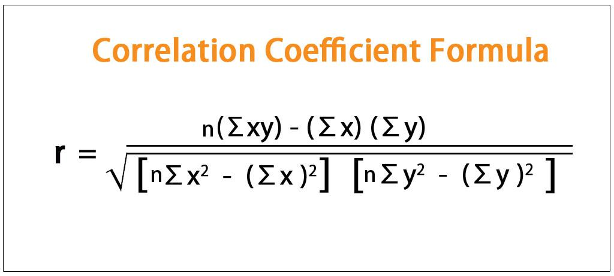

Understanding the dynamics of the stock market is crucial for investors seeking to optimize their returns. In this era of quantitative finance, algorithms have become pivotal in predicting stock market trends, leveraging statistical tools to enhance decision-making processes. One such tool is the correlation coefficient, a measure that quantifies the degree to which two securities move in relation to each other. This statistical measure is foundational in financial analysis, particularly in assessing asset relationships and portfolio diversification.

In recent years, the interplay between financial predictions, stock market returns, and algorithmic trading has garnered significant attention. Algorithmic trading, which utilizes pre-programmed instructions to execute trades efficiently, relies heavily on statistical correlations to identify opportunities and manage risks. This approach not only improves execution speed but also mitigates emotional biases that can often impact human traders.



The correlation coefficient, ranging from -1 to 1, is critical in understanding financial markets. A coefficient of 1 suggests a perfect positive relationship between two assets, meaning they move in the same direction. Conversely, a coefficient of -1 indicates a perfect inverse relationship. A coefficient near zero implies no predictable relationship. While the correlation coefficient aids in interpreting historical market data, its predictive power regarding future stock returns remains limited due to market volatility and dynamic changes in economic environments.

This article aims to elucidate the interconnections between financial modeling, stock market dynamics, and investment strategies, particularly focusing on algorithmic trading and the role of correlation in portfolio management. By doing so, we intend to provide investors with actionable insights into leveraging these tools and strategies to maximize returns while managing risks effectively.

## Table of Contents

## Understanding Correlation Coefficient in Stock Market

The correlation coefficient is a key statistical measure in financial markets, representing the degree to which two securities move in relation to each other. It serves as an essential tool in modern portfolio theory (MPT), which emphasizes the importance of risk assessment and diversification in portfolio management. The correlation coefficient provides a numerical value ranging from -1 to 1, where:

- A value of 1 indicates a perfect positive correlation, signifying that the securities move in the same direction.
- A value of 0 denotes no correlation, implying that the securities move independently of one another.
- A value of -1 reflects a perfect inverse correlation, meaning the securities move in opposite directions.

These correlations are invaluable for investors seeking to diversify their portfolios. By combining assets with low or negative correlations, investors can reduce the overall risk of their portfolios while potentially maintaining returns. This forms the cornerstone of MPT, aiming to construct an efficient frontier where the risk is minimized for a given level of expected return.

Despite the significant role of correlation coefficients in portfolio management, their ability to predict future returns is limited. Correlations are primarily historical measures, based on past data, which do not necessarily capture future market dynamics or sudden shifts. As market conditions fluctuate, correlations can change quite drastically, emphasizing the need for investors to continuously monitor these relationships rather than relying solely on historical data. This limitation underscores the importance of not using correlation coefficients in isolation but rather as part of a broader analysis considering various market factors.

## Financial Prediction Models and Their Limitations

Financial prediction models play a crucial role in attempting to forecast future stock market movements. These models leverage historical data and statistical measures to generate predictive insights. One essential component integrated into many of these models is the correlation coefficient. By quantifying how two securities move in relation to one another, correlation coefficients aim to enhance the accuracy of predictions by identifying potential patterns and relationships within the market.

In mathematical terms, the correlation coefficient ($r$) between two variables $X$ and $Y$ can be expressed as:

$$
r = \frac{\sum{(X_i - \bar{X})(Y_i - \bar{Y})}}{\sqrt{\sum{(X_i - \bar{X})^2}\sum{(Y_i - \bar{Y})^2}}}
$$

where $X_i$ and $Y_i$ are the individual data points, and $\bar{X}$ and $\bar{Y}$ are the mean values of $X$ and $Y$, respectively.

Despite the usefulness of correlation coefficients, financial prediction models incorporating them face significant challenges. One of the primary issues is the dynamic nature of market correlations. The stock market environment is highly fluid, influenced by numerous factors such as economic changes, geopolitical events, and investor sentiment. As these factors evolve, the previously observed correlations between securities can shift dramatically, which poses a threat to the reliability of the models grounded in static correlation assumptions.

Market [volatility](/wiki/volatility-trading-strategies) further exacerbates these limitations. During periods of high volatility, correlations can become unstable, leading to abrupt changes that prediction models may not account for effectively. For instance, during a financial crisis, correlations between asset classes often converge as investors simultaneously move into or out of certain assets in a bid for safety or [liquidity](/wiki/liquidity-risk-premium). This phenomenon, known as "correlation breakdown," can undermine the effectiveness of models that depend on historically stable relationships.

Moreover, prediction models often struggle to encapsulate the complex, non-linear interdependencies that exist in actual financial markets. While linear correlation measures can provide a snapshot of potential relationships, they may fall short in capturing the full spectrum of market dynamics. Advanced modeling techniques, such as [machine learning](/wiki/machine-learning) algorithms, attempt to address some of these challenges by uncovering deeper insights from vast datasets. However, even these sophisticated approaches require careful validation to ensure that they do not overfit historical data, rendering them ineffective in real-world applications.

In conclusion, while correlation coefficients and financial prediction models offer valuable insights into market movements, investors and analysts must remain cautious about their limitations. The ever-changing nature of correlations and market volatility necessitates a comprehensive approach to forecasting, combining traditional statistical methods with cutting-edge technologies and continuous market monitoring.

## Algorithmic Trading: Enhancing Predictions

Algorithmic trading employs algorithms to execute trades efficiently based on predetermined criteria. This sophisticated method of trading leverages statistical and mathematical models to optimize decision-making. One of the critical tools in these algorithms is the correlation coefficient, which helps identify trading opportunities by quantifying the degree of movement between different securities or market indices. By analyzing historical data, the algorithms can predict potential correlations that may signal opportune moments for executing trades.

Automating the trading process offers several advantages. It enhances efficiency by processing large volumes of data in fractions of a second, far surpassing human capabilities. Moreover, [algorithmic trading](/wiki/algorithmic-trading) reduces emotional bias—a common pitfall for human traders—by adhering strictly to predefined rules without deviation. This discipline ensures consistency in trade execution, often leading to more favorable financial outcomes.

However, algorithmic trading is not without its challenges. The complexity of these algorithms requires sophisticated design and continuous refinement. Traders and financial institutions must invest in high-frequency trading ([HFT](/wiki/high-frequency-trading-strategies)) infrastructure to achieve the necessary computational power and speed. HFT allows the execution of large numbers of orders at extremely high speeds, taking advantage of even the smallest price discrepancies. This infrastructure demands substantial financial resources and technical expertise to maintain and upgrade.

Developing effective algorithmic trading strategies often involves advanced programming skills and knowledge of quantitative finance. For instance, Python, with its extensive libraries for data analysis and machine learning, is a popular language among developers of trading algorithms. A simple example of calculating a correlation coefficient between two stocks using Python could look like this:

```python
import numpy as np
import pandas as pd

# Sample stock prices
stock_prices = {'Stock_A': [100, 102, 104, 103, 107],
                'Stock_B': [98, 99, 101, 100, 102]}

# Create DataFrame
df = pd.DataFrame(stock_prices)

# Calculate correlation coefficient
correlation_matrix = np.corrcoef(df['Stock_A'], df['Stock_B'])
correlation_coefficient = correlation_matrix[0, 1]

print(f"Correlation Coefficient: {correlation_coefficient}")
```

Despite the intricacies involved, algorithmic trading remains a powerful tool in the financial markets. It has transformed the landscape, paving the way for more sophisticated and dynamic trading strategies that can adapt to the ever-fluctuating market conditions. As technology continues to evolve, the role of algorithmic trading is set to expand, offering new possibilities for investors seeking to enhance their trading predictions and performance.

## The Role of Modern Portfolio Theory

Modern Portfolio Theory (MPT), developed by Harry Markowitz in 1952, is a fundamental concept in financial economics that aids in understanding how risk-averse investors can construct optimal portfolios. The theory emphasizes portfolio diversification, where investments are spread across a variety of assets to reduce risk and optimize returns. A central tenet of MPT is the efficient frontier—a set of optimal portfolios that provide the highest expected return for a given level of risk.

MPT relies heavily on the correlation coefficient to minimize portfolio risk. The correlation coefficient quantifies the degree to which two assets move together. By incorporating assets with low or negative correlations, an investor can potentially reduce the overall volatility of the portfolio. For instance, if asset A tends to rise when asset B falls, combining these assets can stabilize returns over time, achieving diversification benefits. The formula for calculating the correlation coefficient ($\rho$) between two asset returns $X$ and $Y$ is given by:

$$
\rho(X, Y) = \frac{\text{Cov}(X, Y)}{\sigma_X \sigma_Y}
$$

where $\text{Cov}(X, Y)$ is the covariance between the returns of the two assets, and $\sigma_X$ and $\sigma_Y$ are the standard deviations of the returns for assets $X$ and $Y$, respectively.

Despite its theoretical appeal, MPT assumes that asset correlations are static, which may not be the case in volatile markets. In practice, correlations can fluctuate significantly over time due to factors such as economic cycles, market sentiment, and macroeconomic events. These dynamic relationships can lead to unexpected correlations and impact the risk and return profile of a portfolio.

Consequently, investors must be vigilant about the shifting nature of correlations over time. Economic shifts, such as financial crises or market booms, can lead to synchronized movements across various asset classes, thus diminishing the benefits of diversification predicted by MPT. To address this limitation, investors might consider using dynamic models that adjust the correlation inputs based on current market conditions, rather than assuming static correlations.

In summary, while MPT provides a robust framework for portfolio construction through diversification and the efficient frontier, its reliance on static correlations presents challenges. Savvy investors need to continuously monitor and adapt to the changing correlation landscape to effectively manage portfolio risk and optimize returns during different economic phases.

## Practical Implications for Investors

Understanding the limitations of correlation coefficients is crucial for investors, as this statistical measure may not always predict future stock returns accurately. While correlation coefficients can indicate the historical relationship between assets, they do not inherently predict how assets will move in the future due to ever-changing market conditions. Therefore, investors should approach the correlation coefficient as one of many tools within a broader investment strategy.

Incorporating algorithmic strategies into traditional investing approaches can enhance decision-making processes. Algorithms can process vast amounts of data with higher efficiency and speed than manual methods. This allows for the identification of complex patterns and opportunities that might be missed by human analysis. For instance, algorithms can dynamically adjust parameters based on real-time data, potentially increasing the accuracy of investment decisions. One simple approach might involve a Python script to adjust the weight of assets in a portfolio based on recent correlation data:

```python
import numpy as np

# Example function to adjust portfolio weights
def adjust_portfolio_weights(corr_matrix, current_weights):
    # Calculate a modified weight based on inverse correlation
    inv_corr = np.linalg.inv(corr_matrix)  # Compute inverse of the correlation matrix
    new_weights = np.dot(inv_corr, current_weights)
    return new_weights / np.sum(new_weights)  # Normalize the weights

# Example data
correlation_matrix = np.array([[1, 0.5], [0.5, 1]])
current_portfolio_weights = np.array([0.6, 0.4])

# Adjust portfolio based on correlation
new_weights = adjust_portfolio_weights(correlation_matrix, current_portfolio_weights)
print("New Portfolio Weights:", new_weights)
```

Diversification remains a critical strategy, as it can reduce the overall risk of an investment portfolio. A well-diversified portfolio distributes risk across various asset classes, sectors, and geographies, thereby minimizing the impact of poor performance in any single area. However, diversification is not static and should dynamically adapt to changing market conditions to remain effective. As correlations between assets shift over time, regularly rebalancing the portfolio ensures that it stays aligned with risk and return objectives.

Continuous monitoring and adaptation to emerging market trends are vital for optimizing returns. The financial markets are influenced by numerous factors, including economic indicators, geopolitical events, and technological changes. By staying informed about these trends, investors can adjust their strategies proactively rather than reactively. This may involve leveraging technology to automate data collection and analysis, ensuring that investors have the most up-to-date information to inform their decisions.

Ultimately, a strategic blend of algorithmic and traditional investing methods, combined with a flexible approach to diversification and constant vigilance over market developments, can help investors navigate the complexities of financial markets and strive for optimal returns.

## Conclusion

While the correlation coefficient is an invaluable tool in financial analysis, its use in predicting stock returns has limitations. The coefficient measures the degree to which two financial securities move in relation to each other, providing insights into diversification and risk management. However, it does not inherently forecast future price movements. Market conditions are dynamic, with correlations often changing due to unforeseen events or shifts in investor sentiment. This unpredictability limits the correlation coefficient's reliability as a standalone predictive mechanism.

Algorithmic trading offers advancements in utilizing correlations to improve trading outcomes. Algorithms can process vast amounts of data rapidly, identifying patterns and relationships that might elude human traders. By integrating correlation coefficients, these systems can make informed decisions about asset pairings and potential trading strategies. Nevertheless, these advanced systems require careful management due to the complexity of their programming and the necessity for robust technological infrastructure.

Investors should employ a balanced approach, combining algorithmic methods with traditional investment strategies. While algorithms provide speed and data-driven insights, human intuition and long-term thinking remain crucial. Traditional strategies, grounded in [fundamental analysis](/wiki/fundamental-analysis) and patience, can complement the precision and rapid execution offered by algorithmic trades, creating a more resilient portfolio structure.

Staying informed about market dynamics and adapting investment strategies is essential for success in the ever-evolving financial landscape. Continuous education about macroeconomic factors, technological advancements, and global events will equip investors to adjust their portfolios proactively. Emphasizing diversification and flexibility allows for optimization of returns as markets transition through various phases, ensuring that investments remain aligned with both short-term opportunities and long-term goals.

## References & Further Reading

[1]: Markowitz, H. (1952). ["Portfolio Selection."](https://onlinelibrary.wiley.com/doi/abs/10.1111/j.1540-6261.1952.tb01525.x) The Journal of Finance, 7(1), 77-91.

[2]: Lopez de Prado, M. (2018). ["Advances in Financial Machine Learning."](https://www.amazon.com/Advances-Financial-Machine-Learning-Marcos/dp/1119482089) Wiley.

[3]: Chan, E. P. (2009). ["Quantitative Trading: How to Build Your Own Algorithmic Trading Business."](https://github.com/ftvision/quant_trading_echan_book) Wiley.

[4]: Jansen, S. (2020). ["Machine Learning for Algorithmic Trading."](https://github.com/stefan-jansen/machine-learning-for-trading) Packt Publishing.

[5]: Aronson, D. R. (2006). ["Evidence-Based Technical Analysis: Applying the Scientific Method and Statistical Inference to Trading Signals."](https://www.amazon.com/Evidence-Based-Technical-Analysis-Scientific-Statistical/dp/0470008741) Wiley.

[6]: Engle, R. F. (2002). ["Dynamic Conditional Correlation."](https://www.jstor.org/stable/1392121) Journal of Business & Economic Statistics, 20(3), 339-350.