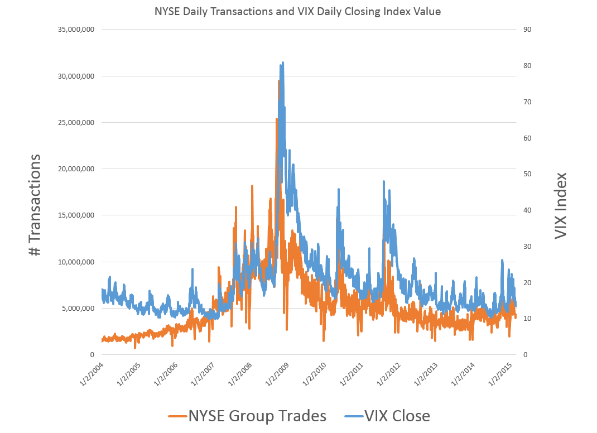

The financial markets are characterized by rapid fluctuations and massive trading volumes, a dynamic environment where stock volatility plays a pivotal role. Investors and traders closely monitor stock volatility, defined as the magnitude of price changes within a specific period, as it is crucial in assessing market risk and opportunities. Understanding the relationship between stock volatility and trading volume is essential, as these elements are interconnected. Trading volume, the total quantity of shares or contracts traded for a particular security, often correlates with volatility, providing insights into market sentiment and participants' behavior.

Algorithmic trading, or 'algo trading,' has transformed modern financial markets by using sophisticated algorithms to execute trades at speeds and scales impossible with manual methods. This technological advancement has revolutionized trading efficiency, enabling the rapid processing of complex data and enhancing market liquidity and price discovery.



This article explores the dynamics of stock volatility and trading volumes, shedding light on how they affect each other and the broader implications for market participants. It also examines the role of algo trading in today's financial landscape, highlighting its impact on trading strategies and market structures. Through this exploration, we aim to provide a comprehensive understanding of these critical factors shaping the modern financial markets.

## Table of Contents

## Understanding Stock Volatility and Trading Volume

Stock volatility refers to the extent of variability in the price of a stock over a defined timeframe. It is an essential metric that indicates the degree of risk associated with the asset's price movements. Historically, volatility is quantified using statistical tools, with the standard deviation of returns over a specified period being a common measure. A higher volatility indicates greater uncertainty and potential for substantial price swings.

A substantive relationship exists between trading volume and stock volatility. Trading volume, the total quantity of shares traded for a particular asset, can serve as a proxy for market activity and investor interest. Empirical studies suggest an increase in trading volume often accompanies heightened volatility. This relationship is attributed to the fact that significant volumes can reflect divergent investor opinions, leading to more significant price fluctuations.

Various factors can incite increased volatility, with earnings reports and breaking news being prominent triggers. For instance, an unexpected announcement regarding a company's earnings can lead to rapid reassessment of the stock's value, driving both trading volume and volatility. Similarly, news events affecting broader economic conditions can have a ripple effect on stocks, intensifying market activity. 

Furthermore, while higher trading volumes typically imply improved [liquidity](/wiki/liquidity-risk-premium) and could theoretically reduce [volatility](/wiki/volatility-trading-strategies) by absorbing buy and sell orders efficiently, this is not always the case. Stocks with substantial trading volumes can still experience varying levels of volatility due to other underlying dynamics, such as market sentiment and investor behavior.

A critical aspect of understanding these dynamics lies in analyzing trading orders. Order flow analysis, which examines the type and [volume](/wiki/volume-trading-strategy) of trades occurring at different price levels, provides insights into market sentiment and potential price movements. By focusing on the distribution and intensity of orders, traders can anticipate periods of increased volatility and adjust their strategies accordingly. Therefore, the interaction between trading volume and stock volatility is complex and requires nuanced analysis to fully comprehend its implications for market participants.

## The Impact of Trading Volume on Stock Volatility

Large quantities of buy or sell orders can significantly impact a stock's price. When a surge of buying interest prevails, as indicated by an increased volume of buy orders, the demand for the stock outpaces the supply. This situation often leads to a rise in stock price. Conversely, a higher volume of sell orders may lead to a decrease in the stock price as supply exceeds demand. Thus, trading volume plays a pivotal role in price fluctuations and the overall volatility of stocks.

An imbalance in trade orders is a common precursor to volatility. When there is a disproportion between buy and sell orders, it creates an environment conducive to price volatility. This imbalance can be driven by various factors, including market news, economic indicators, and company-specific events. Market participants respond to these stimuli by entering trades that skew the [order book](/wiki/order-book-trading-strategies), thereby impacting price stability.

High trading volumes typically suggest greater liquidity, potentially reducing volatility. Liquidity refers to the ability to buy or sell an asset quickly without substantial price changes. In liquid markets, larger trade orders tend to have less impact on prices, as there are sufficient counterparties to match the trades. As a result, volatility may be lower in stocks with higher trading volumes, as the market efficiently absorbs the impact of trades. However, this is not always the case, as liquidity can suddenly dry up due to external shocks or market sentiment shifts.

Real-world examples of this dynamic can be observed in popular stocks such as Tesla and Apple. Both stocks are characterized by high trading volumes, but they exhibit different levels of volatility. Tesla, known for its groundbreaking innovations and CEO Elon Musk's influence on social media, frequently experiences significant price swings. Despite its high trading volume, the stock's volatility is amplified by speculative trading and market sentiment shifts. In contrast, Apple, with its established market presence and steady growth projections, often demonstrates relatively lower volatility, even with its high trading volume. This difference can be attributed to varying factors, including market perception, [fundamental analysis](/wiki/fundamental-analysis), and the investor base's risk appetite.

The interaction between trading volume and stock volatility is multifaceted and influenced by market conditions, investor behavior, and external stimuli. Understanding these elements is essential for investors seeking to navigate the complexities of financial markets effectively.

## Algorithmic Trading in the Modern Financial Markets

Algorithmic trading, commonly referred to as algo trading, uses predefined instructions or algorithms to execute trades in financial markets, significantly enhancing the speed and efficiency of transactions compared to manual execution. These algorithms can be based on a variety of factors such as timing, price, quantity, or any mathematical model, allowing for a more systematic and disciplined approach to trading. The primary advantage of algo trading is its ability to perform tasks with higher frequency and precision than human traders, thereby offering a distinct competitive edge in the marketplace.

One of the most significant components of [algorithmic trading](/wiki/algorithmic-trading) is High-Frequency Trading ([HFT](/wiki/high-frequency-trading-strategies)), which is characterized by the extremely rapid execution of a large number of orders. HFT involves using complex algorithms to analyze multiple markets and execute orders based on market conditions that may change within milliseconds. The ability to capitalize on very short-term market inefficiencies is a hallmark of HFT strategies. An example code snippet in Python for a simplified HFT strategy might look like this:

```python
import numpy as np

def generate_high_frequency_trades(price_data):
    orders = []
    for i in range(1, len(price_data)):
        # Buy if price has decreased in last period
        if price_data[i] < price_data[i - 1]:
            orders.append(('BUY', i))
        # Sell if price has increased in last period
        elif price_data[i] > price_data[i - 1]:
            orders.append(('SELL', i))
    return orders

# Example price data
price_data = np.random.uniform(100, 150, 100)
orders = generate_high_frequency_trades(price_data)
```

Algorithmic trading is not limited to stock markets but is widely applicable across various financial markets, including [forex](/wiki/forex-system) and the burgeoning market of cryptocurrencies. In the forex market, algo trading can enable the execution of trades with a higher level of precision based on currency price movements and macroeconomic indicators. In the [cryptocurrency](/wiki/cryptocurrency) market, the use of algorithms can assist in trading digital assets across multiple exchanges with varying degrees of volatility and liquidity.

Different strategies in algorithmic trading cater to various market conditions and objectives. These strategies may include trend-following, market-making, statistical [arbitrage](/wiki/arbitrage), and mean-reversion. Each strategy can be tailored to specific financial instruments and market environments, allowing traders to optimize their approaches based on historical and real-time data.

Overall, algo trading represents a significant evolution in trading methodologies, where the integration of technology into financial markets allows for improved speed, accuracy, and capacity to handle vast amounts of data. As these technologies continue to advance, algorithmic trading is expected to further transform market landscapes, creating new opportunities and challenges for traders and institutions alike.

## Popular Algo Trading Strategies

Trend-following and mean reversion are fundamental strategies in algorithmic trading. Trend-following involves identifying and capitalizing on existing market trends by buying in an uptrend and selling in a downtrend. This can be implemented using technical indicators such as moving averages and the Average Directional Index (ADX). For instance, a simple moving average crossover system—a popular trend-following strategy—executes trades when a short-term moving average crosses a long-term moving average, signifying a trend change.

Mean reversion, on the other hand, is based on the premise that asset prices will revert to their historical averages over time. This strategy identifies overbought or oversold conditions, leveraging indicators such as the Relative Strength Index (RSI) to execute trades. For example, if a stock's RSI indicates it is oversold, a mean-reversion algorithm might automatically initiate a buy order anticipating a price correction.

Statistical arbitrage leverages quantitative and statistical methods to exploit pricing inefficiencies between related financial instruments. It typically involves pairs trading, where the algorithm identifies two historically correlated assets, buys the undervalued asset while simultaneously short-selling the overvalued one. The trade is closed when prices revert to their historical relationship, capturing the pricing discrepancy as profit. 

Market-making involves providing liquidity in the market by simultaneously quoting buy and sell prices for a financial instrument, intending to profit from the bid-ask spread. Algorithms in market-making continuously adjust prices based on supply and demand factors to maintain a balanced book and mitigate risk.

High-frequency trading (HFT) is characterized by executing a large number of orders at extremely high speeds to capitalize on small price anomalies. Algorithms assess and execute trades in milliseconds, making them effective in capturing fleeting market opportunities. HFT often uses [statistical arbitrage](/wiki/statistical-arbitrage), trend-following, and market-making strategies at high speeds but on a smaller scale.

The selection of an appropriate algorithmic trading strategy is contingent upon the trader’s objectives and prevailing market conditions. Factors such as market volatility, asset liquidity, and transaction costs play a significant role in strategy optimization. Traders and firms often invest in [backtesting](/wiki/backtesting) and simulations to tailor these strategies to match their unique risk profiles and ensure their efficacy in live markets.

## Advantages and Challenges of Algo Trading

Algorithmic trading, commonly referred to as algo trading, has become an integral component of the financial markets, primarily due to its technological advancements and intrinsic benefits. Among these benefits are speed and efficiency in executing trades, which significantly surpass what is achievable through traditional manual trading methods. Algorithmic systems can process vast amounts of market data and execute orders within milliseconds, providing a critical edge in fast-paced markets.

Another significant advantage of algo trading is the reduction of emotional bias. Human traders are prone to emotional decision-making, which can lead to irrational trades, particularly during periods of high volatility. Algorithmic systems adhere strictly to pre-defined rules and conditions, thus maintaining objectivity and consistency in trading decisions, which helps prevent costly mistakes driven by fear or greed.

Algo trading also facilitates the backtesting of trading strategies. Backtesting involves running a strategy against historical data to assess its viability. This process allows traders to optimize their strategies by understanding potential risks and expected performance before deploying them in live markets. By using backtesting, strategies can be honed and refined to improve outcomes and increase the likelihood of success.

Despite its significant advantages, algo trading presents several challenges. One of the primary challenges is the requirement for robust and high-quality data. Since algos depend heavily on data to make decisions, any inaccuracies or delays in data can lead to erroneous trades and potential losses. Ensuring access to reliable data sources is crucial for the effective functioning of any algorithmic system.

Another challenge lies in the need for reliable execution engines. These systems must be able to handle the high throughput necessary for real-time trading without failure. Technical glitches or system downtimes can result in missed opportunities or unintended trades, thus impacting the overall performance of the trading strategies.

Traders engaging in algo trading must also incorporate effective risk management systems. While algorithms can process data swiftly, they must be programmed to recognize and mitigate risk factors adequately. This includes setting proper stop-loss levels, position sizing, and understanding market conditions that could affect strategy performance. Effective risk management ensures that potential losses are minimized and that the algorithmic strategies operate within the trader's risk tolerance levels.

In conclusion, while algorithmic trading offers considerable benefits such as speed, efficiency, and the elimination of emotional biases, these advantages come with the need for robust infrastructure, high-quality data, and comprehensive risk management. Traders must weigh these factors carefully to effectively capitalize on the potential of algo trading in the modern financial markets.

## The Future of Financial Markets with Algo Trading

Algorithmic trading continues to grow, driving innovation in global markets. This rise in adoption is not just a response to increasing market complexities but also a strategic shift demanding precision and speed in execution. The integration of [artificial intelligence](/wiki/ai-artificial-intelligence) (AI) and [machine learning](/wiki/machine-learning) presents new possibilities for strategy development, enabling algo traders to analyze vast datasets and identify patterns that were previously undetectable.

AI and machine learning facilitate the creation of more adaptive trading algorithms that evolve over time. Through continuous learning processes, these systems can adjust strategies in real-time based on market conditions. For instance, [reinforcement learning](/wiki/reinforcement-learning), a subset of machine learning, enables trading systems to optimize their decision-making by learning from trading outcomes. An algorithm can be designed to maximize a reward function $R(t)$, which represents trading performance, through the formula:

$$
R(t) = f(\text{Profit}, \text{Risk}, \text{Execution Quality})
$$

As technology progresses, algorithmic trading is poised to become increasingly complex. This sophistication may manifest in the development of predictive models that not only react to market changes but anticipate them. By employing [deep learning](/wiki/deep-learning) models, currently one of the most advanced AI methodologies, traders can forecast market trends and shift trading strategies proactively.

Traders who adapt to these technological advancements are likely to secure a significant competitive advantage. Early adopters who leverage AI-powered algorithms can capitalize on improved accuracy and execution efficiency. Furthermore, increased computational power and access to high-performance computing make it feasible for a wider range of market participants to engage in algorithmic trading.

The future of algorithmic trading is inherently linked to its ability to harness and exploit these technological innovations. As markets become more complex and data-rich, the successful deployment of advanced algorithms will be a critical differentiator. Traders who remain informed and embrace these changes are positioned to thrive in the evolving financial landscape.

## Conclusion

Volatility and trading volume are central to grasping stock market behavior, serving as key indicators for predicting market movements. The dynamic relationship between these elements is crucial for formulating trading strategies, and understanding them can lead to significant advantages for both individual and institutional investors. Algorithmic trading, a sophisticated approach to trading that leverages computer programs to execute trades based on predefined criteria, has become essential in the modern financial landscape. By enabling the rapid processing of complex datasets, algo trading plays a pivotal role in managing and capitalizing on market dynamics, offering traders the ability to execute strategies with precision and speed.

Effectively harnessing these tools and strategies is indispensable for traders aiming to optimize their performance in fluctuating financial markets. Algo trading minimizes human error and emotional bias in trading decisions, allowing for more consistent execution of strategies. This discipline also facilitates backtesting, which is crucial in refining models for better predictive capabilities.

Given the continuous evolution of financial markets, staying informed and adaptable is essential for sustained success. As technology advances, incorporating developments like AI and machine learning into algorithmic trading can provide a competitive edge. These technologies not only enhance decision-making processes but also help identify new patterns and opportunities in the market. Ultimately, the ability to adapt to technological and market changes will be a decisive [factor](/wiki/factor-investing) for traders aiming to thrive in an increasingly automated trading environment.

## References & Further Reading

[1]: Bollerslev, T., Chou, R.Y., & Kroner, K.F. (1992). ["ARCH modeling in finance: A review of the theory and empirical evidence."](https://www.sciencedirect.com/science/article/pii/030440769290064X) Journal of Econometrics, 52(1-2), 5-59.

[2]: Karpoff, J.M. (1987). ["The Relation Between Price Changes and Trading Volume: A Survey."](https://www.jstor.org/stable/2330874?item_view=read_online) Journal of Financial and Quantitative Analysis, 22(1), 109-126.

[3]: Chan, E. (2009). ["Quantitative Trading: How to Build Your Own Algorithmic Trading Business."](https://github.com/ftvision/quant_trading_echan_book) Wiley Finance.

[4]: Engle, R.F. (1982). ["Autoregressive Conditional Heteroscedasticity with Estimates of the Variance of United Kingdom Inflation."](https://www.semanticscholar.org/paper/Autoregressive-conditional-heteroscedasticity-with-Engle/2ee6cb87fc81ecd78d161c4a92c9dfce00c8961c) Econometrica, 50(4), 987-1007.

[5]: Hasbrouck, J. (1991). ["Measuring the Information Content of Stock Trades."](https://www.jstor.org/stable/2328693) The Journal of Finance, 46(1), 179-207.

[6]: Lopez de Prado, M. (2018). ["Advances in Financial Machine Learning."](https://www.amazon.com/Advances-Financial-Machine-Learning-Marcos/dp/1119482089) Wiley Finance.