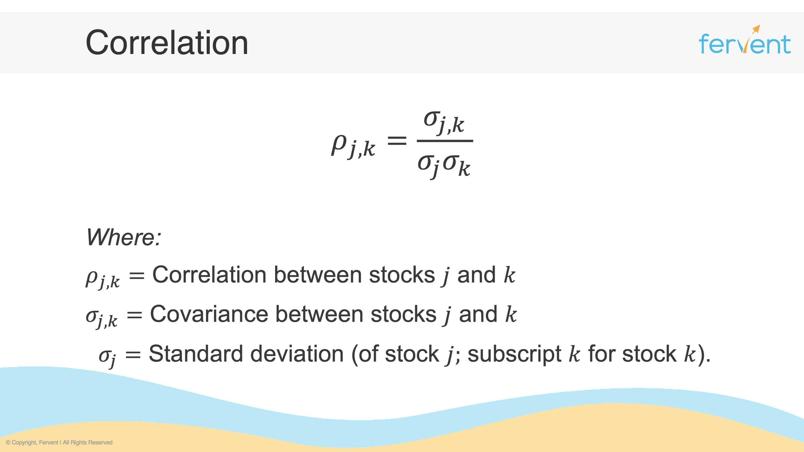

With the rise of algorithmic trading, understanding financial correlations has become crucial for traders and investors. In the financial markets, correlation is a statistical measure that determines how two securities move in relation to each other. This concept is pivotal in developing trading strategies that capitalize on the co-movements of assets, thereby enhancing potential returns and optimizing risk management. Algorithmic trading, with its reliance on quantitative models and data-driven insights, relies heavily on correlation metrics to inform position allocation, timing, and diversification strategies.

This article explores the intersection of finance correlation and algorithmic trading by providing insights into how these correlations impact trading strategies, enhance risk management, and contribute to diversified portfolios. Correlation analysis allows traders to formulate strategies involving pair trading and to identify which assets to include in a portfolio to minimize risk while maximizing returns. Portfolio diversification, achieved through the careful selection of non-correlated or negatively correlated assets, is crucial for reducing exposure to idiosyncratic risks.



This guide is designed for both novice traders and seasoned financial analysts looking to deepen their understanding of correlation's role in crafting effective trading strategies. New traders will gain insights into how correlation calculations can inform their initial trading decisions, while experienced analysts will appreciate a deeper exploration of its applications in algorithmic frameworks.

Furthermore, the guide investigates into the statistical methods used for calculating correlation, primarily focusing on the Pearson correlation coefficient, and its role in developing automated trading strategies. By understanding the significance of correlation, traders can leverage automated systems to execute trades more efficiently, adapting swiftly to market changes. This foundational knowledge sets the stage for more advanced discussions on leveraging modern technologies such as machine learning to refine correlation-based trading strategies, highlighting the evolving nature of algorithmic trading and financial analysis.

## Table of Contents

## What is Correlation in Finance?

Correlation in finance refers to the statistical relationship between two financial instruments or variables, indicating how they move in relation to each other. This metric plays a critical role in portfolio management and risk assessment, as it helps investors understand the potential impact of individual asset movements on the overall portfolio.

Correlation values range from -1 to +1. A correlation of +1 implies a perfect positive correlation, meaning the financial instruments move in unison. Conversely, a correlation of -1 indicates a perfect negative correlation, where the instruments move in opposite directions. A correlation of 0 suggests no linear relationship between the instruments.

For investors, understanding correlation is essential for risk mitigation. By constructing a portfolio with non-correlated or negatively correlated assets, investors can achieve diversification, which reduces the risk of significant losses. Diversifying in this manner can help cushion a portfolio from [volatility](/wiki/volatility-trading-strategies), as losses in one asset class may be offset by gains in another.

In financial markets, the concepts of positive, negative, and zero correlation are applied to various asset classes. For instance, equity markets may exhibit a positive correlation with economic growth indicators. In contrast, bonds and stocks often show negative correlations, as bonds typically perform better when equities are underperforming due to differing reactions to [interest rate](/wiki/interest-rate-trading-strategies) changes.

The calculation of correlation typically involves the Pearson correlation coefficient, a standard statistical measure expressed as:

$$
\rho(X, Y) = \frac{\text{cov}(X, Y)}{\sigma_X \sigma_Y}
$$

Where $\rho(X, Y)$ is the correlation coefficient, $\text{cov}(X, Y)$ is the covariance between the two variables, and $\sigma_X$ and $\sigma_Y$ are the standard deviations of the variables X and Y, respectively.

Exploring these correlations provides insights into the behavior of different financial instruments and aids in constructing robust portfolios that can withstand market fluctuations.

## Formula for Calculating Correlation

The Pearson correlation coefficient is a statistical measure used to evaluate the degree to which two financial variables, such as asset returns, move in relation to each other. It is a key tool in finance for assessing correlations between various assets, which can inform risk management and portfolio diversification strategies. The coefficient ranges from -1 to +1, where +1 indicates a perfect positive correlation, -1 a perfect negative correlation, and 0 no correlation.

### Steps Involved in Calculating the Pearson Correlation Coefficient

1. **Data Collection**: Gather the data for the two variables (e.g., daily returns of two stocks) that you wish to analyze. Ideally, the data set should be large enough to provide a statistically reliable measure.

2. **Mean Calculation**: Compute the mean (average) of each dataset. The formula for the mean of a dataset $X$ is:
$$
   \bar{X} = \frac{1}{n} \sum_{i=1}^{n} X_i

$$
   where $n$ is the number of data points and $X_i$ represents each data point.

3. **Deviation Computation**: Determine the deviation of each data point from its respective mean. For each data point in datasets $X$ and $Y$, calculate:
$$
   x_i = X_i - \bar{X}

$$
$$
   y_i = Y_i - \bar{Y}

$$

4. **Correlation Formula Application**: Apply the Pearson correlation coefficient formula:
$$
   r = \frac{\sum_{i=1}^{n} (x_i \cdot y_i)}{\sqrt{\sum_{i=1}^{n} x_i^2} \cdot \sqrt{\sum_{i=1}^{n} y_i^2}}

$$
   This formula takes the covariance of the two variables and divides it by the product of their standard deviations, standardizing the measure.

### Manual Calculation Example

Consider a simplified example with two datasets, each containing the following values:

- Data set X: 3, 4, 5, 6
- Data set Y: 2, 5, 7, 8

**Means**:
- $\bar{X} = (3 + 4 + 5 + 6) / 4 = 4.5$
- $\bar{Y} = (2 + 5 + 7 + 8) / 4 = 5.5$

**Deviation from Mean**:
- $x = [-1.5, -0.5, 0.5, 1.5]$
- $y = [-3.5, -0.5, 1.5, 2.5]$

**Correlation Calculation**:
- Numerator: $((-1.5) \cdot (-3.5)) + ((-0.5) \cdot (-0.5)) + ((0.5) \cdot 1.5) + (1.5 \cdot 2.5) = 12.5$
- Denominator: $\sqrt{((-1.5)^2 + (-0.5)^2 + 0.5^2 + 1.5^2) \cdot ((-3.5)^2 + (-0.5)^2 + 1.5^2 + 2.5^2)} = 13.6$

Thus, $r = \frac{12.5}{13.6} \approx 0.919$.

### Calculation Using Python

Python and other programming tools can streamline these calculations and handle larger datasets effectively. Below is a simple Python code using NumPy to calculate the Pearson correlation coefficient:

```python
import numpy as np

# Sample data
X = np.array([3, 4, 5, 6])
Y = np.array([2, 5, 7, 8])

# Calculate Pearson correlation coefficient
corr_coefficient = np.corrcoef(X, Y)[0, 1]

print("Pearson Correlation Coefficient:", corr_coefficient)
```

This script leverages NumPy's `corrcoef` function, which internally computes the Pearson correlation, producing an efficient and quick solution to manage complex data sets, such as those encountered in financial markets.

## Application of Correlation in Algorithmic Trading

In [algorithmic trading](/wiki/algorithmic-trading), correlation analysis plays a critical role in shaping robust trading strategies capable of predicting asset price movements with greater accuracy. By effectively leveraging correlation data, traders can optimize their trade executions, manage risk, and achieve better portfolio diversification.

One of the primary applications of correlation in algorithmic trading is in the implementation of [pair trading](/wiki/pair-trading) strategies. Pair trading involves selecting two stocks or financial instruments with high positive or negative correlation and trading them together. The rationale is that if one asset's price deviates significantly from its correlated counterpart, the relationship will eventually revert, allowing traders to profit from the convergence. For example, if the correlation between Stock A and Stock B is strong, traders might go long on Stock A and short Stock B when the price spread widens, anticipating a return to the mean.

Another essential application is in risk management and portfolio diversification. By understanding the correlation between different assets, traders can construct portfolios that minimize risk exposure. A well-diversified portfolio typically includes assets with low or negative correlation, reducing the impact of any single asset's price volatility on the overall portfolio performance. This method aligns with Markowitz's Modern Portfolio Theory, which suggests that diversification can lead to optimal risk-reward balances.

Arbitrage opportunities are also identified through correlation analysis. Market inefficiencies can often be exploited by observing dislocations in typically correlated assets. For instance, if two related assets display an unexpected divergence, traders can implement [arbitrage](/wiki/arbitrage) strategies to capitalize on the expected convergence.

Advanced trading algorithms take this a step further by utilizing real-time correlation data to dynamically adjust trading strategies. These algorithms continuously analyze market data to identify shifts in correlation patterns. For example, [machine learning](/wiki/machine-learning) models can process vast datasets to detect subtle correlation changes that may indicate upcoming market movements, enabling rapid adaptation to evolving conditions. This technology-driven approach allows traders to make informed decisions that exploit temporary market inefficiencies, enhancing trading performance.

The Python programming language is often employed to automate correlation analyses and implement algorithmic trading strategies. Here is a simplified example of how correlation data can be utilized using Python:

```python
import pandas as pd
import numpy as np
import yfinance as yf  # For more datasets, visit: https://paperswithbacktest.com/datasets

# Fetch historical data
stocks = ['AAPL', 'MSFT']
data = yf.download(stocks, start='2022-01-01', end='2023-01-01')['Adj Close']

# Calculate daily returns
returns = data.pct_change().dropna()

# Compute the correlation matrix
correlation_matrix = returns.corr()

# Display the correlation matrix
print(correlation_matrix)
```

This code fetches historical price data for Apple and Microsoft, computes their daily returns, and then calculates the correlation matrix. This information is instrumental in shaping pair trading strategies, as the correlation coefficient quantifies how closely the two asset prices move relative to each other.

In conclusion, correlation analysis is a powerful tool in algorithmic trading, providing critical insights into asset relationships, risk management, and market inefficiencies. By integrating real-time data and advanced algorithms, traders can enhance the efficiency and effectiveness of their trading strategies, achieving superior financial outcomes in competitive markets.

## Special Considerations and Challenges

Correlation does not imply causation; hence, caution is required when interpreting correlated financial instruments. Just because two assets exhibit a correlation does not mean that one causes the other to behave in a certain way. This distinction is crucial in trading, as relying solely on correlation without understanding the underlying causal relationships could lead to misguided investment decisions.

Market conditions can change dynamically, affecting correlation and necessitating continuous monitoring and adjustment of trading strategies. Correlations that hold during certain periods may diminish or reverse under different market conditions, such as economic shifts, changes in interest rates, or geopolitical events. Traders must, therefore, continually reassess their strategies to ensure they align with current market conditions. Algorithms can assist in this by automatically adjusting parameters based on real-time correlation data, ensuring timely responses to market changes.

Dealing with outliers is another critical aspect of accurate correlation analysis. Outliers can skew correlation coefficients, leading to erroneous conclusions about the relationships between financial instruments. Techniques such as robust statistical methods or data transformations can be used to mitigate the effect of outliers. For instance, using the Spearman rank correlation instead of the Pearson correlation coefficient can reduce the influence of outliers.

Diversification is a fundamental practice in correlation analysis yet presents its own challenges. While diversification helps reduce portfolio risk, traders must carefully select non-correlated assets to gain the desired benefit. A lack of diversification can result in unduly high risk if heavily correlated assets are selected inadvertently.

Advanced statistical techniques and tools can enhance the reliability of correlation analyses in the trading process. For example, multivariate statistical methods can capture more complex relationships between multiple assets. Machine learning models, such as principal component analysis (PCA) and clustering algorithms, can identify patterns and correlations that traditional statistical methods might miss.

Using Python for correlation analysis can streamline the process. Python libraries such as NumPy and Pandas offer efficient data manipulation capabilities, while SciPy provides functions to calculate correlation coefficients. Moreover, visualization libraries like Matplotlib and Seaborn can graphically represent correlations, helping traders to better interpret data.

For example, a simple script to compute the Pearson correlation coefficient using Python is as follows:

```python
import numpy as np
import pandas as pd

# Example data
data = {'Asset1': [2.4, 2.5, 2.8, 3.2, 3.5],
        'Asset2': [1.2, 1.4, 1.8, 2.0, 2.2]}
df = pd.DataFrame(data)

# Calculate Pearson correlation coefficient
correlation_matrix = df.corr(method='pearson')
print(correlation_matrix)
```

This script calculates the correlation matrix for two assets, enabling further analysis and strategy development. Overall, while correlation is a valuable tool in trading, it must be applied thoughtfully, considering the various challenges inherent in dynamic financial markets.

## Conclusion

Understanding and calculating correlation is crucial for developing effective trading strategies within algorithmic trading. Correlation measures the extent to which the prices of two financial instruments move in relation to each other, providing traders with insights into the dynamics of market behavior. By analyzing these relationships, algorithmic traders can identify pairs of assets that move together or inversely, which helps in devising strategies that aim to optimize returns.

Leveraging correlation, traders can enhance portfolio resilience against market volatility. For instance, incorporating assets with low or negative correlations can reduce risk exposure, as the varying movements can offset potential losses from other assets. This diversification strategy is fundamental to managing risk and ensuring stable returns, even in fluctuating market conditions.

This article has laid a foundation for those looking to understand the significant role correlation plays in both finance and algorithmic trading. By grasping these concepts, traders and analysts can use correlation data to enhance trading decisions, create sophisticated and diversified investment portfolios, and manage risk effectively.

Future avenues of exploration could include integrating machine learning techniques to refine correlation-based trading strategies. Machine learning algorithms can process large datasets and recognize complex patterns, potentially improving the accuracy and adaptability of correlation models in fast-paced trading environments. By incorporating advanced analytics, traders can stay ahead in dynamic markets, making informed decisions based on real-time data and historical correlations.

## References & Further Reading

[1]: Hull, J. C. (2018). ["Options, Futures, and Other Derivatives"](https://www.semanticscholar.org/paper/Options%2C-Futures%2C-and-Other-Derivatives-Hull/89bdee500c8623864fc9eb7a471546aa713acc44). Pearson Education.

[2]: Lopez de Prado, M. (2018). ["Advances in Financial Machine Learning"](https://www.amazon.com/Advances-Financial-Machine-Learning-Marcos/dp/1119482089). Wiley.

[3]: Alexander, C. (2001). ["Market Models: A Guide to Financial Data Analysis"](https://archive.org/details/marketmodelsguid0000alex). Wiley.

[4]: Chan, E. P. (2009). ["Quantitative Trading: How to Build Your Own Algorithmic Trading Business"](https://github.com/ftvision/quant_trading_echan_book). Wiley.

[5]: Shumway, R. H., & Stoffer, D. S. (2017). ["Time Series Analysis and Its Applications: With R Examples"](https://link.springer.com/book/10.1007/978-3-319-52452-8). Springer.

[6]: Pearson, K. (1895). ["Notes on regression and inheritance in the case of two parents"](https://royalsocietypublishing.org/doi/10.1098/rspl.1895.0041). Proceedings of the Royal Society of London.