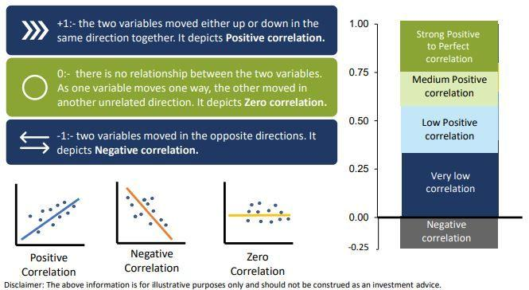

## Table of Contents

## What is correlation in the context of finance?

In finance, correlation refers to how closely the prices of two different investments move together. If two investments have a high positive correlation, it means that when one goes up, the other tends to go up as well. On the other hand, if they have a high negative correlation, one going up usually means the other goes down. Understanding correlation is important for investors because it helps them build a diversified portfolio, which can reduce risk.

For example, if an investor only buys stocks from the same industry, those stocks might all be affected by the same economic factors and move in the same direction. This could be risky because if the industry does poorly, the investor's entire portfolio could lose value. By choosing investments with low or negative correlations, an investor can spread out their risk. If one investment goes down, another might go up, helping to balance out the overall performance of the portfolio.

## How does correlation impact investment portfolios?

Correlation affects investment portfolios by showing how different investments move together. When investments have a high positive correlation, they tend to go up or down at the same time. This can be risky because if one investment does badly, others might do badly too. For example, if an investor puts all their money into tech stocks, and the tech industry has a bad year, the whole portfolio could lose value.

On the other hand, choosing investments with low or negative correlations can help spread out risk. If one investment goes down, another might go up, which can balance out the portfolio's performance. For instance, if an investor has some money in tech stocks and some in real estate, a bad year for tech might be offset by a good year for real estate. This way, the overall impact on the portfolio might be less severe.

Understanding correlation helps investors make smarter choices about which investments to include in their portfolio. By mixing investments that don't move in the same way, investors can create a more stable and potentially more profitable portfolio. This strategy is called diversification, and it's a key part of managing risk in investing.

## What is Modern Portfolio Theory (MPT) and how does it use correlation?

Modern Portfolio Theory (MPT) is a way of thinking about investing that helps people build better portfolios. It was created by Harry Markowitz in the 1950s. The main idea is that by carefully choosing different investments, you can lower the risk of losing money without giving up the chance to make money. MPT says that it's not just about picking the best single investments, but about how those investments work together. This is where correlation comes in.

Correlation is important in MPT because it helps investors understand how different investments move together. If two investments have a high positive correlation, they tend to go up or down at the same time. This can be risky because if one goes down, the other might too. But if investments have a low or negative correlation, they might move in opposite ways. This can help balance out the portfolio. By choosing investments with different correlations, MPT helps investors spread out their risk and aim for the best possible return for the amount of risk they are willing to take.

## Can you explain the difference between positive, negative, and zero correlation?

Positive correlation means that two things tend to move in the same direction. If one goes up, the other usually goes up too. If one goes down, the other usually goes down as well. For example, if you see that the price of gas and the cost of flying on an airplane both go up at the same time, they might have a positive correlation. The closer the correlation is to 1, the stronger the positive relationship.

Negative correlation is when two things move in opposite directions. When one goes up, the other tends to go down, and vice versa. For instance, if you notice that when the weather gets colder, fewer people go to the beach, those two things might have a negative correlation. The closer the correlation is to -1, the stronger the negative relationship.

Zero correlation means that there is no clear relationship between the two things. One thing going up or down doesn't seem to affect the other at all. For example, if you see that the number of hours you sleep each night doesn't seem to change no matter how much ice cream you eat, those two things might have a zero correlation. In this case, the correlation is close to 0, showing no significant link between them.

## How is correlation measured in Modern Portfolio Theory?

In Modern Portfolio Theory, correlation is measured using a number called the correlation coefficient. This number tells us how closely two investments move together. The correlation coefficient can be anywhere from -1 to 1. If it's close to 1, it means the two investments have a strong positive correlation, which means they tend to go up and down together. If it's close to -1, it means they have a strong negative correlation, meaning when one goes up, the other tends to go down. If the correlation coefficient is close to 0, it means there's no clear relationship between the two investments; they move independently of each other.

To find the correlation coefficient, you need data on how the investments have moved in the past. You look at the returns of the investments over time and use a formula to calculate the correlation. This formula takes into account how each investment's returns vary and how they vary together. By using this information, Modern Portfolio Theory helps investors figure out how to mix different investments in a way that can reduce risk while still aiming for good returns.

## What role does the correlation coefficient play in portfolio diversification?

The correlation coefficient helps investors make their portfolios stronger by showing how different investments move together. When the correlation coefficient is close to 1, it means that two investments go up and down at the same time. This can be risky because if one investment does badly, the other one might too. On the other hand, if the correlation coefficient is close to -1, the investments move in opposite directions. This can be good because if one investment goes down, the other might go up, helping to balance out the portfolio.

By looking at the correlation coefficient, investors can choose investments that don't all move the same way. This is called diversification. When a portfolio is diversified, it can handle ups and downs better because the different investments help balance each other out. For example, if stocks and bonds have a low correlation, a bad year for stocks might be offset by a good year for bonds. This way, the overall risk in the portfolio goes down, making it more stable and possibly more profitable over time.

## How can investors use correlation to minimize risk in their portfolios?

Investors can use correlation to minimize risk in their portfolios by choosing investments that don't move in the same way. When two investments have a low or negative correlation, it means that if one goes down, the other might go up. This helps balance out the portfolio. For example, if an investor has money in both stocks and bonds, and stocks have a bad year, the bonds might do well and help reduce the overall loss.

By looking at the correlation between different investments, investors can spread out their risk. This is called diversification. If all the investments in a portfolio move together, it's like putting all your eggs in one basket. But if the investments have different correlations, it's like spreading the eggs into different baskets. This way, if one basket falls, the eggs in the other baskets are still safe. Diversification helps make the portfolio more stable and less likely to lose a lot of value all at once.

## What are common misconceptions about correlation in portfolio management?

One common misconception about correlation in portfolio management is that a high correlation between two investments means they will always move in the same direction. While it's true that high correlation suggests a tendency to move together, it's not a guarantee. Correlation is based on historical data and can change over time. For example, two stocks might have been highly correlated in the past, but due to changes in the market or the companies themselves, their correlation could shift in the future.

Another misconception is that having investments with low or negative correlations will completely eliminate risk. While diversification through low or negative correlations can reduce risk, it doesn't remove it entirely. Unexpected events can still affect the entire market, causing even seemingly unrelated investments to move together. For instance, a global economic crisis might cause stocks, bonds, and commodities to all decline, regardless of their usual correlations. Understanding these nuances helps investors manage their expectations and build more resilient portfolios.

## How does correlation between assets change over time and what factors influence these changes?

Correlation between assets can change over time because the world is always changing. What affects the price of one investment today might not affect it the same way tomorrow. For example, two companies in the same industry might have been closely linked in the past, but if one company starts making products in a new industry, their correlation with the old industry might go down. Also, big events like economic crises, new laws, or technological changes can shake up how investments move together. During calm times, different types of investments might not move much together, but when there's a big shock, like a financial crisis, many investments might start moving in the same direction as everyone tries to sell off risky assets.

There are many things that can change how assets are correlated. One big factor is how the economy is doing. When the economy is growing, different sectors might do well or poorly on their own, leading to lower correlations. But if the economy starts to struggle, investments might start moving together more because everyone is worried about the same things. Another factor is what investors are thinking and feeling. If everyone gets scared and wants to play it safe, they might all move their money into the same types of investments, pushing correlations up. Also, changes in how companies do business, like moving into new markets or changing what they sell, can make their stocks less or more like other companies in their industry.

## Can you discuss advanced statistical methods used to assess correlation in MPT?

In Modern Portfolio Theory, one advanced way to assess correlation is by using something called the covariance matrix. This is a bit like a table that shows how different investments move together. Instead of just looking at how two things are related, the covariance matrix looks at how all the investments in a portfolio relate to each other. This helps investors understand the overall risk of their portfolio. It's a bit more complicated than just using a simple correlation coefficient, but it gives a fuller picture of how investments interact.

Another method is called the rolling window correlation. This technique looks at how the correlation between investments changes over time. Instead of just using all the past data at once, rolling window correlation breaks it into smaller chunks, like looking at data from the last year or the last three months. By doing this, investors can see if the correlation between their investments is staying the same, going up, or going down. This helps them adjust their portfolio to keep it balanced and manage risk better as market conditions change.

These advanced methods help investors make smarter choices about their portfolios. By using a covariance matrix, they can see the whole picture of how their investments move together. And by using rolling window correlation, they can keep an eye on how those relationships are changing. Both methods are important tools in Modern Portfolio Theory, helping to build portfolios that are more likely to do well over time while keeping risk under control.

## How do financial models account for non-linear correlations in portfolio construction?

Financial models often use advanced math to deal with non-linear correlations in building a portfolio. Non-linear correlations mean that the way two investments move together can change depending on how the market is doing. For example, two stocks might move together a lot when the market is going up, but not so much when the market is going down. To handle this, models might use something called copulas. Copulas are a way to look at how different investments are related, no matter if that relationship is simple or complex. By using copulas, financial models can better understand and predict how investments will behave together in different market situations.

Another way models account for non-linear correlations is by using machine learning techniques. These methods can find patterns in data that traditional math might miss. For instance, machine learning can look at lots of past data to see how different investments have moved together in the past, and then use that information to guess how they might move in the future. This helps investors make their portfolios more stable by understanding the tricky ways investments can be connected. By using these advanced tools, financial models can give a fuller picture of risk and help investors make smarter choices about their money.

## What are the limitations of relying on historical correlation data for future portfolio performance?

Relying on historical correlation data to predict how a portfolio will do in the future can be tricky. The main problem is that the past doesn't always tell us what will happen next. Markets change, companies change, and the world changes. What worked well together in the past might not work the same way in the future. For example, two stocks might have moved together a lot in the last few years, but if one company starts selling different products or if there's a big change in the economy, their relationship could change.

Another issue is that big events can shake things up. Things like economic crises, new laws, or big technological changes can make investments move in ways we didn't expect based on the past. During calm times, different types of investments might not move much together, but when there's a big shock, like a financial crisis, many investments might start moving in the same direction as everyone tries to sell off risky assets. So, while historical data can give us some clues, it's not a perfect guide for the future, and investors need to be ready for surprises.

## What is Understanding Modern Portfolio Theory?

Modern Portfolio Theory (MPT) is a cornerstone of modern finance, introduced by Harry Markowitz in his seminal paper "Portfolio Selection," published in 1952. Markowitz's theory revolutionized the way investors approached portfolio management by emphasizing the importance of diversification to minimize risk.

At its core, MPT posits that an investor can optimize their portfolio by selecting assets in such a way that the portfolio's expected return is maximized for a given level of risk, or conversely, the risk is minimized for a given level of expected return. This is achieved by considering the covariance between asset returns, which introduces the concept of diversification—holding a mix of assets that do not move perfectly in tandem with each other helps reduce the overall risk of the portfolio.

A key component of MPT is the efficient frontier, a graphical representation of optimal portfolios that offer the highest expected return for each level of risk. Portfolios that lie on this frontier are considered efficient, as there are no other portfolios that offer a higher expected return for the same level of risk. The risk-return trade-off, characterized by the efficient frontier, enables investors to make informed decisions about their risk tolerance and return expectations. Mathematically, the expected return $E(R_p)$ of a portfolio is the weighted sum of the expected returns of the individual assets:

$$
E(R_p) = \sum_{i=1}^n w_i E(R_i)
$$

where $w_i$ is the proportion of the portfolio's total value invested in asset $i$, and $E(R_i)$ is the expected return of asset $i$.

The risk of the portfolio is measured by its standard deviation, represented by $\sigma_p$, which takes into account the individual assets' standard deviations and their correlations:

$$
\sigma_p = \sqrt{\sum_{i=1}^n w_i^2 \sigma_i^2 + \sum_{i=1}^{n-1}\sum_{j=i+1}^n 2w_i w_j \sigma_i \sigma_j \rho_{ij}}
$$

where $\sigma_i$ is the standard deviation of asset $i$, and $\rho_{ij}$ is the correlation coefficient between assets $i$ and $j$.

The importance of MPT in constructing investment portfolios lies in its ability to allow investors to make quantitatively backed decisions about asset allocation that align with their investment goals and risk appetite. By considering the interplay between risk and return, investors can build portfolios that not only aim to maximize returns but also manage risk effectively.

MPT's introduction of diversification, efficient frontier, and the risk-return trade-off has had profound implications for portfolio management. It provides a structured framework that investment professionals and individual investors alike can use to derive optimal asset combinations, thus underpinning many modern investment strategies and financial products.

## What is the role of correlation in Modern Portfolio Theory (MPT)?

Correlation is a statistical measure that quantifies the extent to which two financial assets move in relation to each other. It ranges from -1 to +1, where +1 indicates a perfect positive correlation, meaning that the assets move in the same direction, and -1 indicates a perfect negative correlation, signifying that the assets move in opposite directions. A correlation of 0 implies no linear relationship between the movements of the assets.

In the context of Modern Portfolio Theory (MPT), correlation plays a crucial role in diversification and risk management. The primary objective of diversification is to create a portfolio that minimizes risk while achieving a desired return. By selecting assets with low or negative correlations, investors can reduce the overall [volatility](/wiki/volatility-trading-strategies) of their portfolio. This is because the negative price movements of one asset can be offset by the positive price movements of another, thereby smoothing out the portfolio's performance.

The impact of correlation on diversification can be mathematically represented through the portfolio variance formula. For a two-asset portfolio, the formula is as follows:

$$

\sigma_p^2 = w_1^2 \sigma_1^2 + w_2^2 \sigma_2^2 + 2w_1w_2 \sigma_1 \sigma_2 \rho_{12} 
$$

Where:
- $\sigma_p^2$ is the portfolio variance.
- $w_1$ and $w_2$ are the weights of asset 1 and asset 2 in the portfolio.
- $\sigma_1^2$ and $\sigma_2^2$ are the variances of asset 1 and asset 2.
- $\rho_{12}$ is the correlation coefficient between asset 1 and asset 2.

The correlation coefficient $\rho_{12}$ directly influences the covariance term $2w_1w_2 \sigma_1 \sigma_2 \rho_{12}$. If $\rho_{12}$ is low or negative, the overall portfolio variance—and thus risk—can be significantly reduced, resulting in an optimized portfolio that lies on the efficient frontier, where the best possible return for a given level of risk is achieved.

For portfolio optimization, investors aim to identify the set of asset weights that minimizes the variance while achieving a specified return level. By considering the correlation coefficients between all asset pairs, the optimization process analytically determines the ideal combination, informing investors on how to allocate resources efficiently.

In practical terms, investment strategies might utilize software tools to calculate correlations and generate optimal portfolios. Python, for example, offers libraries like NumPy and pandas to compute correlation matrices and scipy.optimize for numerical optimization of portfolio weights.

Here is a simple example using Python to compute a correlation matrix:

```python
import numpy as np
import pandas as pd

# Sample data: percentage returns for three assets
data = {
    'Asset_A': [0.05, 0.02, 0.01, 0.03, 0.04],
    'Asset_B': [0.02, 0.01, 0.03, 0.02, 0.01],
    'Asset_C': [-0.01, 0.00, 0.02, -0.01, 0.01]
}

# Create a DataFrame
df = pd.DataFrame(data)

# Calculate the correlation matrix
correlation_matrix = df.corr()

print(correlation_matrix)
```

In this example, the `corr()` function calculates the correlation matrix, which aids in understanding how each asset's returns relate to others, crucial for implementing MPT effectively. By strategically managing these relationships, investors can construct portfolios that offer optimal risk-return profiles.

## References & Further Reading

[1]: Markowitz, H. (1952). ["Portfolio Selection."](https://onlinelibrary.wiley.com/doi/abs/10.1111/j.1540-6261.1952.tb01525.x) The Journal of Finance, 7(1), 77-91.

[2]: Elton, E. J., & Gruber, M. J. (1997). ["Modern Portfolio Theory, 1950 to Date."](https://www.sciencedirect.com/science/article/pii/S0378426697000484) Journal of Banking & Finance, 21(11-12), 1743-1759.

[3]: Pardo, R. (2008). ["The Evaluation and Optimization of Trading Strategies"](https://onlinelibrary.wiley.com/doi/book/10.1002/9781119196969) by Robert Pardo.

[4]: Grinold, R. C., & Kahn, R. N. (2000). ["Active Portfolio Management: A Quantitative Approach for Producing Superior Returns and Controlling Risk."](https://www.amazon.com/Active-Portfolio-Management-Quantitative-Controlling/dp/0070248826) 

[5]: Avellaneda, M., & Stoikov, S. (2008). ["High-frequency trading in a limit order book."](https://people.orie.cornell.edu/sfs33/LimitOrderBook.pdf) Quantitative Finance, 8(3), 217-224.