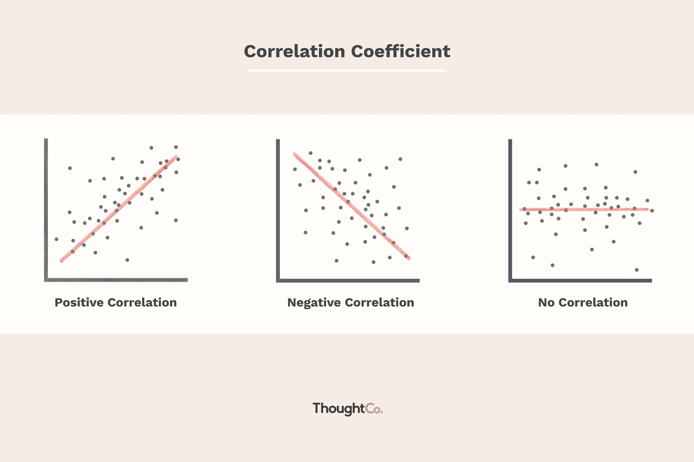

This article aims to elucidate the interconnected roles of Modern Portfolio Theory (MPT), correlation, and algorithmic trading in contemporary investment strategies. The target audience includes financial analysts, portfolio managers, and investors looking to deepen their understanding of these foundational concepts and their applications in optimizing investment portfolios.

The significance of Modern Portfolio Theory, introduced by Harry Markowitz in 1952, cannot be overstated. It revolutionized the field of investment by proposing a systematic framework for constructing portfolios that maximize expected return for a given level of risk. MPT's central tenet lies in its quantification of the trade-off between risk and return and its prescription for diversification as a method to mitigate risk. This risk-return paradigm is essential for any investor aiming to make informed decisions in a fluctuating market environment.



Correlation represents a pivotal concept when discussing MPT. In finance, correlation refers to the statistical measure that describes the degree to which two securities move in relation to each other. Understanding correlation is vital for investors as it impacts diversification and, consequently, portfolio risk. Negative or low positive correlations between asset returns can reduce overall portfolio risk, leading to more efficient portfolios as outlined on an efficient frontier.

Algorithmic trading introduces another layer of complexity and efficiency, leveraging advanced mathematical models and computational power to automate trading decisions. This not only enhances the precision and speed of executing trades but also allows for the continuous rebalancing of portfolios to align with the principles of MPT. The integration of algorithmic trading with MPT introduces dynamic and data-driven approaches to managing portfolios, making it a compelling tool for modern financial markets.

Ultimately, this article will explore these concepts, highlighting their individual and collective roles in shaping investment strategies. By doing so, it seeks to provide readers with a comprehensive understanding of how Modern Portfolio Theory, correlation, and algorithmic trading combine to advance the field of finance and offer opportunities for enhanced portfolio management.

## Table of Contents

## Understanding Modern Portfolio Theory

Modern Portfolio Theory (MPT) is a cornerstone of modern finance, introduced by Harry Markowitz in his seminal paper "Portfolio Selection," published in 1952. Markowitz's theory revolutionized the way investors approached portfolio management by emphasizing the importance of diversification to minimize risk.

At its core, MPT posits that an investor can optimize their portfolio by selecting assets in such a way that the portfolio's expected return is maximized for a given level of risk, or conversely, the risk is minimized for a given level of expected return. This is achieved by considering the covariance between asset returns, which introduces the concept of diversification—holding a mix of assets that do not move perfectly in tandem with each other helps reduce the overall risk of the portfolio.

A key component of MPT is the efficient frontier, a graphical representation of optimal portfolios that offer the highest expected return for each level of risk. Portfolios that lie on this frontier are considered efficient, as there are no other portfolios that offer a higher expected return for the same level of risk. The risk-return trade-off, characterized by the efficient frontier, enables investors to make informed decisions about their risk tolerance and return expectations. Mathematically, the expected return $E(R_p)$ of a portfolio is the weighted sum of the expected returns of the individual assets:

$$
E(R_p) = \sum_{i=1}^n w_i E(R_i)
$$

where $w_i$ is the proportion of the portfolio's total value invested in asset $i$, and $E(R_i)$ is the expected return of asset $i$.

The risk of the portfolio is measured by its standard deviation, represented by $\sigma_p$, which takes into account the individual assets' standard deviations and their correlations:

$$
\sigma_p = \sqrt{\sum_{i=1}^n w_i^2 \sigma_i^2 + \sum_{i=1}^{n-1}\sum_{j=i+1}^n 2w_i w_j \sigma_i \sigma_j \rho_{ij}}
$$

where $\sigma_i$ is the standard deviation of asset $i$, and $\rho_{ij}$ is the correlation coefficient between assets $i$ and $j$.

The importance of MPT in constructing investment portfolios lies in its ability to allow investors to make quantitatively backed decisions about asset allocation that align with their investment goals and risk appetite. By considering the interplay between risk and return, investors can build portfolios that not only aim to maximize returns but also manage risk effectively.

MPT's introduction of diversification, efficient frontier, and the risk-return trade-off has had profound implications for portfolio management. It provides a structured framework that investment professionals and individual investors alike can use to derive optimal asset combinations, thus underpinning many modern investment strategies and financial products.

## Correlation and Its Role in MPT

Correlation is a statistical measure that quantifies the extent to which two financial assets move in relation to each other. It ranges from -1 to +1, where +1 indicates a perfect positive correlation, meaning that the assets move in the same direction, and -1 indicates a perfect negative correlation, signifying that the assets move in opposite directions. A correlation of 0 implies no linear relationship between the movements of the assets.

In the context of Modern Portfolio Theory (MPT), correlation plays a crucial role in diversification and risk management. The primary objective of diversification is to create a portfolio that minimizes risk while achieving a desired return. By selecting assets with low or negative correlations, investors can reduce the overall [volatility](/wiki/volatility-trading-strategies) of their portfolio. This is because the negative price movements of one asset can be offset by the positive price movements of another, thereby smoothing out the portfolio's performance.

The impact of correlation on diversification can be mathematically represented through the portfolio variance formula. For a two-asset portfolio, the formula is as follows:

$$

\sigma_p^2 = w_1^2 \sigma_1^2 + w_2^2 \sigma_2^2 + 2w_1w_2 \sigma_1 \sigma_2 \rho_{12} 
$$

Where:
- $\sigma_p^2$ is the portfolio variance.
- $w_1$ and $w_2$ are the weights of asset 1 and asset 2 in the portfolio.
- $\sigma_1^2$ and $\sigma_2^2$ are the variances of asset 1 and asset 2.
- $\rho_{12}$ is the correlation coefficient between asset 1 and asset 2.

The correlation coefficient $\rho_{12}$ directly influences the covariance term $2w_1w_2 \sigma_1 \sigma_2 \rho_{12}$. If $\rho_{12}$ is low or negative, the overall portfolio variance—and thus risk—can be significantly reduced, resulting in an optimized portfolio that lies on the efficient frontier, where the best possible return for a given level of risk is achieved.

For portfolio optimization, investors aim to identify the set of asset weights that minimizes the variance while achieving a specified return level. By considering the correlation coefficients between all asset pairs, the optimization process analytically determines the ideal combination, informing investors on how to allocate resources efficiently.

In practical terms, investment strategies might utilize software tools to calculate correlations and generate optimal portfolios. Python, for example, offers libraries like NumPy and pandas to compute correlation matrices and scipy.optimize for numerical optimization of portfolio weights.

Here is a simple example using Python to compute a correlation matrix:

```python
import numpy as np
import pandas as pd

# Sample data: percentage returns for three assets
data = {
    'Asset_A': [0.05, 0.02, 0.01, 0.03, 0.04],
    'Asset_B': [0.02, 0.01, 0.03, 0.02, 0.01],
    'Asset_C': [-0.01, 0.00, 0.02, -0.01, 0.01]
}

# Create a DataFrame
df = pd.DataFrame(data)

# Calculate the correlation matrix
correlation_matrix = df.corr()

print(correlation_matrix)
```

In this example, the `corr()` function calculates the correlation matrix, which aids in understanding how each asset's returns relate to others, crucial for implementing MPT effectively. By strategically managing these relationships, investors can construct portfolios that offer optimal risk-return profiles.

## Algorithmic Trading and Its Integration with MPT

Algorithmic trading refers to the use of computer algorithms to execute trading orders at speeds and frequencies impossible for human traders. It leverages mathematical models and statistical analyses to make trade decisions, offering distinct advantages such as increased speed, accuracy, and the ability to process significant quantities of data. In modern financial markets, [algorithmic trading](/wiki/algorithmic-trading) represents a dominant strategy, contributing to improved [liquidity](/wiki/liquidity-risk-premium) and market efficiency.

Integrating algorithmic trading with Modern Portfolio Theory (MPT) presents an opportunity to enhance portfolio management by automating asset selection and rebalancing processes. MPT, developed by Harry Markowitz, emphasizes optimizing portfolios through diversification, maximizing returns while minimizing risk. Algorithms can systematically rebalance portfolios in response to market movements, ensuring that the investments align with an investor's risk preferences and the efficient frontier—an integral concept of MPT that defines the set of optimal portfolios offering the highest expected return for a given level of risk.

Consider an example algorithm designed to incorporate MPT principles:

```python
import numpy as np
import cvxopt as opt
from cvxopt import blas, solvers

def optimal_portfolio(returns):
    n = len(returns)
    returns = np.asmatrix(returns)
    N = 100
    mus = [10**(5.0 * t / N - 1.0) for t in range(N)]

    # Convert to cvxopt matrices
    S = opt.matrix(np.cov(returns))
    pbar = opt.matrix(np.mean(returns, axis=1))

    # Create constraint matrices
    G = -opt.matrix(np.eye(n))   # negative n x n identity matrix
    h = opt.matrix(0.0, (n ,1))
    A = opt.matrix(1.0, (1, n))
    b = opt.matrix(1.0)

    # Calculate efficient frontier weights using quadratic programming
    portfolios = [solvers.qp(mu * S, -pbar, G, h, A, b)['x'] for mu in mus]
    returns = [blas.dot(pbar, x) for x in portfolios]
    risks = [np.sqrt(blas.dot(x, S*x)) for x in portfolios]

    return np.array(returns), np.array(risks), portfolios
```

This Python code uses quadratic programming to generate an efficient frontier based on historical asset returns. The algorithm computes optimal asset weights for the portfolio that maximizes expected returns for a given level of risk, thereby enhancing decision-making in line with MPT.

Furthermore, various algorithms such as Genetic Algorithms and Particle Swarm Optimization have been explored for their potential to optimize asset allocation within the MPT framework. These algorithms help in exploring a vast space of potential portfolios, providing solutions that adhere to MPT’s risk-return trade-off principle while adapting to market dynamics in real-time.

By integrating algorithmic trading strategies with MPT, investors can achieve a dynamic approach to portfolio management, one that anticipates market changes and reacts faster than traditional manual strategies.

## Criticisms and Limitations of MPT

Modern Portfolio Theory (MPT) has fundamentally shaped investment strategies by promoting diversification and quantifying the risk-return trade-off. However, it has notable criticisms and limitations, particularly regarding its reliance on correlation and assumptions that may not always align with market realities.

One critical aspect of MPT is its dependence on correlation to achieve diversification. In theory, investing in a combination of assets with low or negative correlations should reduce portfolio risk. However, the predictive reliability of correlation coefficients is limited. Correlations between assets are not static; they can fluctuate significantly, especially during market stress periods. For instance, assets believed to be uncorrelated may become highly correlated during a financial crisis, undermining the diversification benefits MPT seeks to provide. This unpredictability can lead to poorly optimized portfolios if the correlations assumed during the construction of the portfolio significantly change.

Moreover, MPT assumes that relationships between asset returns, specifically correlations, are linear and stable over time. However, financial markets are complex and may not always follow these linear patterns. The assumption of fixed correlations in MPT is overly simplistic and fails to capture the dynamic nature of financial markets, where asset interdependencies can exhibit non-linear and time-varying behaviors.

Transactions costs and liquidity constraints are other critical factors that MPT does not fully address. MPT assumes that markets are frictionless, meaning investors can buy and sell assets without incurring costs. However, in reality, transaction costs such as commissions, bid-ask spreads, and taxes can significantly impact a portfolio's performance. Similarly, liquidity constraints can hinder an investor's ability to enter or [exit](/wiki/exit-strategy) positions, particularly in times of market distress. These factors introduce practical challenges in implementing MPT-based strategies, as frequent rebalancing to maintain an optimal portfolio can exacerbate transaction costs and liquidity issues.

To illustrate with Python, consider calculating the impact of transaction costs on an MPT-based portfolio's rebalancing strategy:

```python
import numpy as np

# Hypothetical portfolio returns
returns = np.array([0.05, 0.1, 0.15])
# Portfolio weights before rebalancing
weights_before = np.array([0.3, 0.4, 0.3])
# Portfolio weights after rebalancing
weights_after = np.array([0.4, 0.3, 0.3])
# Transaction cost per trade (e.g., 0.2%)
transaction_cost = 0.002

# Calculate the total cost of rebalancing
rebalancing_cost = np.sum(np.abs(weights_after - weights_before) * transaction_cost)

print(f"Total rebalancing cost: {rebalancing_cost:.4f}")
```

This code demonstrates how transaction costs can be accounted for in rebalancing a portfolio. Such considerations are essential for understanding the real-world applicability and limitations of MPT.

In summary, while MPT provides a foundational framework for portfolio optimization, its reliance on fixed correlation assumptions and its oversight of transaction costs and liquidity constraints highlight significant limitations. These factors necessitate careful consideration and adaptation when applying MPT principles to ensure robustness in volatile and unpredictable markets.

## The Future of Portfolio Management

The future of portfolio management stands at the intersection of technological advancements and traditional investment theories such as Modern Portfolio Theory (MPT). Emerging technologies, particularly [machine learning](/wiki/machine-learning), are showing considerable promise in enhancing the application of MPT by improving predictive accuracy and refining the decision-making process.

Machine learning algorithms have the potential to revolutionize portfolio management through their ability to process and analyze vast amounts of data more efficiently than traditional methods. By leveraging these algorithms, investors can achieve more precise estimations of expected returns, risk (as represented by variance or standard deviation), and correlations among assets. For instance, machine learning can help in identifying non-linear patterns and relationships that traditional MPT might overlook due to its reliance on linear assumptions. This is particularly beneficial in optimizing the risk-return trade-off and constructing a more resilient efficient frontier.

Furthermore, the incorporation of algorithmic trading offers significant enhancements to MPT. Algorithms can automate the process of asset selection and rebalancing through real-time analysis, allowing for rapid adjustments that align with market conditions. For example, machine learning-driven algorithms can continuously adapt to market changes by recalibrating the efficient frontier based on new data, thus maintaining optimal asset allocation.

Emerging trends in algorithmic trading suggest a move towards more sophisticated, self-learning algorithms capable of high-frequency trading, which could lead to increased liquidity and narrower bid-ask spreads. These trends allow investment strategies to be executed with higher precision and reduced transaction costs.

Fintech solutions are integral in facilitating these advancements. Platforms that integrate [artificial intelligence](/wiki/ai-artificial-intelligence) and blockchain technology are making it easier for institutional and individual investors to access complex financial instruments and analytical tools based on MPT. These technologies enhance transparency, security, and efficiency in financial transactions, fostering a more inclusive investment landscape. Moreover, robo-advisors, powered by fintech innovations, offer personalized investment strategies by incorporating user-specific risk profiles and financial goals, applying principles of MPT in a user-friendly manner.

In conclusion, the future of portfolio management is poised for significant transformation through the integration of machine learning, sophisticated algorithmic trading strategies, and fintech innovations. These advancements promise to refine MPT applications, enabling more dynamic and personalized investment processes that better cater to the nuances of modern financial markets.

## Conclusion

In concluding the discussion on Modern Portfolio Theory (MPT), correlation, and algorithmic trading, we revisit their central roles in contemporary investment management. MPT serves as a foundational framework for constructing portfolios that maximize returns for a given level of risk. This theory introduced by Harry Markowitz emphasizes the significance of diversification, helping investors identify portfolios that lie on the efficient frontier—an optimal set of portfolios offering the best possible returns for varying levels of risk.

Critical to this framework is the concept of correlation, which measures how financial asset prices move in relation to each other. Lower correlations between assets result in more effective diversification, reducing risk without sacrificing expected returns. However, understanding and predicting correlations remains a complex aspect, as these can change unexpectedly in volatile markets.

Algorithmic trading represents a significant advancement that complements traditional MPT. By utilizing sophisticated algorithms, investment strategies can be automated to execute trades at optimal times, efficiently managing asset selection and portfolio rebalancing. These algorithms can incorporate real-time data analysis, optimizing decision-making processes beyond human capabilities.

Despite criticisms that highlight the limitations of fixed correlations and the need for models that account for market complexities such as transaction costs and liquidity constraints, MPT remains a cornerstone of investment strategy. As technologies like machine learning advance, they promise to enhance MPT by refining its predictive accuracy and adaptability to dynamic market conditions.

Investors today are encouraged to adopt these modern techniques that integrate MPT with algorithmic strategies, facilitating more robust portfolio management. Leveraging these sophisticated approaches allows for more informed, agile investment decisions that align with both current market realities and future financial goals.

## References & Further Reading

[1]: Markowitz, H. (1952). ["Portfolio Selection."](https://onlinelibrary.wiley.com/doi/abs/10.1111/j.1540-6261.1952.tb01525.x) The Journal of Finance, 7(1), 77-91.

[2]: Elton, E. J., & Gruber, M. J. (1997). ["Modern Portfolio Theory, 1950 to Date."](https://www.sciencedirect.com/science/article/pii/S0378426697000484) Journal of Banking & Finance, 21(11-12), 1743-1759.

[3]: Pardo, R. (2008). ["The Evaluation and Optimization of Trading Strategies"](https://onlinelibrary.wiley.com/doi/book/10.1002/9781119196969) by Robert Pardo.

[4]: Grinold, R. C., & Kahn, R. N. (2000). ["Active Portfolio Management: A Quantitative Approach for Producing Superior Returns and Controlling Risk."](https://www.amazon.com/Active-Portfolio-Management-Quantitative-Controlling/dp/0070248826) 

[5]: Avellaneda, M., & Stoikov, S. (2008). ["High-frequency trading in a limit order book."](https://people.orie.cornell.edu/sfs33/LimitOrderBook.pdf) Quantitative Finance, 8(3), 217-224.