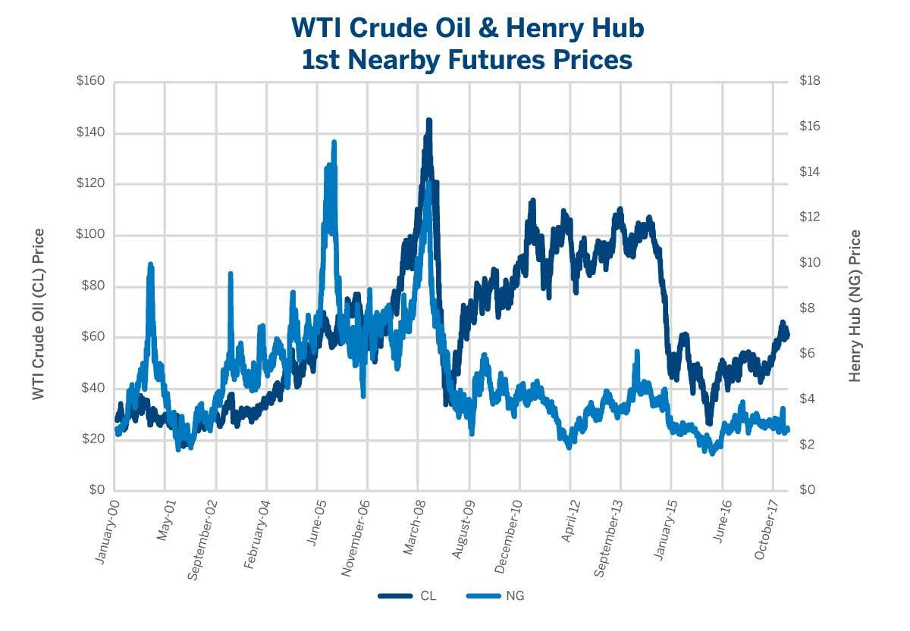

## Table of Contents

## What is the basic definition of oil and natural gas?

Oil is a liquid that comes from deep underground. It is made from tiny plants and animals that lived millions of years ago. These plants and animals died and were buried under layers of rock and soil. Over a very long time, heat and pressure turned them into oil. People use oil for many things, like making gasoline for cars, heating homes, and making plastics.

Natural gas is also found deep underground, often near oil. Like oil, it comes from ancient plants and animals that got buried and changed over millions of years. Natural gas is mostly made of a gas called methane. People use natural gas to cook food, heat homes, and make electricity. It burns cleaner than oil, which means it produces less pollution.

## How are oil and natural gas extracted and produced?

Oil and natural gas are extracted from the ground using a process called drilling. First, geologists study the earth to find places where oil and natural gas might be. They use special tools like seismic surveys to look deep into the ground. Once they find a good spot, a big machine called a drilling rig is set up. The rig drills a hole deep into the earth, sometimes thousands of feet down. When the drill reaches the oil or gas, it can start to flow up the hole to the surface. Sometimes, the oil or gas needs a little help to come up, so workers use pumps to bring it to the surface.

After the oil and natural gas are brought up from the ground, they need to be processed before people can use them. The oil goes to a refinery, which is like a big factory where the oil is heated and separated into different parts. Some parts become gasoline for cars, some become jet fuel for airplanes, and others are used to make things like plastics. Natural gas also gets cleaned and processed to remove impurities. Once it's ready, it can be sent through pipelines to homes and businesses, where it's used for heating, cooking, and making electricity.

## What factors influence the prices of oil and natural gas?

The prices of oil and natural gas are influenced by many things. One big [factor](/wiki/factor-investing) is how much oil and gas people want to use. If more people want to use them, like during cold winters when they need more gas to heat their homes, the prices can go up. Another factor is how much oil and gas countries are producing. If countries are producing less, maybe because of problems at their oil wells or because they are trying to keep prices high, then the prices can go up too. Also, things like wars or natural disasters can mess with how much oil and gas can be produced or moved around the world, which can make prices change.

Another thing that affects oil and natural gas prices is the value of money in different countries. If the money in one country becomes worth less compared to another country's money, it can make oil and gas more expensive for people in that country. Also, decisions made by big groups of countries that produce a lot of oil, like OPEC, can change prices. If these countries decide to produce less oil, they can make the price go up. Finally, new technologies that help find and get oil and gas more easily can sometimes make prices go down, because there is more oil and gas available.

## What is meant by the term 'correlation' in economics?

In economics, 'correlation' means how two things move together. If one thing goes up and the other thing also goes up, they have a positive correlation. If one thing goes up and the other goes down, they have a negative correlation. For example, if ice cream sales go up when the temperature goes up, we say there is a positive correlation between ice cream sales and temperature.

Correlation is important because it helps economists understand relationships between different parts of the economy. But it's important to remember that just because two things are correlated, it doesn't mean one causes the other. For example, there might be a correlation between the number of firefighters at a fire and the size of the fire, but that doesn't mean firefighters cause bigger fires. Economists use correlation to make predictions and understand patterns, but they need to be careful not to mix up correlation with causation.

## How do oil and natural gas prices typically correlate?

Oil and natural gas prices usually move together because they come from the same places in the ground and people use them for similar things, like heating and making energy. If something happens that makes it harder to get oil, like a problem at an oil well or a war, it often makes it harder to get natural gas too. This means that if oil prices go up, natural gas prices often go up as well. Also, if more people want to use oil, they might also want to use more natural gas, so both prices can go up together.

But sometimes, oil and natural gas prices can move differently. For example, if a new way to get natural gas is found, like fracking, it can make natural gas cheaper even if oil prices stay the same. Also, the weather can affect natural gas prices more than oil prices. If it's a very cold winter, people might use a lot more natural gas to heat their homes, which can make natural gas prices go up even if oil prices don't change much. So while oil and natural gas prices often move together, there are times when they can move in different ways.

## What are the historical trends in the correlation between oil and natural gas prices?

Over the years, oil and natural gas prices have generally moved together because they are both energy sources that come from the ground. When oil prices went up, natural gas prices often went up too. This happened because when people needed more energy, they used both oil and natural gas. Also, if there were problems getting oil, like a war or a problem at an oil well, it often made it harder to get natural gas too. This meant that both oil and natural gas prices could go up together.

However, there have been times when oil and natural gas prices did not move in the same way. For example, in the early 2000s, new ways to get natural gas, like fracking, were used more. This made natural gas cheaper, even when oil prices stayed the same or went up. Also, the weather can affect natural gas prices more than oil prices. In very cold winters, people use a lot more natural gas to heat their homes, which can make natural gas prices go up even if oil prices do not change much. So while oil and natural gas prices often move together, there are times when they can move differently.

## What economic theories explain the correlation between oil and natural gas prices?

One economic theory that helps explain the correlation between oil and natural gas prices is the theory of supply and demand. This theory says that if more people want to use oil and natural gas, the prices will go up. If it's harder to get oil and natural gas, like during a war or if a big oil well has a problem, the supply goes down and prices go up. Since oil and natural gas often come from the same places and are used for similar things, like making energy, when something affects one, it often affects the other too. So, if there's a big change in how much oil is available, it can also change how much natural gas is available, making their prices move together.

Another theory that can explain this correlation is the theory of substitution. This theory says that if one energy source gets too expensive, people will start using another energy source instead. For example, if oil prices go up a lot, people might start using more natural gas to heat their homes or run their factories. This increased demand for natural gas can make its price go up too. But sometimes, new technologies, like fracking, can make one energy source cheaper even if the other stays the same. This can make oil and natural gas prices move differently for a while, but over time, they usually start moving together again because they are both important energy sources.

## How do geopolitical events affect the correlation between oil and natural gas prices?

Geopolitical events can really shake up the prices of oil and natural gas. When there's a war or a big political problem in a country that makes a lot of oil and gas, it can make it harder to get these energy sources. For example, if there's fighting in a country with big oil wells, the oil might not be able to get out of the country easily. This can make the supply of oil go down, which makes the price go up. Because oil and natural gas often come from the same places, if something makes it hard to get oil, it can also make it hard to get natural gas. So, both prices can go up together because of these geopolitical events.

Sometimes, geopolitical events can affect oil and natural gas prices in different ways. If a country decides to stop selling oil to another country because of a political fight, it might not stop selling natural gas. This can make oil prices go up a lot, but natural gas prices might not change as much. Also, if a new government in a country decides to produce more oil or gas, it can make the prices of one go down more than the other. So, while geopolitical events often make oil and natural gas prices move together, they can also make them move differently sometimes.

## What are the impacts of technological advancements on the correlation between oil and natural gas prices?

Technological advancements can change how oil and natural gas prices move together. For example, new ways to find and get oil and gas, like fracking, can make one of them cheaper than the other. If fracking makes it easier to get natural gas, more natural gas comes onto the market, and its price can go down. But if the same technology doesn't help as much with oil, oil prices might stay the same or even go up. This means that for a while, oil and natural gas prices might not move together as much because of new technology.

Over time, though, technology usually helps bring oil and natural gas prices back to moving together. As new technologies become better and cheaper, they start being used for both oil and gas. This can make both energy sources easier to get, so their prices can start to move together again. Also, if a new technology makes one energy source much cheaper, people might start using more of it, which can affect the demand for the other energy source. So, while technology can make oil and natural gas prices move differently for a while, it usually brings them back to moving together in the long run.

## How do market structures and regulations influence the correlation between oil and natural gas prices?

Market structures and regulations can change how oil and natural gas prices move together. If a country has a lot of rules about how oil and gas can be sold, it can make the prices of one go up or down more than the other. For example, if the government puts a tax on oil but not on natural gas, oil might get more expensive while natural gas stays the same. This can make oil and natural gas prices move differently for a while. Also, if a big company controls a lot of the oil or gas, they can change the prices by deciding how much to sell. If they sell less oil but the same amount of gas, oil prices might go up more than gas prices.

Over time, though, market structures and regulations usually help bring oil and natural gas prices back to moving together. As rules change or new companies come into the market, the prices can start to balance out again. For example, if a new rule makes it easier to sell natural gas, more gas might come onto the market, and its price can go down. This can make people use more gas instead of oil, which can affect oil prices too. So while market structures and regulations can make oil and natural gas prices move differently for a while, they usually help bring them back to moving together in the long run.

## What are the implications of the correlation between oil and natural gas prices for energy policy?

The correlation between oil and natural gas prices has big effects on energy policy. When oil and gas prices move together, it can be easier for governments to plan energy policies. They can make rules and set goals knowing that if oil prices go up, gas prices will likely go up too. This helps them decide how much to invest in different kinds of energy, like wind or solar, which don't depend on oil or gas. If oil and gas prices are going up, governments might want to push for more renewable energy to keep energy costs down for people.

But when oil and gas prices don't move together, it can make energy policy harder. If a new technology makes natural gas cheaper but not oil, the government might need to change its energy plans. They might need to think about how to help people who use oil, like those who drive cars, while also taking advantage of cheaper gas for heating homes. This can mean changing rules to encourage more use of natural gas or finding ways to make oil cheaper too. So, understanding how oil and gas prices move together or apart helps governments make better energy policies.

## How can investors use the understanding of oil and natural gas price correlation in their strategies?

Investors can use the understanding of how oil and natural gas prices move together to make better choices about where to put their money. If they see that oil and gas prices usually go up and down together, they might decide to invest in both at the same time. This can help them make money if both prices go up. They can also use this knowledge to guess what might happen next. For example, if they think oil prices will go up because of a new war, they might also buy natural gas, expecting its price to go up too.

But investors also need to watch out for times when oil and gas prices don't move together. If a new technology makes natural gas cheaper but not oil, they might want to invest more in natural gas and less in oil. They can also use this knowledge to protect their money. If they think oil prices will go down but gas prices will stay the same, they might sell some of their oil investments and keep their gas ones. So, understanding how oil and gas prices move together or apart can help investors make smarter choices and protect their money.

## References & Further Reading

[1]: Geman, H. (2005). ["Commodities and Commodity Derivatives: Modelling and Pricing for Agriculturals, Metals and Energy."](https://www.semanticscholar.org/paper/Commodities-and-Commodity-Derivatives%3A-Modelling-Geman/e20e4e93b7ef47399f0faf7a4a0c9d660763b850) Wiley Finance.

[2]: Silvennoinen, A., & Thorp, S. (2013). ["Financialization, crisis and commodity correlation dynamics."](https://www.sciencedirect.com/science/article/pii/S1042443112001059) Journal of International Financial Markets, Institutions and Money, 24, 42-65.

[3]: Li, R., & Ji, Q. (2019). ["Financialization and synchronization of energy markets under volatility constraints: A connectedness perspective."](https://pmc.ncbi.nlm.nih.gov/articles/PMC8308419/) Energy Policy, 134, 110901.

[4]: ["Algorithmic Trading and DMA: An Introduction to Direct Access Trading Strategies"](https://www.amazon.com/Algorithmic-Trading-DMA-introduction-strategies/dp/0956399207) by Barry Johnson

[5]: Tang, K., & Xiong, W. (2012). ["Index Investment and the Financialization of Commodities."](https://www.princeton.edu/~wxiong/papers/commodity.pdf) American Economic Review, 102(3), 1187-1211.