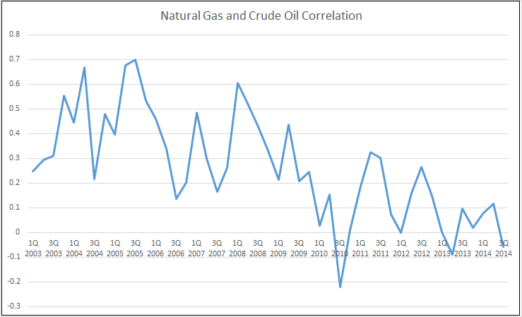

Understanding the price correlation between oil and natural gas is paramount for traders and investors navigating the volatile energy commodities market. These two critical energy resources exhibit a complex interplay that is pivotal not just for individual trading strategies but for broader market dynamics and global economic trends. Price movements in oil and natural gas can significantly impact inflation, energy costs, and ultimately the economic health of nations.

The advent of algorithmic trading in recent years has provided market participants with robust tools to analyze and predict these correlations with greater accuracy. Algorithmic trading harnesses vast amounts of data, combining historical trends and real-time information to produce insights that were previously difficult or impossible to obtain. This technological advancement allows traders to make informed decisions at unprecedented speeds, optimizing their trading strategies in dynamic and often unpredictable energy markets.



The relationship between oil and natural gas prices often reflects shifts in supply and demand, geopolitical events, and seasonal consumption patterns. By leveraging algorithmic trading, participants can identify these patterns more swiftly, enabling them to capitalize on trading opportunities and mitigate risks more effectively. In this article, we explore the nuances of oil and natural gas price correlations and discuss how algorithmic trading can provide traders with a competitive edge in optimizing their strategies. Understanding these dynamics is essential for surviving and thriving in the fluctuating global energy landscape.

## Table of Contents

## Understanding the Price Correlation Between Oil and Natural Gas

Historically, the prices of oil and natural gas have exhibited a complex and interdependent relationship shaped by various economic and geopolitical factors. Both commodities serve as primary energy sources, leading to a certain interconnectedness in their pricing. This connection arises because changes in the energy sector often impact both commodities simultaneously, although not always to the same extent or in the same direction.

Market demand plays a critical role in establishing the price correlation between oil and natural gas. As industrial activities and economic growth accelerate, the demand for energy sources like oil and natural gas increases. This heightened demand can cause prices to rise concurrently if supply does not keep pace. Conversely, during periods of economic slowdown, a decrease in demand for these energy resources may lead to a decline in prices, impacting both commodities in a correlated manner.

Supply constraints also significantly influence the correlation. For example, disruptions in oil production due to geopolitical tensions or natural disasters can lead to increased use of natural gas as an alternative energy source, potentially causing natural gas prices to rise. Similarly, constraints in natural gas availability may increase reliance on oil, thereby affecting its price.

Seasonal factors contribute to the dynamic nature of price correlation. During winter months, when heating demand peaks, natural gas prices often rise due to heightened consumption. Conversely, in summer, increased use of oil for transportation can elevate oil prices. These seasonal patterns can create variability in the correlation as each commodity responds to specific seasonal demands.

Understanding the complex interplay between these factors is vital for making informed trading decisions and anticipating market trends. For traders and investors, assessing the historical data and analyzing patterns in the price movements of oil and natural gas can illuminate potential future correlations. This understanding offers insights into market opportunities and risks, enabling more strategic decision-making in the acquisition and disposition of energy commodities.

## Factors Influencing the Correlation

Several factors influence the correlation between oil and natural gas prices, reflecting the complexity of global energy markets. One significant [factor](/wiki/factor-investing) is technological advancements that impact both the extraction and consumption of these commodities. Innovations such as hydraulic fracturing and horizontal drilling have altered supply landscapes, particularly in the United States, leading to changes in production levels and affecting the relative prices of oil and natural gas. Similarly, advances in renewable energy technologies can influence demand, as they provide alternative energy sources, potentially disrupting traditional consumption patterns.

Government policies play a crucial role in influencing this correlation. Policies related to energy taxation, subsidies, and environmental regulations can directly impact production costs and market prices. For instance, subsidies for renewable energy could reduce the demand for oil and gas, altering their price dynamics. Additionally, government decisions regarding strategic petroleum reserves can lead to temporary supply adjustments, impacting price trends.

Shifts in global energy consumption patterns are another critical factor. Economic growth drives industrial demand for energy, thus affecting consumption levels of both oil and natural gas. Emerging economies, particularly in Asia, are experiencing rapid industrialization, resulting in increased energy consumption and influencing global demand dynamics. This, in turn, can affect the correlation between oil and gas prices, as changes in one market can have spillover effects on the other.

Geopolitical events, particularly those involving conflicts in oil-producing regions, can cause significant swings in oil and natural gas prices. Political instability or conflicts in key producing areas can disrupt supplies, leading to price [volatility](/wiki/volatility-trading-strategies). For example, tensions in the Middle East, a major oil-producing region, often lead to supply uncertainties, thereby influencing both commodities' prices.

Seasonal patterns are also influential in determining price movements and correlation. The demand for natural gas rises in winter due to heating needs, while oil demand can increase in summer, partly due to higher transportation activity. These seasonal demands create cyclical patterns in price movements, affecting the correlation between oil and natural gas prices. Understanding these patterns is vital for anticipating market trends and making informed trading decisions.

## Algorithmic Trading and Its Impact on Energy Markets

Algorithmic trading has revolutionized financial markets by enabling rapid and precise decision-making through the analysis of complex data sets. This transformation is particularly evident in the energy sector, where [algorithmic trading](/wiki/algorithmic-trading) can process enormous volumes of data to uncover patterns and correlations between commodities such as oil and natural gas. The ability to utilize historical data and technical indicators, along with real-time market information, allows these algorithms to forecast prices and optimize trading strategies with remarkable accuracy.

The role of algorithmic trading in energy markets can be understood through its application in several key areas. Firstly, the identification of patterns and correlations is crucial. Algorithms analyze historical price data to identify trends and relationships between commodities. For instance, a statistical model might be developed to understand how a change in the price of [crude oil](/wiki/crude-oil) could impact natural gas prices. Such insights allow traders to anticipate market shifts and adjust their positions accordingly.

Python scripts are instrumental in algorithmic trading, enabling the implementation of complex trading strategies. A simple example of a moving average crossover strategy in Python might look like this:

```python
import pandas as pd
import numpy as np

def moving_average_strategy(data, short_window, long_window):
    signals = pd.DataFrame(index=data.index)
    signals['price'] = data['price']
    signals['short_ma'] = data['price'].rolling(window=short_window, min_periods=1, center=False).mean()
    signals['long_ma'] = data['price'].rolling(window=long_window, min_periods=1, center=False).mean()
    signals['signal'] = 0.0  

    signals['signal'][short_window:] = np.where(signals['short_ma'][short_window:] > signals['long_ma'][short_window:], 1.0, 0.0)   
    signals['positions'] = signals['signal'].diff()

    return signals

# Assume `data` is a DataFrame with a datetime index and a 'price' column.
# signals = moving_average_strategy(data, 40, 100)
```

This script evaluates short and long-term moving averages of a commodity's price to generate buy or sell signals. Such strategies are crucial for the timely execution of trades, allowing traders to react swiftly to market changes.

Arbitrage opportunities represent another vital area where algorithmic trading is impactful. By continuously monitoring price discrepancies between markets, algorithms can exploit these differences instantaneously. For example, if there is a temporary price divergence between oil futures on different exchanges, algorithms can execute buy and sell orders to capitalize on this discrepancy before it closes.

Risk mitigation is enhanced through algorithmic trading by allowing more sophisticated and real-time risk management. Algorithms can incorporate stop-loss orders, limit orders, and other risk management tools to protect against adverse market movements. This flexibility in executing complex multi-layered risk management strategies provides traders with an enhanced capability to maintain profitability amidst market volatility.

Overall, algorithmic trading empowers traders in energy markets to operate with a high degree of precision and responsiveness. By leveraging vast data sets and executing trades based on data-driven insights, market participants can navigate the complexities of energy trading more effectively, capturing opportunities and minimizing risks.

## Strategies for Algorithmic Trading in Oil and Natural Gas Markets

Developing a successful algorithmic trading strategy in the oil and natural gas markets requires a robust understanding of market dynamics and factors that affect price movements. One critical aspect of strategy development is the use of statistical models and [machine learning](/wiki/machine-learning) techniques to create predictive models for pricing these commodities.

- **Statistical Models and Machine Learning Techniques**: Traders often rely on statistical techniques such as time series analysis (including ARIMA models) and machine learning algorithms like Random Forests and Neural Networks to forecast prices. These models analyze historical data to identify patterns and establish correlations between various market indicators and commodity prices. For instance, a time series forecasting approach might involve using an ARIMA model to predict future price movements based on historical pricing data. Python's `statsmodels` library can be used to implement such models.

  ```python
  import pandas as pd
  from statsmodels.tsa.arima.model import ARIMA

  # Assume df is a pandas DataFrame with a 'price' column containing historical price data
  model = ARIMA(df['price'], order=(5, 1, 0))
  model_fit = model.fit()
  forecast = model_fit.forecast(steps=10)
  print(forecast)
  ```

- **Backtesting for Model Validation**: Backtesting involves testing predictive models on historical data to evaluate their performance before deploying them in live trading scenarios. This process helps ensure that the model can generate reliable predictions and adapt to real-world conditions. Metrics such as Mean Absolute Error (MAE) or Root Mean Square Error (RMSE) are commonly used to assess the predictive accuracy of the models.

- **Risk Management Strategies**: Effective risk management is crucial for algorithmic trading. Techniques such as stop-loss orders, diversification, and hedging help manage volatility and protect against potential losses. Stop-loss orders automatically sell positions when the price falls to a predetermined level, preventing excessive losses. Diversification reduces risk by spreading investments across various assets or contracts. Hedging involves taking offsetting positions to balance exposure, minimizing the impact of adverse price movements.

By combining sophisticated statistical tools and risk management techniques, traders can develop robust algorithmic trading strategies optimized for the oil and natural gas markets, enhancing their ability to navigate the complexities of energy trading efficiently.

## Challenges and Risks Associated with Algorithmic Trading

Algorithmic trading, while offering significant advantages in speed and precision, faces several challenges and risks, particularly in the oil and natural gas markets. One major challenge is market [liquidity](/wiki/liquidity-risk-premium). Insufficient liquidity can lead to increased volatility and slippage, impacting the execution of trades at desired prices. This can be particularly problematic in energy markets, where large trades might move prices unfavorably.

Regulatory changes present another hurdle. The energy markets are subject to various regulatory standards that can shift due to political, environmental, or economic considerations. These changes can alter market dynamics and the effectiveness of existing algorithms. For instance, new regulations might impose restrictions on trading practices or require enhanced transparency, necessitating adjustments in algorithm parameters and strategies.

Technological disruptions can also pose significant risks. As trading platforms evolve and new technologies emerge, algorithms must be continually updated to remain compatible and effective. Unexpected system upgrades or failures can halt trading activities, resulting in missed opportunities and financial losses.

Overfitting is a potential pitfall in algorithmic trading models. This occurs when a model is too closely tailored to historical data, capturing noise rather than underlying patterns. Such models may perform well in [backtesting](/wiki/backtesting) but fail in live trading conditions. To address this, it is crucial to ensure that models are robust by using techniques like cross-validation. Traders must avoid relying solely on historical data and instead incorporate adaptive features that can respond to new market information.

Data errors also represent a significant risk. Accurate input data is the foundation of any reliable algorithm. Errors or inconsistencies in data can lead to incorrect predictions and trading decisions. Data validation checks are essential to minimize this risk. Implementing rigorous data cleansing and preprocessing steps can help ensure data integrity.

Traders must remain vigilant and adaptable to keep pace with shifting market conditions and emerging trends. Continuous monitoring of algorithm performance and market conditions is essential. Strategies should be reassessed regularly, and updates should be implemented to algorithms to maintain their relevance and effectiveness.

The dynamic and complex nature of the energy markets requires traders to develop scalable and flexible algorithms. Utilizing machine learning techniques that focus on dynamic adaptation rather than static prediction could be valuable. Additionally, maintaining a diverse set of strategies that can operate under various market conditions is vital to managing risks effectively. By acknowledging these challenges and implementing robust risk management practices, traders can optimize their algorithmic strategies for greater resilience and performance.

## Conclusion

The correlation between oil and natural gas prices is a crucial component of the energy markets, directly influencing trading strategies and investment decisions. Traders keen on exploiting these correlations now have at their disposal powerful algorithmic trading tools. These tools are capable of sophisticated analysis, leveraging extensive datasets to uncover patterns that might be easily overlooked through manual trading methods.

By harnessing big data and advanced analytics, algorithmic trading significantly enhances market efficiency. It allows traders to process and interpret large volumes of data in real time, thereby reducing risks and improving profit margins. The ability to predict price movements with greater accuracy not only aids in capitalizing on market opportunities but also in mitigating potential losses. The incorporation of machine learning techniques into trading algorithms can further refine these predictions by adapting to new data and market conditions.

However, success in the fast-paced and complex domain of energy trading is contingent on staying informed about ever-evolving market trends. Continuous refinement of trading algorithms is necessary to align with dynamic market conditions. This requires an iterative process of testing, validation, and adjustment to ensure algorithms remain effective in capturing the nuances of oil and natural gas price correlations. Leveraging emerging technologies and consistently integrating new data insights are keys to maintaining a competitive edge in the market.

## References & Further Reading

[1]: Geman, H. (2005). ["Commodities and Commodity Derivatives: Modelling and Pricing for Agriculturals, Metals and Energy."](https://www.semanticscholar.org/paper/Commodities-and-Commodity-Derivatives%3A-Modelling-Geman/e20e4e93b7ef47399f0faf7a4a0c9d660763b850) Wiley Finance.

[2]: Silvennoinen, A., & Thorp, S. (2013). ["Financialization, crisis and commodity correlation dynamics."](https://www.sciencedirect.com/science/article/pii/S1042443112001059) Journal of International Financial Markets, Institutions and Money, 24, 42-65.

[3]: Li, R., & Ji, Q. (2019). ["Financialization and synchronization of energy markets under volatility constraints: A connectedness perspective."](https://pmc.ncbi.nlm.nih.gov/articles/PMC8308419/) Energy Policy, 134, 110901.

[4]: ["Algorithmic Trading and DMA: An Introduction to Direct Access Trading Strategies"](https://www.amazon.com/Algorithmic-Trading-DMA-introduction-strategies/dp/0956399207) by Barry Johnson

[5]: Tang, K., & Xiong, W. (2012). ["Index Investment and the Financialization of Commodities."](https://www.princeton.edu/~wxiong/papers/commodity.pdf) American Economic Review, 102(3), 1187-1211.