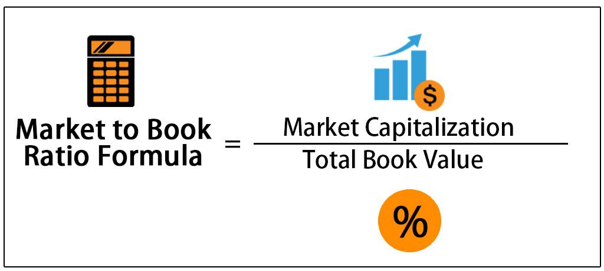

Understanding financial metrics is crucial for investors and traders, particularly in algorithmic trading where data-driven decision-making dominates. Two fundamental metrics often employed are the Price-to-Book (P/B) ratio and Return on Equity (ROE). The P/B ratio aids in assessing a company's market value compared to its book value, helping investors discern growth expectations or undervaluation. Meanwhile, ROE offers insight into a company's profitability by measuring how effectively it generates income from its shareholders' equity.

Algorithmic trading strategies benefit greatly by integrating these metrics, enhancing decision-making and investment performance. By analyzing both P/B and ROE, traders can interpret potential correlations that might reflect a company's financial health. For instance, a high P/B ratio can indicate market optimism regarding growth prospects, whereas a high ROE underscores efficient capital utilization.



The interplay of these metrics goes further, enabling deeper insights into stock valuation and growth prospects. A harmonious relationship between P/B and ROE suggests robust business operations and sound market valuation. Conversely, discrepancies could signal mispricing opportunities or risks. Effectively, understanding these metrics not only enhances stock valuation but also drives improved algorithmic trading outcomes.

## Table of Contents

## Understanding Price-to-Book Ratio

The Price-to-Book (P/B) ratio is a widely utilized valuation metric in finance, comparing a company's current market price to its book value. Mathematically, it is represented as:

$$
\text{P/B Ratio} = \frac{\text{Market Price per Share}}{\text{Book Value per Share}}
$$

The market price per share reflects the trading price of a company's stock in the financial markets. In contrast, the book value per share represents the accounting value of shareholders’ equity as recorded on the balance sheet.

A high P/B ratio is frequently interpreted by investors as an indication of promising growth prospects. This suggests that investors believe the company will generate higher earnings in the future, justifying a premium market price compared to its book value. However, a high P/B ratio can sometimes indicate overvaluation, especially if the increase is not supported by corresponding improvements in earnings or growth.

Conversely, a low P/B ratio might signal that the stock is undervalued. This often attracts value investors looking for opportunities to buy shares at prices below their perceived intrinsic value. However, a persistently low P/B ratio can also indicate potential issues within the company, such as underlying financial weaknesses or poor future prospects.

The P/B ratio holds particular relevance in asset-heavy industries, such as banking, manufacturing, and utilities. These sectors typically have substantial physical assets, making book value a meaningful indicator of intrinsic worth. As such, the P/B ratio can provide valuable insights when assessing companies within these industries.

However, caution is warranted in interpretation, since the P/B ratio does not fully capture the value of intangible assets. Companies in technology or service sectors often possess significant intangible assets, such as intellectual property, brand value, or goodwill, which may not be reflected on the balance sheet. This can result in misleading P/B ratios if used in isolation. Therefore, a comprehensive analysis often involves contextual evaluation, taking into consideration industry specifics and other financial metrics to form a holistic view of a company’s valuation.

## Exploring Return on Equity

Return on Equity (ROE) is an essential financial metric used to evaluate a company's ability to generate profits from its shareholders' equity. It is calculated by dividing net income by shareholders' equity, typically expressed as a percentage:

$$
\text{ROE} = \left( \frac{\text{Net Income}}{\text{Shareholders' Equity}} \right) \times 100
$$

A higher ROE suggests that the company is efficiently using its equity base to generate income, which can be indicative of strong management and effective operational strategies. Companies that consistently achieve high ROE values are often considered attractive investments, as they demonstrate an ability to utilize shareholders' funds effectively to produce returns.

This metric is particularly valuable for assessing management performance and operational efficiency, offering insights into how well a company's leadership is able to deploy capital for growth and profitability. Investors and analysts use ROE to compare the financial performance of similar companies in the same industry, helping to identify those that are making the most of their equity investments.

However, it's important to consider that ROE can be heavily influenced by a company's capital structure, particularly its levels of debt. High leverage can artificially inflate ROE figures by reducing shareholders' equity. Consequently, a high ROE might not always reflect operational effectiveness if it is heavily reliant on borrowed funds. Sustainable growth and profitability are better assessed by examining whether ROEs are a result of efficient use of equity or excessive leverage.

When evaluating ROE, it is crucial to consider the context of industry standards and economic conditions, as different sectors may have varying baseline ROE levels. Investors should also scrutinize the sustainability of high ROE figures, distinguishing between those driven by sound business practices and those reliant on financial leverage, to make informed investment decisions.

## Correlation between P/B Ratio and ROE

While a high Price-to-Book (P/B) ratio does not automatically imply a high Return on Equity (ROE), there can be a correlation between these metrics under certain conditions. Understanding this relationship is key for investors aiming to extract meaningful insights into a company's operational effectiveness and market valuation.

In an ideal scenario, a company exhibiting both high P/B and high ROE is likely well-regarded by investors. This indicates that the company is achieving strong profitability relative to its shareholders' equity, pointing to efficient management and operations. The favorable market valuation, as reflected by the high P/B ratio, suggests investor confidence in the company's future growth prospects.

However, a high P/B ratio alone, without a corresponding high ROE, might signal potential overvaluation. Such a company is valued highly by the market but might not be efficiently generating income from its equity base. Investors need to be cautious, as the elevated market valuation might not be sustainable in the absence of strong profitability.

Conversely, a low P/B ratio combined with a high ROE can signal a hidden value investment opportunity. This scenario suggests that the market has undervalued the stock. Despite the lower market valuation, the company demonstrates strong operational efficiency and profitable return on equity, which can attract value-oriented investors looking for underpriced stocks with good fundamentals.

When evaluating these metrics, it's essential to contextualize them within the broader industry and macroeconomic environment. Variations across industries and market conditions can affect the interpretation of P/B and ROE, and thus, a comprehensive analysis considering additional financial indicators is crucial for making informed investment decisions.

## Incorporating P/B and ROE into Algorithmic Trading

Algorithmic trading strategies can significantly benefit from the integration of Price-to-Book (P/B) ratios and Return on Equity (ROE) into the stock selection and evaluation process. These financial metrics provide insight into a company's valuation and profitability, allowing for more informed trading decisions.

Trading algorithms can be crafted to seek out stocks exhibiting high ROE and low P/B ratios. This combination is particularly attractive as it may indicate undervalued investments with efficient profit generation. ROE, calculated as:

$$
\text{ROE} = \frac{\text{Net Income}}{\text{Shareholders' Equity}}
$$

This measures a company's ability to generate profit from its equity base, while the P/B ratio, expressed as:

$$
\text{P/B Ratio} = \frac{\text{Market Price per Share}}{\text{Book Value per Share}}
$$

This compares the market value of a company's shares to its book value. A low P/B ratio suggests that the market price is close to or below the company's book value, potentially signifying undervaluation.

To operationalize these metrics in [algorithmic trading](/wiki/algorithmic-trading), algorithms must filter and select stocks based on pre-defined thresholds for both ROE and P/B ratios. Here is an example of how such an algorithm could be implemented using Python:

```python
import pandas as pd

# Sample data
data = {
    'ticker': ['A', 'B', 'C'],
    'ROE': [0.15, 0.25, 0.10],
    'PB': [1.2, 0.9, 1.5]
}

df = pd.DataFrame(data)

# Thresholds for ROE and P/B
roe_threshold = 0.15
pb_threshold = 1.0

# Filter stocks based on metrics
undervalued_stocks = df[(df['ROE'] > roe_threshold) & (df['PB'] < pb_threshold)]

print(undervalued_stocks)
```

In this example, stocks are filtered to identify those with an ROE above 15% and a P/B ratio below 1.0, signaling potentially undervalued and profitable investments.

The effectiveness of these strategies can be increased by [backtesting](/wiki/backtesting) using historical data. Backtesting helps refine algorithms through simulated trading scenarios under various market conditions, enhancing predictive accuracy and risk management. By simulating these conditions, investors can understand how a strategy might perform over time and identify potential adjustments to improve performance.

While incorporating P/B and ROE into algorithmic trading offers substantial potential, it's crucial to combine these metrics with other financial analyses for a comprehensive evaluation of investment opportunities. This ensures a well-rounded approach, maintaining awareness of industry-specific factors and macroeconomic trends that could impact trading outcomes.

## Challenges and Considerations

One of the primary challenges in using the Price-to-Book (P/B) ratio and Return on Equity (ROE) lies in the necessity to tailor these measures to industry-specific contexts and varying market conditions. Different industries exhibit diverse financial characteristics and capital structures that can skew the interpretation of these metrics. For instance, technology firms, which often possess substantial intangible assets, might appear overvalued based solely on P/B ratios. Conversely, capital-intensive industries like utilities may naturally have lower ROE due to significant asset bases, irrespective of operational efficiency.

Economic cycles significantly influence the reliability of P/B and ROE as indicators of financial health. During an economic boom, P/B ratios might inflate due to increased investor optimism, whereas in a downturn, these ratios could undervalue stocks that are fundamentally sound but temporarily distressed. Similarly, ROE can be affected by economic fluctuations, as profitability metrics often lag behind broader economic trends. Thus, aligning these metrics within macroeconomic contexts becomes essential for accurate assessments.

Investors should approach P/B and ROE with caution, acknowledging that these metrics alone may provide an incomplete picture of a company's financial state. They are best utilized as components of a broader analytical framework that includes other financial ratios, qualitative analysis, and market conditions. Cross-verification with metrics such as debt-to-equity ratios, cash flow analysis, and revenue growth can yield more comprehensive insights. 

Incorporating algorithmic trading strategies requires careful calibration, ensuring that algorithms are responsive to both quantitative metrics and qualitative market signals. This can involve creating models that dynamically adjust thresholds for P/B and ROE based on industry benchmarks and economic indicators. Below is a basic example of how Python can be used to incorporate such dynamic thresholds in an algorithmic trading strategy:

```python
def dynamic_thresholds(industry, economic_cycle):
    industry_benchmarks = {'tech': (5.0, 15.0), 'utilities': (1.0, 8.0)}
    cycle_adjustment = {'boom': 1.2, 'recession': 0.8}

    base_pb, base_roe = industry_benchmarks.get(industry, (1.5, 10.0))
    adjustment = cycle_adjustment.get(economic_cycle, 1.0)

    return base_pb * adjustment, base_roe * adjustment

# Example Usage
industry = 'tech'
economic_cycle = 'boom'
pb_threshold, roe_threshold = dynamic_thresholds(industry, economic_cycle)

print(f"Adjusted P/B Threshold: {pb_threshold}")
print(f"Adjusted ROE Threshold: {roe_threshold}")
```

Using these adaptive strategies can enhance the predictability and resilience of trading strategies, resulting in more informed investment decisions. However, it is crucial that such models are persistently refined and backtested to ensure accuracy and effectiveness in ever-evolving market environments.

## Conclusion

The integration of the Price-to-Book (P/B) ratio and Return on Equity (ROE) metrics into trading strategies offers investors a robust framework for decision-making. These financial indicators, when properly understood and applied, provide a multifaceted view of a company’s market valuation and profitability, two critical components in making informed investment choices. By utilizing P/B and ROE, traders can enhance their algorithmic strategies, optimizing them for improved investment outcomes.

P/B ratio gives insights into the market's valuation of a company relative to its book value, serving as a tool to identify potential undervaluation or overvaluation scenarios. ROE, on the other hand, helps assess a company's ability to generate profit from its shareholders' equity, indicating managerial efficiency and operational performance.

To successfully leverage these metrics in trading, it is essential to evaluate both fundamental and technical aspects of market analysis. Fundamental analysis involves examining a company’s financial health through P/B and ROE, while technical analysis focuses on price movement and market trends. For instance, a Python-based algorithm could screen for stocks with high ROE and low P/B ratios, suggesting potential investment opportunities, and then backtest these selections against historical data to assess performance efficacy. Here is a simple Python code snippet illustrating this approach:

```python
import pandas as pd

# hypothetical dataframe of companies with P/B and ROE data
data = pd.DataFrame({
    'Company': ['A', 'B', 'C', 'D'],
    'P/B': [1.2, 0.8, 1.5, 0.6],
    'ROE': [15, 10, 8, 20]
})

# filter for high ROE and low P/B
investment_candidates = data[(data['ROE'] > 10) & (data['P/B'] < 1)]

print(investment_candidates)
```

Integrating these metrics requires careful consideration of economic cycles and industry-specific factors to mitigate risks associated with solitary reliance on P/B and ROE. A comprehensive investment strategy should incorporate these metrics alongside other financial analyses, fostering a more holistic appraisal of market opportunities. With careful attention to the nuances inherent in financial indicators like P/B and ROE, investors can effectively enhance the predictive power and reliability of their algorithmic trading systems.

## References & Further Reading

[1]: ["The Intelligent Investor: The Definitive Book on Value Investing. A Book of Practical Counsel"](https://www.amazon.com/Intelligent-Investor-Definitive-Investing-Essentials/dp/0060555661) by Benjamin Graham

[2]: ["Security Analysis: Sixth Edition, Foreword by Warren Buffett"](https://www.amazon.com/Security-Analysis-Foreword-Buffett-Editions/dp/0071592539) by Benjamin Graham and David Dodd

[3]: Damodaran, A. (2012). ["Investment Valuation: Tools and Techniques for Determining the Value of Any Asset."](https://books.google.com/books/about/Investment_Valuation.html?id=5SRHAAAAQBAJ) Wiley Finance.

[4]: ["Valuation: Measuring and Managing the Value of Companies"](https://www.amazon.com/Valuation-Measuring-Managing-Companies-Finance/dp/1119610885) by McKinsey & Company Inc., Tim Koller, Marc Goedhart, and David Wessels

[5]: Fama, E. F., & French, K. R. (1992). ["The Cross-Section of Expected Stock Returns."](https://onlinelibrary.wiley.com/doi/full/10.1111/j.1540-6261.1992.tb04398.x) The Journal of Finance, 47(2), 427-465.