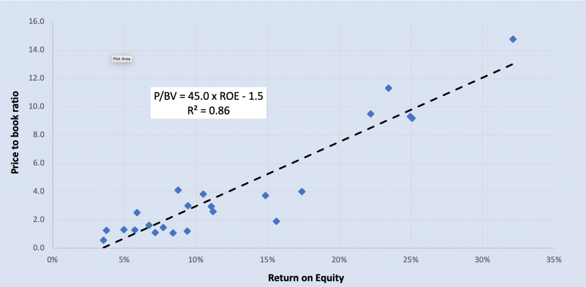

## Table of Contents

## What is the Price-to-Book Ratio (P/B Ratio)?

The Price-to-Book Ratio, often called the P/B Ratio, is a way to figure out if a company's stock is a good buy. It compares the market value of a company's stock to its book value. The book value is what the company would be worth if it sold all its assets and paid off all its debts. To find the P/B Ratio, you divide the current stock price by the book value per share. A lower P/B Ratio might mean the stock is undervalued, while a higher ratio might mean it's overvalued.

This ratio is especially useful for companies that have a lot of physical assets, like factories or machines. For these companies, the book value can give a good idea of what the company is really worth. However, the P/B Ratio isn't perfect. It doesn't work well for companies that don't have many physical assets, like tech companies. Also, the book value might not reflect the true value of a company if its assets are worth more or less than what's on the books. So, while the P/B Ratio can be a helpful tool, it's best used along with other ways to value a company.

## What is Return on Equity (ROE)?

Return on Equity (ROE) is a way to see how well a company is using the money that shareholders have invested in it. It tells you how much profit a company makes for each dollar of shareholder's equity. To find ROE, you take the company's net income and divide it by the shareholder's equity. The result is shown as a percentage. A higher ROE means the company is doing a good job of turning the money it gets from shareholders into profit.

ROE is important because it helps investors see if a company is a good place to put their money. If a company has a high ROE, it means it's making good use of the money investors give it. But ROE isn't perfect. Sometimes, a high ROE can come from taking on a lot of debt, which can be risky. So, it's a good idea to look at other things too, like how much debt the company has, before deciding if it's a good investment.

## How are the Price-to-Book Ratio and Return on Equity calculated?

The Price-to-Book Ratio, or P/B Ratio, is calculated by dividing the current market price of a company's stock by its book value per share. The book value per share is found by taking the total value of the company's assets and subtracting its liabilities, then dividing that number by the number of outstanding shares. This ratio helps investors see if a stock is priced fairly compared to what the company is actually worth on paper.

Return on Equity, or ROE, is calculated by dividing a company's net income by its shareholder's equity. Net income is the profit the company makes after paying all its expenses, and shareholder's equity is the total value of the company that belongs to the shareholders. ROE shows how well a company is using the money invested by its shareholders to generate profit. A higher ROE means the company is doing a better job at turning shareholder investments into earnings.

## Why are P/B Ratio and ROE important for investors?

The P/B Ratio is important for investors because it helps them see if a company's stock is a good deal. It compares what the stock is worth in the market to what the company would be worth if it sold everything it owns and paid off all its debts. If the P/B Ratio is low, it might mean the stock is undervalued and could be a good buy. But if it's high, the stock might be overvalued. This ratio is especially useful for companies that have a lot of physical stuff like buildings or machines, because it gives a clear picture of what the company is really worth.

ROE is important because it shows how well a company is using the money that investors give it. It tells you how much profit the company makes for every dollar of money from shareholders. A high ROE means the company is good at turning that money into profit, which is great for investors. But, a high ROE can also come from taking on a lot of debt, which can be risky. So, investors should look at ROE along with other things, like how much debt the company has, to get a full picture of how the company is doing.

## What does a high P/B Ratio indicate about a company?

A high P/B Ratio means that the market price of a company's stock is much higher than its book value. This can happen if investors think the company will do really well in the future and make a lot of money. They might be willing to pay more for the stock because they believe the company's earnings will grow a lot. So, a high P/B Ratio often shows that people are hopeful about the company's future.

But, a high P/B Ratio can also mean the stock is overvalued. This means that the price of the stock is too high compared to what the company is actually worth. If the company doesn't meet the high expectations, the stock price could drop. So, investors need to be careful and look at other things, like how the company is doing right now and what it might do in the future, before deciding if a high P/B Ratio is a good sign or a warning.

## What does a high ROE suggest about a company's performance?

A high ROE means a company is good at making money from the money that shareholders have put into it. It shows that the company is using the money it gets from investors well to make profits. If a company has a high ROE, it means it's doing a better job at turning the money it gets from shareholders into earnings. This can make the company look like a good place for investors to put their money.

But, a high ROE isn't always a good sign. Sometimes, a company can have a high ROE because it's using a lot of borrowed money, or debt. Using debt can make the company's profits look bigger, but it can also be risky. If the company can't pay back the debt, it could get into trouble. So, when looking at a company's ROE, investors should also check how much debt the company has to make sure the high ROE is a good thing and not a warning sign.

## How can the correlation between P/B Ratio and ROE be analyzed?

The P/B Ratio and ROE can be analyzed together to get a better idea of a company's value and how well it's doing. The P/B Ratio shows what investors are willing to pay for the company's assets, while ROE shows how well the company is using the money from shareholders to make profits. If a company has a high P/B Ratio and a high ROE, it might mean that investors are willing to pay more for the stock because they think the company will keep making good profits in the future. This can be a good sign that the company is doing well and is a good investment.

But, it's also important to look at these numbers carefully. A high P/B Ratio with a high ROE could also mean the stock is overvalued, especially if the company is using a lot of debt to boost its ROE. If the company can't keep up its high profits or if it has trouble paying back its debt, the stock price could drop. So, investors should look at both the P/B Ratio and ROE along with other information, like the company's debt levels and future growth plans, to make a smart decision about whether the company is a good investment.

## What are some common industries where P/B Ratio and ROE are particularly relevant?

The P/B Ratio and ROE are especially useful in industries that have a lot of physical stuff like buildings, machines, or land. Think about companies in the banking, real estate, and manufacturing sectors. For banks, the P/B Ratio helps investors see if the bank's stock price is a good deal compared to what the bank owns, like loans and properties. ROE is also important for banks because it shows how well they are using the money from shareholders to make profits. In real estate, the P/B Ratio can tell investors if the price of the company's stock is fair compared to the value of the properties it owns. And in manufacturing, these ratios help show how well the company is using its factories and equipment to make money.

In other industries, like technology or services, the P/B Ratio might not be as helpful. This is because tech companies often don't have a lot of physical stuff. Their value comes more from ideas, software, or customer relationships, which are harder to put a number on. But ROE can still be useful in these industries to see how well a company is using the money from investors to grow and make profits. So, while the P/B Ratio is more relevant in industries with a lot of physical assets, ROE can be a good tool across different kinds of businesses to check how well they are doing with the money they get from shareholders.

## Can you explain the impact of sector-specific factors on the correlation between P/B Ratio and ROE?

In industries like banking, real estate, and manufacturing, the P/B Ratio and ROE can tell us a lot about a company's health. These industries have lots of physical stuff like buildings, machines, or land. The P/B Ratio helps investors see if the stock price is a good deal compared to what the company owns. For example, in banking, if a bank's P/B Ratio is low and its ROE is high, it might mean the bank is doing well at making money from its loans and other assets. In real estate, a low P/B Ratio with a high ROE could show that the company is making good use of its properties to earn profits. Manufacturing companies with a high ROE and a reasonable P/B Ratio might be using their factories and equipment efficiently to make money.

But in industries like technology or services, the P/B Ratio might not be as useful. These industries often don't have a lot of physical stuff. Their value comes more from ideas, software, or customer relationships, which are harder to put a number on. So, a tech company might have a very high P/B Ratio because investors are excited about its future growth, even if its current assets don't seem to justify the stock price. ROE, on the other hand, can still be a good tool in these industries. It shows how well a tech or service company is using the money from investors to grow and make profits. So, while the P/B Ratio is more relevant in industries with lots of physical assets, ROE can help investors understand a company's performance across different sectors.

## How does the correlation between P/B Ratio and ROE influence investment decisions?

The correlation between the P/B Ratio and ROE can help investors make smart choices about where to put their money. If a company has a low P/B Ratio and a high ROE, it might be a good deal. This means the stock price is low compared to what the company owns, and the company is doing a good job at making money from the money investors give it. Investors might want to buy this stock because it looks like a good value and the company is using the money well to make profits.

But, investors need to be careful too. A high P/B Ratio with a high ROE can be tricky. It might mean that investors are excited about the company's future and are willing to pay a lot for the stock. But if the company can't keep making good profits or if it's using a lot of debt to boost its ROE, the stock price could drop. So, investors should look at both the P/B Ratio and ROE, along with other information like the company's debt and future plans, to decide if it's a good investment.

## What are the limitations of using P/B Ratio and ROE for investment analysis?

The P/B Ratio and ROE are helpful tools, but they have some limits. The P/B Ratio might not be the best way to judge companies that don't have a lot of physical stuff like buildings or machines. For example, tech companies or service businesses often have a lot of value in things you can't touch, like ideas or customer relationships. These things don't show up well in the P/B Ratio, so it might make the company look overvalued when it's not. Also, the book value used in the P/B Ratio can be out of date or not reflect the real value of the company's assets. If a company's assets are worth more or less than what's on the [books](/wiki/algo-trading-books), the P/B Ratio won't give a true picture.

ROE has its own problems too. A high ROE can look good, but it might come from using a lot of borrowed money, or debt. If a company takes on debt to make its profits look bigger, it can be risky. If the company can't pay back the debt, it could get into trouble. Also, ROE doesn't tell the whole story. It's just one number and doesn't show other important things like how fast the company is growing or how much it's spending on new projects. So, while ROE can be a good sign, investors need to look at other things too to make sure the company is a good investment.

## How can advanced statistical methods enhance the understanding of the correlation between P/B Ratio and ROE?

Advanced statistical methods can help investors get a better idea of how the P/B Ratio and ROE work together. By using techniques like regression analysis, investors can see how changes in one ratio affect the other. For example, regression can show if a high ROE usually comes with a high P/B Ratio, and how strong that connection is. This can help investors understand if a company's high ROE is really a good sign or if it's just because the stock price is too high. Also, time series analysis can look at how these ratios change over time, helping investors spot patterns and make better guesses about future trends.

Another way advanced [statistics](/wiki/bayesian-statistics) can help is by using something called multivariate analysis. This lets investors look at the P/B Ratio and ROE along with other important numbers, like debt levels or growth rates, all at once. This gives a fuller picture of what's going on with the company. For example, if a company has a high ROE but also a lot of debt, multivariate analysis can show how that debt might affect the company's future performance. By using these advanced methods, investors can make smarter decisions and get a clearer view of whether a company is a good investment or not.

## What is the Price-to-Book Ratio and how can it be understood?

The Price-to-Book (P/B) ratio is a widely utilized valuation metric in finance, comparing a company's current market price to its book value. Mathematically, it is represented as:

$$
\text{P/B Ratio} = \frac{\text{Market Price per Share}}{\text{Book Value per Share}}
$$

The market price per share reflects the trading price of a company's stock in the financial markets. In contrast, the book value per share represents the accounting value of shareholders’ equity as recorded on the balance sheet.

A high P/B ratio is frequently interpreted by investors as an indication of promising growth prospects. This suggests that investors believe the company will generate higher earnings in the future, justifying a premium market price compared to its book value. However, a high P/B ratio can sometimes indicate overvaluation, especially if the increase is not supported by corresponding improvements in earnings or growth.

Conversely, a low P/B ratio might signal that the stock is undervalued. This often attracts value investors looking for opportunities to buy shares at prices below their perceived intrinsic value. However, a persistently low P/B ratio can also indicate potential issues within the company, such as underlying financial weaknesses or poor future prospects.

The P/B ratio holds particular relevance in asset-heavy industries, such as banking, manufacturing, and utilities. These sectors typically have substantial physical assets, making book value a meaningful indicator of intrinsic worth. As such, the P/B ratio can provide valuable insights when assessing companies within these industries.

However, caution is warranted in interpretation, since the P/B ratio does not fully capture the value of intangible assets. Companies in technology or service sectors often possess significant intangible assets, such as intellectual property, brand value, or goodwill, which may not be reflected on the balance sheet. This can result in misleading P/B ratios if used in isolation. Therefore, a comprehensive analysis often involves contextual evaluation, taking into consideration industry specifics and other financial metrics to form a holistic view of a company’s valuation.

## What is Exploring Return on Equity?

Return on Equity (ROE) is an essential financial metric used to evaluate a company's ability to generate profits from its shareholders' equity. It is calculated by dividing net income by shareholders' equity, typically expressed as a percentage:

$$
\text{ROE} = \left( \frac{\text{Net Income}}{\text{Shareholders' Equity}} \right) \times 100
$$

A higher ROE suggests that the company is efficiently using its equity base to generate income, which can be indicative of strong management and effective operational strategies. Companies that consistently achieve high ROE values are often considered attractive investments, as they demonstrate an ability to utilize shareholders' funds effectively to produce returns.

This metric is particularly valuable for assessing management performance and operational efficiency, offering insights into how well a company's leadership is able to deploy capital for growth and profitability. Investors and analysts use ROE to compare the financial performance of similar companies in the same industry, helping to identify those that are making the most of their equity investments.

However, it's important to consider that ROE can be heavily influenced by a company's capital structure, particularly its levels of debt. High leverage can artificially inflate ROE figures by reducing shareholders' equity. Consequently, a high ROE might not always reflect operational effectiveness if it is heavily reliant on borrowed funds. Sustainable growth and profitability are better assessed by examining whether ROEs are a result of efficient use of equity or excessive leverage.

When evaluating ROE, it is crucial to consider the context of industry standards and economic conditions, as different sectors may have varying baseline ROE levels. Investors should also scrutinize the sustainability of high ROE figures, distinguishing between those driven by sound business practices and those reliant on financial leverage, to make informed investment decisions.

## How can P/B and ROE be incorporated into algorithmic trading?

Algorithmic trading strategies can significantly benefit from the integration of Price-to-Book (P/B) ratios and Return on Equity (ROE) into the stock selection and evaluation process. These financial metrics provide insight into a company's valuation and profitability, allowing for more informed trading decisions.

Trading algorithms can be crafted to seek out stocks exhibiting high ROE and low P/B ratios. This combination is particularly attractive as it may indicate undervalued investments with efficient profit generation. ROE, calculated as:

$$
\text{ROE} = \frac{\text{Net Income}}{\text{Shareholders' Equity}}
$$

This measures a company's ability to generate profit from its equity base, while the P/B ratio, expressed as:

$$
\text{P/B Ratio} = \frac{\text{Market Price per Share}}{\text{Book Value per Share}}
$$

This compares the market value of a company's shares to its book value. A low P/B ratio suggests that the market price is close to or below the company's book value, potentially signifying undervaluation.

To operationalize these metrics in [algorithmic trading](/wiki/algorithmic-trading), algorithms must filter and select stocks based on pre-defined thresholds for both ROE and P/B ratios. Here is an example of how such an algorithm could be implemented using Python:

```python
import pandas as pd

# Sample data
data = {
    'ticker': ['A', 'B', 'C'],
    'ROE': [0.15, 0.25, 0.10],
    'PB': [1.2, 0.9, 1.5]
}

df = pd.DataFrame(data)

# Thresholds for ROE and P/B
roe_threshold = 0.15
pb_threshold = 1.0

# Filter stocks based on metrics
undervalued_stocks = df[(df['ROE'] > roe_threshold) & (df['PB'] < pb_threshold)]

print(undervalued_stocks)
```

In this example, stocks are filtered to identify those with an ROE above 15% and a P/B ratio below 1.0, signaling potentially undervalued and profitable investments.

The effectiveness of these strategies can be increased by [backtesting](/wiki/backtesting) using historical data. Backtesting helps refine algorithms through simulated trading scenarios under various market conditions, enhancing predictive accuracy and risk management. By simulating these conditions, investors can understand how a strategy might perform over time and identify potential adjustments to improve performance.

While incorporating P/B and ROE into algorithmic trading offers substantial potential, it's crucial to combine these metrics with other financial analyses for a comprehensive evaluation of investment opportunities. This ensures a well-rounded approach, maintaining awareness of industry-specific factors and macroeconomic trends that could impact trading outcomes.

## References & Further Reading

[1]: ["The Intelligent Investor: The Definitive Book on Value Investing. A Book of Practical Counsel"](https://www.amazon.com/Intelligent-Investor-Definitive-Investing-Essentials/dp/0060555661) by Benjamin Graham

[2]: ["Security Analysis: Sixth Edition, Foreword by Warren Buffett"](https://www.amazon.com/Security-Analysis-Foreword-Buffett-Editions/dp/0071592539) by Benjamin Graham and David Dodd

[3]: Damodaran, A. (2012). ["Investment Valuation: Tools and Techniques for Determining the Value of Any Asset."](https://books.google.com/books/about/Investment_Valuation.html?id=5SRHAAAAQBAJ) Wiley Finance.

[4]: ["Valuation: Measuring and Managing the Value of Companies"](https://www.amazon.com/Valuation-Measuring-Managing-Companies-Finance/dp/1119610885) by McKinsey & Company Inc., Tim Koller, Marc Goedhart, and David Wessels

[5]: Fama, E. F., & French, K. R. (1992). ["The Cross-Section of Expected Stock Returns."](https://onlinelibrary.wiley.com/doi/full/10.1111/j.1540-6261.1992.tb04398.x) The Journal of Finance, 47(2), 427-465.