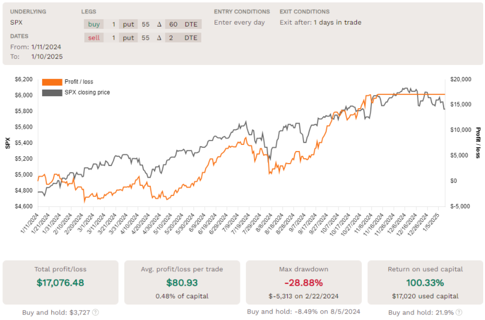

Algorithmic trading is heavily reliant on the application of historical data to test and refine trading strategies, a process known as backtesting. By simulating the performance of a strategy on past market data, traders can assess its viability and make informed adjustments before deploying it in live trading environments. Despite the insights provided by backtesting, it does not guarantee similar future results due to the ever-changing nature of financial markets, fluctuating economic conditions, and other unpredictable variables.

A crucial aspect often overlooked during backtesting is the correlation between the trading strategy and the underlying assets or markets. This correlation can significantly impact the strategy's performance and provide insights into its potential success when used live. Understanding correlation helps traders determine the extent to which a strategy's results are influenced by market movements or if the strategy functions independently of general market trends.



This article explores the importance of analyzing correlation in the context of backtesting for algorithmic trading. It offers guidance on how traders can optimize and evaluate their trading strategies by incorporating correlation assessments. By doing so, traders can better manage risk, improve strategic adjustments, and potentially enhance the robustness of their trading approaches in dynamic market environments.

## Table of Contents

## Understanding Correlation in Backtesting

Correlation in [backtesting](/wiki/backtesting) refers to the relationship between the performance of a trading strategy and the behavior of the underlying market or asset. This relationship can provide key insights into how much a strategy is influenced by market movements and help in assessing its potential effectiveness under various market conditions.

Mathematically, correlation is often represented by the correlation coefficient, which ranges from -1 to 1. A coefficient close to 1 indicates a strong positive correlation, meaning the strategy's performance closely follows the market's ups and downs. Conversely, a coefficient near -1 indicates a strong negative correlation, suggesting that the strategy performs well when the market performance is poor and vice versa. A correlation near zero indicates little to no linear relationship between the strategy's performance and market moves, implying that the strategy might function independently of the market trends.

The significance of understanding this correlation lies in the identification of inherent risks and rewards associated with a trading strategy. In high-correlation scenarios, the strategy might yield substantial returns when the market is booming, but it also risks significant losses during downturns. On the other hand, low-correlation strategies might offer more stability through diversification, as they are less affected by market fluctuations. This independence can be particularly valuable during volatile market conditions, providing a buffer against widespread market movements that can affect correlated assets similarly.

In practice, traders often use statistical software and programming languages like Python to calculate and analyze correlation values. For example, using Python's pandas and numpy libraries, one might analyze historical returns data to compute the correlation between a trading strategy and market indices like so:

```python
import pandas as pd
import numpy as np

# Example data for hypothetical strategy and market returns
strategy_returns = pd.Series([0.02, 0.03, 0.01, -0.01, 0.00, 0.02, -0.02])
market_returns = pd.Series([0.03, 0.01, 0.02, -0.02, 0.01, 0.01, -0.01])

# Calculate correlation
correlation = np.corrcoef(strategy_returns, market_returns)[0, 1]
print(f"Correlation between strategy and market: {correlation}")
```

Ultimately, understanding the correlation in backtesting helps traders identify the alignment of a strategy with their overall investment goals and risk tolerance. By recognizing the degree to which a strategy depends on market conditions, traders can make informed decisions on adjustments or diversification to optimize performance and manage risks effectively.

## Role of Correlation in Strategy Development

Incorporating correlation analysis into algorithmic strategy development helps traders discern which strategies are susceptible or resilient to various market movements. By assessing correlation metrics during backtesting, traders can make informed adjustments to refine their strategies. These adjustments are aimed at mitigating risk or enhancing profits by strategically aligning with or hedging against market fluctuations.

To understand correlation, it is essential to comprehend the correlation coefficient, denoted by $\rho$, which quantifies the strength and direction of a linear relationship between two variables. In the context of trading, these variables typically represent the returns of a trading strategy and the returns of the underlying market or asset. The correlation coefficient is mathematically expressed as:

$$
\rho(X, Y) = \frac{\text{cov}(X, Y)}{\sigma_X \sigma_Y}
$$

where $\text{cov}(X, Y)$ is the covariance between the strategy's returns $X$ and the market's returns $Y$, and $\sigma_X$ and $\sigma_Y$ are the standard deviations of $X$ and $Y$ respectively.

A high correlation coefficient (close to 1 or -1) indicates that the strategy's performance is closely tied to market movements. High positive correlation suggests that the strategy gains when the market rises and vice versa, while high negative correlation indicates the opposite pattern. In such cases, traders may consider diversification strategies or hedging techniques to manage risks associated with adverse market movements. Conversely, a low correlation (close to 0) indicates a strategy that operates independently of the broader market, offering potential advantages in providing diversification and reducing portfolio risk.

For strategy development, traders can employ correlation analysis to ensure that their strategies are not merely mimicking market indices. For instance, if a trader identifies a correlation coefficient near 1, they might focus on developing a market-neutral strategy, which involves creating a portfolio designed to produce gains irrespective of market direction, often by combining positions in various assets with hedging strategies.

In practical application, Python can be utilized to calculate and analyze correlation:

```python
import numpy as np
import pandas as pd

# Example returns data for a strategy and the market
strategy_returns = np.array([0.05, 0.10, -0.02, 0.07, -0.01])
market_returns = np.array([0.06, 0.08, 0.00, 0.05, 0.02])

# Calculating correlation coefficient
correlation_coefficient = np.corrcoef(strategy_returns, market_returns)[0, 1]

print(f"Correlation Coefficient: {correlation_coefficient}")
```

By leveraging such analyses, traders ensure their strategies do not inadvertently replicate the exposure of the broader market. Instead, they can either bolster or temper these strategies according to desired outcomes and risk tolerances, ultimately contributing to more robust and adaptable [algorithmic trading](/wiki/algorithmic-trading) performances.

## Interpreting Correlation Results

In algorithmic trading, interpreting correlation results is essential for comprehending the strength and nature of the relationship between a trading strategy and the underlying market performance. The correlation coefficient, denoted by the symbol $r$, quantitatively measures this relationship, ranging from -1 to 1. A coefficient close to 1 indicates a strong positive correlation, meaning the strategy's returns generally move in tandem with market movements. Conversely, a coefficient near -1 signifies a strong negative correlation, where the strategy's returns tend to move inversely to the market. A coefficient around 0 suggests little to no linear relationship, indicating that the strategy's returns are largely independent of the market.

Traders must examine whether the correlation aligns with their trading objectives and risk tolerance. High positive correlation might be suitable for strategies designed to capitalize on rising markets but poses significant risks during downturns. Negative correlation can be advantageous for hedging against market losses but may limit gains during favorable market conditions. 

Strategies that demonstrate low correlation with underlying markets provide a diversification advantage. By minimizing reliance on broader market movements, these strategies can reduce portfolio [volatility](/wiki/volatility-trading-strategies) and enhance stability. This characteristic is particularly valuable during periods characterized by unpredictability and heightened volatility, as it allows traders to manage risk more effectively.

For instance, consider the calculation of the correlation coefficient in Python to assess the relationship between a trading strategy's returns and market returns:

```python
import numpy as np

# Example data: returns of a strategy and the market
strategy_returns = np.array([0.02, 0.03, -0.01, 0.04, 0.01])
market_returns = np.array([0.01, 0.04, -0.02, 0.03, 0.00])

# Calculate correlation coefficient
correlation_coefficient = np.corrcoef(strategy_returns, market_returns)[0, 1]
print("Correlation Coefficient:", correlation_coefficient)
```

This code snippet demonstrates how to compute the correlation coefficient, providing a practical approach to integrating statistical analysis into trading strategy evaluation and decision-making processes. Understanding and accurately interpreting these results enable traders to fine-tune their strategies according to specific market conditions and personal risk preferences.

## Case Studies: Correlation in Action

### Case Studies: Correlation in Action

Real-world applications of correlation analysis in backtesting demonstrate its critical role in refining trading strategies. By analyzing past financial data, traders can identify correlations that other methods might overlook, leading to better-informed decisions and heightened strategy effectiveness.

One illustrative example comes from the development of [momentum](/wiki/momentum)-based trading strategies. These strategies typically aim to profit from the continuation of existing market trends. However, without properly assessing correlation, traders might inadvertently expose themselves to heightened risk during market trend reversals. By incorporating correlation analysis, traders can measure the strategy's sensitivity to market movements and adjust parameters such as momentum thresholds to mitigate potential losses. For instance, a strategy that shows a correlation coefficient near 1 with a major stock index might suggest an over-reliance on the direction of the broader market. Adjustments to reduce this correlation can lead to a more market-neutral approach, thereby reducing exposure to market corrections.

A different case study involves pairs trading, a market-neutral strategy that capitalizes on the convergence between two historically correlated stocks. By regularly updating the correlation metrics between the two stocks, traders can decide when to enter or [exit](/wiki/exit-strategy) trades based on the divergence from their expected correlation. An absence of such analysis might result in trades that assume a persistent relationship between the stocks, which could lead to considerable losses if the correlation diminishes over time. Using correlation analysis here enhances the robustness and resilience of the strategy against market fluctuations.

Ignoring correlation can often lead to unintended consequences, such as undue risk exposure. For instance, a past scenario involved a [hedge fund](/wiki/hedge-fund-trading-strategies) that implemented a strategy based on historical volatility but failed to account for its strong correlation with economic cycles. When market conditions shifted due to economic downturns, the strategy's performance suffered significantly, resulting in large losses for the fund. By integrating correlation analysis into the backtesting phase, the fund could have anticipated the strategy's vulnerability to economic shifts and adjusted their hedging techniques accordingly.

In conclusion, examining historical case studies underscores the indispensable nature of correlation analysis in backtesting. Properly accounted for, correlation can transform a strategy's susceptibility to market dynamics, fortifying it against unexpected shifts and enhancing its overall performance. Conversely, its neglect can lead to detrimental exposure and diminished returns. Thus, ongoing correlation analysis remains a vital component of effective backtesting and strategy development within algorithmic trading.

## Advanced Strategies and Correlation

Advanced strategies in algorithmic trading often incorporate correlation assessments to create portfolios that are not overly dependent on market direction. One such approach is the market-neutral strategy, designed to generate returns regardless of whether the market moves up or down. Market-neutral strategies achieve this by maintaining a balance between long and short positions, effectively hedging against broad market movements. By doing this, traders can potentially isolate and capitalize on the alpha, or excess returns, generated by specific securities or strategies.

### Market-Neutral Strategies

Market-neutral strategies fundamentally rely on statistical correlation analysis to identify pairs of securities or portfolios that can be held long and short to offset each other's market risk. This results in a zero net market exposure, hence the term "market-neutral". Correlation coefficients, ranging between -1 and 1, are used to determine the strength and direction of the linear relationship between asset returns. By selecting pairs with strong historical correlations, traders aim to minimize systemic risk while targeting individual asset performance.

#### Example of Market-Neutral Strategy

Consider a [pair trading](/wiki/pair-trading) strategy involving two stocks in the same industry, such as Coca-Cola (KO) and PepsiCo (PEP). If historical data shows a strong positive correlation between these stocks, a market-neutral strategy might involve shorting the overperforming stock and going long on the underperforming one when the correlation weakens. The idea is to profit from the convergence of their prices back to the norm, effectively reducing market exposure.

### Use of Derivatives in Managing Correlation Risks

Derivatives like options, futures, and swaps are vital tools in managing correlation risks in advanced trading strategies. These financial instruments allow traders to hedge against potential adverse movements in correlated assets.

#### Options

Options provide the right, but not the obligation, to buy or sell an asset at a predetermined price before a specific date. Traders can use options to implement delta-neutral strategies, which are aimed at mitigating the portfolio's sensitivity to small changes in the price of the underlying asset. By adjusting the delta of the options portfolio, traders can align the correlation risk to their desired level.

#### Futures and Swaps

Futures contracts obligate the purchase or sale of an asset at a set future date and price, offering a straightforward way to hedge against anticipated price movements. Swaps, particularly [interest rate](/wiki/interest-rate-trading-strategies) swaps, are employed to exchange various types of cash flows to mimic the role of correlated securities, allowing traders to manage exposure without directly buying the underlying asset.

### Technical Implementation

Here's an example of how a market-neutral strategy might be implemented in Python using the `pandas` library:

```python
import pandas as pd

# Fetching historical price data for asset1 and asset2
data = pd.DataFrame({
    'Asset1': [adjusted_close_prices_1],
    'Asset2': [adjusted_close_prices_2]
})

# Computing daily returns
returns = data.pct_change().dropna()

# Calculating the correlation matrix
correlation_matrix = returns.corr()

# Implementing a market-neutral strategy
weights = np.array([1, -correlation_matrix.loc['Asset1', 'Asset2']])
normalized_returns = returns.mul(weights, axis=1).sum(axis=1)

print(f"Market-neutral returns: {normalized_returns.mean() * 100:.2f}%")

```

By consistently revisiting and adjusting strategies based on correlation assessments, traders can create more resilient portfolios that are equipped to handle diverse market conditions. The continuous evolution of these strategies is critical for retaining competitive advantage in the dynamic landscape of algorithmic trading.

## Conclusion

Understanding and integrating correlation analysis into backtesting processes enhances the depth and reliability of trading strategies, offering a more nuanced view of potential risks and rewards. Correlation analysis, by quantifying the relationship between a trading strategy's performance and its underlying assets or market conditions, allows traders to adjust and optimize their strategies based on data-driven insights.

As financial markets are inherently dynamic, ongoing assessment of correlation is necessary to adapt and refine strategies over time. Factors such as changes in market volatility, [liquidity](/wiki/liquidity-risk-premium), regulatory environments, and other macroeconomic variables can all influence the correlation between a strategy and the market. By maintaining vigilance in evaluating these correlations, traders can better anticipate shifts that might impact their strategies' effectiveness, thereby sustaining or enhancing performance.

Moreover, understanding correlation serves as a critical component in risk management and strategy optimization. Strategies with low correlation to broader market movements offer diversification benefits, reducing overall portfolio risk without necessarily sacrificing returns. This is particularly advantageous in periods of market turmoil or unpredictability, where traditionally correlated assets might experience simultaneous declines.

In practice, integrating correlation analysis into backtesting requires a multifaceted approach, which can include calculating correlation coefficients and assessing their stability over multiple timeframes and market conditions. By continually refining these processes, traders can tailor their strategies to meet specific risk tolerance levels and achieve targeted financial outcomes.

In summary, the integration of rigorous correlation analysis into the backtesting process provides essential insights that enable traders to construct more robust and resilient trading strategies, aligning with both market expectations and individual risk management goals.

## References & Further Reading

[1]: Bergstra, J., Bardenet, R., Bengio, Y., & Kégl, B. (2011). ["Algorithms for Hyper-Parameter Optimization."](https://papers.nips.cc/paper/4443-algorithms-for-hyper-parameter-optimization) Advances in Neural Information Processing Systems 24.

[2]: ["Advances in Financial Machine Learning"](https://www.amazon.com/Advances-Financial-Machine-Learning-Marcos/dp/1119482089) by Marcos Lopez de Prado.

[3]: Aronson, David R. (2006). ["Evidence-Based Technical Analysis: Applying the Scientific Method and Statistical Inference to Trading Signals"](https://www.amazon.com/Evidence-Based-Technical-Analysis-Scientific-Statistical/dp/0470008741). John Wiley & Sons.

[4]: Jansen, Stefan. (2020). ["Machine Learning for Algorithmic Trading: Predictive Models to Extract Signals from Market and Alternative Data for Systematic Trading Strategies with Python, 2nd Edition"](https://www.amazon.com/Machine-Learning-Algorithmic-Trading-alternative/dp/1839217715) Packt Publishing.

[5]: Chan, Ernest P. (2008). ["Quantitative Trading: How to Build Your Own Algorithmic Trading Business"](https://github.com/ftvision/quant_trading_echan_book). John Wiley & Sons.  

[6]: ["Python for Finance: Analyze Big Financial Data"](https://books.google.com/books/about/Python_for_Finance.html?id=E93SBQAAQBAJ) by Yves Hilpisch.