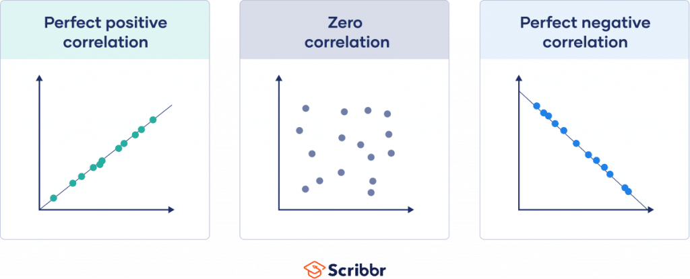

Algorithmic trading, known as algo trading, is a sophisticated method of executing trades that relies extensively on automated systems and data analysis. The primary goal of algorithmic trading is to leverage computational power and advanced mathematical models to execute trades at optimal times and prices, often achieving results that are impossible to replicate manually. This trading approach utilizes algorithms—predefined sets of rules and instructions—that analyze market data, identify trading opportunities, and automatically carry out buy or sell orders.

A crucial aspect of data analysis in algorithmic trading is correlation analysis, which aids in understanding the relationships between different financial instruments. Correlation measures the degree to which two or more variables move in relation to one another. In financial markets, this could mean analyzing how the price movements of stocks, bonds, commodities, or other assets are interrelated. For example, a positive correlation indicates that two variables, such as the prices of gold and a gold-mining company's stock, move in the same direction. Conversely, a negative correlation suggests an inverse relationship, where one variable's rise corresponds with the other's decline.



The significance of correlation analysis in algorithmic trading lies in its ability to provide insights into market dynamics that can inform strategic trading decisions. By understanding these relationships, traders can develop more effective trading strategies, optimize portfolios by diversifying across non-correlated assets, and even identify arbitrage opportunities. This article investigates how correlation is applied in algorithmic trading and its influence on making informed trading decisions that can lead to improved financial outcomes. Through a comprehensive examination of correlation, traders can enhance their ability to navigate complex market environments and achieve better returns on their investments.

## Table of Contents

## What is Correlation in Algorithmic Trading?

Correlation in [algorithmic trading](/wiki/algorithmic-trading) is a metric used to quantify the degree to which two financial variables move with respect to each other. This measurement is paramount to understanding how asset prices, indices, or any financial instruments relate to one another. Correlation is often expressed through the correlation coefficient, a statistical measure that varies between -1 and 1. A positive correlation coefficient indicates that as one variable increases, the other variable tends to increase as well. Conversely, a negative correlation suggests that as one variable rises, the other tends to decrease. A correlation coefficient of zero implies no linear relationship between the variables.

In trading strategies, identifying these relationships is critical. For instance, if two stocks have a high positive correlation, they are likely to move in tandem under similar market conditions. Traders can use this information to anticipate market movements and hedge their portfolios accordingly. On the other hand, identifying pairs with negative correlations can be crucial for diversifying investments, thereby reducing risk.

To put it mathematically, the Pearson correlation coefficient $r$ between two variables $X$ and $Y$ is calculated as follows:

$$
r = \frac{\text{cov}(X, Y)}{\sigma_X \sigma_Y}
$$

where $\text{cov}(X, Y)$ is the covariance between $X$ and $Y$, and $\sigma_X$ and $\sigma_Y$ are the standard deviations of $X$ and $Y$ respectively. This formula captures the linear relationship between the variables.

In algo trading, correlation analysis is part of the decision-making toolkit used to ascertain interdependencies between trading entities. High-frequency trading models use such analysis to tweak their algorithms for optimized outcomes. Python libraries such as Pandas and NumPy can be employed to perform correlation analysis, allowing traders to handle large datasets efficiently. Here’s an example code snippet demonstrating how correlation can be calculated using Pandas:

```python
import pandas as pd

# Assuming df is a DataFrame with two columns, 'Asset1' and 'Asset2'
correlation_matrix = df[['Asset1', 'Asset2']].corr()
correlation_coefficient = correlation_matrix.iloc[0,1]
print("Correlation Coefficient:", correlation_coefficient)
```

Understanding and harnessing correlations allow traders to construct strategies that exploit the predictable co-movements of assets, paving the way for informed and potentially profitable trading decisions.

## Importance of Correlation in Trading

Correlation analysis serves as a vital tool in understanding market dynamics and managing financial assets in algorithmic trading. It helps traders gain insights into market trends by illustrating how assets move in relation to one another. A high positive correlation indicates that the price movements of two assets are aligned, whereas a high negative correlation suggests they move inversely. Recognizing these relationships allows traders to make strategic decisions about which assets to include in their portfolios to optimize returns and manage risk.

Identifying correlated assets is crucial for constructing diversified portfolios. Diversification involves combining assets that have low or negative correlations to reduce overall portfolio risk. This approach seeks to offset losses from one asset with gains from another, thereby stabilizing returns. For instance, if two financial instruments historically exhibit a low or inverse correlation, including both in a portfolio could mitigate risk exposure as they respond differently to market conditions.

Beyond portfolio management, correlation analysis is instrumental in [arbitrage](/wiki/arbitrage) trading. Arbitrage opportunities arise when price discrepancies between correlated assets occur, allowing traders to profit by simultaneously buying and selling these assets. By monitoring correlation metrics, traders can detect inefficiencies in the market and take advantage of these temporary imbalances.

Moreover, correlation analysis is used to verify data integrity within trading models. Ensuring data fidelity is essential in algorithmic trading, as inaccurate data can lead to erroneous trading decisions. By regularly analyzing the correlation between data inputs, traders can identify anomalies or errors in data that could impact model performance.

In summary, understanding and leveraging correlation among financial instruments enables traders to navigate market trends effectively, optimize portfolios for better risk-adjusted returns, and capitalize on arbitrage opportunities, all while safeguarding the credibility of their trading models.

## Tools and Methods for Analyzing Correlation

Correlation analysis is crucial in algorithmic trading, and several methods are available to measure this relationship between financial variables. The choice of method depends on the nature of the data and the specific requirements of the analysis.

**Pearson, Spearman, and Kendall Methods**

Pearson's correlation coefficient is the most commonly used method for measuring linear relationships between two continuous variables. It is calculated as:

$$
r = \frac{\sum{(x_i - \bar{x})(y_i - \bar{y})}}{\sqrt{\sum{(x_i - \bar{x})^2}\sum{(y_i - \bar{y})^2}}}
$$

where $x_i$ and $y_i$ are the individual sample points, and $\bar{x}$ and $\bar{y}$ are the means of the $x$ and $y$ variables, respectively.

Spearman's rank correlation coefficient is a non-parametric measure that assesses how well the relationship between two variables can be described using a monotonic function. It is particularly useful for ordinal data or when the assumption of normality is violated. The Spearman rank correlation is defined as the Pearson correlation coefficient between the ranked variables.

Kendall's tau is another non-parametric method used to measure the strength and direction of association between two variables. It evaluates the ordinal association by considering the difference between the number of concordant and discordant pairs of observations.

**Advanced Statistical Models**

Advanced statistical models such as Generalized Autoregressive Conditional Heteroskedasticity (GARCH) and Dynamic Conditional Correlation (DCC) models help in assessing time-varying correlations. The GARCH model is used to estimate the [volatility](/wiki/volatility-trading-strategies) of financial time series data, which can change over time due to market conditions. On the other hand, the DCC model extends the GARCH framework to accommodate dynamic correlation matrices, allowing for the modeling of correlations that evolve over time.

**Programming Tools for Correlation Analysis**

Python offers a variety of libraries that simplify correlation analysis for algorithmic trading:

- **Pandas**: This library provides extensive data structures that are perfect for dealing with time series data. The `corr` method in Pandas can be used to compute pairwise correlation coefficients.

  ```python
  import pandas as pd

  # Assuming df is a pandas DataFrame with the relevant data
  correlation_matrix = df.corr(method='pearson')  # Other methods: 'spearman', 'kendall'
  ```

- **NumPy**: It offers basic support for large, multi-dimensional arrays and matrices, along with a large library of mathematical functions. The `numpy.corrcoef` function calculates the correlation matrix.

  ```python
  import numpy as np

  # Assuming data is a 2D NumPy array
  correlation_matrix = np.corrcoef(data)
  ```

- **Statsmodels and SciPy**: These libraries provide additional statistical functions. SciPy's `stats` module includes functions to calculate Kendall's tau and Spearman's rho.

Overall, the integration of statistical models and programming tools facilitates comprehensive correlation analysis, enabling traders to make data-driven decisions. Understanding and effectively utilizing these tools can significantly enhance the precision of trading strategies.

## Applications in Portfolio Management

Correlation analysis is crucial in portfolio management as it aids in achieving diversification, thereby reducing risk and potentially enhancing returns. Identifying assets with negative or low correlations allows investors to construct portfolios that are less susceptible to market volatility. This is because the adverse performance of one asset can potentially be offset by the favorable performance of another, reducing overall portfolio risk.

In practical terms, the correlation coefficient, usually denoted by ρ (rho), quantifies the degree of correlation between the returns of two assets. This can be mathematically expressed as:

$$
\rho(X, Y) = \frac{\text{Cov}(X, Y)}{\sigma_X \sigma_Y}
$$

Where $\text{Cov}(X, Y)$ is the covariance between asset X and Y, and $\sigma_X$ and $\sigma_Y$ are the standard deviations of X and Y, respectively.

Beyond diversification, correlation analysis is integral in guiding the rebalancing of portfolios to respond to shifting market dynamics. As financial markets evolve, so do the relationships between various assets, necessitating periodic adjustments to maintain the desired risk-return profile. Managers employ correlation metrics to make informed rebalancing decisions, ensuring alignment with investors' objectives and market conditions.

Additionally, portfolio managers leverage correlation analysis to understand the impact of economic indicators on asset performance. For example, interest rates, inflation, and GDP growth can influence correlations among asset classes. Insight into these relationships enables managers to anticipate how macroeconomic changes might affect portfolio risk and return expectations.

Incorporating correlation analysis into portfolio management strategies involves sophisticated software and statistical tools. Python libraries such as Pandas and NumPy are widely used to conduct this analysis, allowing for efficient computation and visualization of correlation matrices. For instance, a simple Python snippet to calculate the correlation matrix for a given dataset may look like this:

```python
import pandas as pd

# Assuming 'data' is a DataFrame where each column represents asset returns
correlation_matrix = data.corr()
print(correlation_matrix)
```

By utilizing such tools, portfolio managers can perform comprehensive correlation analysis, enabling more strategic decision-making in constructing and maintaining investment portfolios. This quantitative approach helps navigate complex market environments, aiming to optimize potential returns while managing risk effectively.

## Challenges in Utilizing Correlation

Correlation, while a powerful tool in algorithmic trading, presents several inherent challenges that traders need to be mindful of to ensure effective strategy development and implementation.

Firstly, it is crucial to understand that correlation does not imply causation. This is a fundamental principle in [statistics](/wiki/bayesian-statistics), which indicates that even if two variables exhibit a strong correlation, it does not necessarily mean that one causes the other. In trading, this can lead to the identification of spurious correlations—statistical relationships that appear significant simply due to random chance rather than an underlying causal mechanism. Traders exploiting these spurious correlations may encounter substantial financial risk if they base their strategies on these misleading signals.

Furthermore, financial markets are inherently dynamic, characterized by constant fluctuations and evolving patterns. Consequently, correlations between financial instruments are not static but change over time. This variability necessitates continuous monitoring and frequent recalibration of trading models to ensure they reflect current market conditions accurately. Traders might find that a correlation that held firm in one market environment might weaken or reverse as circumstances change, affecting the profitability and risk exposure of their strategies.

High-frequency trading ([HFT](/wiki/high-frequency-trading-strategies)), which involves executing a large number of orders at incredibly fast speeds, further complicates the use of correlation in trading. The rapid price changes and transaction volumes in HFT can obscure the true correlations between assets, making it difficult to discern genuine relationships from noise. Moreover, the speed of transactions can lead to a temporal mismatch, where correlations calculated over longer durations may not hold over shorter, split-second trading periods. This necessitates the use of more sophisticated models that can account for and adapt to these rapid changes in market conditions.

While facing these challenges, traders can employ various strategies to mitigate risks associated with correlation analysis. They might use more robust statistical models designed to handle time-varying correlations or adopt [machine learning](/wiki/machine-learning) techniques to detect and account for spurious correlations. Additionally, real-time data feeds and advanced computational tools are essential in allowing traders to constantly reassess and adapt their models to the ever-changing market landscape.

## Case Studies and Real-World Examples

Historical examples from the financial markets illustrate how correlation analysis has been instrumental in achieving trading success. This section highlights key case studies that underscore the practical application of correlation in algorithmic trading, focusing on the relationship between the S&P 500 Index and the VIX, as well as examples of effective arbitrage strategies.

The correlation between the S&P 500 Index and the VIX (Volatility Index) offers valuable insights, particularly during periods of market turmoil. The VIX, often referred to as the "fear index," quantifies expected market volatility based on options prices of the S&P 500. A well-documented phenomenon is the negative correlation between the S&P 500 and the VIX, where an increase in market volatility (rising VIX) typically corresponds with a decrease in the stock index due to heightened uncertainty or adverse market conditions. During the 2008 financial crisis, this inverse relationship was pronounced as the S&P 500 plunged while the VIX soared to unprecedented levels, reflecting heightened market stress. Traders and portfolio managers who recognized this inverse correlation could implement strategies to hedge against downside risks by using VIX futures or options, protecting their portfolios from steep losses.

Arbitrage strategies based on correlation discrepancies present another avenue where correlation analysis aids trading decisions. An example of this is [statistical arbitrage](/wiki/statistical-arbitrage), a market-neutral strategy that exploits pricing inefficiencies between correlated securities. Suppose two stocks historically exhibit a strong positive correlation. In that case, a temporary deviation from this relationship—where one stock is undervalued relative to the other—presents an arbitrage opportunity. Traders can go long on the undervalued stock while shorting the overvalued one, anticipating that the prices will converge to their historical correlation pattern. For instance, pairs trading, a form of statistical arbitrage, relies on identifying such correlated securities, executing trades when the correlation temporarily weakens, and profiting from the correction.

These case studies highlight the significance of correlation analysis in identifying trading opportunities and managing risks. They demonstrate that by understanding and monitoring the relationships between financial instruments, traders can capitalize on market inefficiencies and protect their investments during periods of high volatility.

## Future Trends in Correlation Analysis

As algorithmic trading continues to evolve, future trends in correlation analysis are becoming increasingly reliant on advanced technologies such as machine learning (ML), [artificial intelligence](/wiki/ai-artificial-intelligence) (AI), big data, and blockchain. These advancements are pushing the boundaries of traditional correlation methods, offering enhanced precision and novel capabilities in financial analysis.

### Enhancements through Machine Learning and AI

Machine learning and AI algorithms are redefining the precision with which correlations are analyzed, allowing for more nuanced models that can capture complex, non-linear relationships between financial assets. Traditional correlation coefficients like Pearson or Spearman often assume linear relationships, which might not fully represent the intricacies of financial data. Machine learning models, such as neural networks or ensemble methods, can model these complexities by learning patterns directly from data without such assumptions.

For example, ML techniques can process vast amounts of historical market data to unveil patterns that indicate potential future correlations. These techniques identify subtle and intricate dependencies that could signal profitable trading opportunities. Algorithms such as the Random Forest or Gradient Boosting can offer insights into feature importance and interaction effects, which are vital for understanding market dynamics.

### Big Data and Uncovering Subtle Correlations

The advent of big data is transforming how correlations are analyzed in financial markets. With the capability to process and analyze high-frequency data and vast datasets from varied sources, traders can uncover subtle correlations that traditional methods might miss. Big data technologies facilitate the amalgamation and analysis of structured and unstructured data, including social media sentiment, news articles, and macroeconomic indicators, providing a more comprehensive view of market conditions.

For instance, utilizing a Python-based stack with libraries like Pandas and Dask can enable real-time processing and analysis of large datasets. By leveraging these tools, correlation analysis can be performed on an unprecedented scale, leading to the identification of minute but significant relationships between assets.

### Blockchain and Real-time Data Accessibility

Blockchain technology introduces a decentralized framework that enhances the accessibility and transparency of real-time data, which is crucial for accurate correlation analysis. Decentralized ledgers ensure that data is immutable and timestamped, providing traders with reliable data sources to analyze market conditions instantaneously.

Smart contracts on blockchain platforms can facilitate autonomous data transactions and verifications, reducing latency and enhancing the efficiency of correlation-based strategies. For example, blockchain can be used to verify transaction data across exchanges, ensuring that the data involved in correlation analysis is not only current but also tamper-proof.

These technological advancements collectively enhance the capabilities of correlation analysis in algorithmic trading, providing traders and analysts with better tools to predict and respond to market shifts efficiently. By integrating machine learning, big data, and blockchain, the financial industry is on the cusp of a new era where correlation analysis is more robust, agile, and insightful than ever before.

## Conclusion

Correlation serves as a foundational element in algorithmic trading, providing critical insights into the intricate dynamics of market behavior. By evaluating how different financial assets move in relation to each other, correlation analysis equips traders with the ability to make informed decisions that can significantly enhance their trading strategies. This analysis helps in identifying patterns that might indicate favorable trading opportunities or potential risks that need mitigation. For instance, detecting a positive correlation between two assets might suggest potential for joint price movements, whereas a negative correlation could present hedging opportunities.

Effective utilization of correlation analysis can lead to more strategic decision-making and improved trading outcomes. By integrating correlation metrics into their trading algorithms, traders can optimize their portfolio's structure and adapt to changing market conditions, aiming to maximize returns while minimizing exposure to undesirable market volatility. Practical applications include portfolio diversification, risk management, and the development of arbitrage strategies that exploit correlation discrepancies.

However, the dynamic nature of financial markets demands that traders and data scientists maintain a proactive approach to correlation analysis. Correlations are not static; they fluctuate with market conditions, requiring continuous recalibration of trading models to accurately reflect these changes. Furthermore, the advent of big data, machine learning, and artificial intelligence heralds new frontiers in correlation analysis, offering the potential for uncovering subtle correlations that might otherwise remain undetected. Keeping abreast of such technological advancements ensures that trading strategies remain robust and adaptive.

In conclusion, while correlation is a powerful tool in algorithmic trading, its effective application requires vigilance and adaptability. Maintaining a nuanced understanding of correlation insights not only fosters strategic decision-making but also enhances the potential for successful trading endeavors in ever-evolving financial markets.

## References & Further Reading

[1]: Alexander, C. (2001). ["Market Models: A Guide to Financial Data Analysis."](https://www.casact.org/sites/default/files/old/marketmodels.pdf) Wiley.

[2]: Engle, R. F. (2002). ["Dynamic Conditional Correlation: A Simple Class of Multivariate GARCH Models."](https://www.jstor.org/stable/1392121) Journal of Business & Economic Statistics, Vol. 20, No. 3.

[3]: López de Prado, M. (2018). ["Advances in Financial Machine Learning."](https://www.amazon.com/Advances-Financial-Machine-Learning-Marcos/dp/1119482089) Wiley.

[4]: Chan, E. P. (2009). ["Quantitative Trading: How to Build Your Own Algorithmic Trading Business."](https://github.com/ftvision/quant_trading_echan_book) Wiley.

[5]: Tsay, R. S. (2010). ["Analysis of Financial Time Series."](https://onlinelibrary.wiley.com/doi/book/10.1002/9780470644560) Wiley.

[6]: Fabozzi, F. J., Focardi, S. M., & Kolm, P. N. (2006). ["Financial Modeling of the Equity Market: From CAPM to Cointegration."](https://onlinelibrary.wiley.com/doi/book/10.1002/9781119201236) Wiley.

[7]: Aronson, D. (2006). ["Evidence-Based Technical Analysis: Applying the Scientific Method and Statistical Inference to Trading Signals."](https://www.wiley.com/en-us/Evidence+Based+Technical+Analysis%3A+Applying+the+Scientific+Method+and+Statistical+Inference+to+Trading+Signals-p-9780470008744) Wiley.