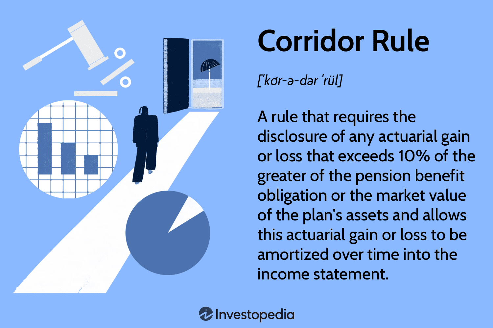

In today's complex financial landscape, having a comprehensive understanding of pension plans, actuarial science, and modern trading mechanisms is essential for effective financial planning and investment strategies. Pension plans are integral to ensuring financial security during retirement, providing either defined benefits or contributions that require careful management and reporting by both employers and employees. Meanwhile, the Corridor Rule significantly impacts the presentation of pension expenses, helping manage the volatility in financial statements due to actuarial gains or losses.

Actuarial science serves as the backbone of pension planning, employing statistical models to predict future liabilities and ensure pension plans are sustainable and well-funded. The expertise of actuaries is crucial for organizations to plan contributions strategically and mitigate long-term financial risks. 



Simultaneously, algorithmic trading has revolutionized investment strategies by automating trading processes through sophisticated computer algorithms. This approach allows for the analysis of extensive market data in real-time and enhances trading efficiency, which can improve returns significantly. As these technologies become prevalent, the integration of actuarial insights with algorithmic trading strategies opens new possibilities for managing pension plans. Such synergy facilitates dynamic asset allocation adjustments based on predictive actuarial forecasts and real-time market conditions.

Overall, the convergence of pension planning, actuarial science, and algorithmic trading is reshaping the financial planning landscape. To adapt to ongoing changes and seize emerging opportunities, investors, fund managers, and companies must deepen their understanding of these interconnected disciplines. As advancing technologies continue to redefine the methodologies for achieving financial security and growth, staying informed about these developments will be crucial for success in the evolving financial environment.

## Table of Contents

## Understanding Pension Plans

Pension plans are essential tools for ensuring financial security during retirement, offering participants the opportunity to accumulate savings and receive income post-retirement. These plans are primarily categorized into two types: defined benefit plans and defined contribution plans, each having distinct features, advantages, and responsibilities.

Defined benefit plans promise retirees a predetermined payout, typically measured through a formula that considers elements such as salary history and duration of employment. This assurance stands regardless of the underlying investment performance, placing the investment risk on the employer or the plan's sponsor. Consequently, these plans necessitate careful management and accurate actuarial calculations to ensure they are adequately funded, thereby guaranteeing promised benefits to retirees.

Conversely, defined contribution plans, such as 401(k) plans, allocate investment risk to the employees. In these plans, employers, employees, or both make contributions to individual accounts, with the ultimate benefits at retirement depending on the investment returns on these contributions. This structure introduces variability in retirement outcomes, as individuals bear the market's ups and downs. Participants often have control over how their funds are invested, which underscores the importance of financial literacy and understanding investment strategies.

The effective management and transparent reporting of pension plans are vital for all stakeholders involved. Accurate reporting practices ensure that both employees and employers have a clear understanding of the financial health and obligations of their pension plans. For employers, the accurate depiction of pension liabilities and assets in financial statements is crucial, as it affects their financial projections and can have significant impacts on their fiscal stability and investment strategies. Employees, on the other hand, need transparency to make informed decisions regarding their retirement planning and contribution strategies.

Enhancing financial security through pension plans requires meticulous attention to their design and administration. Both types of plans have their own sets of complexities, which must be navigated effectively to safeguard the financial well-being of future retirees.

## The Corridor Rule and its Impact

The Corridor Rule serves a fundamental function in the realm of pension accounting by mitigating the [volatility](/wiki/volatility-trading-strategies) associated with pension expenses on a company's financial statements. This rule, as part of the standards set by financial accounting bodies, addresses the problem of fluctuating actuarial gains and losses. These fluctuations typically occur due to changes in estimates and assumptions concerning crucial factors like interest rates, salary growth, employee turnover, and longevity.

The rule stipulates that when the accumulated actuarial gains or losses exceed 10% of the greater of the pension benefit obligation (PBO) or the fair value of the plan assets, a company must recognize part of this excess in its profit and loss statement. This 10% threshold is referred to as the "corridor". The recognition is not immediate but is rather spread over the expected average remaining service life of the employees covered by the plan, thereby allowing for amortization of these variations. This practice is analogous to the concept of smoothing in [statistics](/wiki/bayesian-statistics), where sudden spikes are tempered to present a more consistent trend over time.

Mathematically, the implementation of the Corridor Rule can be expressed as follows:

$$
\text{Recognized Expense} = \frac{\text{Actuarial Gain or Loss} - (0.10 \times \max(\text{PBO}, \text{Fair Value of Plan Assets}))}{\text{Average Remaining Service Life}}
$$

This structured approach to managing actuarial gains and losses is significant because it prevents such variations from causing immediate and potentially misleading impacts on income statements. By offering a buffer against the abrupt recognition of these fluctuations, the Corridor Rule ensures that financial statements more accurately reflect economic realities over time rather than transient market or actuarial conditions. This buffering effect is vital for stakeholders who rely on financial statements to make informed decisions about a company's stability and long-term financial health.

In summary, the Corridor Rule provides a balanced method for recognizing certain volatile financial elements associated with pensions. It allows companies to manage and report pension-related expenses in a manner that aligns more closely with the long-term nature of pension obligations while protecting financial statements from short-term disruptions.

## Actuarial Science: The Backbone of Pension Planning

Actuarial science involves the application of mathematical and statistical techniques to assess financial risks, primarily in the insurance and finance industries. Within pension planning, it assumes a crucial role by providing the necessary framework for accurate calculations and projections that inform decision-making. Actuaries utilize a range of statistical methods to predict future liabilities associated with pension schemes, ensuring that these plans remain sustainable and adequately funded.

One of the primary tasks of actuaries in pension plan management is to estimate future pension liabilities. This involves complex calculations that consider factors such as employee age, salary growth, life expectancy, and turnover rates. To model these uncertainties, actuaries often employ stochastic processes and survival models. For example, the projection of future liabilities involves using present value calculations where liabilities are discounted to their present value using expected rates of return:

$$
PV = \frac{FV}{(1 + r)^n}
$$

Where:
- $PV$ is the present value of future liabilities,
- $FV$ is the future value of the liabilities,
- $r$ is the discount rate (expected rate of return), 
- $n$ is the number of periods until payment.

Additionally, actuaries develop mortality tables and longevity risk models to predict life expectancy more accurately, which greatly influences retirement benefits' duration and cost. By quantifying these risks, actuaries help in structuring pension plans that can withstand demographic and economic changes.

Actuarial expertise is also instrumental in determining appropriate contribution levels for pension funds. This is critical not only for fulfilling current obligations but also for minimizing the long-term financial risk for organizations. Through experience studies and assumptions about economic trends and workforce changes, actuaries advise on contribution strategies that balance between underfunding (resulting in insufficient funds to meet obligations) and overfunding (allocating more resources than necessary, potentially impacting current [liquidity](/wiki/liquidity-risk-premium)).

Furthermore, actuarial analytics empower companies to implement strategic asset-liability management (ALM), matching asset profiles with the timing and amount of liabilities. This practice mitigates risk and aids in optimizing the investment strategies for pension funds. The probabilistic assessment and scenario analysis performed by actuaries provide actionable insights that enable organizations to adjust funding strategies in response to legislative shifts or economic upheaval.

In conclusion, the role of actuaries in pension planning is pivotal to ensuring financial security for retirees while maintaining the fiscal health of pension providers. The strategic insights derived from actuarial science not only safeguard against future uncertainties but also lay the groundwork for sustainable pension systems.

## Algorithmic Trading: Revolutionizing Investment Strategies

Algorithmic trading, often abbreviated as algo trading, utilizes sophisticated computer algorithms to automate and optimize trading processes. This technology has transformed the financial landscape, introducing new efficiencies and capabilities that were previously unimaginable. By employing complex mathematical models and statistical analysis, these algorithms can process a vast array of market variables in real-time, identifying trends and patterns that might elude human traders.

The primary advantage of [algorithmic trading](/wiki/algorithmic-trading) is its speed and efficiency. By executing trades automatically, these algorithms can capitalize on even the slightest market movements within fractions of a second, a timeframe often untenable for manual trading. This capability is particularly beneficial in high-frequency trading ([HFT](/wiki/high-frequency-trading-strategies)), where success and profitability are heavily contingent on the ability to swiftly execute a large number of transactions. Furthermore, algorithmic trading facilitates high-frequency strategies by allowing the execution of thousands of orders per instant, significantly reducing transaction costs.

Python, a popular programming language in finance due to its simplicity and extensive libraries, is often employed in developing algorithmic trading strategies. Consider the following Python example using the `pandas` library to simulate a basic moving average crossover strategy:

```python
import pandas as pd

# Sample data, replace with actual market data
data = pd.DataFrame({
    'price': [100, 101, 102, 101, 100, 99, 100, 102, 104, 106, 107]
})

# Calculate moving averages
short_window = 3
long_window = 5

data['short_mavg'] = data['price'].rolling(window=short_window, min_periods=1).mean()
data['long_mavg'] = data['price'].rolling(window=long_window, min_periods=1).mean()

# Generate signals
data['signal'] = 0
data['signal'][short_window:] = (data['short_mavg'][short_window:] > data['long_mavg'][short_window:]).astype(int)

# Identify trade orders
data['orders'] = data['signal'].diff()

print(data)
```

In this example, the algorithm generates buy and sell signals based on the crossover of short-term and long-term moving averages. When the short-term moving average surpasses the long-term one, it issues a buy signal, indicating a potential upward trend. Conversely, when the short-term moving average falls below the long-term average, it triggers a sell signal. This method exemplifies how algorithmic trading strategies can help investors make more informed decisions by leveraging statistical methods.

The precision of algorithmic trading is another significant draw for institutional investors. Algorithms reduce human error and allow for [backtesting](/wiki/backtesting) strategies against historical data, enhancing the accuracy and reliability of the trading strategies. Additionally, they can manage large trading volumes with minimal human intervention, maintaining market liquidity and potentially yielding higher returns on investment.

Due to these advantages, algorithmic trading has become increasingly popular among hedge funds, banks, and other financial institutions. It is estimated that algorithmic trading now accounts for a significant proportion of overall trading [volume](/wiki/volume-trading-strategy) in major markets, as investors seek to leverage its benefits to maintain a competitive edge. The continued evolution of technology and data analytics promises to further refine and expand the capabilities of algorithmic trading, solidifying its role as a cornerstone of modern investment strategies.

## Intersection of Pension Planning, Actuarial Science, and Algo Trading

The integration of actuarial science and algorithmic trading strategies marks a significant advancement in pension plan management. Actuarial insights provide a statistical foundation for anticipating future liabilities and determining the necessary funding levels to fulfill pension obligations. By incorporating these insights into the algorithmic trading framework, pension managers can optimize asset allocations more dynamically.

Algorithmic trading relies on sophisticated algorithms to analyze vast amounts of market data in real-time. These algorithms can assess various market indicators and respond more quickly and efficiently than traditional trading methods. By using actuarial forecasts, which include probabilities of future events such as changes in life expectancy, inflation rates, or market fluctuations, algorithmic systems can adjust investment strategies to align with anticipated needs and risks.

For instance, if actuarial forecasts predict increased longevity among retirees, pension funds may need to reallocate assets to ensure long-term solvency. Algorithmic trading can facilitate this by efficiently reallocating investments, perhaps increasing exposure to growth-oriented assets or diversifying into new markets.

This synergy between actuarial science and algorithmic trading enhances the robustness of financial planning. It allows pension funds to better anticipate market conditions and adjust their strategies accordingly, thereby providing greater security and potentially higher returns for future retirees. This integration supports a more stable and prosperous retirement landscape, as it mitigates risks associated with market volatility and demographic changes.

Incorporating technology-driven trading strategies ensures that pension funds are not only reacting to current market conditions but are also proactively aligning their strategies with future forecasts. This proactive approach is crucial in maintaining the financial health of pension plans, ensuring they meet their obligations to beneficiaries while optimizing investment returns.

## Conclusion

In an evolving financial environment, the intersection of actuarial science, pension planning, and algorithmic trading is fundamentally transforming investment landscapes. Each of these domains brings unique insights and advancements that collectively enhance the robustness of financial strategies. Understanding these interconnected fields is essential for investors, fund managers, and companies to navigate the challenges and seize the opportunities that arise.

The integration of actuarial science within pension planning enables precise forecasting of future liabilities, ensuring that pension funds are not only sustainable but also optimized for long-term growth. This scientific approach to financial security allows for meticulous planning and strategic allocation of resources to minimize risk and improve stability.

Meanwhile, algorithmic trading introduces efficiency and precision into investment strategies. By leveraging computer algorithms, trades can be executed at unprecedented speeds and scales, capitalizing on market trends and minimizing human errors. This technological advantage is particularly significant for institutional investors who need to handle large volumes of assets with both expertise and agility.

As financial technologies continue to advance, the frameworks and strategies guiding investment and financial security will undoubtedly evolve as well. Innovations in data analytics, [machine learning](/wiki/machine-learning), and [artificial intelligence](/wiki/ai-artificial-intelligence) will further refine the predictive capabilities of actuarial models and the execution speed of trading algorithms. These developments promise a future where financial planning is not only more dynamic but also more resilient against economic fluctuations.

For stakeholders, staying informed about these changes is crucial. By comprehending and integrating actuarial, pension, and trading insights, they can better position themselves to achieve sustained financial growth and security. This evolving landscape offers a multitude of opportunities and challenges, and those equipped with knowledge and adaptability will lead the charge in shaping the future of finance.

## References & Further Reading

[1]: ["IAS 19 - Employee Benefits"](https://www.ifrs.org/content/dam/ifrs/publications/pdf-standards/english/2021/issued/part-a/ias-19-employee-benefits.pdf) - International Financial Reporting Standards (IFRS)

[2]: Goldsticker, R. (2007). "The Evolution of Target Date Funds: Using a Dynamic Glidepath to Mitigate Losses in Distribution." Journal of Pension Benefits, 15(1), 49-55.

[3]: Hull, J. C. (2018). ["Options, Futures, and Other Derivatives"](https://www.semanticscholar.org/paper/Options%2C-Futures%2C-and-Other-Derivatives-Hull/89bdee500c8623864fc9eb7a471546aa713acc44) - Pearson.

[4]: Wilkie, A. D. (1995). "More on a Stochastic Asset Model for Actuarial Use." British Actuarial Journal, 1(5), 777-964. DOI: [10.1017/S1357321700009172](https://www.cambridge.org/core/journals/british-actuarial-journal/article/abs/more-on-a-stochastic-asset-model-for-actuarial-use/BBA55E258D317DBBCAB26A534AC54CF9)

[5]: Barras, L., Scaillet, O., & Wermers, R. (2010). "False Discoveries in Mutual Fund Performance: Measuring Luck in Estimated Alphas." The Journal of Finance, 65(1), 179-216. DOI: [10.1111/j.1540-6261.2009.01527.x](https://www.jstor.org/stable/25656289)