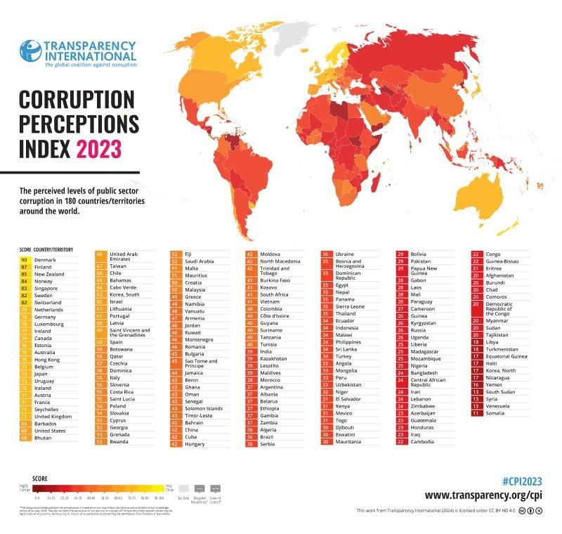

## Table of Contents

## What is the Corruption Perceptions Index (CPI)?

The Corruption Perceptions Index (CPI) is a tool that measures how corrupt people think a country's government is. It is made by Transparency International, a group that fights corruption around the world. The CPI looks at data from different places like surveys and expert opinions to give each country a score from 0 to 100. A score of 0 means the country is seen as very corrupt, and a score of 100 means it is seen as very clean.

The CPI is important because it helps people understand how much corruption might be happening in different countries. It can show where corruption is a big problem and where it is not as bad. This information can be used by governments, businesses, and other groups to make better decisions and fight corruption more effectively. The CPI is released every year, so people can see if a country is getting better or worse at dealing with corruption over time.

## Who publishes the Corruption Perceptions Index?

The Corruption Perceptions Index is published by Transparency International. This is a group that works to stop corruption all over the world. They have been putting out the CPI every year since 1995.

Transparency International uses information from different sources to make the CPI. They look at surveys and what experts think about corruption in each country. This helps them give each country a score from 0 to 100. A higher score means a country is seen as less corrupt.

## How often is the Corruption Perceptions Index updated?

The Corruption Perceptions Index is updated every year. This means that people can see new scores for each country once a year. The yearly update helps everyone see if a country is getting better or worse at dealing with corruption.

Transparency International, the group that makes the CPI, releases the new scores usually in the beginning of the year. They use the latest information from surveys and expert opinions to make sure the scores are up-to-date. This way, the CPI stays a good tool for understanding corruption around the world.

## What sources of data are used to compile the CPI?

The Corruption Perceptions Index uses different sources of data to find out how corrupt people think a country's government is. These sources include surveys and what experts think about corruption. The surveys are done by groups like the World Bank and the World Economic Forum. These groups ask people in businesses and other places about their experiences with corruption. The experts are people who know a lot about corruption in different countries. They give their opinions on how bad corruption is in each country.

Transparency International, the group that makes the CPI, looks at all this information carefully. They make sure the data is good and fair before using it to give each country a score. This score is from 0 to 100, where 0 means a country is seen as very corrupt and 100 means it is seen as very clean. By using many different sources, the CPI can show a clear picture of corruption around the world.

## How are countries ranked in the Corruption Perceptions Index?

Countries are ranked in the Corruption Perceptions Index by their scores, which go from 0 to 100. A score of 0 means a country is seen as very corrupt, and a score of 100 means it is seen as very clean. Transparency International, the group that makes the CPI, uses data from different sources like surveys and expert opinions to give each country its score. They look at information from places like the World Bank and the World Economic Forum to make sure the scores are fair and accurate.

After all the scores are calculated, Transparency International puts the countries in order from the highest score to the lowest score. This ranking shows which countries are seen as having the least corruption at the top, and which ones are seen as having the most corruption at the bottom. The CPI is updated every year, so people can see if a country's ranking is getting better or worse over time.

## What does a higher score on the CPI indicate about a country?

A higher score on the Corruption Perceptions Index means that a country is seen as less corrupt. The score goes from 0 to 100, so a country with a score close to 100 is thought to have very little corruption. This is based on what people in surveys and experts think about the country's government.

When a country gets a high score on the CPI, it shows that the government is doing a good job at fighting corruption. People trust the government more and think it is fair. This can help the country attract more business and make it a better place to live.

## Can you explain the methodology behind the CPI?

The Corruption Perceptions Index (CPI) is made by looking at many different sources of information. Transparency International, the group that makes the CPI, uses surveys and expert opinions to understand how corrupt people think a country's government is. They get data from places like the World Bank and the World Economic Forum. These sources ask people in businesses and other places about their experiences with corruption. Experts who know a lot about corruption in different countries also give their opinions. Transparency International checks all this information carefully to make sure it is fair and accurate before using it to give each country a score.

After collecting and checking all the data, Transparency International gives each country a score from 0 to 100. A score of 0 means a country is seen as very corrupt, and a score of 100 means it is seen as very clean. The scores are then used to rank the countries, with the highest scores at the top and the lowest scores at the bottom. This ranking shows which countries are seen as having the least corruption and which ones are seen as having the most corruption. The CPI is updated every year, so people can see if a country's score is getting better or worse over time.

## How has the CPI been criticized and what are the counterarguments?

Some people say the Corruption Perceptions Index (CPI) is not perfect. They think it only shows what people think about corruption, not the real corruption happening. They also say it can be hard to compare countries because the surveys and experts used might be different in each place. Some critics think the CPI does not help fix corruption because it just tells us what we already know. They want more action instead of just scores.

But, Transparency International, the group that makes the CPI, says it is still a good tool. They explain that knowing what people think about corruption is important because it can show where problems might be. They also say they try to make the CPI fair by using many different sources and checking the data carefully. Transparency International believes the CPI can help start conversations and push for changes to fight corruption better.

## What trends have been observed in global corruption levels according to the CPI?

Over the years, the Corruption Perceptions Index has shown that corruption is still a big problem in many parts of the world. Some countries have been getting better at fighting corruption, but many others are not making much progress. For example, countries in Western Europe and some in Asia usually have high scores, which means people think they are less corrupt. But in places like Sub-Saharan Africa and some parts of Latin America, the scores are often lower, showing more corruption.

The CPI also shows that corruption can change over time. Some countries have improved their scores a lot, which means they are doing better at fighting corruption. Other countries have seen their scores go down, which means corruption might be getting worse. Overall, the CPI helps us see that fighting corruption is hard and needs a lot of work, but it is possible for countries to make changes and get better scores.

## How do regional differences affect CPI scores?

Regional differences can have a big impact on CPI scores. In places like Western Europe and some parts of Asia, countries often get high scores, which means people think they are less corrupt. These areas usually have strong laws and good government systems that help fight corruption. On the other hand, in regions like Sub-Saharan Africa and parts of Latin America, the scores are often lower. This shows that corruption might be more of a problem there. These regions might face challenges like weak laws, poor government systems, and less money to fight corruption.

These differences can also change over time. Some countries in regions with lower scores are working hard to improve and are seeing their scores go up. For example, some countries in Eastern Europe have been making progress in fighting corruption. But in other places, scores might stay the same or even go down, showing that corruption is still a big issue. Overall, the CPI helps us see how different parts of the world are doing in their fight against corruption and where more work is needed.

## What impact does the CPI have on a country's international relations and economic policies?

The Corruption Perceptions Index (CPI) can affect a country's international relations because other countries and international groups look at the CPI scores. If a country has a high score, it means people think it is less corrupt. This can make other countries and businesses trust the country more. They might want to work with the country, invest money there, or help it in other ways. But if a country has a low score, it might be seen as very corrupt. This can make other countries and businesses not want to work with it or invest there. They might be worried about losing money or getting into trouble because of corruption.

The CPI can also influence a country's economic policies. When a country has a high CPI score, it shows that the government is doing a good job at fighting corruption. This can make people and businesses feel safer about investing and doing business in the country. The government might then make policies to keep fighting corruption and attract more investment. But if a country has a low CPI score, it might need to change its economic policies to fight corruption better. The government could make new laws or change how it works to improve its score. This can help the country's economy grow and attract more business in the future.

## How can the CPI be used as a tool for anti-corruption policy development?

The Corruption Perceptions Index (CPI) can be a helpful tool for making anti-corruption policies. It shows how people see corruption in different countries. When a country sees its CPI score, it can learn where it needs to improve. For example, if a country has a low score, it might need to make new laws or change how the government works to fight corruption better. The CPI can help leaders and lawmakers see what is working and what is not, so they can make better plans to stop corruption.

Governments can also use the CPI to see how they are doing compared to other countries. If a country's score is going up, it means its anti-corruption efforts are working. But if the score is going down, it might need to try something different. By looking at the CPI every year, a country can keep track of its progress and make changes to its policies to keep fighting corruption. This way, the CPI helps make sure that anti-corruption plans are always getting better.

## References & Further Reading

[1]: Transparency International. (2023). ["Corruption Perceptions Index 2023."](https://www.transparency.org/en/cpi/2023)

[2]: OECD. (2021). ["OECD Anti-Corruption and Integrity Hub."](https://www.oecd.org/en/topics/anti-corruption-and-integrity.html)

[3]: Rose-Ackerman, S. (1999). ["Corruption and Government: Causes, Consequences, and Reform."](https://www.cambridge.org/core/books/corruption-and-government/94925B501D79FA0357060F5489DE2F1F) Cambridge University Press.

[4]: Jain, A. K. (Ed.). (2001). ["The Political Economy of Corruption."](https://www.taylorfrancis.com/books/edit/10.4324/9780203468388/political-economy-corruption-arvind-jain) Routledge.

[5]: World Bank. (2020). ["Enhancing Government Effectiveness and Transparency: The Fight Against Corruption."](https://www.worldbank.org/en/topic/governance/publication/enhancing-government-effectiveness-and-transparency-the-fight-against-corruption) 

[6]: United Nations Office on Drugs and Crime. (2004). ["The Global Programme against Corruption: UN Anti-Corruption Toolkit."](https://www.unodc.org/documents/corruption/Toolkit_ed2.pdf) 

[7]: ["Economic Analysis of Corruption: A Survey"](https://academic.oup.com/ej/article-abstract/113/491/F632/5086277) by Susan Rose-Ackerman and Bonnie J. Palifka, Annual Review of Economics, 2019.