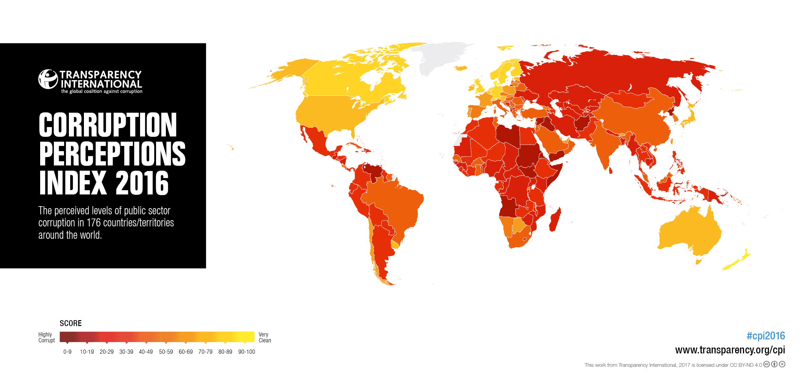

The Corruption Perceptions Index (CPI) is an essential tool for assessing the perceived levels of public sector corruption in countries worldwide. Developed and released annually by Transparency International, the CPI provides a comparative snapshot of corruption by ranking countries on a scale from 0, indicating a high prevalence of corruption, to 100, suggesting a very clean public sector environment. This tool draws on various data sources and assessments to give a robust measurement of corruption perceptions, informing policymakers, researchers, and civil society.

Corruption remains a highly pervasive issue across the globe, severely affecting economic growth, undermining public trust, and creating barriers to sustainable development. It distorts market operations, diminishes the effectiveness of governmental institutions, and erodes the social fabric by privileging the few who can afford to bypass the rules at the expense of the majority. Consequently, understanding corruption through comprehensive tools like the CPI is crucial for formulating strategies to combat its adverse effects.

This article aims to explore the latest CPI rankings to shed light on global corruption perceptions as of 2023. We will analyze how corruption influences economic performance and discuss whether algorithmic trading has a role in mitigating or exacerbating corrupt practices. These insights are fundamental for understanding the multifaceted impact of corruption and the challenges in promoting transparency. Additionally, we will examine case studies from various countries, highlighting both success stories and ongoing struggles to present a nuanced perspective on the efforts to combat corruption at different levels. This comprehensive overview seeks to equip stakeholders with a deeper understanding of the global corruption landscape and ways to address it effectively.

## Table of Contents

## Understanding the Corruption Perceptions Index (CPI)

The Corruption Perceptions Index (CPI) was established by Transparency International in 1995 to combat bribery, fraud, and public sector corruption. As a crucial barometer of perceived corruption, the CPI assesses countries and territories worldwide, ranking them based on perceived levels of corruption within their public sectors. This ranking is informed by data compiled from a diverse array of credible sources, including the World Bank, the World Economic Forum, and other reputable organizations that track governance and economic integrity.

To construct the CPI, Transparency International adopts a meticulous methodology that involves standardizing and synthesizing data from these sources. This process involves transforming qualitative assessments into a quantitative score that ranges from 0 to 100. Here, a score of 0 reflects a highly corrupt perception, while a score of 100 denotes a perception of being very clean. The CPI does not measure actual corruption levels, which are inherently difficult to quantify, but rather the perception of corruption as determined by experts and business communities.

A key aspect of the CPI's methodology is the statistical rescaling and amalgamation of data. This involves converting the data from each source into a scale that aligns with the CPI's 0-100 range, often employing statistical techniques such as z-score normalization or min-max scaling. Countries that score towards the higher end of the scale are perceived to exhibit lower levels of corruption, signifying stronger governance and transparency. Conversely, those with lower scores are viewed as struggling significantly with corruption.

The evolution of a country's CPI score over time offers valuable insights into its governance and transparency trajectory. An upward trend in a CPI score suggests improvements in public sector integrity and anti-corruption efforts. In contrast, declining scores may indicate increasing challenges in managing corruption. Tracking these changes is vital for policymakers and international bodies aiming to foster accountability and transparency.

Thus, the CPI serves as an instrumental tool in monitoring and addressing public sector corruption globally, guiding strategic reforms and international cooperation to enhance integrity and trust in governmental and institutional frameworks.

## Global CPI Rankings and Insights

The Corruption Perceptions Index (CPI) 2023 presents a comprehensive evaluation of corruption levels across various countries. Leading the rankings as the least corrupt nations are Denmark, Finland, and New Zealand. These countries consistently perform well on governance, transparency, and public sector integrity indicators. On the other hand, nations like Somalia, South Sudan, and Syria are positioned at the lower end of the CPI, indicating severe corruption challenges that impact their political and economic stability.

The 2023 index reveals a concerning trend: over two-thirds of assessed countries score below 50, suggesting that corruption remains a widespread problem globally. This pervasive issue underscores the need for robust anti-corruption measures and reforms in both government institutions and private sectors.

A regional analysis of the CPI 2023 indicates significant disparities in perceived corruption levels. Western Europe and the European Union, characterized by strong legal frameworks and accountability mechanisms, score the highest in terms of transparency and low corruption perceptions. In contrast, Sub-Saharan Africa records the lowest scores, reflecting systemic governance challenges and instances of high-profile corruption cases that undermine public trust.

These rankings offer vital insights for policymakers and organizations aiming to combat corruption effectively. By identifying regions and countries with substantial corruption issues, targeted reform efforts can be directed towards improving governance standards, fostering transparency, and enhancing institutional accountability. This strategic targeting not only aids in reducing corruption but also promotes sustainable development and economic stability in affected regions. Furthermore, these insights facilitate international cooperation and support in areas needing urgent intervention to address corruption and its associated impacts.

## Economic Impact of Corruption

Corruption has a profound and detrimental effect on economic growth and development. At the core of its impact is the inefficient allocation of resources. Resources are diverted away from their most productive use towards activities that are favored due to corrupt practices, such as bribery and nepotism. This misallocation leads to suboptimal economic outcomes, stifling innovation and productivity. 

Foreign investment, a crucial driver of economic growth, is also significantly hampered by corruption. Investors are wary of environments where their investments are vulnerable to corrupt practices, which can lead to increased operational costs and risks. This wariness is particularly prevalent in countries with low scores on the Corruption Perceptions Index (CPI). These countries often face hesitation from international investors, resulting in slowed GDP growth and higher costs of doing business due to the need for additional legal safeguards and compliance measures.

Public institutions, which are vital for providing services and maintaining economic stability, are weakened by corruption. When officials engage in corrupt practices, funds meant for public services like education, healthcare, and infrastructure are siphoned off for personal gain. This leads to a degradation of services, which disproportionately affects the economically disadvantaged. The poor, who are most reliant on public services, suffer the most as they are unable to afford bribes, further entrenching poverty and income inequality.

Tackling corruption can be transformative for economic development. By fostering a business environment that is transparent and equitable, corruption can be reduced, which in turn encourages economic growth. Effective anti-corruption measures increase investor confidence, leading to more foreign investment and higher economic growth rates. Furthermore, strengthening public institutions restores public trust and ensures that resources are used efficiently, benefiting the entire population, particularly the vulnerable groups who depend on public services.

In summary, addressing corruption is imperative for economic progress. It requires robust policy frameworks, institutional reforms, and international cooperation to create a transparent and accountable environment conducive to growth and equitable development.

## Algorithmic Trading and Corruption

Algorithmic trading employs sophisticated computer algorithms to execute trading strategies at speeds and frequencies impossible for human traders. This technological advancement plays a pivotal role in enhancing the efficiency and transparency of financial markets. However, it also presents significant challenges in terms of potential corrupt practices and market manipulation.

One of the primary benefits of [algorithmic trading](/wiki/algorithmic-trading) is its ability to process vast amounts of data in real-time, allowing for more informed trading decisions. This can lead to increased [liquidity](/wiki/liquidity-risk-premium) and reduced spreads in the market, theoretically resulting in more accurate asset pricing. Despite these advantages, the automated nature of algorithmic trading systems can also mask unethical practices. For example, some traders might use high-frequency trading algorithms to engage in activities like front-running, where they use advance knowledge of large buy or sell orders to profit illicitly.

Front-running and spoofing are among the several strategies that can potentially exploit the automated frameworks of algorithmic trading. Spoofing involves placing orders to manipulate market prices with no intention of executing them. Such tactics can create an artificial impression of market interest, misleading other market participants. Identifying and mitigating these practices becomes an arduous task for regulatory bodies, necessitating innovative approaches and robust technological solutions.

Regulatory authorities globally recognize the challenges algorithmic trading poses to market integrity. Organizations such as the U.S. Securities and Exchange Commission (SEC) and the European Securities and Markets Authority (ESMA) have implemented rules to curb manipulative trading practices. However, the rapid evolution and complexity of trading algorithms often outpace the regulatory frameworks, creating enforcement gaps. There is a need for continuous research and development of regulatory technology (RegTech) tools capable of providing comprehensive market oversight.

A further complication in regulating algorithmic trading stems from the lack of transparency in algorithmic strategies. Since proprietary systems drive these strategies, financial institutions are often reluctant to disclose specific details. This opacity hinders regulatory efforts to ensure fair trading practices, emphasizing the need for balanced regulations that protect market integrity while encouraging financial innovation.

To combat corruption linked to algorithmic trading, regulators must leverage technology, deploying [artificial intelligence](/wiki/ai-artificial-intelligence) and [machine learning](/wiki/machine-learning) tools for anomaly detection and risk assessment. These technological solutions can monitor trading activities in real-time, flagging suspicious patterns that may indicate manipulative behavior.

In conclusion, algorithmic trading holds the potential to enhance market functionality significantly, yet it also poses risks of market manipulation and corruption. The challenge for regulators is to keep pace with technological advancements and ensure that the financial markets remain fair and transparent for all participants. This requires a coordinated approach involving regulatory updates, advanced technological tools, and collaboration with industry stakeholders to develop effective oversight mechanisms.

## Case Studies and Examples

### Case Studies and Examples

This section focuses on specific examples of countries and sectors that have tackled corruption with varying degrees of success. By examining these cases, we gain insights into both effective strategies and persistent challenges.

#### Denmark and Singapore: Best Practices

Denmark consistently ranks as one of the least corrupt countries globally. Its success is attributed to a robust legal framework, strong institutions, and a culture that values transparency. Denmark's government emphasizes open access to information and maintains rigorous checks and balances that deter corrupt practices. Whistleblower protections and stringent compliance laws further contribute to the country’s clean public sector [1].

Singapore provides another exemplary model characterized by a zero-tolerance policy towards corruption. The Corrupt Practices Investigation Bureau (CPIB), operating directly under the Prime Minister’s Office, is dedicated solely to investigating corruption-related offenses. Singapore’s merit-based civil service and comprehensive e-governance initiatives minimize opportunities for corrupt interactions by reducing face-to-face bureaucracy. Both Denmark and Singapore demonstrate how institutional integrity and technology integration can effectively combat public sector corruption [2].

#### Challenges in Venezuela and Somalia

Conversely, Venezuela and Somalia represent cases where corruption remains deeply entrenched, hampering economic and social progress. Venezuela, plagued by political instability and economic mismanagement, has seen rampant corruption at all levels of government. The nationalization of industries has concentrated power, creating ample opportunity for graft. International sanctions and reduced oil revenues have only exacerbated the economic situation, making reform efforts challenging [3].

Somalia faces a similar plight where years of conflict and weak governance structures have made it conducive for corruption to thrive. Lack of a centralized, functioning government results in misuse of public funds and aid resources. Efforts by international organizations, such as the United Nations, aim to stabilize governance through capacity-building programs and anti-corruption frameworks. However, these endeavors require enduring political will and societal support to succeed [4].

#### Financial Technology (FinTech) and Corruption

Financial technology (FinTech) presents both opportunities and threats in the fight against corruption. On one hand, blockchain technologies can enhance transparency in transactions, making it easier to track financial flows and reduce the scope for illicit activities. Digital payments increase accountability by minimizing cash transactions, which are harder to monitor [5]. 

However, FinTech can also facilitate corruption if not regulated properly. The anonymity associated with cryptocurrencies can be exploited for money laundering and other illegal transactions. Effective regulation and international collaboration are crucial to ensure that technological advancements support transparency rather than concealment of corrupt practices.

#### Successes and Failures

The case studies underscore that while significant strides are being made in some regions, entrenched corruption presents daunting challenges elsewhere. The success stories of Denmark and Singapore emphasize the importance of strong institutions, culture of integrity, and modernity in governance. Conversely, the struggles in Venezuela and Somalia highlight how political instability and weak institutions can perpetuate corrupt environments despite external assistance.

The role of FinTech illustrates the dual nature of technological advancements: potential benefits are significant, but so are the risks if not managed well. These case studies collectively stress that a multifaceted, locally tailored, and internationally supported approach is necessary to effectively combat corruption across different contexts.

---

**References:**

1. Transparency International. (2023). Corruption Perceptions Index 2023.
2. Corrupt Practices Investigation Bureau (CPIB), Singapore.
3. U.S. Institute of Peace. Venezuela Working Paper: Assessing Corruption Scenarios.
4. United Nations Development Programme (UNDP) in Somalia.
5. Financial Action Task Force (FATF) Reports on Cryptocurrencies.

## Conclusion

The Corruption Perceptions Index (CPI) serves as a critical instrument in identifying global corruption patterns and promoting accountability. It highlights the ongoing challenges countries face and the disparities between nations in their fight against corruption. Addressing corruption requires a comprehensive strategy that involves collaboration across governments, businesses, and civil society. Strengthening institutional frameworks and promoting transparency are crucial. Additionally, regulating financial innovations such as algorithmic trading can reduce opportunities for corruption by ensuring market integrity and protecting against manipulation.

Global cooperation remains essential, as corruption knows no borders and often necessitates concerted international efforts to address effectively. While some nations have achieved considerable progress, the global community must continue to prioritize anti-corruption measures to close the gaps where corruption persists. 

Persistent awareness and thorough research are vital in understanding the evolving nature of corruption and in developing robust strategies to combat it. International support and partnerships are fundamental to this endeavor, ensuring that reforms are sustainable and impactful. Through combined efforts, the international community can strive to overcome corruption's challenges and work towards a more transparent and equitable world.

## References & Further Reading

[1]: Transparency International. (2023). ["Corruption Perceptions Index 2023."](https://www.transparency.org/en/cpi/2023)

[2]: OECD. (2021). ["OECD Anti-Corruption and Integrity Hub."](https://www.oecd.org/en/topics/anti-corruption-and-integrity.html)

[3]: Rose-Ackerman, S. (1999). ["Corruption and Government: Causes, Consequences, and Reform."](https://www.cambridge.org/core/books/corruption-and-government/94925B501D79FA0357060F5489DE2F1F) Cambridge University Press.

[4]: Jain, A. K. (Ed.). (2001). ["The Political Economy of Corruption."](https://www.taylorfrancis.com/books/edit/10.4324/9780203468388/political-economy-corruption-arvind-jain) Routledge.

[5]: World Bank. (2020). ["Enhancing Government Effectiveness and Transparency: The Fight Against Corruption."](https://www.worldbank.org/en/topic/governance/publication/enhancing-government-effectiveness-and-transparency-the-fight-against-corruption) 

[6]: United Nations Office on Drugs and Crime. (2004). ["The Global Programme against Corruption: UN Anti-Corruption Toolkit."](https://www.unodc.org/documents/corruption/Toolkit_ed2.pdf) 

[7]: ["Economic Analysis of Corruption: A Survey"](https://academic.oup.com/ej/article-abstract/113/491/F632/5086277) by Susan Rose-Ackerman and Bonnie J. Palifka, Annual Review of Economics, 2019.