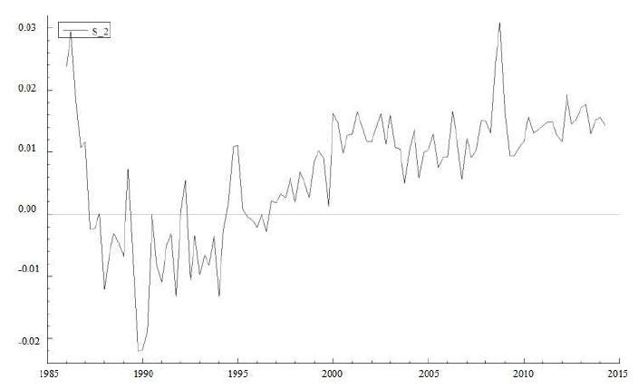

## Table of Contents

## What is the Corwin-Schultz algorithm?

The Corwin-Schultz algorithm is a method used to estimate the bid-ask spread of a stock using only the stock's high and low prices over a period of time. It was developed by Shane A. Corwin and Paul Schultz and is particularly useful for researchers and analysts who do not have direct access to detailed trading data. The algorithm works by analyzing the difference between the high and low prices of a stock over two consecutive days, which helps to infer the spread that traders are willing to accept.

The basic idea behind the algorithm is that the high price of a stock on a given day is likely to be influenced by the ask price, while the low price is influenced by the bid price. By comparing these prices over two days, the algorithm can estimate the average spread. This method is especially valuable for studying less liquid markets or historical data where detailed trade information might not be available. Overall, the Corwin-Schultz algorithm provides a practical tool for understanding market dynamics and liquidity without needing extensive data sets.

## Who developed the Corwin-Schultz algorithm and when?

Shane A. Corwin and Paul Schultz developed the Corwin-Schultz algorithm. They are researchers who wanted to find a way to estimate the bid-ask spread of a stock without needing a lot of detailed trading data.

They published their method in a paper in 2012. Their algorithm uses the high and low prices of a stock over two days to figure out the spread. This is helpful for people studying markets where they can't easily get all the trading details.

## What problem does the Corwin-Schultz algorithm solve?

The Corwin-Schultz algorithm solves the problem of figuring out the bid-ask spread of a stock without needing a lot of detailed trading data. The bid-ask spread is the difference between the highest price someone is willing to pay for a stock (the bid) and the lowest price someone is willing to sell it for (the ask). This spread is important because it shows how easy or hard it is to buy or sell a stock. Knowing the spread helps people understand how much it might cost to trade a stock and how liquid the market is.

The algorithm uses just the high and low prices of a stock over two days to estimate this spread. This is really helpful for researchers and analysts who don't have access to all the detailed trading information. For example, if you're studying old stock data or markets where detailed trade information isn't available, the Corwin-Schultz algorithm lets you still get a good idea of the bid-ask spread. This makes it easier to study and understand market dynamics and [liquidity](/wiki/liquidity-risk-premium) without needing a lot of data.

## Can you explain the basic steps of the Corwin-Schultz algorithm?

The Corwin-Schultz algorithm helps figure out the bid-ask spread of a stock using just the high and low prices over two days. First, you look at the high and low prices of the stock for a single day. The high price is usually close to the ask price, which is what sellers want, and the low price is close to the bid price, which is what buyers want. By looking at these prices, you can start to see how big the spread might be.

Next, you compare the high and low prices over two days. The idea is that if the stock goes up and down a lot, it shows that there's a bigger difference between what buyers and sellers want. You use a special formula to turn these price differences into an estimate of the spread. This formula takes into account how much the stock's price changed over the two days to give you a good guess about the spread without needing all the detailed trading data.

## What are the key components or data structures used in the Corwin-Schultz algorithm?

The Corwin-Schultz algorithm uses the high and low prices of a stock over two days to figure out the bid-ask spread. The high price on any given day is usually close to what sellers want, called the ask price. The low price is usually close to what buyers want, called the bid price. By looking at these two prices, the algorithm can start to see how big the spread might be.

Next, the algorithm compares the high and low prices over two days. If the stock's price changes a lot, it shows that there's a bigger difference between what buyers and sellers want. The algorithm uses a special formula to turn these price differences into an estimate of the spread. This formula takes into account how much the stock's price changed over the two days to give a good guess about the spread without needing detailed trading data.

## How does the Corwin-Schultz algorithm compare to other similar algorithms in terms of efficiency?

The Corwin-Schultz algorithm is very efficient because it only needs the high and low prices of a stock over two days to figure out the bid-ask spread. This means you don't need a lot of detailed trading data, which makes it easier and faster to use, especially if you're studying markets where that detailed data isn't available. Other algorithms, like those that use trade-by-trade data or the Roll model, need more detailed information, which can be harder to get and take more time to process.

Compared to other methods, the Corwin-Schultz algorithm is simpler and quicker. For example, the Roll model uses the serial covariance of price changes to estimate the spread, but it needs a lot of trade data to work well. The Corwin-Schultz algorithm, on the other hand, can give you a good estimate with just a bit of price information. This makes it more efficient for quick analysis and for studying less liquid or historical markets where detailed data might not exist.

## What are the typical applications of the Corwin-Schultz algorithm?

The Corwin-Schultz algorithm is often used by researchers and analysts to study how easy or hard it is to buy and sell stocks in different markets. It's especially helpful when you don't have a lot of detailed trading information. For example, if you're looking at old stock data or markets that aren't very active, this algorithm lets you figure out the bid-ask spread without needing all the trade details. This makes it easier to understand how the market works and how much it might cost to trade.

Another common use is in academic research where people want to study how the bid-ask spread changes over time or in different situations. Since the Corwin-Schultz algorithm only needs the high and low prices of a stock over two days, it's quick and simple to use. This makes it a good tool for researchers who are looking at a lot of data or trying to understand market liquidity without getting bogged down in complex calculations.

## Can you provide a simple example of the Corwin-Schultz algorithm in action?

Imagine you want to know how easy it is to buy and sell a stock, but you only have the highest and lowest prices of the stock for two days. Let's say on Day 1, the stock's high price was $50 and the low price was $48. On Day 2, the high price was $52 and the low price was $49. The Corwin-Schultz algorithm uses these numbers to figure out the bid-ask spread, which is the difference between what buyers are willing to pay and what sellers want.

The algorithm looks at how much the stock's price changed over these two days. It uses a special formula to turn these price changes into an estimate of the spread. In this example, the algorithm might calculate that the bid-ask spread is around $1. This means that if you want to buy the stock, you might have to pay about $1 more than what someone is willing to sell it for. This simple calculation helps you understand the cost of trading the stock without needing a lot of detailed data.

## What are the limitations or potential drawbacks of using the Corwin-Schultz algorithm?

The Corwin-Schultz algorithm is a helpful tool, but it does have some limitations. One main issue is that it relies only on the high and low prices of a stock over two days. This means it might not capture all the details of the market's activity. For example, if there are big trades or unusual events happening, the algorithm might not see them because it's just looking at the highest and lowest prices. This can make the estimate of the bid-ask spread less accurate in some situations.

Another drawback is that the Corwin-Schultz algorithm might not work well for all types of markets. It's best for markets where stocks don't change price too often or too much. If the stock price is very volatile or if the market is very active, the algorithm's simple method might not give a good estimate of the spread. Researchers need to be careful when using this algorithm and make sure it fits the market they're studying.

## How can the performance of the Corwin-Schultz algorithm be optimized?

To make the Corwin-Schultz algorithm work better, you can use it with other methods to check its results. For example, if you have some detailed trading data, you can compare the spread you get from the Corwin-Schultz algorithm with what you see in the detailed data. This helps you see if the algorithm is giving you a good guess or if you need to adjust how you use it. Also, if you know more about the market you're studying, like how often the stock price changes or if there are special events happening, you can use that information to make the algorithm's estimate more accurate.

Another way to improve the Corwin-Schultz algorithm is to use it over longer periods of time. Instead of just looking at two days, you could look at a week or a month. This gives you more data to work with, which can make your estimate of the bid-ask spread more reliable. By looking at more days, you can see how the spread changes over time and get a better idea of what's normal for that stock. This can help you understand the market better and make smarter decisions about buying and selling stocks.

## Are there any known variations or improvements to the original Corwin-Schultz algorithm?

Since the Corwin-Schultz algorithm was first made, people have thought of ways to make it better or change it a bit. One way is to use more than just two days of data. By looking at a whole week or even a month of high and low prices, you can get a better idea of the bid-ask spread. This longer look helps smooth out any weird days and gives a more reliable guess about the spread. Another change is to mix the Corwin-Schultz algorithm with other methods that use more detailed trading data. This can help check if the simple guess from the Corwin-Schultz algorithm is close to the real spread or if it needs to be adjusted.

Another idea is to use the Corwin-Schultz algorithm for different kinds of markets, not just stocks. For example, it could be used to figure out the spread in markets for things like bonds or commodities. This would mean changing the formula a bit to fit the way these other markets work. Also, some researchers have tried to make the algorithm smarter by adding in extra information, like how often the price changes or if there are big events happening in the market. By thinking about these things, the algorithm can give a better estimate of the spread, making it more useful for people studying different markets.

## What advanced techniques can be used to implement the Corwin-Schultz algorithm in a distributed computing environment?

To use the Corwin-Schultz algorithm in a distributed computing environment, you can split the work across many computers. This means each computer can look at different parts of the data, like the high and low prices of different stocks or different days. By doing this, you can process a lot of data much faster than if you used just one computer. You can also use special software that helps these computers talk to each other and share their results. This way, you can quickly put together all the pieces to figure out the bid-ask spread for many stocks at the same time.

Another way to make the Corwin-Schultz algorithm work better in a distributed setup is to use smart ways to handle the data. For example, you can use a technique called "data sharding," where you break the data into smaller pieces and send each piece to a different computer. This helps spread out the work evenly so no single computer gets too busy. Also, you can use "parallel processing" to make the computers work on different parts of the calculation at the same time. This can make the whole process much quicker and more efficient, especially when you're dealing with a lot of data from different markets or over long periods of time.

## What is the Corwin-Schultz Algorithm and how is it a simple yet effective estimator?

The Corwin-Schultz algorithm offers a streamlined approach to estimating bid-ask spreads by utilizing daily high and low prices over consecutive days. It operates on the foundational premise that these price extremes contain essential information about the underlying spread. This approach circumvents the need for exhaustive tick-by-tick data, which is often costly and challenging to obtain, especially for traders dealing with historical data.

The algorithm is designed under the assumption that asset prices follow a geometric Brownian motion. This widely used model in financial mathematics depicts price movements as continuous paths influenced by stochastic processes. The use of geometric Brownian motion enables the modeling of price variances over a period, capturing the natural log price changes that occur due to market [volatility](/wiki/volatility-trading-strategies) and participant actions.

To implement the Corwin-Schultz estimator, traders apply it to two consecutive days of high and low prices. The mathematical formulation ultimately derives from the variance that these daily highs and lows exhibit. Specifically, the algorithm examines the relationship between consecutive days' high-low price variations to yield an approximate estimate of the bid-ask spread:

Given the high ($H_t$) and low ($L_t$) prices on consecutive days $t$ and $t+1$, the estimator can be constructed as follows:

$$
S = \frac{2(e^X - 1)}{1 + e^X}
$$

Where $X$ is related to the observed ratio of high to low prices across two days:

$$
X = \frac{1}{2} \ln \frac{H_t \cdot H_{t+1}}{L_t \cdot L_{t+1}}
$$

This formula indicates the spread as a function of the ratio of geometric means of high and low prices across the two days. By focusing on easily accessible daily price extremes, the Corwin-Schultz algorithm provides an efficient, effective method for traders to estimate transaction costs accurately, facilitating more informed trading decisions and improving the strategic handling of liquidity.

## How is the Corwin-Schultz Estimator derived?

The Corwin-Schultz estimator is founded on the observation that the high and low prices of a security over two consecutive trading days can provide significant insights into the bid-ask spread. This method postulates that understanding the price movements between the highs and lows over these days can enable an approximation of the underlying spread.

A core assumption of the model is that security prices follow a geometric Brownian motion. This assumption simplifies the price dynamics by implying that returns are normally distributed and anticipates that price variations over time can be modeled by stochastic processes. The estimator specifically uses log-prices of daily highs and lows to construct a formula that reflects the spread's breadth.

To mathematically derive the Corwin-Schultz estimator, one begins with the daily high ($H_t$) and low ($L_t$) prices, and calculates two critical metrics:

1. **Price Range**: This is defined by the logarithm of the ratio of the high to low price of each day:
$$
   R_t = \log\left(\frac{H_t}{L_t}\right)

$$

2. **Daily Variance Estimator**: For two consecutive days, the variance estimator ($V_t$) synthesizes these ranges. By considering day $t$ and day $t+1$, the estimator combines these ranges to approximate the bid-ask spread:
$$
   V_t = R_t + R_{t+1}

$$

From these principles, a more comprehensive spread formula is constructed. The Corwin-Schultz spread estimator takes into account the covariance across days, which is involved in adjusting the variance by an empirically determined [factor](/wiki/factor-investing). This is largely explained in their original work, where the authors incorporate further computations to handle the variances and covariances:

$$
S = \sqrt{\frac{2V_t - V_{t+1}}{4 - 2\rho}}
$$

where $\rho$ denotes the empirical correlation between adjacent-day price changes, modified by updates in the variance estimations.

Understanding the estimator's mechanics requires acknowledging that it hinges on the assumption of consistent time scaling with daily data, which inherently limits the estimator when confronted with high-frequency price data. Overall, while the Corwin-Schultz estimator provides an accessible method for estimating spreads, its precision can vary based on data frequency and underlying market conditions.

## References & Further Reading

[1]: Corwin, S. A., & Schultz, P. H. (2012). ["A Simple Way to Estimate Bid-Ask Spreads from Daily High and Low Prices."](https://www.jstor.org/stable/41419709) SSRN Electronic Journal.

[2]: Avellaneda, M., & Stoikov, S. (2008). ["High-frequency trading in a limit order book."](https://math.nyu.edu/~avellane/HighFrequencyTrading.pdf) Quantitative Finance, 8(3), 217-224.

[3]: Almgren, R., & Chriss, N. (2000). ["Optimal execution of portfolio transactions."](https://smallake.kr/wp-content/uploads/2016/03/optliq.pdf) Journal of Risk, 3, 5-39.

[4]: Lopez de Prado, M. (2018). ["Advances in Financial Machine Learning."](https://www.amazon.com/Advances-Financial-Machine-Learning-Marcos/dp/1119482089) Wiley.

[5]: Chan, E. P. (2008). ["Quantitative Trading: How to Build Your Own Algorithmic Trading Business."](https://github.com/ftvision/quant_trading_echan_book) Wiley.

[6]: Jansen, S. (2018). ["Machine Learning for Algorithmic Trading."](https://github.com/stefan-jansen/machine-learning-for-trading) Packt Publishing.