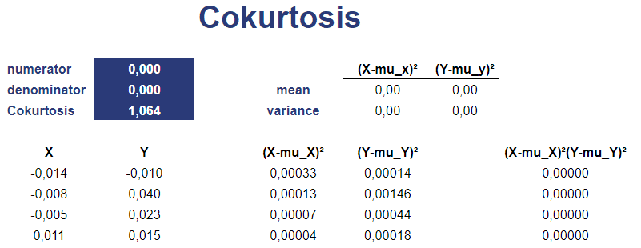

## Table of Contents

## What is coskewness in finance?

Coskewness in finance is a measure that looks at how the returns of an asset move with the returns of the overall market, but it goes beyond just looking at the ups and downs. Instead of focusing only on how much an asset's returns go up or down with the market (which is what covariance measures), coskewness looks at how an asset's returns move with the market's extreme ups and downs. In other words, it tells us how an asset behaves during times when the market has big swings, either very high or very low returns.

This measure is important for investors because it helps them understand how an asset might affect the risk of their whole portfolio, especially during times when the market is very volatile. If an asset has a high coskewness, it means it tends to have big returns when the market has big returns, and vice versa. This can be good or bad depending on what an investor is looking for. For example, an investor might want to avoid assets with high positive coskewness if they are trying to reduce the risk of big losses during market downturns.

## How does coskewness differ from skewness?

Skewness tells us about the shape of the returns of just one asset. It looks at whether the returns are spread out more on the high side or the low side. If an asset has positive skewness, it means there are more big wins than big losses. If it has negative skewness, it means there are more big losses than big wins. Skewness helps investors understand if an asset might have more chance of big gains or big losses.

Coskewness, on the other hand, looks at how an asset's returns move with the market's returns, especially during big market swings. It's not just about the asset by itself, but how it behaves compared to the market. If an asset has high coskewness, it means it tends to have big returns when the market has big returns, and big losses when the market has big losses. This can help investors see how an asset might affect their whole portfolio during times when the market is very up or down.

## Why is coskewness important in portfolio management?

Coskewness is important in portfolio management because it helps investors understand how an asset behaves during big market swings. When the market goes through big ups and downs, coskewness shows if an asset tends to have big gains or big losses at the same time. This information is really useful because it helps investors decide if an asset will make their whole portfolio more or less risky during these times.

For example, if an investor wants to avoid big losses during market downturns, they might look for assets with low or negative coskewness. These assets don't tend to drop as much when the market drops a lot. On the other hand, if an investor is okay with taking more risk for the chance of bigger gains, they might choose assets with high positive coskewness. By understanding coskewness, investors can build a portfolio that matches their risk and reward goals better.

## How is coskewness calculated?

Coskewness is calculated by looking at how the returns of an asset move with the returns of the market, especially during big swings. To start, you need data on the returns of the asset and the returns of the market over the same time periods. You then find the average return of the market and subtract this average from each market return to get what's called the "market excess return." You do the same thing with the asset's returns to get the "asset excess return." Next, you multiply the asset's excess return by the market's excess return squared. You do this for all the time periods you have data for, and then you take the average of these products. This average is the coskewness.

The formula for coskewness can be written as the average of (R_a - E[R_a]) * (R_m - E[R_m])^2, where R_a is the return of the asset, E[R_a] is the expected return of the asset, R_m is the return of the market, and E[R_m] is the expected return of the market. In simpler terms, you're looking at how the asset's returns relate to the market's big ups and downs. A positive coskewness means the asset tends to have big returns when the market has big returns, and big losses when the market has big losses. A negative coskewness means the opposite.

## What are the limitations of using coskewness in financial analysis?

One big limitation of using coskewness in financial analysis is that it can be tricky to understand and use. Coskewness is all about how an asset moves with the market during big ups and downs. But figuring out what a high or low coskewness number means can be confusing. Also, coskewness depends a lot on the data you use. If you don't have enough data, or if the data is not good, your coskewness number might not be very accurate. This can make it hard to trust and use in real life.

Another limitation is that coskewness only looks at one part of risk. It tells you about how an asset behaves when the market has big swings, but it doesn't tell you about other kinds of risk. For example, it doesn't tell you about how an asset might behave during normal times, or how it might be affected by things like interest rates or economic news. Because of this, using coskewness by itself might not give you a full picture of an asset's risk. You need to use it along with other measures to really understand how risky an asset is.

## Can coskewness be used to predict stock returns?

Coskewness can give us some clues about how a stock might behave when the market has big ups and downs, but it's not a magic tool for predicting stock returns. If a stock has high coskewness, it means it tends to have big gains when the market has big gains, and big losses when the market has big losses. This can be useful for investors who want to know how a stock might affect their whole portfolio during wild market swings. But just knowing the coskewness doesn't tell us what the stock's returns will be in the future. There are so many other things that can affect stock prices, like company news, economic reports, and world events.

Because of all these other factors, using coskewness alone to predict stock returns can be tricky. It's one piece of the puzzle, but not the whole picture. Investors need to look at a lot of different things, like the company's financial health, the overall economy, and even what other people think about the stock. Coskewness can help investors understand some risks better, but it's just one tool among many that they need to use to make good guesses about future stock returns.

## How does coskewness relate to asset pricing models?

Coskewness is important in some asset pricing models because it helps explain how much risk an asset has, especially during big market swings. In the Capital Asset Pricing Model (CAPM), we usually just look at how an asset moves with the market, which is called beta. But coskewness goes a step further by showing how an asset behaves when the market has really big ups and downs. Some models, like the three-moment CAPM, include coskewness to give a more complete picture of risk. This can help investors understand if an asset might make their whole portfolio more or less risky during wild market times.

In these models, if an asset has high positive coskewness, it means it tends to have big gains when the market has big gains, and big losses when the market has big losses. This can make the asset seem riskier because it might lead to bigger losses during market downturns. On the other hand, an asset with low or negative coskewness might be seen as less risky because it doesn't swing as much with the market's big moves. By including coskewness in asset pricing models, investors can get a better idea of how different assets might affect their portfolio's risk and return, helping them make smarter investment choices.

## What is the role of coskewness in risk management?

Coskewness plays a big role in risk management because it helps investors understand how an asset behaves during big market swings. When the market goes through wild ups and downs, coskewness shows if an asset tends to have big gains or big losses at the same time. This information is really useful for investors who want to manage the risk of their whole portfolio. If an investor wants to avoid big losses during market downturns, they might look for assets with low or negative coskewness. These assets don't tend to drop as much when the market drops a lot, which can help keep the portfolio safer during tough times.

On the other hand, if an investor is okay with taking more risk for the chance of bigger gains, they might choose assets with high positive coskewness. These assets can make the portfolio more exciting but also more risky because they might lead to bigger losses during market downturns. By understanding coskewness, investors can make better choices about which assets to include in their portfolio to match their risk and reward goals. This helps them manage risk more effectively and build a portfolio that fits their comfort level with market swings.

## How do investors use coskewness to optimize their portfolios?

Investors use coskewness to optimize their portfolios by understanding how different assets behave during big market swings. If an investor wants to keep their portfolio safe during wild market times, they might choose assets with low or negative coskewness. These assets don't move as much with the market's big ups and downs, which can help protect the portfolio from big losses when the market drops a lot. By picking these kinds of assets, investors can build a portfolio that's less risky and more stable during tough times.

On the other hand, if an investor is okay with taking more risk for the chance of bigger gains, they might go for assets with high positive coskewness. These assets tend to have big gains when the market has big gains, and big losses when the market has big losses. Including these assets in a portfolio can make it more exciting but also more risky. By using coskewness, investors can balance their portfolio to match their comfort level with risk and their goals for returns, helping them make smarter choices about which assets to include.

## What are some real-world examples where coskewness has been effectively applied?

One real-world example where coskewness has been effectively applied is in the management of mutual funds. Fund managers often use coskewness to understand how the stocks in their portfolio will behave during big market swings. For example, a fund manager might want to reduce the risk of big losses during market downturns. By choosing stocks with low or negative coskewness, they can build a portfolio that's less likely to drop a lot when the market drops. This helps the fund perform better during tough times and keeps investors happier.

Another example is in the world of hedge funds. Hedge fund managers might use coskewness to find stocks that can give them big gains when the market is doing well. They might choose stocks with high positive coskewness because these stocks tend to have big wins when the market has big wins. This can help the hedge fund make more money during good times. But they have to be careful because these stocks can also lead to big losses during bad times. By understanding coskewness, hedge fund managers can make smarter choices about which stocks to buy and sell, helping them manage risk and aim for better returns.

## How does coskewness interact with other higher moments like cokurtosis?

Coskewness and cokurtosis are both ways to look at how an asset behaves with the market, but they focus on different things. Coskewness tells us about how an asset moves with the market during big ups and downs. It's like looking at how much an asset goes up or down when the market has really big swings. Cokurtosis goes even further. It looks at how an asset behaves during these big market swings, but it also looks at how often these big swings happen and how spread out they are. So, while coskewness is about the direction of the asset's moves with the market, cokurtosis is about the size and frequency of those moves.

Using both coskewness and cokurtosis together can give investors a fuller picture of an asset's risk. If an asset has high coskewness, it might have big gains or losses when the market has big swings. But if it also has high cokurtosis, it means these big swings happen a lot and are very spread out. This can make the asset even riskier because it's not just about the big moves, but also how often and how extreme they are. By looking at both measures, investors can better understand how an asset might affect their whole portfolio during wild market times and make smarter choices about managing risk.

## What advanced statistical methods are used to estimate coskewness accurately?

To estimate coskewness accurately, advanced statistical methods like time series analysis and robust regression techniques are often used. Time series analysis helps because it looks at how returns change over time. By using this method, we can see patterns in how an asset's returns move with the market's big swings. Robust regression techniques are also helpful because they can handle data that might have mistakes or be a bit off. These methods make sure that the coskewness we calculate is as close to the real thing as possible, even if the data isn't perfect.

Another method that can be used is bootstrapping. This technique involves taking lots of samples from the data we have and then calculating coskewness for each sample. By doing this many times, we can get a good idea of how accurate our coskewness estimate is. It's like checking our work over and over to make sure we're getting it right. Using these advanced methods, investors can get a better understanding of how an asset behaves during big market swings and make smarter choices about their portfolios.

## What is Coskewness?

Coskewness, a statistical concept primarily applied in finance, refers to the measure of how much the returns on one asset or portfolio co-move with the returns of another asset or portfolio in terms of their third central moment. Essentially, it captures the degree to which the tails of the distribution of two variables exhibit similar behavior. This measure extends beyond standard correlation and covariance by exploring the asymmetry of returns distribution, thus offering deeper insights into the joint distribution of asset returns.

In statistical terms, the coskewness between two random variables, X and Y, is defined as the expectation of the product of the centered random variables raised to the third power:

$$
\text{Coskewness}_{X,Y} = E[(X - \mu_X)(Y - \mu_Y)^2]
$$

where $\mu_X$ and $\mu_Y$ are the means of the variables X and Y, respectively. This formulation highlights the focus on the interaction between the quadratic deviation of one variable and the linear deviation of another.

To differentiate it from skewness and covariance, it's important to note that skewness assesses the asymmetry of the distribution of a single variable. Skewness is particularly concerned with the shape of the distribution and whether it has a longer tail on one side. Conversely, covariance evaluates the linear relationship between two variables, indicating how they move together. While covariance is limited to assessing linear dependencies, coskewness extends this by considering how these variables move together with respect to asymmetrical events, essentially capturing more complex relationships in the co-movement patterns.

Coskewness thus becomes particularly valuable in financial contexts where asset returns are not normally distributed. Many financial assets display skewness, and capturing the coskewness provides insights into how these asymmetric behaviors could impact portfolio returns, particularly during periods of market stress where tail events are more prominent. Understanding coskewness is crucial for risk management as it allows for a more comprehensive assessment of joint tail risks and market dependencies beyond the scope provided by traditional metrics like correlation and covariance.

## What is the role of Coskewness in Financial Analysis?

Coskewness plays a pivotal role in financial analysis, particularly in portfolio management, by offering a nuanced perspective on market dynamics and asset relationships. It measures the degree to which the skewness, or asymmetry, of one asset's returns is related to the skewness of another asset's returns. This relationship is crucial for understanding the collective movement of assets under varying market conditions, especially during events that cause extreme positive or negative returns.

In portfolio management, coskewness is used to enhance diversification strategies. Traditional metrics like covariance or correlation focus on linear relationships, often missing the deeper, asymmetric interactions among assets. Coskewness addresses this gap by capturing the non-linear dependencies that affect the portfolio's risk-return profile. For instance, a portfolio manager aiming to minimize downside risk might look for investments with negative coskewness relative to the portfolio, as these assets are likely to provide positive returns when the portfolio experiences negative outliers.

Coskewness also aids in understanding market risk by identifying how different assets respond to common external shocks in a non-linear manner. During extreme market downturns or upswings, assets with a high positive coskewness with the market index are likely to amplify risks, while those with negative coskewness may serve as a hedge. This property is particularly beneficial in stress testing and scenario analysis, where understanding assets' tail behavior is crucial.

In practical terms, coskewness is applied in assessing investment strategies by enabling investors to evaluate how new assets or strategies will affect the portfolio's overall skewness, particularly under different economic conditions. For example, an investor using a strategy that relies heavily on derivatives may evaluate the coskewness between the derivatives and the underlying assets to predict potential leverage effects during volatile periods.

Coskewness is mathematically defined as the third standardized moment of the joint distribution of two random variables. For two asset returns $X$ and $Y$, the coskewness can be expressed as:

$$
\text{Coskewness}(X, Y) = \frac{E[(X - \mu_X)(Y - \mu_Y)^2]}{\sigma_X \sigma_Y^2}
$$

where $E$ denotes the expected value, $\mu_X$ and $\mu_Y$ are the means of $X$ and $Y$, and $\sigma_X$ and $\sigma_Y$ are the standard deviations.

By incorporating coskewness into their analyses, portfolio managers and traders gain a richer perspective on risk, allowing for improved decision-making in the face of unpredictable markets. This metric not only enhances traditional risk management tools but also improves the strategic layer of constructing resilient portfolios.

## How can one calculate coskewness: what methods and tools are used?

Coskewness is a statistical measure used to evaluate the co-movement of the skewness (asymmetry) in the return distributions of two assets. It provides valuable insights into the joint behavior of asset returns beyond what covariance can describe. Mathematically, coskewness is calculated as:

$$
\text{Coskewness}(X, Y) = \frac{E[(X - \mu_X)^2 (Y - \mu_Y)]}{\sigma_X^2 \sigma_Y}
$$

where $X$ and $Y$ are random variables representing asset returns, $\mu_X$ and $\mu_Y$ are their respective means, $\sigma_X$ and $\sigma_Y$ are their standard deviations, and $E$ denotes the expected value.

Several software tools and programming environments facilitate calculating coskewness. Python is a popular choice due to its comprehensive libraries like NumPy and SciPy, which provide functions for statistical analysis. MATLAB also offers robust capabilities for similar calculations.

### Calculating Coskewness in Python

To calculate coskewness using Python, you can follow these practical steps:

1. **Import Necessary Libraries**: Ensure that numpy and pandas (for data manipulation) are installed, and import them in your script.

    ```python
    import numpy as np
    import pandas as pd
    ```

2. **Prepare Data**: Assuming you have a Pandas DataFrame with columns representing the returns of assets $X$ and $Y$.

    ```python
    # Example data
    data = {'X': [0.01, 0.02, 0.015, -0.01, 0.005],
            'Y': [-0.005, 0.015, -0.01, 0.02, 0.025]}
    df = pd.DataFrame(data)
    ```

3. **Calculate Coskewness**:

    ```python
    def coskewness(x, y):
        mu_x = np.mean(x)
        mu_y = np.mean(y)
        sigma_x = np.std(x)
        sigma_y = np.std(y)

        coskew = np.mean((x - mu_x)**2 * (y - mu_y)) / (sigma_x**2 * sigma_y)

        return coskew

    x_returns = df['X']
    y_returns = df['Y']

    result = coskewness(x_returns, y_returns)
    print("Coskewness:", result)
    ```

This script defines a function to calculate coskewness and applies it to the return data of assets $X$ and $Y$. The use of numpy ensures efficient computation even with larger datasets.

### Using MATLAB

In MATLAB, similar calculations can be implemented using its numerical computing environment:

1. **Load Data**: Define vectors for your asset returns.

    ```matlab
    X = [0.01, 0.02, 0.015, -0.01, 0.005];
    Y = [-0.005, 0.015, -0.01, 0.02, 0.025];
    ```

2. **Calculate Coskewness**:

    ```matlab
    mu_X = mean(X);
    mu_Y = mean(Y);
    sigma_X = std(X);
    sigma_Y = std(Y);

    coskewness = mean((X - mu_X).^2 .* (Y - mu_Y)) / (sigma_X^2 * sigma_Y);
    disp(['Coskewness: ', num2str(coskewness)]);
    ```

These tools and methods allow researchers and practitioners to quantify coskewness efficiently, enabling enhanced insights into the asymmetric co-movements of asset returns, which are crucial for sophisticated financial analyses and risk management.

## References & Further Reading

[1]: Harvey, C. R., & Siddique, A. (2000). ["Conditional Skewness in Asset Pricing Tests."](https://people.duke.edu/~charvey/Research/Published_Papers/P56_Conditional_skewness_in.pdf) The Review of Financial Studies, 13(3), 527-554.

[2]: Kraus, A., & Litzenberger, R. H. (1976). ["Skewness Preference and the Valuation of Risk Assets."](https://people.umass.edu/kazemi/871/KrausLitz76.pdf) Journal of Finance, 31(4), 1085-1100.

[3]: Mitton, T., & Vorkink, K. (2007). ["Equilibrium Underdiversification and the Preference for Skewness."](https://academic.oup.com/rfs/article-abstract/20/4/1255/1617743) The Review of Financial Studies, 20(4), 1255-1288.

[4]: [“Portfolio Optimization with Higher Moments”](https://people.duke.edu/~charvey/Research/Chapters/C36_Portfolio_selection_with.pdf) by Karl-Mikael Edeman, which explores the use of higher moments such as coskewness in portfolio management.

[5]: [“Practical Portfolio Performance Measurement and Attribution”](https://onlinelibrary.wiley.com/doi/book/10.1002/9781119206309) by Carl R. Bacon, which discusses various analytical tools, including those for risk management in finance.