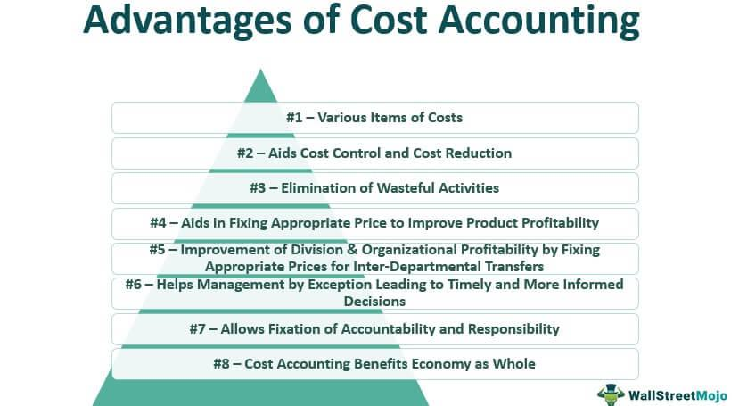

The evolving landscape of finance has created a pressing need for a comprehensive understanding of various accounting methods. As businesses strive to optimize their financial strategies, the implementation of effective accounting practices has become imperative. Among these, cost accounting and algorithmic trading have emerged as pivotal components in shaping modern financial decision-making.

Cost accounting provides an in-depth analysis of cost structures within an organization, enabling businesses to enhance their budgeting and cost control capabilities. It is instrumental in offering insights that drive strategic planning and competitive analysis, making it a valuable tool in assessing financial performance. On the other hand, algorithmic trading utilizes computer algorithms to execute trades at optimal conditions, benefiting from precise and timely data to achieve superior trading outcomes. This combination of rigorous cost analysis and automated trading strategies offers a powerful approach to maximize profitability and manage risk in financial markets.



This article will critically evaluate the advantages and disadvantages of various accounting methods, with a particular focus on cost accounting and its integration within algorithmic trading. By exploring these crucial elements, the article aims to provide a comprehensive understanding of how businesses can leverage accounting strategies to boost their financial performance and navigate the complexities of modern financial markets effectively.

## Table of Contents

## Overview of Accounting Methods

Accounting methods are essential for accurately recording, reporting, and managing a business's financial activities. The three primary accounting methods—cash accounting, accrual accounting, and cost accounting—each offer unique benefits and limitations that can significantly impact financial reporting and decision-making.

**Cash Accounting** is a straightforward method where transactions are recorded when cash is received or paid. This method provides a clear picture of cash flow, making it ideal for smaller businesses or those that do not deal with complex financial transactions. The main advantage is its simplicity, as it aligns with the actual cash available. However, cash accounting might not accurately reflect the business's financial health or profitability for entities with significant accounts receivable or payable at any given time, as it does not account for obligations until actual payment occurs.

**Accrual Accounting**, in contrast, recognizes income and expenses when they are earned or incurred, regardless of when cash transactions occur. This method provides a more comprehensive view of a company's financial status and is often required for larger businesses or those with extensive inventories. By recording all financial transactions as they occur, accrual accounting helps in accurately assessing profitability within a specific time frame. However, it can be more complex to maintain, requiring robust systems to track receivables and payables accurately.

**Cost Accounting** goes beyond financial accounting by focusing on the detailed tracking and analysis of costs associated with producing goods or services. This method plays a critical role in budgeting, performance evaluation, and cost control. It helps businesses understand their cost structures, improving operational efficiency and strategic planning capabilities. While cost accounting can significantly enhance decision-making, especially in manufacturing and production sectors, it can be intricate and resource-intensive, often necessitating advanced software and expertise.

Choosing the appropriate accounting method is crucial for businesses as it influences the accuracy and transparency of financial statements, impacting stakeholders’ perceptions and strategic business decisions. Each method offers distinct perspectives on a company's financial performance, and the selection depends on the business size, industry, regulatory requirements, and management's objective for financial analysis. The right choice of accounting method can provide a solid foundation for financial health and future growth.

## Understanding Cost Accounting

Cost accounting is a branch of accounting that focuses on capturing, recording, and analyzing the costs associated with the production of goods or services within an organization. It aims to provide detailed cost information, which can be used by management to plan and control business operations and enhance profitability. The fundamental objectives of cost accounting include cost ascertainment, cost control, and cost reduction, which are achieved through various methods such as standard costing, activity-based costing, and marginal costing.

In terms of budgeting, cost accounting plays a crucial role by providing a basis for preparing budgets. It allows businesses to estimate future costs accurately and allocate resources efficiently. This budgeting process involves predicting future expenses and revenues, which helps in setting financial targets and benchmarks. By analyzing cost behavior and cost-[volume](/wiki/volume-trading-strategy)-profit relationships, cost accounting aids in developing more realistic and achievable budgets. 

Performance evaluation is another critical area where cost accounting contributes significantly. It provides a framework for assessing the efficiency and effectiveness of various departments and operations within a business. By analyzing variances between actual costs and budgeted costs, management can identify areas of inefficiency and take corrective actions. This process involves computing and analyzing different types of variances such as material, labor, and overhead variances. 

Cost control is inherently tied to cost accounting as it facilitates the monitoring and regulation of costs associated with production or service delivery. This involves analyzing cost drivers and implementing measures to manage and optimize costs effectively. Techniques such as variance analysis, cost audits, and inventory control are used to ensure that costs remain within established limits, thus enhancing operational efficiency.

In strategic planning, cost accounting yields insights that drive competitive advantage. By understanding cost structures and pinpointing cost-saving opportunities, businesses can devise strategies that maximize profitability while minimizing expenses. For example, in competitive analysis, cost accounting helps organizations understand how their cost structures compare to their competitors. This understanding enables the business to make informed strategic decisions regarding pricing, product mix, and market entry.

Overall, cost accounting is an indispensable tool that supports management in making data-driven decisions, optimizing resource allocation, and sustaining a competitive edge in the marketplace. By systematically tracking and controlling costs, businesses can enhance their financial performance and strategic position.

## Advantages of Cost Accounting

Cost accounting offers significant advantages to businesses through enhanced cost control and reduction, which are achieved via detailed analysis of cost behavior and performance metrics. By systematically examining the various components of costs, businesses can identify inefficiencies, reduce waste, and optimize operations. For instance, cost variance analysis is an essential tool within cost accounting that helps identify discrepancies between expected and actual costs, allowing managers to address these issues proactively.

Facilitating better budgeting and resource allocation is another advantage of cost accounting. Through precise cost measurement and allocation techniques, businesses are able to develop more accurate budgets, leading to improved financial planning and control. Cost accounting supports the establishment of performance benchmarks, helping organizations allocate resources more efficiently to areas that yield the highest returns on investment. This systematic approach ensures that financial resources are utilized optimally, aligning with the organizational goals.

Moreover, cost accounting provides valuable insights for pricing strategies and financial forecasting. By understanding the total cost of producing a product or service, businesses can develop competitive pricing strategies that maximize profit margins while remaining attractive to consumers. Cost accounting methodologies, such as activity-based costing (ABC), offer granular insights into cost drivers, enabling businesses to refine their pricing models. In terms of financial forecasting, cost accounting supplies decision-makers with historical cost data and trends, enhancing their ability to predict future financial performance with greater accuracy.

Overall, these advantages underscore the critical role of cost accounting in supporting effective financial management and strategic planning within organizations. By enabling precise control over costs and offering insights for informed decision-making, cost accounting strengthens the financial health and competitive position of a business.

## Disadvantages of Cost Accounting

Cost accounting, while invaluable for detailed financial analysis, presents several challenges that can impede its effective implementation. One primary issue is its inherent complexity, which often requires a significant time commitment from financial professionals. The intricate processes involved in accurately capturing and analyzing cost data can overwhelm businesses, particularly those lacking adequate resources or expertise.

Another noteworthy disadvantage is the financial burden associated with implementing cost accounting systems. Comprehensive cost accounting often necessitates the use of specialized software tailored to dissect and report financial data accurately. The procurement, installation, and maintenance of such software represent substantial investments. Furthermore, training staff to proficiently use these tools incurs additional costs, both in terms of time and resources. This investment can be prohibitive for smaller firms with limited budgets.

Moreover, cost accounting can lead to information overload. The detailed level of analysis inherent in cost accounting may produce extensive data reports that, while useful, could overwhelm decision-makers. Instead of facilitating insightful analysis, the abundance of available data risks leading to decision paralysis, where the sheer volume of information makes it difficult to draw actionable conclusions. This paradox highlights the potential pitfalls of excessive detail, whereby critical insights may be obscured by less relevant data points.

In conclusion, although cost accounting can yield significant benefits for strategic planning and cost management, its disadvantages must be carefully managed. The complexities, financial investments, and potential for data overload necessitate a strategic approach to implementation, ensuring that its advantages can be fully realized without falling prey to its inherent drawbacks.

 to Algorithmic Trading

Algorithmic trading, often referred to as algo trading, involves the use of computer algorithms to execute trades. These algorithms are programmed to follow specific instructions, such as timing, price, or quantity, to minimize the manual intervention in executing trades. The popularity of [algorithmic trading](/wiki/algorithmic-trading) has surged significantly in recent years due to its ability to process large volumes of data with speed and accuracy that far surpasses human capabilities. This increase in popularity can be attributed to the efficiency it brings to trades, lowering transaction costs and enabling the execution of complex strategies that might be impractical manually.

The core function of algorithms in trading is to ensure that trades are executed at the most favorable conditions. By quickly analyzing vast datasets, algorithms can identify patterns and opportunities that are not immediately obvious to human traders. For instance, algorithms can monitor multiple markets and make simultaneous trades to capitalize on [arbitrage](/wiki/arbitrage) opportunities or execute large trade orders by slicing them into smaller trades to minimize market impact, a technique known as "order slicing."

Precise and timely data are crucial components of successful algorithmic trading. The effectiveness of an algorithm is largely dependent on the quality of the data it analyzes. Accurate and up-to-date information allows the algorithm to make predictions about market movements and execute trades swiftly, potentially giving traders a competitive edge. High frequency trading ([HFT](/wiki/high-frequency-trading-strategies)), a subset of algorithmic trading, highlights the importance of timely data as it operates on very short time frames, making a millisecond's difference matter significantly.

Python, often favored in algorithmic trading for its robust libraries and frameworks, can illustrate the basic structure of a trading algorithm. Consider the following simple example in Python, where a moving average crossover strategy is implemented:

```python
import pandas as pd
import numpy as np

# Load historical price data
data = pd.read_csv('market_data.csv')

# Calculate moving averages
data['Short_MA'] = data['Close'].rolling(window=40).mean()
data['Long_MA'] = data['Close'].rolling(window=100).mean()

# Generate buy/sell signals
data['Signal'] = np.where(data['Short_MA'] > data['Long_MA'], 1, -1)

# Print the first few rows to see the signals
print(data.head())
```

This code snippet demonstrates how an algorithm might generate buy (1) and sell (-1) signals based on moving average crossovers, a common technical analysis strategy. Such programs can be expanded with more data sources and more complex strategies, executing trades on real-time signals derived from these calculations.

In conclusion, algorithmic trading stands as a transformative approach in financial markets, utilizing the power of algorithms to enhance trading efficiency. Its reliance on precise and timely data underscores the necessity for robust data management practices in order to exploit market opportunities effectively.

## The Role of Cost Accounting in Algorithmic Trading

Cost accounting techniques significantly contribute to the success of algorithmic trading strategies by providing detailed insights into cost structures, which are crucial for developing effective trading algorithms. In algorithmic trading, the efficiency of executing a vast number of trades is paramount. Cost accounting aids in identifying various cost components, such as transaction costs, taxes, and opportunity costs, which can then be integrated into the trading algorithms to optimize these processes.

Integration of cost data into trading algorithms allows for improved efficiency by enabling the algorithms to account for all associated expenses, ensuring that each trade is executed in a cost-effective manner. By incorporating cost considerations, algorithms can optimize parameters that minimize high transaction costs or other expenses that may erode potential profits. This integration is often done by embedding cost functions within the algorithms, which adjust trading strategies dynamically based on real-time data.

Furthermore, cost accounting enhances trade decision-making and risk management by providing precise cost analysis that aids in evaluating the profitability of trades. With detailed cost insights, algorithms can not only assess the immediate profitability of a trade but also evaluate the long-term viability of trading strategies. These insights support risk management by highlighting potential cost-related risks and enabling the development of contingency strategies to mitigate these risks.

The formula for calculating the net profit from trades in an algorithmic trading setup, incorporating cost data, can be expressed as:

$$
\text{Net Profit} = \text{Gross Profit} - (\text{Transaction Costs} + \text{Other Costs})
$$

In this formula, cost accounting allows for an accurate estimation of transaction costs and other associated expenses, which is critical for determining the true profitability of trading activities.

Integrating Python libraries such as pandas and NumPy can facilitate the handling of cost data in algorithmic trading models. A simple Python snippet to calculate costs might look like this:

```python
import pandas as pd

# Sample data
data = {'Gross Profit': [1000, 1500, 1200],
        'Transaction Costs': [100, 150, 120],
        'Other Costs': [50, 75, 60]}

df = pd.DataFrame(data)

# Calculate Net Profit
df['Net Profit'] = df['Gross Profit'] - (df['Transaction Costs'] + df['Other Costs'])

print(df)
```

This example calculates the net profit by subtracting transaction and other costs from the gross profit, illustrating how cost accounting data can be operationalized within algorithmic trading strategies. By employing such detailed cost analyses, traders can make more informed decisions leading to optimized performance and enhanced risk management in high-frequency trading environments.

## Advantages of Combining Cost Accounting with Algo Trading

Combining cost accounting with algorithmic trading offers several advantages that significantly enhance financial strategy and operational efficiency. This integration leads to improved accuracy in assessing trade profitability by providing a detailed analysis of both historical and real-time cost data. By applying cost accounting principles, traders can better assess the direct and indirect costs associated with each transaction. This includes transaction fees, slippage, and other trading-related expenses. This thorough understanding enables more precise evaluation of the true profitability of trades, moving beyond mere gross profit figures to encompass a comprehensive net profit calculation.

Enhanced strategic decision-making is another advantage gained through integrating cost accounting data into algorithmic trading systems. The provision of detailed financial insights allows for more informed decisions regarding asset allocation, trade execution, and risk management. Traders can employ cost data to refine algorithms, such as optimizing stop-loss levels and entry/[exit](/wiki/exit-strategy) points based on cost minimization strategies. This integration leads to more robust, data-driven trading strategies that are adaptable to varying market conditions.

Moreover, optimized resource allocation for algorithmic infrastructure is facilitated through an understanding of cost behavior and capital expenditure efficiency. By pinpointing cost centers and evaluating performance metrics, financial managers can allocate resources more effectively, ensuring that algorithmic systems are neither overfunded nor under-resourced. This thoughtful allocation ensures that trading infrastructure is balanced in terms of cost-effectiveness and performance capabilities, reducing wastage and maximizing potential returns.

Complex data analysis and modeling can be facilitated using programming languages such as Python. For instance, calculating the profitability of a trading strategy while accounting for transaction costs can be achieved with the following Python snippet:

```python
def calculate_net_profit(trades, costs):
    gross_profit = sum(trade['profit'] for trade in trades)
    total_cost = sum(costs)
    net_profit = gross_profit - total_cost
    return net_profit

trades = [{'profit': 100}, {'profit': 200}, {'profit': -50}]
costs = [10, 15, 5]  # Example transaction costs
net_profit = calculate_net_profit(trades, costs)
print(f"Net Profit: ${net_profit}")
```

In this example, the function calculates net profit by accounting for both the profits from trades and the associated costs, thus providing a more accurate measure of trading success. By employing such methods, firms can systematically improve their operational strategies, aligning cost efficiency with trading objectives.

## Disadvantages and Challenges

Integrating accounting data with algorithmic trading systems presents notable challenges and disadvantages. The process involves complex systems that require seamless data flow and high precision, which is not always straightforward.

One significant challenge is the complexity involved in integrating accounting data with existing algorithmic systems. Accounting data traditionally used in financial reporting is composed of sophisticated metrics and variable cost elements that must be meticulously mapped onto algorithmic models. This mapping process often necessitates creating customized solutions tailored to specific algorithmic requirements, thereby increasing implementation complexity and time. 

Moreover, potential inefficiencies can arise from data latency and inaccuracies. Algorithmic trading thrives on real-time data to execute trades at optimal conditions. The integration of accounting data, which can be intricate and updated at different intervals, introduces latency. Data must be synchronized across systems to prevent delays that could affect trading decisions. Inaccurate or outdated accounting information can lead to suboptimal trading choices, impacting profitability.

Another disadvantage is the high initial cost associated with integrating these systems. Implementing robust integration requires significant investment in specialized infrastructure, including software and hardware, as well as the hiring or training of personnel skilled in both accounting and algorithmic systems. Post-implementation, the system demands ongoing management, monitoring, and updates to ensure compatibility with evolving technology and changing accounting standards. These updates, while necessary for maintaining system integrity and effectiveness, add to the operational costs, making the integration of accounting data with algorithmic systems an expensive undertaking. 

In summary, while integrating cost accounting with algorithmic trading can provide enhanced financial insights and strategic advantage, it also entails complex system configuration, potential inefficiencies from data synchronization issues, and significant financial investment both in terms of initial setup and ongoing management.

## Conclusion

In concluding the exploration of cost accounting and its integral role in algorithmic trading, several core insights have been underscored. Cost accounting, with its focus on detailed financial analysis and cost control, presents numerous advantages such as enhanced budgeting, improved pricing strategies, and informed financial forecasting. However, these benefits come with challenges like complexity in implementation and the potential for decision paralysis due to information overload.

When applied to algorithmic trading, cost accounting contributes significantly by integrating financial insights into trading strategies. This integration aids in the precise assessment of trade profitability and supports strategic decision-making. The combination of cost accounting with algorithmic trading enhances resource allocation for developing robust trading infrastructures. Nevertheless, the challenges of data integration, potential inefficiencies due to data latency, and high initial setup costs underscore the need for careful consideration.

Choosing the right accounting method is crucial for any business, particularly in integrating with advanced technologies such as algorithmic trading. The selected method should align with business objectives, operational scale, and technical capabilities. As financial strategies become more complex, organizations must balance the opportunities presented by cost accounting and algorithmic trading with the inherent challenges. By doing so, businesses can optimize their financial operations while navigating the rapidly evolving financial landscape.

## References & Further Reading

[1]: Drury, C. (2012). "Management and Cost Accounting." Cengage Learning.

[2]: Horngren, C. T., Datar, S. M., & Rajan, M. V. (2015). "Cost Accounting: A Managerial Emphasis." Pearson Education.

[3]: ["Algorithmic Trading: Winning Strategies and Their Rationale"](https://www.amazon.com/Algorithmic-Trading-Winning-Strategies-Rationale-ebook/dp/B00CY5HC0U) by Ernie Chan

[4]: Pompian, M. M. (2006). "Behavioral Finance and Wealth Management: How to Build Optimal Portfolios That Account for Investor Biases." John Wiley & Sons.

[5]: ["Cost Accounting: Foundations and Evolutions"](https://www.researchgate.net/publication/225083728_Cost_Accounting_Foundations_and_Evolutions) by Kinney, M. R., & Raiborn, C. A. 

[6]: ["The Econometrics of Financial Markets"](https://www.amazon.com/Econometrics-Financial-Markets-John-Campbell/dp/0691043019) by Campbell, J. Y., Lo, A. W., & MacKinlay, A. C.