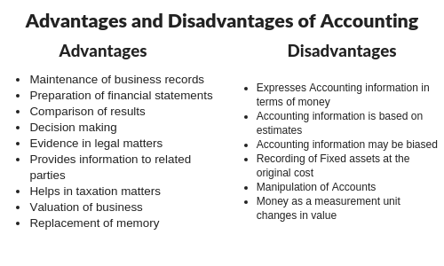

## Table of Contents

## What is cost accounting?

Cost accounting is a type of accounting that helps businesses figure out how much it costs to make their products or provide their services. It looks at all the expenses involved, like the cost of materials, labor, and overhead. By understanding these costs, a company can set prices that will cover their expenses and make a profit. Cost accounting is different from financial accounting, which focuses on reporting a company's financial performance to external parties like investors and tax authorities.

One important part of cost accounting is figuring out the cost of each product or service. This can be done using different methods, like tracking the costs directly related to making a product (direct costs) and spreading out the costs that are not directly related (indirect costs) across all products. This information helps managers make decisions about pricing, budgeting, and improving efficiency. For example, if a company finds out that one product is much more expensive to make than others, they might decide to raise its price or find ways to reduce its costs.

Cost accounting also helps with planning and controlling costs. Managers use cost accounting data to create budgets and set financial goals for the company. They can compare actual costs to budgeted costs to see if they are on track or if they need to make changes. This ongoing process helps businesses stay efficient and profitable. By keeping a close eye on costs, companies can identify problems early and take action to fix them before they become bigger issues.

## How does cost accounting differ from financial accounting?

Cost accounting and financial accounting are two different ways of keeping track of a company's money, but they have different goals. Cost accounting is all about helping the people inside the company understand how much it costs to make their products or provide their services. It looks at things like the cost of materials, labor, and other expenses. This helps managers make smart decisions about pricing, budgeting, and how to make things more efficiently. Cost accounting is like a tool for the people inside the company to use every day to keep things running smoothly.

On the other hand, financial accounting is focused on showing the company's financial health to people outside the company, like investors, banks, and the government. It follows strict rules and creates reports like income statements and balance sheets. These reports show how much money the company made, how much it spent, and what it owns and owes. Financial accounting is important because it helps these outside people understand if the company is doing well and if it's a good investment. While cost accounting helps with daily management, financial accounting is more about giving a clear picture of the company's overall financial situation to the outside world.

## What are the main types of cost accounting?

There are a few main types of cost accounting that businesses use to keep track of their costs. One type is called standard costing. This method involves setting a standard cost for each part of making a product, like materials and labor. Then, the actual costs are compared to these standards to see if the company is spending more or less than expected. This helps managers find out where they can save money or where costs are higher than planned.

Another type is activity-based costing (ABC). This method looks at all the activities that go into making a product and figures out how much each activity costs. It's especially useful for companies with lots of different products or services because it helps them see which products are more expensive to make. By understanding the cost of each activity, managers can make better decisions about how to price their products and where to cut costs.

A third type is marginal costing, also known as variable costing. This method focuses on the costs that change depending on how much is produced, like the cost of materials. It helps businesses figure out how much it costs to make one more unit of a product. This information is useful for deciding whether to make more of something or to stop making it if the costs are too high. Each of these types of cost accounting helps businesses in different ways to manage their costs and make smart decisions.

## What are the primary advantages of implementing cost accounting in a business?

Implementing cost accounting in a business helps managers understand the costs of making products or providing services. By knowing these costs, managers can set prices that cover all expenses and make a profit. This is important because if a business doesn't know its costs, it might set prices too low and lose money. Cost accounting also helps businesses see which products or services are more profitable. This way, they can focus on making more of the profitable items and less of the ones that don't make as much money.

Another big advantage of cost accounting is that it helps with planning and controlling costs. Managers use cost accounting to create budgets and set financial goals. They can then compare actual costs to the budget to see if they are on track. If costs are higher than expected, they can find out why and fix the problem before it gets worse. This ongoing process helps businesses stay efficient and save money. By keeping a close eye on costs, companies can make better decisions and stay profitable in the long run.

## Can cost accounting help in reducing costs? If so, how?

Yes, cost accounting can help businesses reduce costs by giving them a clear picture of where their money is going. When a business knows exactly how much it costs to make each product or provide each service, it can find out where it's spending too much. For example, if the cost of materials for one product is really high, the business can look for cheaper materials or find a way to use less of them. By understanding these costs, managers can make smart choices about where to cut back and save money.

Cost accounting also helps by showing how different activities add to the total cost. This is called activity-based costing. When a business knows which activities are expensive, it can find ways to do those activities more cheaply or even stop doing them if they're not necessary. For instance, if it costs a lot to ship products, the business might look for a cheaper shipping company or change how it packs items to save on shipping costs. By using cost accounting, businesses can make changes that lower their costs and keep more money in their pockets.

## How does cost accounting assist in pricing decisions?

Cost accounting helps businesses figure out how much to charge for their products or services. By knowing the cost of making each item, a business can set a price that covers all its expenses and still makes a profit. If the business doesn't know its costs, it might set prices too low and lose money. Cost accounting breaks down the costs into parts like materials, labor, and overhead. This helps managers see which products cost more to make and which ones are cheaper. They can then set higher prices for the more expensive items and lower prices for the cheaper ones, making sure they earn enough to stay in business.

Another way cost accounting helps with pricing is by showing how different activities add to the total cost. For example, if a business finds out that shipping costs are high, it might decide to raise prices to cover those costs or find a cheaper way to ship. By understanding these costs, managers can make smart choices about pricing. They can also see which products or services are more profitable and focus on selling more of those. This way, the business can make more money overall and keep its prices competitive in the market.

## What role does cost accounting play in budgeting and planning?

Cost accounting helps businesses make budgets and plan for the future. It does this by showing managers how much it costs to make each product or provide each service. This information is really important when making a budget because it helps managers guess how much money they will need to spend. They can look at the costs of materials, labor, and other expenses and then plan how much they will need in the future. By using cost accounting, managers can make a budget that is realistic and helps the business stay on track financially.

Cost accounting also helps with planning because it lets managers compare what they planned to spend with what they actually spent. If the actual costs are higher than the budgeted costs, managers can figure out why and fix the problem. For example, if the cost of materials went up, they might look for cheaper materials or find a way to use less. By keeping a close eye on costs, managers can make changes to their plans and keep the business running smoothly. This ongoing process helps businesses save money and make smart decisions about the future.

## What are some common disadvantages or limitations of cost accounting?

Cost accounting can be really helpful, but it also has some downsides. One big problem is that it can be expensive and time-consuming to set up and keep going. A business needs to spend a lot of time and money to gather all the data and make sure it's right. This can be hard for small businesses that don't have a lot of money or people to do this work. Also, cost accounting needs special skills and knowledge, so a business might need to hire experts, which can cost more money.

Another limitation is that cost accounting can be complicated. There are different ways to do it, like standard costing, activity-based costing, and marginal costing. Each way has its own rules and can give different results. This can make it hard for managers to understand and use the information correctly. Sometimes, the cost of setting up and running a cost accounting system might be more than the benefits it brings to the business.

Lastly, cost accounting can sometimes focus too much on the numbers and miss the big picture. It's good at showing how much things cost, but it might not tell the whole story about why costs are high or low. For example, if a business cuts costs by using cheaper materials, cost accounting might show that as a good thing. But if those cheaper materials make the product worse and customers stop buying it, the business could lose money in the long run. So, while cost accounting is useful, it's important to use it along with other ways of looking at the business.

## How can the complexity of cost accounting systems impact small businesses?

The complexity of cost accounting systems can be a big challenge for small businesses. These systems need a lot of time and money to set up and keep running. Small businesses often don't have a lot of extra money or people to do this work. They might need to hire experts to help them, which can cost even more. This can make it hard for small businesses to use cost accounting because the cost of setting it up might be more than the benefits they get from it.

Also, cost accounting can be hard to understand because it has different ways of doing things, like standard costing and activity-based costing. Each way has its own rules and can give different results. This can confuse small business owners who might not have a lot of experience with accounting. They might find it hard to use the information correctly to make good decisions. So, while cost accounting can help businesses understand their costs better, the complexity can make it tough for small businesses to use it effectively.

## What advanced techniques in cost accounting can enhance decision-making?

One advanced technique in cost accounting that can help with decision-making is called Activity-Based Costing (ABC). This method looks at all the different activities that go into making a product and figures out how much each activity costs. It's really useful for businesses that make a lot of different things because it helps them see which products cost more to make. By understanding these costs, managers can decide which products to focus on and where they can save money. For example, if one activity like shipping is really expensive, the business might look for a cheaper way to ship or change how they pack their products.

Another technique is called Target Costing. This method starts with the price that customers are willing to pay for a product and then works backward to figure out how much it should cost to make. If the cost to make the product is higher than the target cost, the business has to find ways to cut costs. This helps businesses make products that are both affordable for customers and profitable for the company. By using target costing, managers can make better decisions about product design and how to make things more efficiently.

A third advanced technique is Life-Cycle Costing. This looks at all the costs of a product from when it's first made until it's no longer used. It includes costs like design, production, marketing, and even disposal. By understanding all these costs, businesses can see the whole picture and make smarter decisions about which products to develop and how to manage them over time. For example, if a product has high disposal costs, the business might decide to design it differently to make it easier and cheaper to get rid of at the end of its life.

## How does cost accounting integrate with other management systems like ERP?

Cost accounting works well with other management systems like ERP, which stands for Enterprise Resource Planning. ERP systems help businesses keep track of everything they do, from buying materials to selling products. Cost accounting fits into ERP because it helps the ERP system understand how much it costs to make each product. When cost accounting data is put into the ERP system, it can show managers how much money they are spending and where they can save. This makes it easier for businesses to plan and control their costs because all the information is in one place.

Using cost accounting with ERP also helps with making decisions. For example, if a business wants to know if it should make more of a certain product, the ERP system can use cost accounting data to show how much it will cost and how much profit they might make. This helps managers see the big picture and make smart choices. By having cost accounting and ERP work together, businesses can run more smoothly and make better decisions about pricing, budgeting, and planning.

## What future trends are expected to influence the practice of cost accounting?

In the future, technology will play a big role in changing how cost accounting is done. More businesses will use software and tools that can quickly gather and analyze data. This will make cost accounting faster and more accurate. For example, [artificial intelligence](/wiki/ai-artificial-intelligence) and [machine learning](/wiki/machine-learning) might help businesses predict costs better and find ways to save money. Also, cloud computing will make it easier for companies to share cost accounting data with other parts of the business, like sales and production, so everyone can make better decisions together.

Another trend that will affect cost accounting is the focus on sustainability. More and more, businesses will need to think about the environmental costs of making their products. Cost accounting will have to include these costs, like the impact of using certain materials or the cost of getting rid of products at the end of their life. This will help businesses make choices that are not only good for their profits but also good for the planet. As a result, cost accounting will become a tool for making businesses more sustainable and responsible.

## What is the Role of Cost Accounting in Algorithmic Trading?

Cost accounting techniques significantly contribute to the success of [algorithmic trading](/wiki/algorithmic-trading) strategies by providing detailed insights into cost structures, which are crucial for developing effective trading algorithms. In algorithmic trading, the efficiency of executing a vast number of trades is paramount. Cost accounting aids in identifying various cost components, such as transaction costs, taxes, and opportunity costs, which can then be integrated into the trading algorithms to optimize these processes.

Integration of cost data into trading algorithms allows for improved efficiency by enabling the algorithms to account for all associated expenses, ensuring that each trade is executed in a cost-effective manner. By incorporating cost considerations, algorithms can optimize parameters that minimize high transaction costs or other expenses that may erode potential profits. This integration is often done by embedding cost functions within the algorithms, which adjust trading strategies dynamically based on real-time data.

Furthermore, cost accounting enhances trade decision-making and risk management by providing precise cost analysis that aids in evaluating the profitability of trades. With detailed cost insights, algorithms can not only assess the immediate profitability of a trade but also evaluate the long-term viability of trading strategies. These insights support risk management by highlighting potential cost-related risks and enabling the development of contingency strategies to mitigate these risks.

The formula for calculating the net profit from trades in an algorithmic trading setup, incorporating cost data, can be expressed as:

$$
\text{Net Profit} = \text{Gross Profit} - (\text{Transaction Costs} + \text{Other Costs})
$$

In this formula, cost accounting allows for an accurate estimation of transaction costs and other associated expenses, which is critical for determining the true profitability of trading activities.

Integrating Python libraries such as pandas and NumPy can facilitate the handling of cost data in algorithmic trading models. A simple Python snippet to calculate costs might look like this:

```python
import pandas as pd

# Sample data
data = {'Gross Profit': [1000, 1500, 1200],
        'Transaction Costs': [100, 150, 120],
        'Other Costs': [50, 75, 60]}

df = pd.DataFrame(data)

# Calculate Net Profit
df['Net Profit'] = df['Gross Profit'] - (df['Transaction Costs'] + df['Other Costs'])

print(df)
```

This example calculates the net profit by subtracting transaction and other costs from the gross profit, illustrating how cost accounting data can be operationalized within algorithmic trading strategies. By employing such detailed cost analyses, traders can make more informed decisions leading to optimized performance and enhanced risk management in high-frequency trading environments.

## References & Further Reading

[1]: Drury, C. (2012). "Management and Cost Accounting." Cengage Learning.

[2]: Horngren, C. T., Datar, S. M., & Rajan, M. V. (2015). "Cost Accounting: A Managerial Emphasis." Pearson Education.

[3]: ["Algorithmic Trading: Winning Strategies and Their Rationale"](https://www.amazon.com/Algorithmic-Trading-Winning-Strategies-Rationale-ebook/dp/B00CY5HC0U) by Ernie Chan

[4]: Pompian, M. M. (2006). "Behavioral Finance and Wealth Management: How to Build Optimal Portfolios That Account for Investor Biases." John Wiley & Sons.

[5]: ["Cost Accounting: Foundations and Evolutions"](https://www.researchgate.net/publication/225083728_Cost_Accounting_Foundations_and_Evolutions) by Kinney, M. R., & Raiborn, C. A. 

[6]: ["The Econometrics of Financial Markets"](https://www.amazon.com/Econometrics-Financial-Markets-John-Campbell/dp/0691043019) by Campbell, J. Y., Lo, A. W., & MacKinlay, A. C.